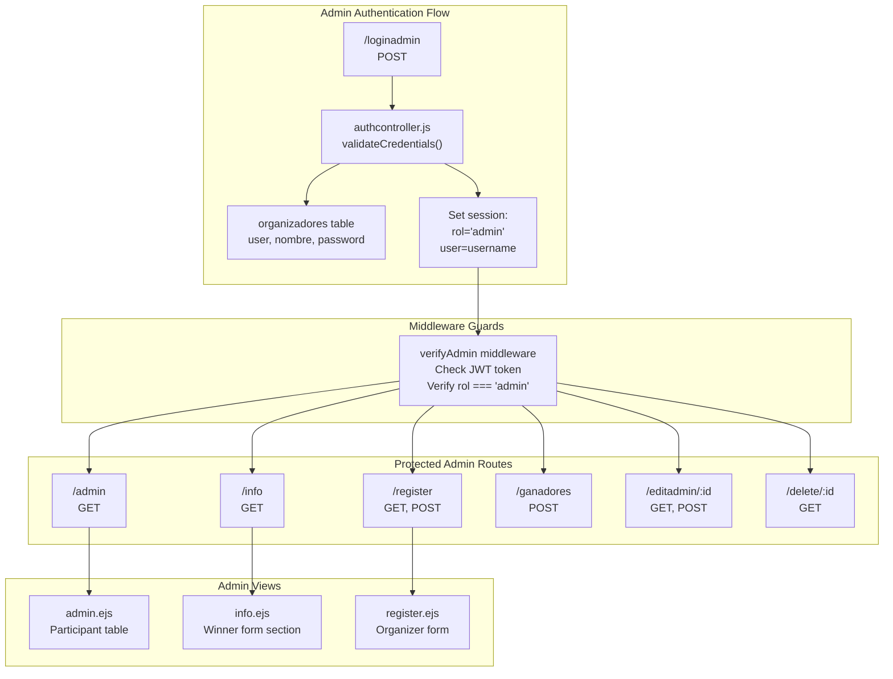

# Admin Interfaces

> **Relevant source files**
> * [views/admin.ejs](https://github.com/Lourdes12587/Proyecto-Node.js/blob/3a172be7/views/admin.ejs)
> * [views/info.ejs](https://github.com/Lourdes12587/Proyecto-Node.js/blob/3a172be7/views/info.ejs)
> * [views/register.ejs](https://github.com/Lourdes12587/Proyecto-Node.js/blob/3a172be7/views/register.ejs)

## Purpose and Scope

This document describes the three administrator-only interfaces in the HAPPY RUNNER 42K application: the **Admin Panel** for participant management, **Winner Management** for selecting race winners, and **Organizer Registration** for creating new admin accounts. These interfaces are protected by role-based access control and accessible only to users with `rol === "admin"` in their session.

For information about participant-facing interfaces, see [Participant Interfaces](/Lourdes12587/Proyecto-Node.js/4.1-participant-interfaces). For details on the authentication mechanisms that protect these interfaces, see [Role-Based Access Control](/Lourdes12587/Proyecto-Node.js/3.2-role-based-access-control).

---

## Overview of Admin Interfaces

The system provides three distinct administrative interfaces, each serving a specific management function:

| Interface | Route | View File | Primary Function |
| --- | --- | --- | --- |
| **Admin Panel** | `/admin` | `views/admin.ejs` | View, search, edit, and delete participant records |
| **Winner Management** | `/info` (admin section) | `views/info.ejs` | Select 1st/2nd/3rd place winners from participant list |
| **Organizer Registration** | `/register` | `views/register.ejs` | Create new admin accounts for organizers |

All three interfaces require authentication through the `verifyAdmin` middleware, which validates both the presence of a valid JWT token and confirms that `req.session.rol === "admin"`.

**Sources:** [views/admin.ejs L1-L79](https://github.com/Lourdes12587/Proyecto-Node.js/blob/3a172be7/views/admin.ejs#L1-L79)

 [views/info.ejs L30-L84](https://github.com/Lourdes12587/Proyecto-Node.js/blob/3a172be7/views/info.ejs#L30-L84)

 [views/register.ejs L1-L71](https://github.com/Lourdes12587/Proyecto-Node.js/blob/3a172be7/views/register.ejs#L1-L71)

---

## Access Control Architecture



**Admin Access Requirements:**

1. **Session Authentication:** Valid JWT token stored in cookie (verified using `process.env.JWT_SECRET`)
2. **Role Verification:** Session must contain `rol === "admin"`
3. **Redirect Behavior:** Failed authentication redirects to `/authadmin` or `/loginadmin`

The `verifyAdmin` middleware enforces these requirements for all administrative routes. Without proper authorization, users are redirected and cannot access admin functionality.

**Sources:** High-level architecture diagrams (Diagram 2), [views/admin.ejs L1-L79](https://github.com/Lourdes12587/Proyecto-Node.js/blob/3a172be7/views/admin.ejs#L1-L79)

 [views/info.ejs L30-L84](https://github.com/Lourdes12587/Proyecto-Node.js/blob/3a172be7/views/info.ejs#L30-L84)

 [views/register.ejs L1-L71](https://github.com/Lourdes12587/Proyecto-Node.js/blob/3a172be7/views/register.ejs#L1-L71)

---

## Admin Panel (4.2.1)

The Admin Panel provides a comprehensive view of all registered participants with search, edit, and delete capabilities. The interface is rendered by `views/admin.ejs` and accessible via the `/admin` route.

### Interface Components

**Participant Table Structure:**

| Column | Data Field | Description |
| --- | --- | --- |
| N° Dorsal | `participante.id` | Unique participant identifier / race number |
| Nombre | `participante.nombre` | First name |
| Apellido | `participante.apellido` | Last name |
| DNI | `participante.dni` | National identification number |
| Tel. | `participante.telefono` | Contact phone |
| Calle | `participante.calle` | Street address |
| N° | `participante.numero` | Street number |
| Población | `participante.poblacion` | City/town |
| CP° | `participante.codigo_postal` | Postal code |
| Acciones | — | Edit/Delete action buttons |

The table iterates over the `participantes` array passed from the server, rendering each participant as a table row [views/admin.ejs L39-L59](https://github.com/Lourdes12587/Proyecto-Node.js/blob/3a172be7/views/admin.ejs#L39-L59)

### Client-Side Search Implementation

The admin panel includes a real-time search filter implemented entirely in client-side JavaScript:

```

```

This implementation:

* Listens for input events on the search field [views/admin.ejs L18](https://github.com/Lourdes12587/Proyecto-Node.js/blob/3a172be7/views/admin.ejs#L18-L18)
* Converts the query to lowercase for case-insensitive matching
* Iterates through all table rows (`<tbody id="participantesTable">` [views/admin.ejs L38](https://github.com/Lourdes12587/Proyecto-Node.js/blob/3a172be7/views/admin.ejs#L38-L38) )
* Shows/hides rows based on whether their text content includes the query string
* Searches across all visible fields (name, DNI, address, etc.)

### Action Buttons

Each participant row includes two action buttons in the "Acciones" column [views/admin.ejs L50-L57](https://github.com/Lourdes12587/Proyecto-Node.js/blob/3a172be7/views/admin.ejs#L50-L57)

:

**Edit Button:**

```

```

* Links to `/editadmin/:id` route
* Opens a form to modify participant data
* Uses Boxicons `bxs-edit` icon

**Delete Button:**

```

```

* Links to `/delete/:id` route
* Includes JavaScript confirmation dialog
* Uses Boxicons `bxs-trash` icon

### Participant Count Badge

The interface displays the total participant count using a badge component:

```

```

This badge is rendered at [views/admin.ejs L19](https://github.com/Lourdes12587/Proyecto-Node.js/blob/3a172be7/views/admin.ejs#L19-L19)

 and updates only on page reload (not dynamically filtered by the search).

**Sources:** [views/admin.ejs L1-L79](https://github.com/Lourdes12587/Proyecto-Node.js/blob/3a172be7/views/admin.ejs#L1-L79)

---

## Winner Management (4.2.2)

Winner management functionality is embedded within the `info.ejs` view as a conditional admin-only section. When an administrator is logged in, the page renders a form to select and register the top three finishers.

### Conditional Rendering

The winner management form only appears when the `isAdmin` variable is truthy:

```

```

This conditional block spans [views/info.ejs L30-L84](https://github.com/Lourdes12587/Proyecto-Node.js/blob/3a172be7/views/info.ejs#L30-L84)

 The `isAdmin` variable is populated by server-side logic based on the user's session role.

### Winner Selection Form

```mermaid
flowchart TD

Select3[""]
Form["method='POST'enctype='multipart/form-data'>"]
Select1[""]
Select2[""]
Submit[""]
ParticipantList1["Populate from<br>participantes array"]
ParticipantList2["Populate from<br>participantes array"]
ParticipantList3["Populate from<br>participantes array"]
File3["name='foto3'>"]
File2["name='foto2'>"]
File1["name='foto1'>"]

subgraph subGraph3 ["Winner Form Structure"]
    Form
    Submit
    Form --> Select1
    Form --> Select2
    Form --> Select3
    Form --> Submit

subgraph subGraph2 ["Third Place"]
    Select3
    ParticipantList3
    File3
    Select3 --> ParticipantList3
end

subgraph subGraph1 ["Second Place"]
    Select2
    ParticipantList2
    File2
    Select2 --> ParticipantList2
end

subgraph subGraph0 ["First Place"]
    Select1
    ParticipantList1
    File1
    Select1 --> ParticipantList1
end
end
```

**Form Structure:**

The form posts to `/ganadores` with `multipart/form-data` encoding [views/info.ejs L34](https://github.com/Lourdes12587/Proyecto-Node.js/blob/3a172be7/views/info.ejs#L34-L34)

 to support file uploads. Each place (1st, 2nd, 3rd) has:

1. **Dropdown selector** - populated from the `participantes` array
2. **Optional file upload** - for winner-specific photos

### Participant Dropdown Population

Each dropdown is populated identically using this EJS loop:

```

```

This pattern repeats for `primero` [views/info.ejs L38-L43](https://github.com/Lourdes12587/Proyecto-Node.js/blob/3a172be7/views/info.ejs#L38-L43)

 `segundo` [views/info.ejs L51-L56](https://github.com/Lourdes12587/Proyecto-Node.js/blob/3a172be7/views/info.ejs#L51-L56)

 and `tercero` [views/info.ejs L64-L69](https://github.com/Lourdes12587/Proyecto-Node.js/blob/3a172be7/views/info.ejs#L64-L69)

 Each option displays the participant's dorsal number (ID), first name, and last name.

### File Upload Fields

Winner photos are optional and handled through standard file inputs:

```

```

These correspond to first, second, and third place respectively [views/info.ejs L44-L70](https://github.com/Lourdes12587/Proyecto-Node.js/blob/3a172be7/views/info.ejs#L44-L70)

 The `accept="image/*"` attribute restricts uploads to image files.

### Form Actions

The form includes two buttons [views/info.ejs L74-L77](https://github.com/Lourdes12587/Proyecto-Node.js/blob/3a172be7/views/info.ejs#L74-L77)

:

* **Submit button:** `<button type="submit" class="btn cta-btn">Guardar ganadores</button>`
* **Cancel link:** `<a href="/admin" class="btn btn-neutral">Cancelar</a>` - returns to admin panel

### Feedback Messages

After form submission, the page displays server-generated feedback:

```

```

This conditional rendering [views/info.ejs L79-L81](https://github.com/Lourdes12587/Proyecto-Node.js/blob/3a172be7/views/info.ejs#L79-L81)

 shows success or error messages based on `mensaje` and `mensajeTipo` variables passed from the route handler.

**Sources:** [views/info.ejs L30-L84](https://github.com/Lourdes12587/Proyecto-Node.js/blob/3a172be7/views/info.ejs#L30-L84)

---

## Organizer Registration (4.2.3)

The organizer registration interface allows existing administrators to create new admin accounts. This is the only mechanism for adding administrators to the system.

### Form Structure

The registration form is rendered by `views/register.ejs` and accessible via the `/register` route. The form uses POST method to submit credentials:

```

```

**Form Fields:**

| Field | Input Name | Type | Description |
| --- | --- | --- | --- |
| Usuario | `user` | `text` | Unique username for authentication |
| Nombre | `nombre` | `text` | Organizer's display name |
| Contraseña | `password` | `password` | Account password (hashed with bcrypt) |

All fields are required [views/register.ejs L15-L27](https://github.com/Lourdes12587/Proyecto-Node.js/blob/3a172be7/views/register.ejs#L15-L27)

### Value Persistence

The form implements value persistence for failed submissions, repopulating fields with previously entered data:

```

```

This pattern repeats for `user`, `nombre`, and `password` fields [views/register.ejs L18-L26](https://github.com/Lourdes12587/Proyecto-Node.js/blob/3a172be7/views/register.ejs#L18-L26)

 The `valores` object is passed from the server when validation fails.

### Server-Side Validation

The form displays validation errors from `express-validator`:

```

```

This block [views/register.ejs L31-L37](https://github.com/Lourdes12587/Proyecto-Node.js/blob/3a172be7/views/register.ejs#L31-L37)

 iterates over the `validaciones` array, displaying each error message in a styled alert box. The `aria-live="polite"` attribute ensures screen reader accessibility.

### SweetAlert Integration

Successful registration triggers a SweetAlert2 modal:

```

```

This script block [views/register.ejs L44-L67](https://github.com/Lourdes12587/Proyecto-Node.js/blob/3a172be7/views/register.ejs#L44-L67)

:

* Displays a styled modal with title, message, and icon
* Applies custom colors matching the application theme
* Auto-closes after the specified `timer` duration
* Redirects to the route specified in `ruta` variable

**Sources:** [views/register.ejs L1-L71](https://github.com/Lourdes12587/Proyecto-Node.js/blob/3a172be7/views/register.ejs#L1-L71)

---

## Admin Operation Data Flow

```mermaid
sequenceDiagram
  participant Admin Browser
  participant app.js
  participant verifyAdmin
  participant middleware
  participant Route Handler
  participant MySQL Database
  participant (participantes,
  participant organizadores,
  participant ganadores)
  participant File System
  participant (uploads/participantes/)

  note over Admin Browser,Route Handler: Admin Panel Flow (/admin)
  Admin Browser->>app.js: GET /admin
  app.js->>verifyAdmin: Check authorization
  verifyAdmin->>verifyAdmin: Verify JWT + rol==='admin'
  verifyAdmin->>Route Handler: Authorized
  Route Handler->>MySQL Database: SELECT * FROM participantes
  MySQL Database-->>Route Handler: participantes[]
  Route Handler-->>Admin Browser: Render admin.ejs with participantes
  Admin Browser->>Admin Browser: Client-side search
  Admin Browser->>app.js: (filter table rows)
  app.js->>verifyAdmin: GET /delete/:id
  verifyAdmin->>Route Handler: Check authorization
  Route Handler->>MySQL Database: Authorized
  MySQL Database-->>Route Handler: DELETE FROM participantes WHERE id=?
  Route Handler-->>Admin Browser: Success
  note over Admin Browser,(uploads/participantes/): Winner Management Flow (/ganadores)
  Admin Browser->>app.js: Redirect to /admin
  app.js->>verifyAdmin: GET /info
  verifyAdmin->>Route Handler: Check authorization
  Route Handler->>MySQL Database: Authorized
  Route Handler->>MySQL Database: SELECT * FROM participantes
  MySQL Database-->>Route Handler: SELECT * FROM ganadores
  Route Handler-->>Admin Browser: participantes[], ganadores[]
  Admin Browser->>app.js: Render info.ejs
  app.js->>verifyAdmin: (isAdmin=true, show form)
  verifyAdmin->>Route Handler: POST /ganadores
  Route Handler->>File System: (primero, segundo, tercero, foto1-3)
  File System-->>Route Handler: Check authorization
  Route Handler->>MySQL Database: Authorized
  MySQL Database-->>Route Handler: Save foto1, foto2, foto3
  Route Handler-->>Admin Browser: (if provided)
  note over Admin Browser,ganadores): Organizer Registration Flow (/register)
  Admin Browser->>app.js: File paths
  app.js->>verifyAdmin: INSERT/UPDATE ganadores table
  verifyAdmin->>Route Handler: (positions 1,2,3)
  Route Handler-->>Admin Browser: Success
  Admin Browser->>app.js: Redirect to /info with mensaje
  app.js->>verifyAdmin: GET /register
  verifyAdmin->>Route Handler: Check authorization
  Route Handler->>Route Handler: Authorized
  loop [Validation Failed]
    Route Handler-->>Admin Browser: Render register.ejs
    Route Handler->>Route Handler: POST /register
    Route Handler->>MySQL Database: (user, nombre, password)
    MySQL Database-->>Route Handler: Check authorization
    Route Handler-->>Admin Browser: Authorized
  end
```

**Key Data Flow Characteristics:**

1. **Consistent Authorization:** Every admin request passes through `verifyAdmin` middleware before reaching route handlers
2. **Admin Panel:** Fetches all participants in a single query, performs search client-side without additional server requests
3. **Winner Management:** Handles both database operations (inserting/updating `ganadores` table) and file operations (saving winner photos)
4. **Organizer Registration:** Implements server-side validation, password hashing, and provides feedback through both inline errors and SweetAlert modals

**Sources:** [views/admin.ejs L67-L78](https://github.com/Lourdes12587/Proyecto-Node.js/blob/3a172be7/views/admin.ejs#L67-L78)

 [views/info.ejs L34-L84](https://github.com/Lourdes12587/Proyecto-Node.js/blob/3a172be7/views/info.ejs#L34-L84)

 [views/register.ejs L15-L67](https://github.com/Lourdes12587/Proyecto-Node.js/blob/3a172be7/views/register.ejs#L15-L67)

 High-level architecture diagrams (Diagram 5)

---

## Route and View Mapping

The following table summarizes the routing architecture for all admin interfaces:

| HTTP Method | Route Path | Protected By | Renders View | Data Operations |
| --- | --- | --- | --- | --- |
| GET | `/admin` | `verifyAdmin` | `admin.ejs` | SELECT all participantes |
| GET | `/editadmin/:id` | `verifyAdmin` | Edit form (not in provided files) | SELECT participante by id |
| POST | `/editadmin/:id` | `verifyAdmin` | Redirect | UPDATE participante |
| GET | `/delete/:id` | `verifyAdmin` | Redirect to `/admin` | DELETE participante |
| GET | `/info` | `verifyAdmin` | `info.ejs` (with admin section) | SELECT participantes, ganadores |
| POST | `/ganadores` | `verifyAdmin` | Redirect to `/info` | INSERT/UPDATE ganadores, file upload |
| GET | `/register` | `verifyAdmin` | `register.ejs` | None |
| POST | `/register` | `verifyAdmin` | Redirect or re-render | INSERT organizador (with bcrypt hash) |

**Navigation Links:**

* Admin panel links to edit: `/editadmin/<%= participante.id %>` [views/admin.ejs L51](https://github.com/Lourdes12587/Proyecto-Node.js/blob/3a172be7/views/admin.ejs#L51-L51)
* Admin panel links to delete: `/delete/<%= participante.id %>` [views/admin.ejs L54](https://github.com/Lourdes12587/Proyecto-Node.js/blob/3a172be7/views/admin.ejs#L54-L54)
* Winner form cancels to: `/admin` [views/info.ejs L76](https://github.com/Lourdes12587/Proyecto-Node.js/blob/3a172be7/views/info.ejs#L76-L76)
* Registration success redirects to: `/<%= ruta %>` [views/register.ejs L64](https://github.com/Lourdes12587/Proyecto-Node.js/blob/3a172be7/views/register.ejs#L64-L64)

**Sources:** [views/admin.ejs L51-L56](https://github.com/Lourdes12587/Proyecto-Node.js/blob/3a172be7/views/admin.ejs#L51-L56)

 [views/info.ejs L34-L76](https://github.com/Lourdes12587/Proyecto-Node.js/blob/3a172be7/views/info.ejs#L34-L76)

 [views/register.ejs L15-L64](https://github.com/Lourdes12587/Proyecto-Node.js/blob/3a172be7/views/register.ejs#L15-L64)