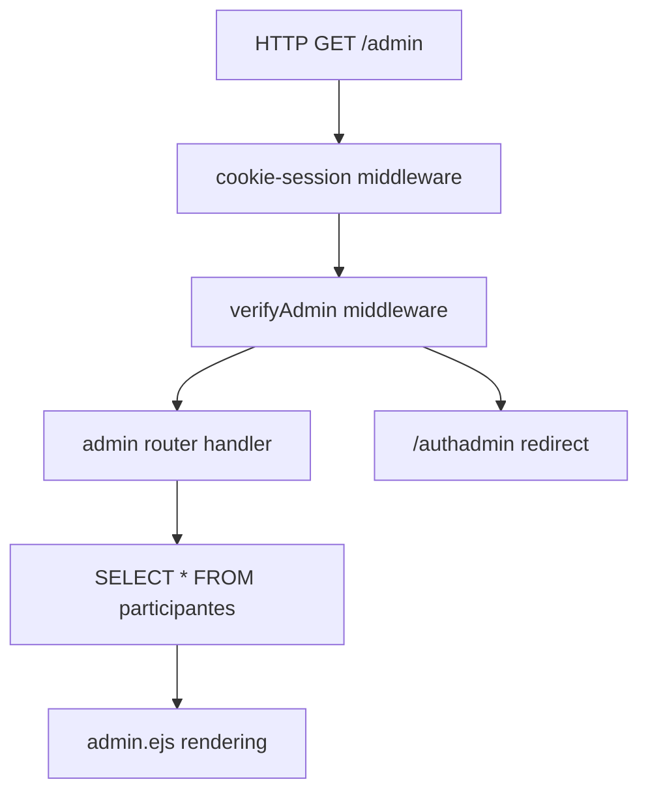
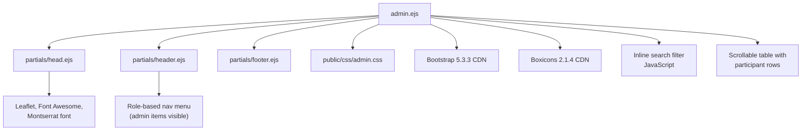
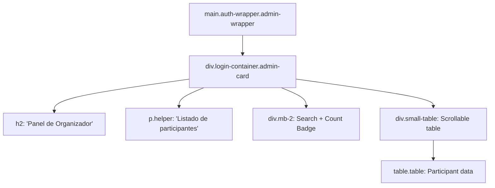
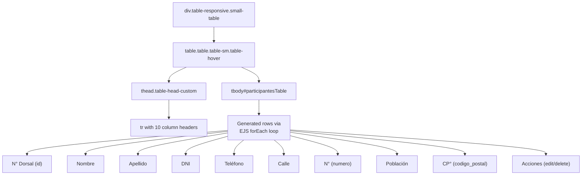
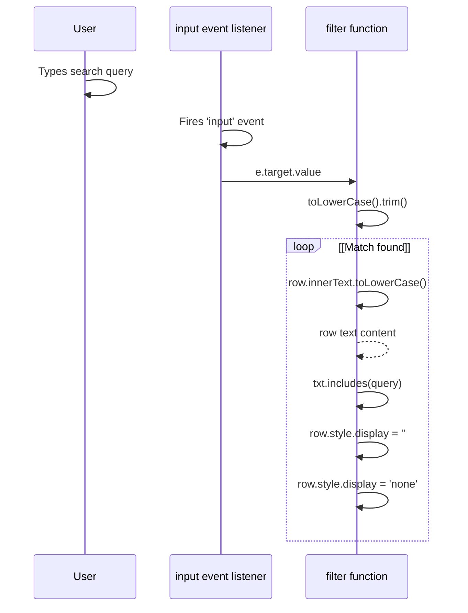
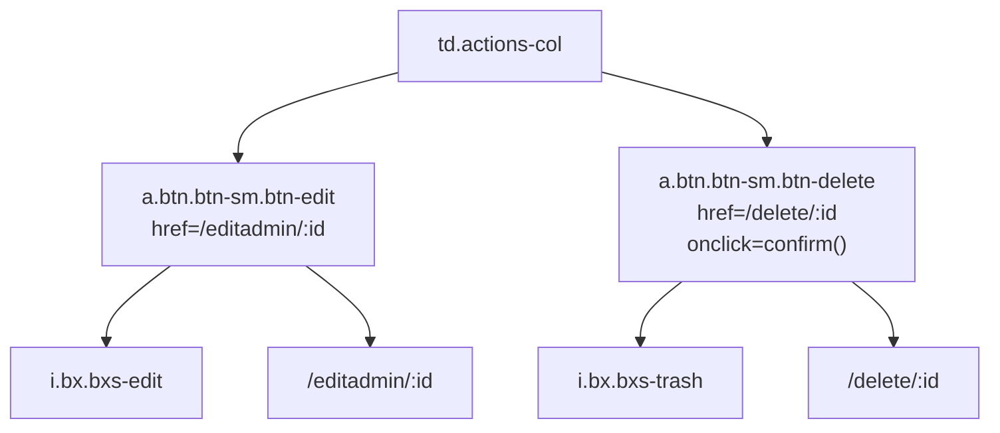
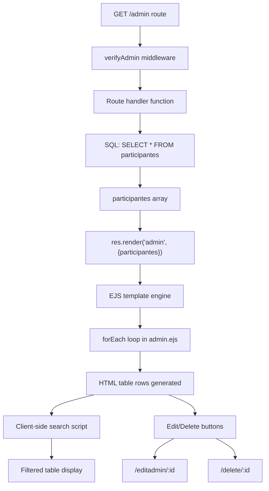

# Admin Panel

> **Relevant source files**
> * [public/css/admin.css](https://github.com/Lourdes12587/Proyecto-Node.js/blob/3a172be7/public/css/admin.css)
> * [views/admin.ejs](https://github.com/Lourdes12587/Proyecto-Node.js/blob/3a172be7/views/admin.ejs)

## Purpose and Scope

The Admin Panel is the primary interface for organizers to view and manage all registered marathon participants. This page provides a comprehensive participant list in a tabular format with client-side search capabilities and quick-access edit/delete actions. The panel is accessible only to users with administrator privileges who have successfully authenticated through the admin login flow.

This document covers the admin panel's view template, styling, search functionality, and action buttons. For the authentication mechanism that protects this page, see [Role-Based Access Control](/Lourdes12587/Proyecto-Node.js/3.2-role-based-access-control). For the actual edit and delete operations that occur when action buttons are clicked, see [Participant Data](/Lourdes12587/Proyecto-Node.js/6.1-participant-data). For winner selection functionality within the info page, see [Winner Management](/Lourdes12587/Proyecto-Node.js/4.2.2-winner-management).

## Access Control and Route Protection

The admin panel is served through a protected route that requires admin-level authorization. The request must pass through two middleware layers before reaching the view.



**Sources:** High-level architecture diagrams (Diagram 2, Diagram 5)

The `verifyAdmin` middleware validates that `req.session.rol` equals `"admin"` and that a valid JWT token exists in the request cookies. Failed authorization redirects to `/authadmin`. Upon successful authentication, the route handler queries all participant records from the `participantes` table and passes them to the view template.

## View Architecture

The admin panel follows the standard EJS partial composition pattern used throughout the application, with dedicated styling and embedded client-side JavaScript.



**Sources:** [views/admin.ejs L1-L9](https://github.com/Lourdes12587/Proyecto-Node.js/blob/3a172be7/views/admin.ejs#L1-L9)

The view structure includes:

* **Head partial inclusion** [views/admin.ejs L1](https://github.com/Lourdes12587/Proyecto-Node.js/blob/3a172be7/views/admin.ejs#L1-L1)  - Loads core dependencies (Montserrat font, Boxicons)
* **Bootstrap CSS** [views/admin.ejs L6](https://github.com/Lourdes12587/Proyecto-Node.js/blob/3a172be7/views/admin.ejs#L6-L6)  - Provides table and form control styling
* **Admin-specific stylesheet** [views/admin.ejs L7](https://github.com/Lourdes12587/Proyecto-Node.js/blob/3a172be7/views/admin.ejs#L7-L7)  - Custom styling via `/resources/css/admin.css`
* **Header partial** [views/admin.ejs L9](https://github.com/Lourdes12587/Proyecto-Node.js/blob/3a172be7/views/admin.ejs#L9-L9)  - Renders admin-context navigation
* **Footer partial** [views/admin.ejs L65](https://github.com/Lourdes12587/Proyecto-Node.js/blob/3a172be7/views/admin.ejs#L65-L65)  - Page footer

## Page Components

### Main Container Structure

The admin panel uses a centered wrapper design consistent with other authentication-protected pages:



**Sources:** [views/admin.ejs L11-L22](https://github.com/Lourdes12587/Proyecto-Node.js/blob/3a172be7/views/admin.ejs#L11-L22)

| Component | Classes | Purpose |
| --- | --- | --- |
| `<main>` | `.auth-wrapper`, `.admin-wrapper` | Flex container for vertical/horizontal centering |
| Container `<div>` | `.login-container`, `.admin-card` | White card with gradient background and shadow |
| Title `<h2>` | - | "Panel de Organizador" heading |
| Helper `<p>` | `.helper`, `.small`, `.mb-2` | "Listado de participantes inscritos" description |
| Search row | `.mb-2`, `.d-flex`, `.gap-2` | Contains search input and count badge |
| Table wrapper | `.small-table`, `.mb-2` | Scrollable container with 420px max height |

### Search and Count Display

The interface provides real-time client-side filtering with a participant count badge:

[views/admin.ejs L17-L20](https://github.com/Lourdes12587/Proyecto-Node.js/blob/3a172be7/views/admin.ejs#L17-L20)

* **Search input** - `#searchInput` with `.form-control-sm` styling, placeholder "Buscar por nombre, DNI..."
* **Count badge** - `.participantes-count` displays total participant count using EJS interpolation: `<%= participantes.length %>`

The badge uses custom CSS styling with gradient background:

**Sources:** [views/admin.ejs L17-L20](https://github.com/Lourdes12587/Proyecto-Node.js/blob/3a172be7/views/admin.ejs#L17-L20)

 [public/css/admin.css L65-L72](https://github.com/Lourdes12587/Proyecto-Node.js/blob/3a172be7/public/css/admin.css#L65-L72)

### Participant Data Table

The table displays comprehensive participant information with fixed column headers and scrollable body:



**Sources:** [views/admin.ejs L22-L62](https://github.com/Lourdes12587/Proyecto-Node.js/blob/3a172be7/views/admin.ejs#L22-L62)

#### Table Columns

| Column Header | Data Field | Display Value |
| --- | --- | --- |
| N° Dorsal | `participante.id` | Unique participant ID |
| Nombre | `participante.nombre` | First name |
| Apellido | `participante.apellido` | Last name |
| DNI | `participante.dni` | National ID number |
| Tel. | `participante.telefono` | Phone number |
| Calle | `participante.calle` | Street name |
| N° | `participante.numero` | Street number |
| Población | `participante.poblacion` | City/town |
| CP° | `participante.codigo_postal` | Postal code |
| Acciones | - | Edit/delete buttons |

The table body is generated server-side using an EJS `forEach` loop [views/admin.ejs L39-L59](https://github.com/Lourdes12587/Proyecto-Node.js/blob/3a172be7/views/admin.ejs#L39-L59)

 that iterates over the `participantes` array passed from the route handler.

## Client-Side Search Implementation

The search functionality filters table rows in real-time without server round-trips, providing instant feedback as the admin types.

### Search Algorithm



**Sources:** [views/admin.ejs L67-L78](https://github.com/Lourdes12587/Proyecto-Node.js/blob/3a172be7/views/admin.ejs#L67-L78)

### Implementation Details

The search is implemented in an inline `<script>` tag at the bottom of the view:

[views/admin.ejs L67-L78](https://github.com/Lourdes12587/Proyecto-Node.js/blob/3a172be7/views/admin.ejs#L67-L78)

**Key aspects:**

1. **Event binding** - Attaches `input` event listener to `#searchInput`
2. **Query normalization** - Converts query to lowercase and trims whitespace
3. **Text matching** - Uses `row.innerText.toLowerCase()` to get all cell content
4. **Filter logic** - Simple substring match with `txt.includes(q)`
5. **Display toggle** - Sets `row.style.display` to empty string (visible) or `'none'` (hidden)

The search operates across all table columns simultaneously, matching against the combined text content of each row. This allows admins to search by any field (name, DNI, phone, address, etc.) without selecting a specific column.

## Action Buttons

Each participant row includes two action buttons in the final column: Edit and Delete.

### Button Structure and Routing



**Sources:** [views/admin.ejs L50-L57](https://github.com/Lourdes12587/Proyecto-Node.js/blob/3a172be7/views/admin.ejs#L50-L57)

### Edit Button

* **Route**: `/editadmin/<%= participante.id %>`
* **Classes**: `.btn`, `.btn-sm`, `.btn-edit`
* **Icon**: Boxicons `bxs-edit` (solid edit icon)
* **Tooltip**: `title="Editar"`

The edit button redirects to an admin edit form where organizers can modify participant data [views/admin.ejs L51-L53](https://github.com/Lourdes12587/Proyecto-Node.js/blob/3a172be7/views/admin.ejs#L51-L53)

### Delete Button

* **Route**: `/delete/<%= participante.id %>`
* **Classes**: `.btn`, `.btn-sm`, `.btn-delete`
* **Icon**: Boxicons `bxs-trash` (solid trash icon)
* **Tooltip**: `title="Borrar"`
* **Confirmation**: `onclick="return confirm('¿Eliminar participante?');"` prevents accidental deletion

The delete button includes JavaScript confirmation dialog that blocks navigation if user cancels [views/admin.ejs L54-L56](https://github.com/Lourdes12587/Proyecto-Node.js/blob/3a172be7/views/admin.ejs#L54-L56)

## Styling System

The admin panel uses a dedicated stylesheet that maintains visual consistency with the login/authentication pages while adapting for tabular data display.

### CSS Custom Properties

The stylesheet defines a color palette using CSS custom properties for consistency:

[public/css/admin.css L1-L11](https://github.com/Lourdes12587/Proyecto-Node.js/blob/3a172be7/public/css/admin.css#L1-L11)

| Variable | Value | Usage |
| --- | --- | --- |
| `--lapis-lazuli` | `#2f6690ff` | Primary brand color |
| `--cerulean` | `#3a7ca5ff` | Secondary brand color |
| `--platinum` | `#d9dcd6ff` | Light background |
| `--indigo-dye` | `#16425bff` | Dark text/accent |
| `--sky-blue` | `#81c3d7ff` | Tertiary accent |
| `--white` | `#ffffff` | Pure white |
| `--muted-shadow` | `rgba(22,66,91,0.08)` | Soft shadow |
| `--card-max-width` | `980px` | Maximum card width |

### Key Style Rules

#### Container Styling

```
.login-container.admin-card [public/css/admin.css:36-44]
```

* Max width: 900px (wider than standard login to accommodate table)
* Background: Linear gradient from white to platinum
* Border radius: 14px
* Padding: 18px
* Box shadow: `0 10px 30px var(--muted-shadow)`

#### Table Styling

```
.small-table [public/css/admin.css:75-82]
```

* Max height: 420px (enables vertical scrolling)
* Overflow: auto
* Border radius: 8px
* White background
* Padding: 6px

#### Table Header

```
.table-head-custom th [public/css/admin.css:85-91]
```

* Background: Linear gradient from `--lapis-lazuli` to `--cerulean`
* Color: White
* Font weight: 700 (bold)
* Font size: 0.85rem
* No border

#### Table Cells

```
.table th, .table td [public/css/admin.css:94-99]
```

* Compact padding: 0.45rem horizontal, 0.5rem vertical
* Vertical alignment: middle
* Font size: 0.86rem
* Border color: `rgba(22,66,91,0.06)` (subtle)

#### Action Button Styling

Both edit and delete buttons share base styling [public/css/admin.css L107-L117](https://github.com/Lourdes12587/Proyecto-Node.js/blob/3a172be7/public/css/admin.css#L107-L117)

:

* Fixed size: 34px × 34px
* Display: inline-flex (for icon centering)
* Border radius: 10px
* No border (uses box shadow instead)

**Edit button** [public/css/admin.css L120-L124](https://github.com/Lourdes12587/Proyecto-Node.js/blob/3a172be7/public/css/admin.css#L120-L124)

:

* Background: Yellow/cream gradient `rgba(255,239,186,0.95)` to `rgba(255,249,230,0.95)`
* Text color: `#7a5a00` (dark yellow)
* Subtle border: `rgba(122,90,0,0.08)`

**Delete button** [public/css/admin.css L127-L131](https://github.com/Lourdes12587/Proyecto-Node.js/blob/3a172be7/public/css/admin.css#L127-L131)

:

* Background: Red/pink gradient `rgba(255,232,232,0.95)` to `rgba(255,245,245,0.95)`
* Text color: `#8b1e1e` (dark red)
* Subtle border: `rgba(139,30,30,0.06)`

### Participant Count Badge

The badge displaying total participant count uses a gradient background matching the table header:

[public/css/admin.css L65-L72](https://github.com/Lourdes12587/Proyecto-Node.js/blob/3a172be7/public/css/admin.css#L65-L72)

* Background: Linear gradient from `--lapis-lazuli` to `--cerulean`
* White text
* Padding: 0.28rem × 0.6rem
* Border radius: 999px (pill shape)
* Font weight: 700
* Font size: 0.82rem

## Responsive Design

The admin panel adapts to different screen sizes through media query breakpoints:

### Tablet Breakpoint (max-width: 992px)

[public/css/admin.css L146-L149](https://github.com/Lourdes12587/Proyecto-Node.js/blob/3a172be7/public/css/admin.css#L146-L149)

* Card max-width reduced to 720px
* Card padding reduced to 14px
* Table max-height reduced to 360px

### Mobile Breakpoint (max-width: 576px)

[public/css/admin.css L150-L156](https://github.com/Lourdes12587/Proyecto-Node.js/blob/3a172be7/public/css/admin.css#L150-L156)

* Wrapper padding reduced to 20px horizontal, 10px vertical
* Card max-width reduced to 360px
* Card padding reduced to 12px
* Table cell font size reduced to 0.78rem
* Cell padding reduced to 0.32rem × 0.36rem
* Table max-height reduced to 300px
* CTA button padding and font size reduced

These responsive adjustments ensure the admin panel remains usable on smaller devices while prioritizing desktop/tablet usage where tabular data is easier to manage.

**Sources:** [public/css/admin.css L146-L156](https://github.com/Lourdes12587/Proyecto-Node.js/blob/3a172be7/public/css/admin.css#L146-L156)

## Data Flow Summary



**Sources:** High-level architecture diagrams (Diagram 3), [views/admin.ejs L39-L78](https://github.com/Lourdes12587/Proyecto-Node.js/blob/3a172be7/views/admin.ejs#L39-L78)

The admin panel receives pre-loaded participant data from the server, renders it as static HTML table rows, then adds client-side interactivity through the search filter. Action buttons provide direct navigation to participant editing and deletion routes, completing the participant management workflow.