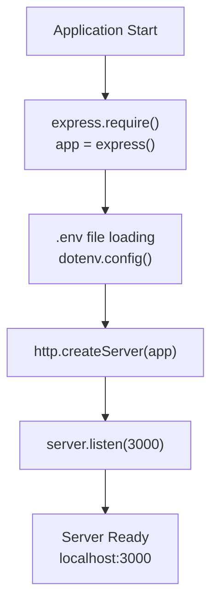
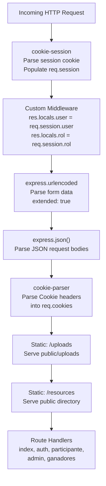
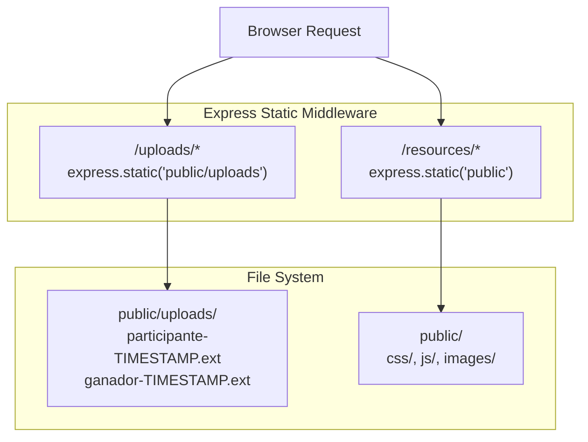
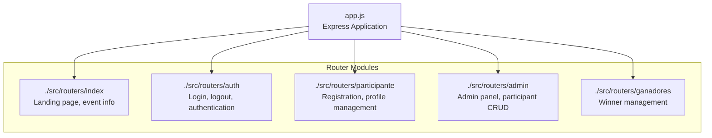
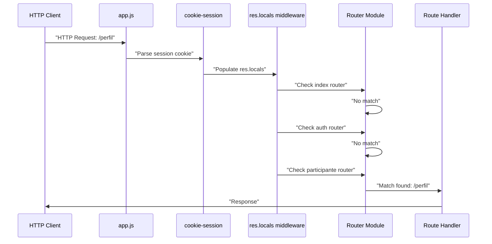

# Application Server

> **Relevant source files**
> * [app.js](https://github.com/Lourdes12587/Proyecto-Node.js/blob/3a172be7/app.js)

## Purpose and Scope

This document details the Express.js application server configuration in `app.js`, which serves as the central entry point and orchestrator for the HAPPY RUNNER 42K application. This page covers:

* Express application initialization and HTTP server creation
* Session management configuration using `cookie-session`
* Middleware pipeline setup and execution order
* Static file serving for uploads and public assets
* View engine configuration for EJS templates
* Route delegation to specialized router modules

For authentication middleware (`verifyToken`, `verifyAdmin`) that protect routes, see [Middleware Layer](/Lourdes12587/Proyecto-Node.js/2.2-middleware-layer). For database connection configuration, see [Database Layer](/Lourdes12587/Proyecto-Node.js/2.3-database-layer). For session data structure and lifecycle details, see [Session Management](/Lourdes12587/Proyecto-Node.js/3.3-session-management).

**Sources:** [app.js L1-L47](https://github.com/Lourdes12587/Proyecto-Node.js/blob/3a172be7/app.js#L1-L47)

---

## Server Initialization and Configuration

The application server is initialized in `app.js` through a series of configuration steps that establish the Express application, HTTP server, and environment settings.

### Express Application Creation

The server begins by creating an Express application instance and loading environment variables:

```
Express app instance → Environment variable loading → HTTP server creation
```

The application loads environment configuration from `./env/.env` using the `dotenv` package, with special handling for production environments [app.js L3-L6](https://github.com/Lourdes12587/Proyecto-Node.js/blob/3a172be7/app.js#L3-L6)

 This configuration loads sensitive values such as `JWT_SECRET` used by authentication middleware.

An HTTP server is explicitly created wrapping the Express app [app.js L7-L8](https://github.com/Lourdes12587/Proyecto-Node.js/blob/3a172be7/app.js#L7-L8)

 allowing the server to handle standard HTTP requests. The server listens on port 3000 [app.js L18-L20](https://github.com/Lourdes12587/Proyecto-Node.js/blob/3a172be7/app.js#L18-L20)

### Server Initialization Flow



**Sources:** [app.js L1-L20](https://github.com/Lourdes12587/Proyecto-Node.js/blob/3a172be7/app.js#L1-L20)

---

## Session Management

The application implements session management using the `cookie-session` middleware, which stores session data directly in cookies rather than server-side storage.

### Session Configuration

The `cookie-session` middleware is configured with the following parameters:

| Parameter | Value | Purpose |
| --- | --- | --- |
| `name` | `'session'` | Cookie name in browser |
| `keys` | `['clave_secreta']` | Signing key for cookie integrity |
| `maxAge` | `24 * 60 * 60 * 1000` | Session lifetime (24 hours in milliseconds) |

This configuration appears in [app.js L12-L16](https://github.com/Lourdes12587/Proyecto-Node.js/blob/3a172be7/app.js#L12-L16)

 and is applied before any route handlers, ensuring session data is available throughout the request lifecycle.

### Response Locals Population

A custom middleware populates `res.locals` with session data on every request [app.js L22-L26](https://github.com/Lourdes12587/Proyecto-Node.js/blob/3a172be7/app.js#L22-L26)

:

```
req.session.user → res.locals.user
req.session.rol → res.locals.rol
```

This middleware makes session data (`user` and `rol`) automatically available to all EJS templates without explicit passing. If no session exists, these values default to `null`, allowing templates to conditionally render based on authentication state.

**Sources:** [app.js L9-L26](https://github.com/Lourdes12587/Proyecto-Node.js/blob/3a172be7/app.js#L9-L26)

---

## Middleware Pipeline

The application employs a sequential middleware pipeline that processes every incoming request. The execution order is critical as each middleware layer depends on previous layers.

### Middleware Execution Order



### Request Parsing Middleware

The application configures three request parsing middleware layers:

1. **express.urlencoded** [app.js L29](https://github.com/Lourdes12587/Proyecto-Node.js/blob/3a172be7/app.js#L29-L29) : Parses URL-encoded form data (e.g., from HTML form submissions) with `extended: true` to support nested objects
2. **express.json** [app.js L30](https://github.com/Lourdes12587/Proyecto-Node.js/blob/3a172be7/app.js#L30-L30) : Parses JSON request bodies for API endpoints
3. **cookie-parser** [app.js L31](https://github.com/Lourdes12587/Proyecto-Node.js/blob/3a172be7/app.js#L31-L31) : Parses Cookie headers into `req.cookies` object

These middleware execute in sequence before any route handlers, ensuring request data is properly parsed regardless of content type.

**Sources:** [app.js L22-L32](https://github.com/Lourdes12587/Proyecto-Node.js/blob/3a172be7/app.js#L22-L32)

---

## Static File Serving

The application serves static assets through two distinct mount points, separating uploaded user content from application resources.

### Static Route Configuration

| Route Path | File System Path | Purpose |
| --- | --- | --- |
| `/uploads` | `public/uploads` | User-uploaded participant and winner photos |
| `/resources` | `public/` | CSS stylesheets, JavaScript files, static images |

The `/uploads` route [app.js L32](https://github.com/Lourdes12587/Proyecto-Node.js/blob/3a172be7/app.js#L32-L32)

 provides direct access to the `public/uploads` directory where multer stores participant photos with timestamped filenames (e.g., `participante-1234567890.jpg`).

The `/resources` route [app.js L34](https://github.com/Lourdes12587/Proyecto-Node.js/blob/3a172be7/app.js#L34-L34)

 serves the entire `public` directory, using `__dirname` to ensure the path is resolved relative to the application root. This route provides access to:

* CSS files (`style.css`, `admin.css`, `inscripcion.css`, etc.)
* JavaScript files
* Static event images used in the gallery

### Static File Access Pattern



**Sources:** [app.js L32-L34](https://github.com/Lourdes12587/Proyecto-Node.js/blob/3a172be7/app.js#L32-L34)

---

## View Engine Configuration

The application uses EJS (Embedded JavaScript) as its templating engine for server-side HTML rendering. The view engine is configured with a single directive [app.js L36](https://github.com/Lourdes12587/Proyecto-Node.js/blob/3a172be7/app.js#L36-L36)

:

```
app.set('view engine', 'ejs')
```

This configuration allows route handlers to render EJS templates using the `res.render()` method without specifying the file extension. For example, `res.render('perfil')` automatically resolves to `views/perfil.ejs`.

The application uses the default views directory (`views/`) without explicitly setting it via `app.set('views', path)`, as indicated by the commented-out line [app.js L37](https://github.com/Lourdes12587/Proyecto-Node.js/blob/3a172be7/app.js#L37-L37)

 All EJS templates reside in the `views/` directory at the application root.

**Sources:** [app.js L36-L37](https://github.com/Lourdes12587/Proyecto-Node.js/blob/3a172be7/app.js#L36-L37)

---

## Route Delegation Architecture

The application follows a modular routing architecture, delegating request handling to five specialized router modules. Each router handles a distinct functional domain of the application.

### Router Module Registration



All router modules are mounted at the root path `/` [app.js L40-L44](https://github.com/Lourdes12587/Proyecto-Node.js/blob/3a172be7/app.js#L40-L44)

 with each router defining its own sub-paths. This approach allows routers to specify complete route paths (e.g., `/login`, `/perfil`, `/admin`) rather than relative paths.

### Router Module Responsibilities

| Router Module | File Path | Functional Domain |
| --- | --- | --- |
| `index` | `./src/routers/index` | Public pages (landing, event information) |
| `auth` | `./src/routers/auth` | Authentication flows (login, logout) |
| `participante` | `./src/routers/participante` | Participant operations (registration, profile) |
| `admin` | `./src/routers/admin` | Administrative operations (participant management) |
| `ganadores` | `./src/routers/ganadores` | Winner selection and management |

The order of router registration matters when routes overlap. Routers are evaluated in the order they are registered, with the first matching route handling the request. However, in this application, each router defines distinct paths, minimizing routing conflicts.

### Request Flow Through Routers



**Sources:** [app.js L40-L44](https://github.com/Lourdes12587/Proyecto-Node.js/blob/3a172be7/app.js#L40-L44)

---

## Complete Application Bootstrap Sequence

The following diagram illustrates the complete initialization sequence from application start to request handling readiness:

```mermaid
flowchart TD

Start["Node.js Process Start"]
RequireExpress["Require express module"]
CreateApp["Create Express app instance"]
LoadEnv["Load environment variables<br>from ./env/.env"]
RequireHTTP["Require http module"]
CreateServer["Create HTTP server<br>http.createServer(app)"]
CookieSession["Configure cookie-session<br>name: 'session'<br>keys: ['clave_secreta']<br>maxAge: 24 hours"]
CustomLocals["Register res.locals middleware<br>user, rol from session"]
URLEncoded["Register express.urlencoded<br>extended: true"]
JSON["Register express.json()"]
CookieParser["Register cookie-parser"]
StaticUploads["Mount /uploads static<br>public/uploads"]
StaticResources["Mount /resources static<br>public/"]
ViewEngine["Set view engine: ejs"]
RouterIndex["Register index router"]
RouterAuth["Register auth router"]
RouterParticipante["Register participante router"]
RouterAdmin["Register admin router"]
RouterGanadores["Register ganadores router"]
Listen["server.listen(3000)"]
Ready["Server Ready<br>Accepting Connections"]

Start --> RequireExpress
CreateServer --> CookieSession
CustomLocals --> URLEncoded
StaticResources --> ViewEngine
ViewEngine --> RouterIndex
RouterGanadores --> Listen

subgraph subGraph5 ["Server Start"]
    Listen
    Ready
    Listen --> Ready
end

subgraph subGraph4 ["Router Registration"]
    RouterIndex
    RouterAuth
    RouterParticipante
    RouterAdmin
    RouterGanadores
    RouterIndex --> RouterAuth
    RouterAuth --> RouterParticipante
    RouterParticipante --> RouterAdmin
    RouterAdmin --> RouterGanadores
end

subgraph subGraph3 ["Application Configuration"]
    ViewEngine
end

subgraph subGraph2 ["Middleware Registration"]
    URLEncoded
    JSON
    CookieParser
    StaticUploads
    StaticResources
    URLEncoded --> JSON
    JSON --> CookieParser
    CookieParser --> StaticUploads
    StaticUploads --> StaticResources
end

subgraph subGraph1 ["Session Configuration"]
    CookieSession
    CustomLocals
    CookieSession --> CustomLocals
end

subgraph subGraph0 ["Initialization Phase"]
    RequireExpress
    CreateApp
    LoadEnv
    RequireHTTP
    CreateServer
    RequireExpress --> CreateApp
    CreateApp --> LoadEnv
    LoadEnv --> RequireHTTP
    RequireHTTP --> CreateServer
end
```



This bootstrap sequence ensures that:

1. Session management is configured before route handlers
2. Response locals are populated before any route processing
3. Request parsing middleware is available to all routers
4. Static file serving is configured before route delegation
5. All routers have access to the complete middleware pipeline

**Sources:** [app.js L1-L47](https://github.com/Lourdes12587/Proyecto-Node.js/blob/3a172be7/app.js#L1-L47)

---

## Port Configuration

The HTTP server listens on port 3000 [app.js L18-L20](https://github.com/Lourdes12587/Proyecto-Node.js/blob/3a172be7/app.js#L18-L20)

 making the application accessible at `http://localhost:3000`. This port is hardcoded in the application rather than loaded from environment variables.

When the server successfully starts, it logs:

```
Servidor corriendo en http://localhost:3000
```

For production deployments, this port configuration may need modification or extraction to environment variables to support different deployment environments and reverse proxy configurations.

**Sources:** [app.js L18-L20](https://github.com/Lourdes12587/Proyecto-Node.js/blob/3a172be7/app.js#L18-L20)