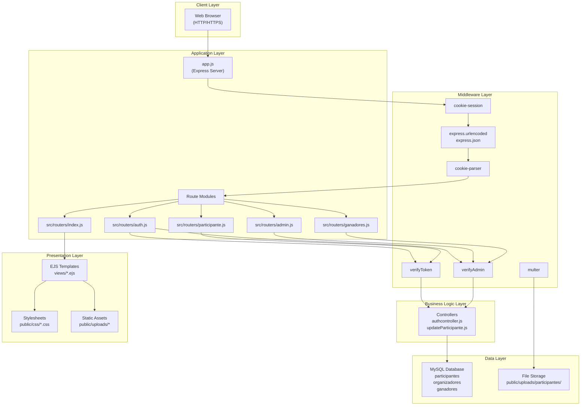
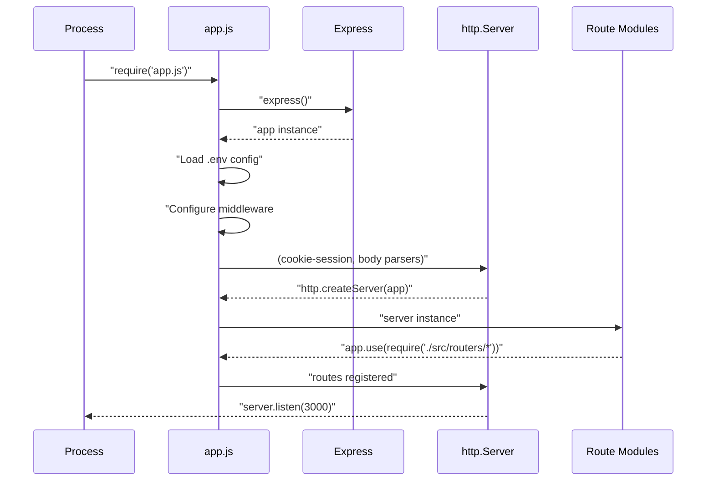
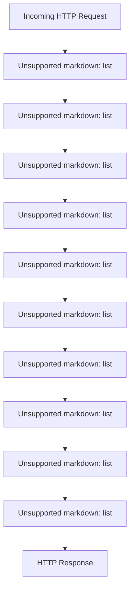
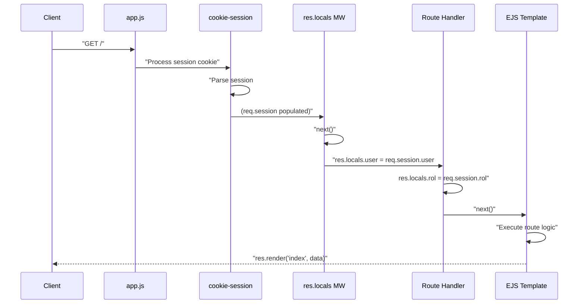
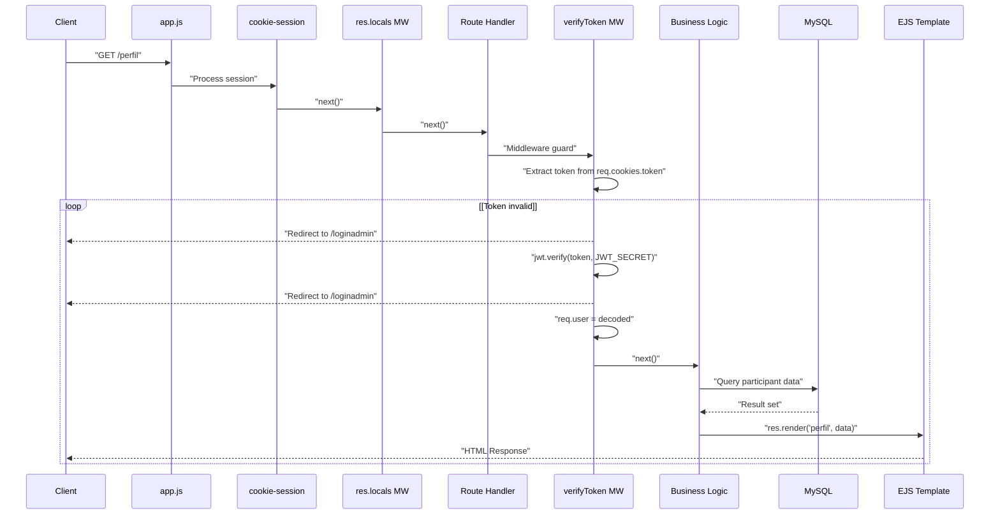
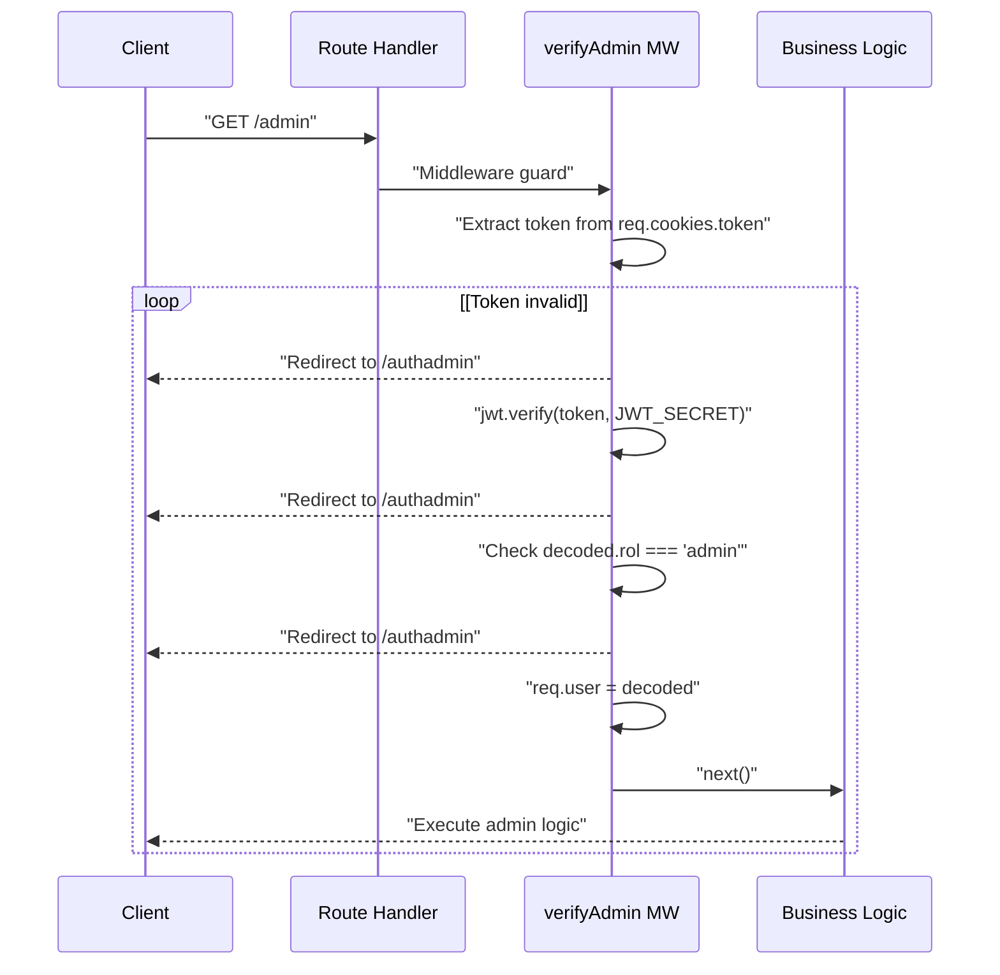
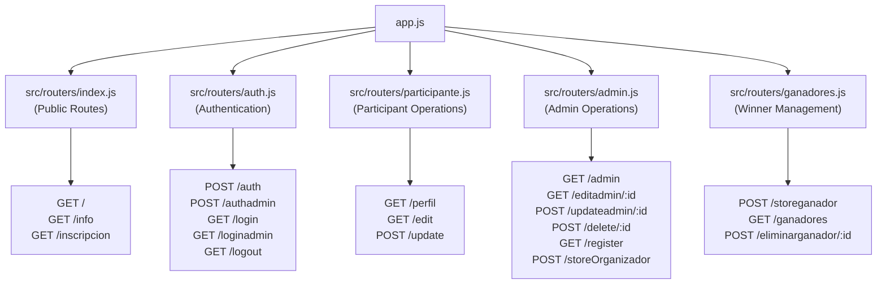
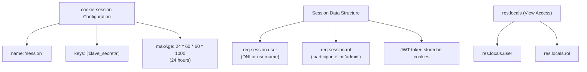
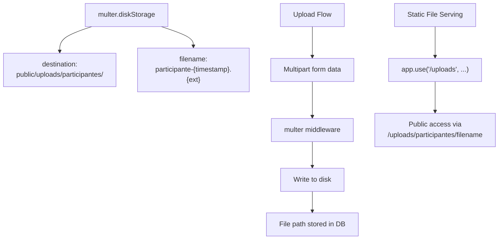

# Architecture

> **Relevant source files**
> * [app.js](https://github.com/Lourdes12587/Proyecto-Node.js/blob/3a172be7/app.js)
> * [middlewares/multer.js](https://github.com/Lourdes12587/Proyecto-Node.js/blob/3a172be7/middlewares/multer.js)
> * [middlewares/verifyAdmin.js](https://github.com/Lourdes12587/Proyecto-Node.js/blob/3a172be7/middlewares/verifyAdmin.js)
> * [middlewares/verifyToken.js](https://github.com/Lourdes12587/Proyecto-Node.js/blob/3a172be7/middlewares/verifyToken.js)
> * [public/css/edit.css](https://github.com/Lourdes12587/Proyecto-Node.js/blob/3a172be7/public/css/edit.css)

## Purpose and Scope

This document describes the overall architecture of the HAPPY RUNNER 42K marathon management application, including the Express.js server structure, middleware pipeline, and request lifecycle. It provides a high-level view of how system components interact and how HTTP requests flow through the application layers.

For detailed information about specific architectural components, see:

* Application server configuration and route delegation: [Application Server](/Lourdes12587/Proyecto-Node.js/2.1-application-server)
* Middleware implementation details: [Middleware Layer](/Lourdes12587/Proyecto-Node.js/2.2-middleware-layer)
* Database connection and configuration: [Database Layer](/Lourdes12587/Proyecto-Node.js/2.3-database-layer)
* Authentication mechanisms: [Authentication & Authorization](/Lourdes12587/Proyecto-Node.js/3-authentication-and-authorization)

## Architectural Overview

The application follows a layered architecture pattern built on Express.js. The system separates concerns across distinct layers: presentation (EJS views), application logic (routes and controllers), authentication/authorization (middleware guards), and data persistence (MySQL database and file storage).

### System Layers Diagram

Sources: [app.js L1-L47](https://github.com/Lourdes12587/Proyecto-Node.js/blob/3a172be7/app.js#L1-L47)

The application implements clear separation between public routes (accessible without authentication), participant routes (requiring authentication), and admin routes (requiring admin role verification).

## Application Entry Point

The Express application initializes in `app.js` with the following responsibilities:

| Component | Purpose | Configuration Location |
| --- | --- | --- |
| Express Server | HTTP server creation | [app.js L1-L2](https://github.com/Lourdes12587/Proyecto-Node.js/blob/3a172be7/app.js#L1-L2)    [app.js L7-L8](https://github.com/Lourdes12587/Proyecto-Node.js/blob/3a172be7/app.js#L7-L8) |
| Environment Variables | Configuration management | [app.js L3-L6](https://github.com/Lourdes12587/Proyecto-Node.js/blob/3a172be7/app.js#L3-L6) |
| Session Management | Cookie-based sessions | [app.js L12-L16](https://github.com/Lourdes12587/Proyecto-Node.js/blob/3a172be7/app.js#L12-L16) |
| View Engine | EJS template rendering | [app.js L36](https://github.com/Lourdes12587/Proyecto-Node.js/blob/3a172be7/app.js#L36-L36) |
| Static Files | Public asset serving | [app.js L32-L34](https://github.com/Lourdes12587/Proyecto-Node.js/blob/3a172be7/app.js#L32-L34) |
| Route Delegation | Modular routing | [app.js L40-L44](https://github.com/Lourdes12587/Proyecto-Node.js/blob/3a172be7/app.js#L40-L44) |

### Server Initialization Flow

Sources: [app.js L1-L20](https://github.com/Lourdes12587/Proyecto-Node.js/blob/3a172be7/app.js#L1-L20)

 [app.js L36-L44](https://github.com/Lourdes12587/Proyecto-Node.js/blob/3a172be7/app.js#L36-L44)

The server listens on port 3000 and creates an HTTP server instance wrapping the Express application. Environment variables are loaded from `./env/.env` using dotenv, with production-specific handling.

## Middleware Pipeline

The middleware pipeline processes every incoming request in a specific order. Middleware execution follows the registration sequence in `app.js`:

### Middleware Execution Order

Sources: [app.js L12-L34](https://github.com/Lourdes12587/Proyecto-Node.js/blob/3a172be7/app.js#L12-L34)

 [middlewares/verifyToken.js L1-L19](https://github.com/Lourdes12587/Proyecto-Node.js/blob/3a172be7/middlewares/verifyToken.js#L1-L19)

 [middlewares/verifyAdmin.js L1-L17](https://github.com/Lourdes12587/Proyecto-Node.js/blob/3a172be7/middlewares/verifyAdmin.js#L1-L17)

### Core Middleware Components

| Middleware | Purpose | Implementation |
| --- | --- | --- |
| `cookie-session` | Session state management with 24-hour lifetime | [app.js L12-L16](https://github.com/Lourdes12587/Proyecto-Node.js/blob/3a172be7/app.js#L12-L16) |
| `res.locals` population | Makes `req.session.user` and `req.session.rol` available to all views | [app.js L22-L26](https://github.com/Lourdes12587/Proyecto-Node.js/blob/3a172be7/app.js#L22-L26) |
| `express.urlencoded` | Parses form data (application/x-www-form-urlencoded) | [app.js L29](https://github.com/Lourdes12587/Proyecto-Node.js/blob/3a172be7/app.js#L29-L29) |
| `express.json` | Parses JSON request bodies | [app.js L30](https://github.com/Lourdes12587/Proyecto-Node.js/blob/3a172be7/app.js#L30-L30) |
| `cookie-parser` | Parses cookies for JWT token extraction | [app.js L31](https://github.com/Lourdes12587/Proyecto-Node.js/blob/3a172be7/app.js#L31-L31) |
| Static file serving | Serves uploaded files and public assets | [app.js L32-L34](https://github.com/Lourdes12587/Proyecto-Node.js/blob/3a172be7/app.js#L32-L34) |

The custom middleware at [app.js L22-L26](https://github.com/Lourdes12587/Proyecto-Node.js/blob/3a172be7/app.js#L22-L26)

 populates `res.locals` with session data, making user identity and role accessible to all EJS templates without explicit passing.

## Request Lifecycle

A complete request flows through multiple stages from HTTP reception to response rendering. The lifecycle varies based on route protection level.

### Public Route Request Flow

Sources: [app.js L12-L26](https://github.com/Lourdes12587/Proyecto-Node.js/blob/3a172be7/app.js#L12-L26)

 [app.js L40-L44](https://github.com/Lourdes12587/Proyecto-Node.js/blob/3a172be7/app.js#L40-L44)

### Protected Route Request Flow (Participant)

Sources: [middlewares/verifyToken.js L1-L19](https://github.com/Lourdes12587/Proyecto-Node.js/blob/3a172be7/middlewares/verifyToken.js#L1-L19)

### Protected Route Request Flow (Admin)

Sources: [middlewares/verifyAdmin.js L1-L17](https://github.com/Lourdes12587/Proyecto-Node.js/blob/3a172be7/middlewares/verifyAdmin.js#L1-L17)

The key difference between `verifyToken` and `verifyAdmin` middleware is that `verifyAdmin` performs an additional role check at [middlewares/verifyAdmin.js L9](https://github.com/Lourdes12587/Proyecto-Node.js/blob/3a172be7/middlewares/verifyAdmin.js#L9-L9)

 ensuring `decoded.rol === "admin"` before allowing access.

## Routing Architecture

Routes are organized into five modular files, each handling a specific functional domain:

### Route Module Organization

Sources: [app.js L40-L44](https://github.com/Lourdes12587/Proyecto-Node.js/blob/3a172be7/app.js#L40-L44)

### Route Protection Matrix

| Route Module | Protection Level | Middleware | Accessed By |
| --- | --- | --- | --- |
| `index.js` | None | - | All users |
| `auth.js` | Mixed | - | Authentication endpoints |
| `participante.js` | Participant | `verifyToken` | Authenticated participants |
| `admin.js` | Admin | `verifyAdmin` | Admin users only |
| `ganadores.js` | Admin | `verifyAdmin` | Admin users only |

Each router module is registered with `app.use("/", require("./src/routers/..."))`, mounting all routes at the root path. Individual route handlers within each module then apply appropriate middleware guards.

## Session and State Management

Session state is managed through `cookie-session` middleware with encrypted cookies containing session data.

### Session Configuration

Sources: [app.js L12-L16](https://github.com/Lourdes12587/Proyecto-Node.js/blob/3a172be7/app.js#L12-L16)

 [app.js L22-L26](https://github.com/Lourdes12587/Proyecto-Node.js/blob/3a172be7/app.js#L22-L26)

### Session Lifecycle

| Event | Action | Location |
| --- | --- | --- |
| User login | Session created with `user` and `rol` properties | Authentication controllers |
| Session duration | 24 hours from last activity | [app.js L15](https://github.com/Lourdes12587/Proyecto-Node.js/blob/3a172be7/app.js#L15-L15) |
| Each request | Session data populated into `res.locals` for view access | [app.js L22-L26](https://github.com/Lourdes12587/Proyecto-Node.js/blob/3a172be7/app.js#L22-L26) |
| JWT validation | Token extracted from `req.cookies.token` | [middlewares/verifyToken.js L4](https://github.com/Lourdes12587/Proyecto-Node.js/blob/3a172be7/middlewares/verifyToken.js#L4-L4)    [middlewares/verifyAdmin.js L4](https://github.com/Lourdes12587/Proyecto-Node.js/blob/3a172be7/middlewares/verifyAdmin.js#L4-L4) |
| User logout | Session destroyed, cookies cleared | Auth router |

The session middleware uses a secret key `'clave_secreta'` to sign session cookies, preventing tampering. JWT tokens provide additional authentication security, stored separately in cookies and verified using `process.env.JWT_SECRET`.

## File Upload Architecture

File uploads are handled by multer middleware with disk storage configuration.

### Multer Storage Configuration

Sources: [middlewares/multer.js L1-L15](https://github.com/Lourdes12587/Proyecto-Node.js/blob/3a172be7/middlewares/multer.js#L1-L15)

 [app.js L32](https://github.com/Lourdes12587/Proyecto-Node.js/blob/3a172be7/app.js#L32-L32)

Uploaded files are stored in `public/uploads/participantes/` with timestamped filenames generated at [middlewares/multer.js L11](https://github.com/Lourdes12587/Proyecto-Node.js/blob/3a172be7/middlewares/multer.js#L11-L11)

 The naming convention `participante-{Date.now()}.{ext}` ensures uniqueness and prevents filename collisions. These files are publicly accessible through the static file middleware at [app.js L32](https://github.com/Lourdes12587/Proyecto-Node.js/blob/3a172be7/app.js#L32-L32)

 which maps the `/uploads` URL path to the `public/uploads` directory.

## Summary

The HAPPY RUNNER 42K application architecture implements a layered design with clear separation of concerns:

* **Application Layer**: Express.js server in `app.js` coordinates all components
* **Middleware Pipeline**: Sequential processing of requests through session management, body parsing, and authentication guards
* **Routing Layer**: Five modular routers handling distinct functional domains
* **Authentication**: Dual-level protection using JWT tokens with role-based access control
* **Data Persistence**: MySQL database for structured data, file system for uploaded photos
* **Session Management**: Cookie-based sessions with 24-hour lifetime and `res.locals` population for view access

The architecture enables role-based feature segregation, with public routes for event information, participant-protected routes for profile management, and admin-protected routes for system administration.