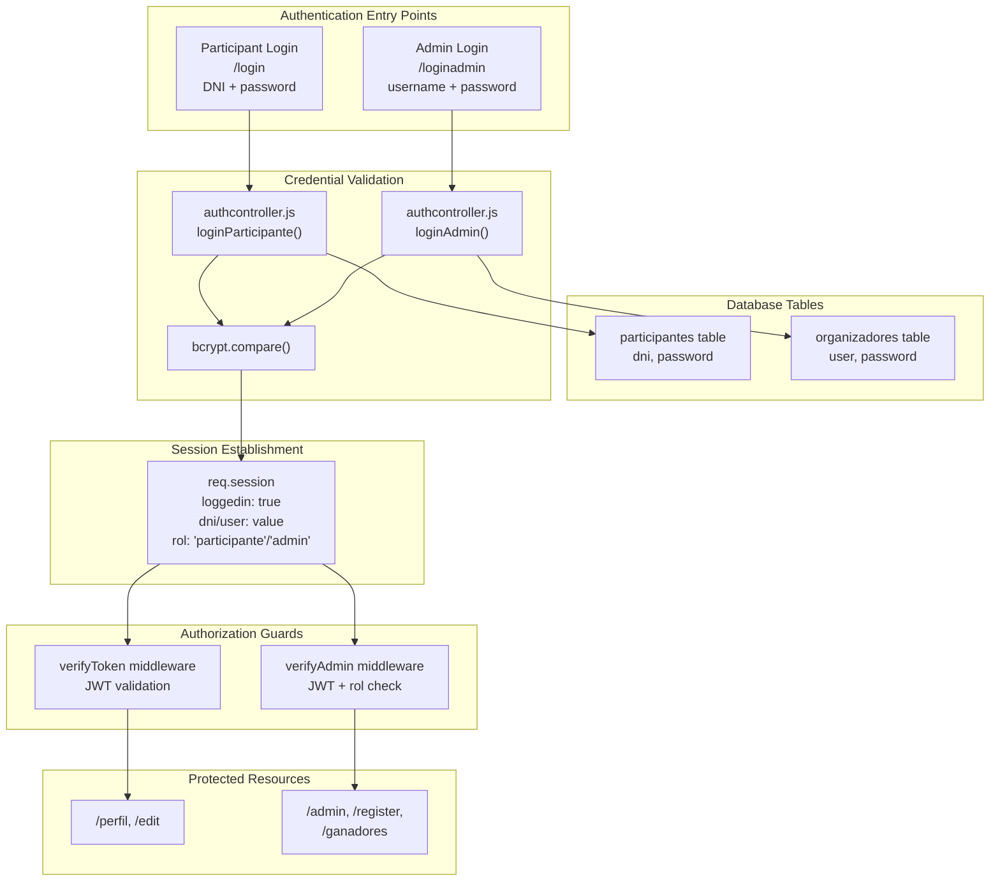
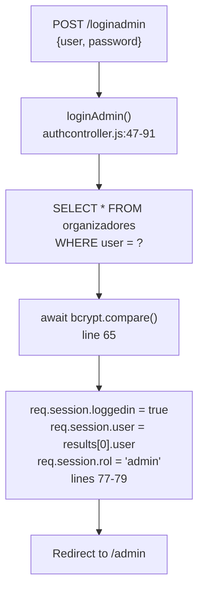
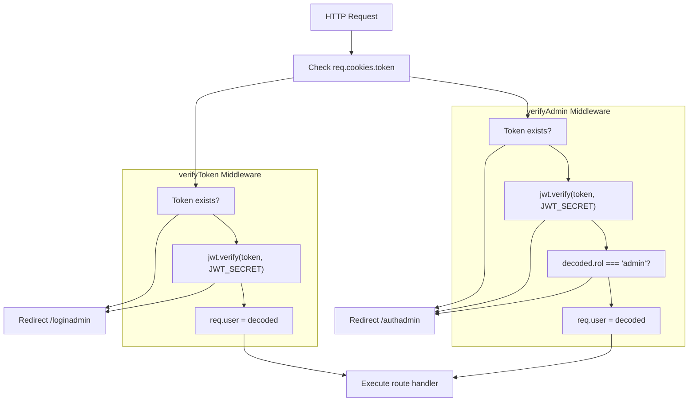
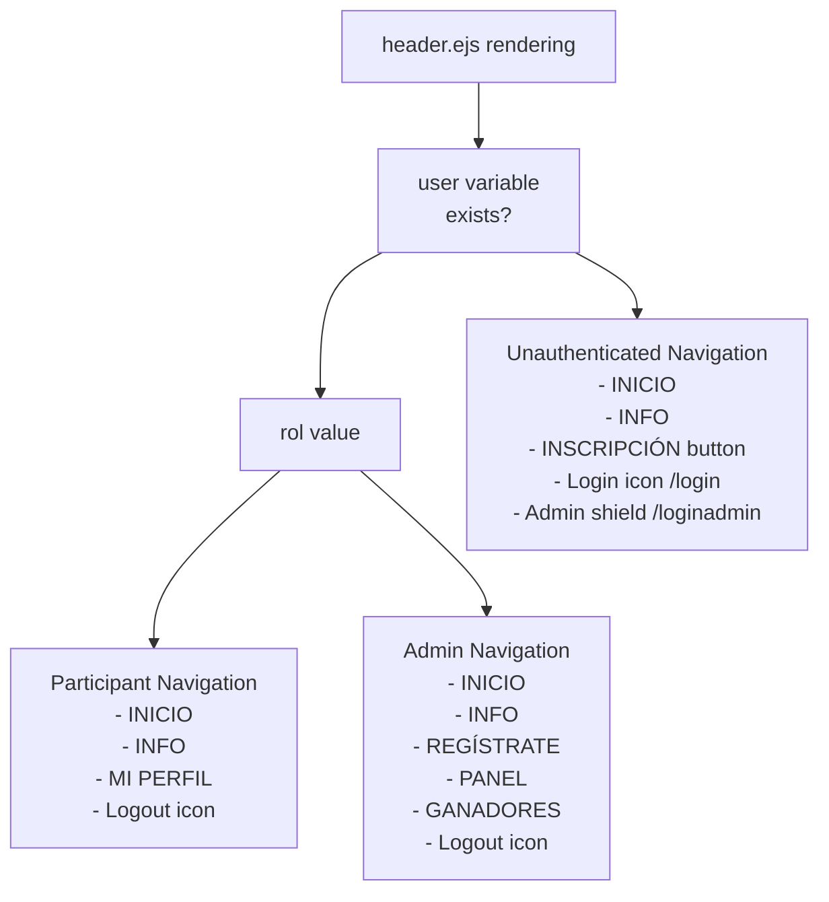
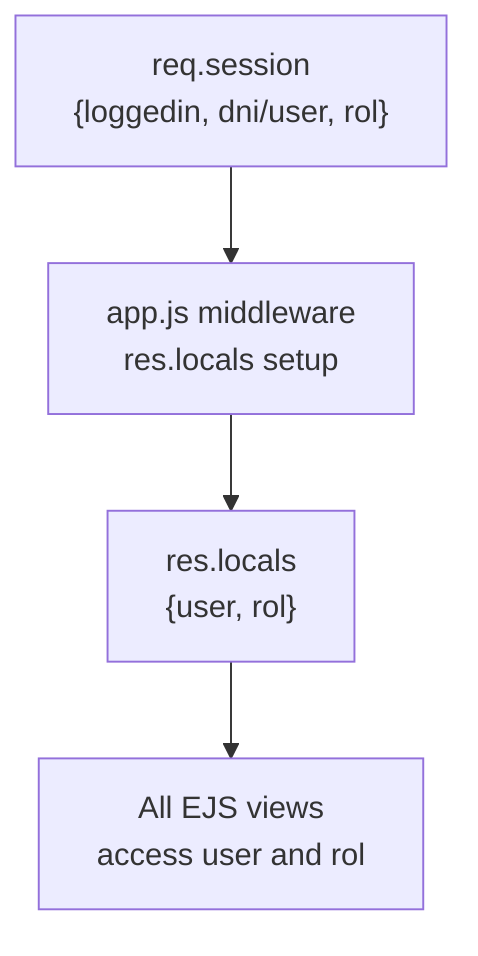

# Authentication & Authorization

> **Relevant source files**
> * [controllers/authcontroller.js](https://github.com/Lourdes12587/Proyecto-Node.js/blob/3a172be7/controllers/authcontroller.js)
> * [middlewares/multer.js](https://github.com/Lourdes12587/Proyecto-Node.js/blob/3a172be7/middlewares/multer.js)
> * [middlewares/verifyAdmin.js](https://github.com/Lourdes12587/Proyecto-Node.js/blob/3a172be7/middlewares/verifyAdmin.js)
> * [middlewares/verifyToken.js](https://github.com/Lourdes12587/Proyecto-Node.js/blob/3a172be7/middlewares/verifyToken.js)
> * [public/css/edit.css](https://github.com/Lourdes12587/Proyecto-Node.js/blob/3a172be7/public/css/edit.css)
> * [views/partials/header.ejs](https://github.com/Lourdes12587/Proyecto-Node.js/blob/3a172be7/views/partials/header.ejs)

This document provides a comprehensive overview of the authentication and authorization mechanisms in the HAPPY RUNNER 42K application. The system implements a dual authentication model with session-based state management and role-based access control to distinguish between participant and administrator capabilities.

**Scope**: This document covers login mechanisms, credential validation, middleware-based authorization guards, session management, and role-based navigation. For information about the broader middleware pipeline, see [Middleware Layer](/Lourdes12587/Proyecto-Node.js/2.2-middleware-layer). For details about user interface access patterns, see [User Interfaces](/Lourdes12587/Proyecto-Node.js/4-user-interfaces).

---

## System Overview

The application implements two independent authentication pathways that converge on a unified session-based authorization model:



**Sources**: [controllers/authcontroller.js L1-L91](https://github.com/Lourdes12587/Proyecto-Node.js/blob/3a172be7/controllers/authcontroller.js#L1-L91)

 [middlewares/verifyToken.js L1-L18](https://github.com/Lourdes12587/Proyecto-Node.js/blob/3a172be7/middlewares/verifyToken.js#L1-L18)

 [middlewares/verifyAdmin.js L1-L15](https://github.com/Lourdes12587/Proyecto-Node.js/blob/3a172be7/middlewares/verifyAdmin.js#L1-L15)

---

## 3.1 Login System

The login system provides two distinct authentication mechanisms that query separate database tables and establish role-specific sessions.

### Participant Login (DNI-Based)

Participants authenticate using their National Identity Document (DNI) number as the username. The `loginParticipante` function implements the following validation logic:

**Authentication Flow**:

| Step | Action | Implementation |
| --- | --- | --- |
| 1 | Validate input presence | Check `dni` and `password` fields exist |
| 2 | Query database | `SELECT * FROM participantes WHERE dni = ?` |
| 3 | Verify credentials | `bcrypt.compare(password, results[0].password)` |
| 4 | Establish session | Set `req.session.loggedin`, `req.session.dni`, `req.session.rol = "participante"` |
| 5 | Redirect | Navigate to `/perfil` on success |

```mermaid
sequenceDiagram
  participant Client
  participant /login POST
  participant loginParticipante()
  participant participantes table
  participant bcrypt
  participant req.session

  Client->>/login POST: "POST {dni, password}"
  /login POST->>loginParticipante(): "Execute handler"
  loop [Missing Credentials]
    loginParticipante()-->>Client: "Render login with error"
    loginParticipante()->>participantes table: "SELECT * FROM participantes
    participantes table-->>loginParticipante(): WHERE dni = ?"
    loginParticipante()-->>Client: "User record or empty"
    loginParticipante()->>bcrypt: "Render 'Credenciales inválidas'"
    bcrypt-->>loginParticipante(): "compare(password, hash)"
    loginParticipante()-->>Client: "boolean result"
  end
  loginParticipante()->>req.session: "Render 'Credenciales inválidas'"
  loginParticipante()-->>Client: "loggedin = true
```

**Implementation Details**:

The function performs asynchronous password comparison using bcrypt to validate hashed credentials stored in the database [controllers/authcontroller.js L1-L45](https://github.com/Lourdes12587/Proyecto-Node.js/blob/3a172be7/controllers/authcontroller.js#L1-L45)

 Input validation occurs before database queries [controllers/authcontroller.js L4-L12](https://github.com/Lourdes12587/Proyecto-Node.js/blob/3a172be7/controllers/authcontroller.js#L4-L12)

 Failed authentication attempts render the login view with error feedback rather than throwing exceptions [controllers/authcontroller.js L17-L27](https://github.com/Lourdes12587/Proyecto-Node.js/blob/3a172be7/controllers/authcontroller.js#L17-L27)

**Sources**: [controllers/authcontroller.js L1-L45](https://github.com/Lourdes12587/Proyecto-Node.js/blob/3a172be7/controllers/authcontroller.js#L1-L45)

### Admin Login (Username-Based)

Administrator authentication uses a traditional username/password combination, querying the `organizadores` table:

**Key Differences from Participant Login**:

| Aspect | Participant | Admin |
| --- | --- | --- |
| Credential field | `dni` | `user` |
| Database table | `participantes` | `organizadores` |
| Session identifier | `req.session.dni` | `req.session.user` |
| Role value | `"participante"` | `"admin"` |
| Success redirect | `/perfil` | `/admin` |



The admin login function follows identical validation patterns to participant login but operates on different data structures [controllers/authcontroller.js L47-L91](https://github.com/Lourdes12587/Proyecto-Node.js/blob/3a172be7/controllers/authcontroller.js#L47-L91)

 Error handling mirrors the participant flow, rendering `loginadmin.ejs` with appropriate alert configurations.

**Sources**: [controllers/authcontroller.js L47-L91](https://github.com/Lourdes12587/Proyecto-Node.js/blob/3a172be7/controllers/authcontroller.js#L47-L91)

### Password Security

Both login functions employ bcrypt for secure password comparison:

* **Asynchronous comparison**: Uses `await bcrypt.compare()` to prevent timing attacks
* **No plaintext exposure**: Passwords are never logged or displayed
* **Database storage**: Only bcrypt hashes are stored in `participantes.password` and `organizadores.password` fields

The comparison occurs after successful database query retrieval [controllers/authcontroller.js L19](https://github.com/Lourdes12587/Proyecto-Node.js/blob/3a172be7/controllers/authcontroller.js#L19-L19)

 and [controllers/authcontroller.js L65](https://github.com/Lourdes12587/Proyecto-Node.js/blob/3a172be7/controllers/authcontroller.js#L65-L65)

 ensuring short-circuit evaluation when users don't exist.

**Sources**: [controllers/authcontroller.js L19](https://github.com/Lourdes12587/Proyecto-Node.js/blob/3a172be7/controllers/authcontroller.js#L19-L19)

 [controllers/authcontroller.js L65](https://github.com/Lourdes12587/Proyecto-Node.js/blob/3a172be7/controllers/authcontroller.js#L65-L65)

---

## 3.2 Role-Based Access Control

The application enforces authorization through two middleware guards that intercept requests to protected routes. These guards validate JWT tokens and role attributes to control access.

### Middleware Architecture



**Sources**: [middlewares/verifyToken.js L1-L18](https://github.com/Lourdes12587/Proyecto-Node.js/blob/3a172be7/middlewares/verifyToken.js#L1-L18)

 [middlewares/verifyAdmin.js L1-L15](https://github.com/Lourdes12587/Proyecto-Node.js/blob/3a172be7/middlewares/verifyAdmin.js#L1-L15)

### verifyToken Middleware

The `verifyToken` middleware provides general authentication validation for routes requiring any authenticated user. It reads JWT tokens from cookies and validates them against the `JWT_SECRET` environment variable.

**Implementation** [middlewares/verifyToken.js L1-L18](https://github.com/Lourdes12587/Proyecto-Node.js/blob/3a172be7/middlewares/verifyToken.js#L1-L18)

:

```yaml
Token retrieval: req.cookies.token (line 4)
Validation: jwt.verify(token, process.env.JWT_SECRET) (line 10)
User attachment: req.user = decoded (line 11)
Failure redirect: /loginadmin (lines 6, 14)
```

**Usage Pattern**:
This middleware protects participant-facing routes where general authentication suffices without role differentiation. The decoded token payload is attached to `req.user` for downstream route handlers.

**Sources**: [middlewares/verifyToken.js L1-L18](https://github.com/Lourdes12587/Proyecto-Node.js/blob/3a172be7/middlewares/verifyToken.js#L1-L18)

### verifyAdmin Middleware

The `verifyAdmin` middleware extends authentication with role verification, ensuring only users with `rol: "admin"` in their token payload can access administrative routes.

**Implementation** [middlewares/verifyAdmin.js L1-L15](https://github.com/Lourdes12587/Proyecto-Node.js/blob/3a172be7/middlewares/verifyAdmin.js#L1-L15)

:

```yaml
Token retrieval: req.cookies.token (line 4)
Validation: jwt.verify(token, process.env.JWT_SECRET) (line 8)
Role check: decoded.rol !== "admin" (line 9)
Success attachment: req.user = decoded (line 10)
Failure redirect: /authadmin (lines 5, 9, 13)
```

**Key Difference**: The additional role comparison [middlewares/verifyAdmin.js L9](https://github.com/Lourdes12587/Proyecto-Node.js/blob/3a172be7/middlewares/verifyAdmin.js#L9-L9)

 creates a two-stage authorization: first validating the token's authenticity, then verifying the role attribute. Failed role checks redirect to `/authadmin` rather than `/loginadmin`, distinguishing authentication failures from authorization failures.

**Sources**: [middlewares/verifyAdmin.js L1-L15](https://github.com/Lourdes12587/Proyecto-Node.js/blob/3a172be7/middlewares/verifyAdmin.js#L1-L15)

### Protected Route Mapping

The following table maps routes to their authorization requirements:

| Route | Middleware | Role Required | Purpose |
| --- | --- | --- | --- |
| `/perfil` | `verifyToken` | Any authenticated | View participant profile |
| `/edit` | `verifyToken` | Any authenticated | Edit participant profile |
| `/admin` | `verifyAdmin` | `"admin"` | View all participants |
| `/register` | `verifyAdmin` | `"admin"` | Register new organizers |
| `/ganadores` | `verifyAdmin` | `"admin"` | Manage race winners |
| `/editadmin/:id` | `verifyAdmin` | `"admin"` | Edit participant as admin |
| `/delete/:id` | `verifyAdmin` | `"admin"` | Delete participant |

**Sources**: [middlewares/verifyToken.js L1-L18](https://github.com/Lourdes12587/Proyecto-Node.js/blob/3a172be7/middlewares/verifyToken.js#L1-L18)

 [middlewares/verifyAdmin.js L1-L15](https://github.com/Lourdes12587/Proyecto-Node.js/blob/3a172be7/middlewares/verifyAdmin.js#L1-L15)

### Role-Based Navigation

The navigation header dynamically renders links based on authentication state and role, implemented in the `header.ejs` partial:



**Implementation Details** [views/partials/header.ejs L18-L30](https://github.com/Lourdes12587/Proyecto-Node.js/blob/3a172be7/views/partials/header.ejs#L18-L30)

:

* Line 18: Checks `if (!user)` for unauthenticated state
* Line 22: Checks `else if (rol === 'participante')` for participant role
* Line 25: Checks `else if (rol === 'admin')` for admin role

The `user` and `rol` variables are populated from session data by middleware before template rendering, providing seamless role-based UI customization without client-side logic.

**Sources**: [views/partials/header.ejs L18-L30](https://github.com/Lourdes12587/Proyecto-Node.js/blob/3a172be7/views/partials/header.ejs#L18-L30)

---

## 3.3 Session Management

The application uses the `cookie-session` middleware to maintain server-side session state encoded in signed cookies. Session data persists across requests and stores authentication status and role information.

### Session Data Structure

The session object contains the following properties after successful authentication:

| Property | Type | Purpose | Set By |
| --- | --- | --- | --- |
| `loggedin` | Boolean | Indicates active authentication | Both login functions |
| `dni` | String | Participant identifier (DNI number) | `loginParticipante` |
| `user` | String | Admin username | `loginAdmin` |
| `rol` | String | User role (`"participante"` or `"admin"`) | Both login functions |

**Participant Session Example** [controllers/authcontroller.js L31-L33](https://github.com/Lourdes12587/Proyecto-Node.js/blob/3a172be7/controllers/authcontroller.js#L31-L33)

:

```
req.session.loggedin = true
req.session.dni = results[0].dni
req.session.rol = "participante"
```

**Admin Session Example** [controllers/authcontroller.js L77-L79](https://github.com/Lourdes12587/Proyecto-Node.js/blob/3a172be7/controllers/authcontroller.js#L77-L79)

:

```
req.session.loggedin = true
req.session.user = results[0].user
req.session.rol = "admin"
```

**Sources**: [controllers/authcontroller.js L31-L33](https://github.com/Lourdes12587/Proyecto-Node.js/blob/3a172be7/controllers/authcontroller.js#L31-L33)

 [controllers/authcontroller.js L77-L79](https://github.com/Lourdes12587/Proyecto-Node.js/blob/3a172be7/controllers/authcontroller.js#L77-L79)

### Session Lifecycle

```mermaid
sequenceDiagram
  participant Browser
  participant cookie-session
  participant middleware
  participant loginParticipante() or
  participant loginAdmin()
  participant app.js middleware
  participant res.locals setup
  participant EJS Template

  Browser->>cookie-session: "Request with session cookie"
  cookie-session->>cookie-session: "Decrypt and verify
  cookie-session->>app.js middleware: using clave_secreta"
  note over app.js middleware,res.locals setup: "Populate res.locals
  app.js middleware->>EJS Template: "req.session populated"
  EJS Template-->>Browser: "user = req.session.user/dni
  note over Browser: "User initiates login"
  Browser->>loginParticipante() or: rol = req.session.rol"
  loginParticipante() or->>loginParticipante() or: "Rendered HTML with
  loginParticipante() or->>cookie-session: role-based content"
  cookie-session->>cookie-session: "POST /login or /loginadmin"
  cookie-session-->>Browser: "Validate credentials"
  note over Browser,middleware: "Session active for 24 hours"
  Browser->>cookie-session: "req.session.loggedin = true
  cookie-session->>app.js middleware: req.session.rol = role
```

**Sources**: [controllers/authcontroller.js L31-L33](https://github.com/Lourdes12587/Proyecto-Node.js/blob/3a172be7/controllers/authcontroller.js#L31-L33)

 [controllers/authcontroller.js L77-L79](https://github.com/Lourdes12587/Proyecto-Node.js/blob/3a172be7/controllers/authcontroller.js#L77-L79)

### Cookie-Session Configuration

The `cookie-session` middleware configuration establishes session parameters:

**Configuration Properties** (from application setup):

| Property | Value | Purpose |
| --- | --- | --- |
| `name` | Session cookie name | Cookie identifier in browser |
| `keys` | `['clave_secreta']` | Signing key for session encryption |
| `maxAge` | 24 hours (milliseconds) | Session expiration time |

The session cookie is signed using the `clave_secreta` key, ensuring integrity and preventing client-side tampering. Sessions expire after 24 hours, requiring re-authentication.

### Session Availability in Views

The application middleware populates `res.locals` from session data before rendering EJS templates:



This pattern makes session state available to all rendered views without explicit passing in route handlers. The `header.ejs` partial leverages this to implement role-based navigation [views/partials/header.ejs L18-L30](https://github.com/Lourdes12587/Proyecto-Node.js/blob/3a172be7/views/partials/header.ejs#L18-L30)

**Sources**: [views/partials/header.ejs L18-L30](https://github.com/Lourdes12587/Proyecto-Node.js/blob/3a172be7/views/partials/header.ejs#L18-L30)

### Logout Mechanism

Logout functionality destroys the session and redirects users to the home page. The session is cleared by setting `req.session = null` or by destroying the session cookie, forcing re-authentication on subsequent protected route access.

---

## Security Considerations

The authentication and authorization implementation includes several security measures:

| Security Feature | Implementation | Location |
| --- | --- | --- |
| Password hashing | bcrypt with automatic salting | Login functions |
| JWT token validation | Signature verification with secret | Middleware guards |
| Session encryption | Signed cookies with secret key | cookie-session config |
| Role verification | Explicit role checking in middleware | verifyAdmin |
| SQL injection prevention | Parameterized queries | Database queries |
| Timing attack mitigation | Async bcrypt comparison | Login functions |

**Credential Validation Pattern**: Both login functions follow identical error handling, avoiding information leakage about user existence [controllers/authcontroller.js L17-L27](https://github.com/Lourdes12587/Proyecto-Node.js/blob/3a172be7/controllers/authcontroller.js#L17-L27)

 and [controllers/authcontroller.js L63-L73](https://github.com/Lourdes12587/Proyecto-Node.js/blob/3a172be7/controllers/authcontroller.js#L63-L73)

**Token Storage**: JWT tokens are stored in HTTP-only cookies rather than localStorage, preventing XSS-based token theft. The `verifyToken` and `verifyAdmin` middleware read tokens from `req.cookies.token` [middlewares/verifyToken.js L4](https://github.com/Lourdes12587/Proyecto-Node.js/blob/3a172be7/middlewares/verifyToken.js#L4-L4)

 and [middlewares/verifyAdmin.js L4](https://github.com/Lourdes12587/Proyecto-Node.js/blob/3a172be7/middlewares/verifyAdmin.js#L4-L4)

**Sources**: [controllers/authcontroller.js L17-L27](https://github.com/Lourdes12587/Proyecto-Node.js/blob/3a172be7/controllers/authcontroller.js#L17-L27)

 [controllers/authcontroller.js L63-L73](https://github.com/Lourdes12587/Proyecto-Node.js/blob/3a172be7/controllers/authcontroller.js#L63-L73)

 [middlewares/verifyToken.js L4](https://github.com/Lourdes12587/Proyecto-Node.js/blob/3a172be7/middlewares/verifyToken.js#L4-L4)

 [middlewares/verifyAdmin.js L4](https://github.com/Lourdes12587/Proyecto-Node.js/blob/3a172be7/middlewares/verifyAdmin.js#L4-L4)