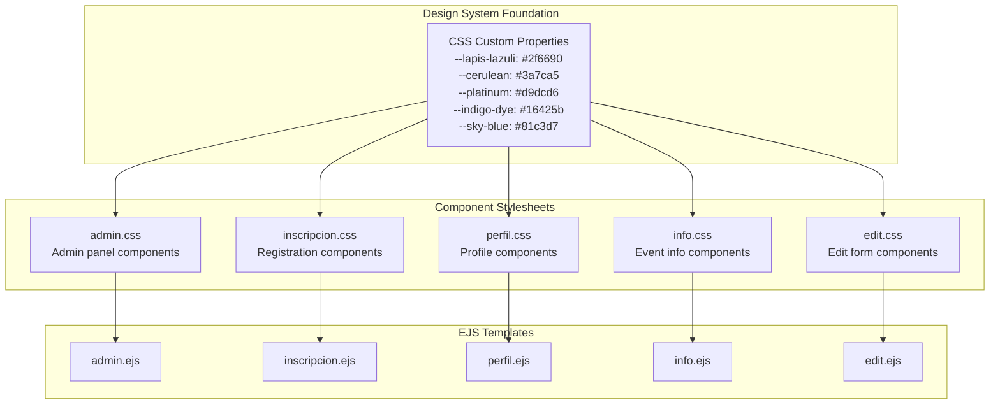
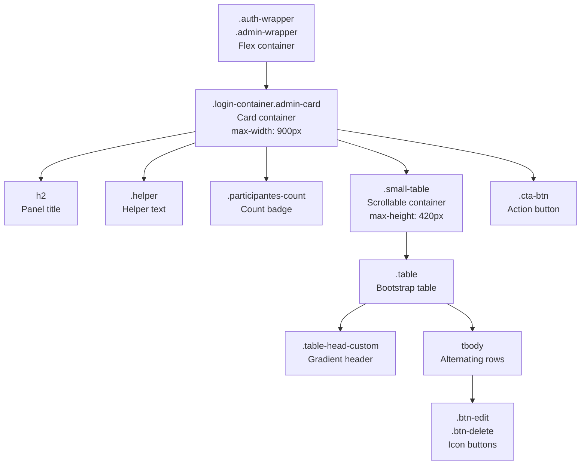
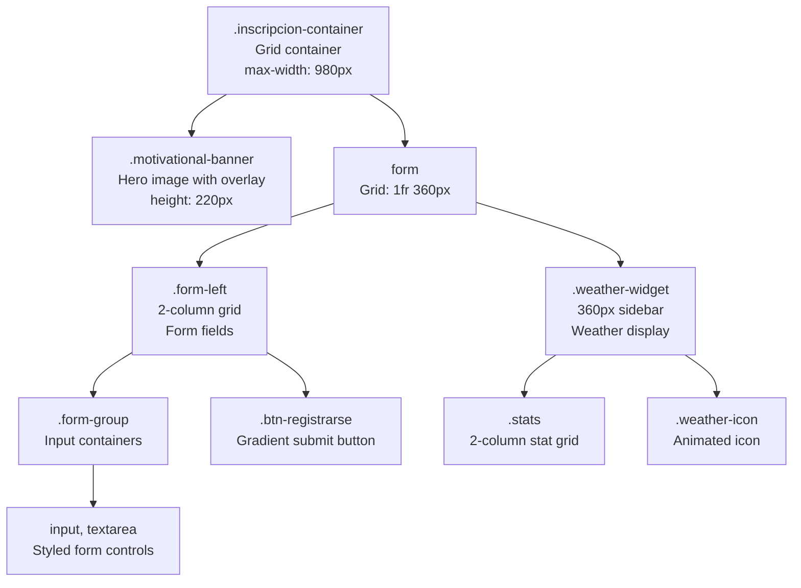
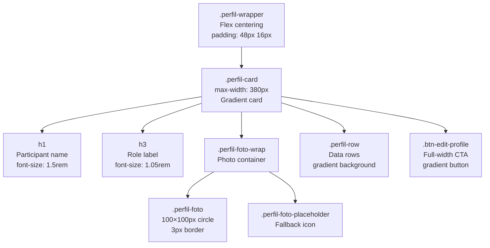
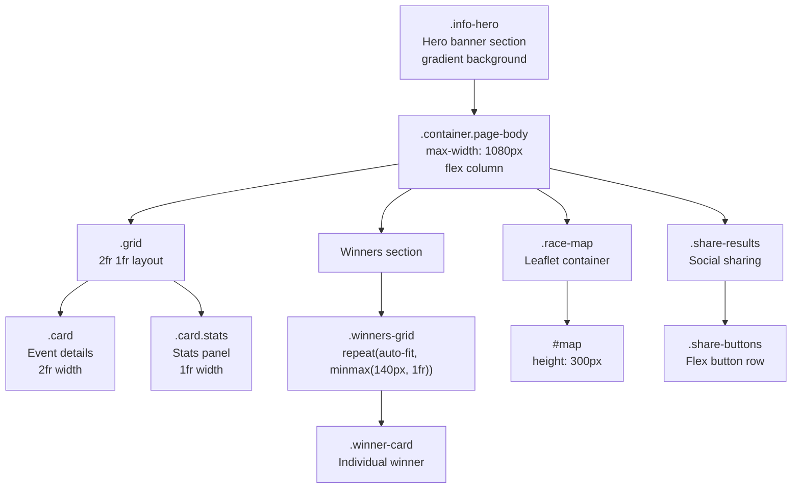
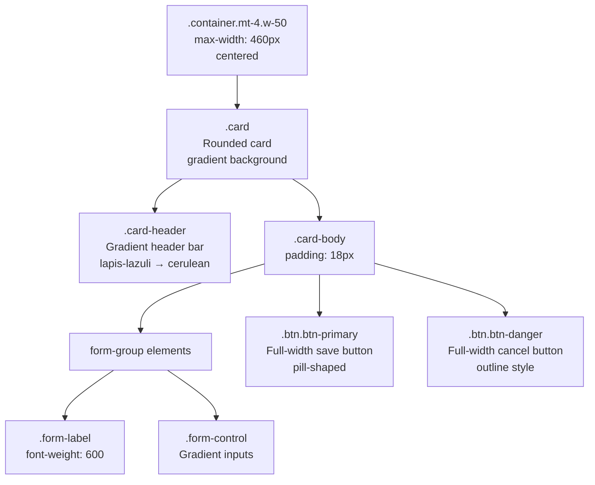
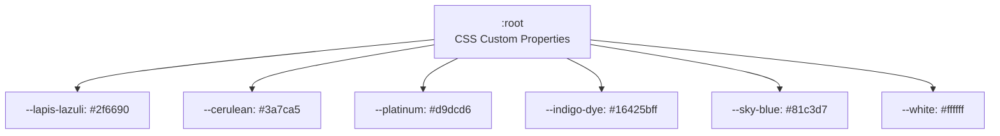

# Component Styles

> **Relevant source files**
> * [middlewares/multer.js](https://github.com/Lourdes12587/Proyecto-Node.js/blob/3a172be7/middlewares/multer.js)
> * [middlewares/verifyAdmin.js](https://github.com/Lourdes12587/Proyecto-Node.js/blob/3a172be7/middlewares/verifyAdmin.js)
> * [middlewares/verifyToken.js](https://github.com/Lourdes12587/Proyecto-Node.js/blob/3a172be7/middlewares/verifyToken.js)
> * [public/css/admin.css](https://github.com/Lourdes12587/Proyecto-Node.js/blob/3a172be7/public/css/admin.css)
> * [public/css/edit.css](https://github.com/Lourdes12587/Proyecto-Node.js/blob/3a172be7/public/css/edit.css)
> * [public/css/info.css](https://github.com/Lourdes12587/Proyecto-Node.js/blob/3a172be7/public/css/info.css)
> * [public/css/inscripcion.css](https://github.com/Lourdes12587/Proyecto-Node.js/blob/3a172be7/public/css/inscripcion.css)
> * [public/css/perfil.css](https://github.com/Lourdes12587/Proyecto-Node.js/blob/3a172be7/public/css/perfil.css)

## Purpose and Scope

This document details the page-specific stylesheets in the HAPPY RUNNER 42K application, covering the component patterns, layout strategies, and responsive behaviors implemented in `admin.css`, `inscripcion.css`, `perfil.css`, `info.css`, and `edit.css`. These stylesheets build upon the foundational design system to create specialized visual experiences for different user interfaces.

For information about the foundational CSS custom properties, color palette, and base styles, see [Design System](/Lourdes12587/Proyecto-Node.js/5.1-design-system). For information about the EJS templates that use these styles, see [User Interfaces](/Lourdes12587/Proyecto-Node.js/4-user-interfaces).

---

## Architecture Overview

The component styling system follows a **one-stylesheet-per-page** pattern where each major user interface has a dedicated CSS file that imports and extends the design system tokens defined in [public/css/admin.css L1-L11](https://github.com/Lourdes12587/Proyecto-Node.js/blob/3a172be7/public/css/admin.css#L1-L11)

 [public/css/info.css L1-L10](https://github.com/Lourdes12587/Proyecto-Node.js/blob/3a172be7/public/css/info.css#L1-L10)

 [public/css/inscripcion.css L4-L26](https://github.com/Lourdes12587/Proyecto-Node.js/blob/3a172be7/public/css/inscripcion.css#L4-L26)

 [public/css/perfil.css L1-L8](https://github.com/Lourdes12587/Proyecto-Node.js/blob/3a172be7/public/css/perfil.css#L1-L8)

 and [public/css/edit.css L2-L9](https://github.com/Lourdes12587/Proyecto-Node.js/blob/3a172be7/public/css/edit.css#L2-L9)



**Sources:** [public/css/admin.css L1-L157](https://github.com/Lourdes12587/Proyecto-Node.js/blob/3a172be7/public/css/admin.css#L1-L157)

 [public/css/inscripcion.css L1-L313](https://github.com/Lourdes12587/Proyecto-Node.js/blob/3a172be7/public/css/inscripcion.css#L1-L313)

 [public/css/perfil.css L1-L93](https://github.com/Lourdes12587/Proyecto-Node.js/blob/3a172be7/public/css/perfil.css#L1-L93)

 [public/css/info.css L1-L195](https://github.com/Lourdes12587/Proyecto-Node.js/blob/3a172be7/public/css/info.css#L1-L195)

 [public/css/edit.css L1-L150](https://github.com/Lourdes12587/Proyecto-Node.js/blob/3a172be7/public/css/edit.css#L1-L150)

---

## Admin Panel Styles (admin.css)

The admin panel stylesheet implements a compact, table-centric design for participant management with client-side search functionality.

### Component Hierarchy



**Sources:** [public/css/admin.css L26-L44](https://github.com/Lourdes12587/Proyecto-Node.js/blob/3a172be7/public/css/admin.css#L26-L44)

 [public/css/admin.css L74-L82](https://github.com/Lourdes12587/Proyecto-Node.js/blob/3a172be7/public/css/admin.css#L74-L82)

 [public/css/admin.css L84-L99](https://github.com/Lourdes12587/Proyecto-Node.js/blob/3a172be7/public/css/admin.css#L84-L99)

### Key Component Patterns

| Component | Class | Styling Pattern | Code Reference |
| --- | --- | --- | --- |
| Container | `.admin-wrapper` | Flex centering, min-height viewport-based | [public/css/admin.css L27-L33](https://github.com/Lourdes12587/Proyecto-Node.js/blob/3a172be7/public/css/admin.css#L27-L33) |
| Card | `.login-container.admin-card` | Gradient background, rounded corners, shadow | [public/css/admin.css L36-L44](https://github.com/Lourdes12587/Proyecto-Node.js/blob/3a172be7/public/css/admin.css#L36-L44) |
| Count Badge | `.participantes-count` | Gradient pill, bold text | [public/css/admin.css L65-L72](https://github.com/Lourdes12587/Proyecto-Node.js/blob/3a172be7/public/css/admin.css#L65-L72) |
| Table Container | `.small-table` | Fixed height with scroll, rounded | [public/css/admin.css L75-L82](https://github.com/Lourdes12587/Proyecto-Node.js/blob/3a172be7/public/css/admin.css#L75-L82) |
| Table Header | `.table-head-custom` | Gradient background (lapis-lazuli → cerulean) | [public/css/admin.css L85-L91](https://github.com/Lourdes12587/Proyecto-Node.js/blob/3a172be7/public/css/admin.css#L85-L91) |
| Edit Button | `.btn-edit` | Yellow gradient, 34×34px icon button | [public/css/admin.css L120-L124](https://github.com/Lourdes12587/Proyecto-Node.js/blob/3a172be7/public/css/admin.css#L120-L124) |
| Delete Button | `.btn-delete` | Pink gradient, 34×34px icon button | [public/css/admin.css L127-L131](https://github.com/Lourdes12587/Proyecto-Node.js/blob/3a172be7/public/css/admin.css#L127-L131) |

### Responsive Breakpoints

The admin panel implements three responsive tiers defined in [public/css/admin.css L146-L156](https://github.com/Lourdes12587/Proyecto-Node.js/blob/3a172be7/public/css/admin.css#L146-L156)

:

* **Desktop (> 992px)**: Full 900px width, 420px table height
* **Tablet (577-992px)**: 720px width, 360px table height
* **Mobile (≤ 576px)**: 360px width, 300px table height, reduced padding

**Sources:** [public/css/admin.css L1-L157](https://github.com/Lourdes12587/Proyecto-Node.js/blob/3a172be7/public/css/admin.css#L1-L157)

---

## Registration Form Styles (inscripcion.css)

The registration stylesheet implements a sophisticated two-column layout with an embedded weather widget and motivational banner.

### Layout Architecture



**Sources:** [public/css/inscripcion.css L52-L64](https://github.com/Lourdes12587/Proyecto-Node.js/blob/3a172be7/public/css/inscripcion.css#L52-L64)

 [public/css/inscripcion.css L79-L92](https://github.com/Lourdes12587/Proyecto-Node.js/blob/3a172be7/public/css/inscripcion.css#L79-L92)

 [public/css/inscripcion.css L161-L244](https://github.com/Lourdes12587/Proyecto-Node.js/blob/3a172be7/public/css/inscripcion.css#L161-L244)

### Weather Widget Component

The weather widget is a distinctive feature with animated floating effects and dynamic gradient backgrounds:

**Class Structure:**

* `.weather-widget` [public/css/inscripcion.css L161-L185](https://github.com/Lourdes12587/Proyecto-Node.js/blob/3a172be7/public/css/inscripcion.css#L161-L185)  - Container with gradient background (sky-blue → lapis-lazuli)
* `.weather-icon img` [public/css/inscripcion.css L196-L200](https://github.com/Lourdes12587/Proyecto-Node.js/blob/3a172be7/public/css/inscripcion.css#L196-L200)  - 100×100px icon with float animation
* `.stats` [public/css/inscripcion.css L207-L212](https://github.com/Lourdes12587/Proyecto-Node.js/blob/3a172be7/public/css/inscripcion.css#L207-L212)  - 2-column grid for temperature and conditions
* `.stat` [public/css/inscripcion.css L214-L231](https://github.com/Lourdes12587/Proyecto-Node.js/blob/3a172be7/public/css/inscripcion.css#L214-L231)  - Individual stat cards with semi-transparent white backgrounds

**Animation:**

```
@keyframes float {
  0%, 100% { transform: translateY(0); }
  50% { transform: translateY(-6px); }
}
```

Defined in [public/css/inscripcion.css L202-L205](https://github.com/Lourdes12587/Proyecto-Node.js/blob/3a172be7/public/css/inscripcion.css#L202-L205)

### Form Input Styling

All form inputs share consistent styling patterns defined in [public/css/inscripcion.css L106-L128](https://github.com/Lourdes12587/Proyecto-Node.js/blob/3a172be7/public/css/inscripcion.css#L106-L128)

:

* **Border**: 1px solid with 12% opacity indigo-dye
* **Background**: Linear gradient from white to light blue (`#ffffff` → `#f7fbff`)
* **Padding**: 12px vertical, 14px horizontal
* **Border Radius**: 12px
* **Focus State**: Transforms upward (-3px), increases shadow, changes border to cerulean

### Motivational Banner

The banner component [public/css/inscripcion.css L251-L292](https://github.com/Lourdes12587/Proyecto-Node.js/blob/3a172be7/public/css/inscripcion.css#L251-L292)

 overlays text on a background image:

* **Height**: 220px (160px on mobile)
* **Background**: URL-based image with rgba overlay (22,66,91,0.48)
* **Typography**: 2rem bold title with text-shadow for contrast

**Sources:** [public/css/inscripcion.css L1-L313](https://github.com/Lourdes12587/Proyecto-Node.js/blob/3a172be7/public/css/inscripcion.css#L1-L313)

---

## Profile Display Styles (perfil.css)

The profile stylesheet creates a compact card-based interface for displaying participant information.

### Component Structure



**Sources:** [public/css/perfil.css L21-L44](https://github.com/Lourdes12587/Proyecto-Node.js/blob/3a172be7/public/css/perfil.css#L21-L44)

 [public/css/perfil.css L49-L59](https://github.com/Lourdes12587/Proyecto-Node.js/blob/3a172be7/public/css/perfil.css#L49-L59)

 [public/css/perfil.css L61-L73](https://github.com/Lourdes12587/Proyecto-Node.js/blob/3a172be7/public/css/perfil.css#L61-L73)

### Profile Card Features

| Element | Class | Specification | Code Reference |
| --- | --- | --- | --- |
| Card Container | `.perfil-card` | 380px max-width, gradient background, 16px border-radius | [public/css/perfil.css L29-L39](https://github.com/Lourdes12587/Proyecto-Node.js/blob/3a172be7/public/css/perfil.css#L29-L39) |
| Hover Effect | `.perfil-card:hover` | translateY(-6px), enhanced shadow | [public/css/perfil.css L41-L44](https://github.com/Lourdes12587/Proyecto-Node.js/blob/3a172be7/public/css/perfil.css#L41-L44) |
| Photo | `.perfil-foto` | 100×100px circular, 3px lapis-lazuli border | [public/css/perfil.css L50-L58](https://github.com/Lourdes12587/Proyecto-Node.js/blob/3a172be7/public/css/perfil.css#L50-L58) |
| Data Row | `.perfil-row` | Gradient background, flex justify-between | [public/css/perfil.css L61-L71](https://github.com/Lourdes12587/Proyecto-Node.js/blob/3a172be7/public/css/perfil.css#L61-L71) |
| Edit Button | `.btn-edit-profile` | Full-width, pill-shaped, gradient | [public/css/perfil.css L75-L89](https://github.com/Lourdes12587/Proyecto-Node.js/blob/3a172be7/public/css/perfil.css#L75-L89) |

The profile photo uses a dual-class system where `.perfil-foto` displays uploaded images and `.perfil-foto-placeholder` shows a fallback icon (40px font-size, gray background) when no photo exists [public/css/perfil.css L59](https://github.com/Lourdes12587/Proyecto-Node.js/blob/3a172be7/public/css/perfil.css#L59-L59)

**Sources:** [public/css/perfil.css L1-L93](https://github.com/Lourdes12587/Proyecto-Node.js/blob/3a172be7/public/css/perfil.css#L1-L93)

---

## Event Info Styles (info.css)

The info stylesheet implements a multi-section layout with hero banner, statistics panel, winner display grid, and interactive map.

### Page Layout Structure



**Sources:** [public/css/info.css L23-L44](https://github.com/Lourdes12587/Proyecto-Node.js/blob/3a172be7/public/css/info.css#L23-L44)

 [public/css/info.css L47-L76](https://github.com/Lourdes12587/Proyecto-Node.js/blob/3a172be7/public/css/info.css#L47-L76)

 [public/css/info.css L106-L149](https://github.com/Lourdes12587/Proyecto-Node.js/blob/3a172be7/public/css/info.css#L106-L149)

 [public/css/info.css L152-L158](https://github.com/Lourdes12587/Proyecto-Node.js/blob/3a172be7/public/css/info.css#L152-L158)

### Winner Card Component

The winner display uses a grid of cards with circular photo containers and position badges:

**Component Classes:**

* `.winners-grid` [public/css/info.css L106-L110](https://github.com/Lourdes12587/Proyecto-Node.js/blob/3a172be7/public/css/info.css#L106-L110)  - Auto-fit grid with 140px minimum column width
* `.winner-card` [public/css/info.css L111-L124](https://github.com/Lourdes12587/Proyecto-Node.js/blob/3a172be7/public/css/info.css#L111-L124)  - Flex column container with hover lift effect
* `.winner-photo-wrap` [public/css/info.css L125-L136](https://github.com/Lourdes12587/Proyecto-Node.js/blob/3a172be7/public/css/info.css#L125-L136)  - 100×100px circular frame with gradient border
* `.winner-place` [public/css/info.css L139](https://github.com/Lourdes12587/Proyecto-Node.js/blob/3a172be7/public/css/info.css#L139-L139)  - Bold position label (font-weight: 900)
* `.dorsal-badge` [public/css/info.css L141-L149](https://github.com/Lourdes12587/Proyecto-Node.js/blob/3a172be7/public/css/info.css#L141-L149)  - Gradient pill badge with race number

### Statistics Panel

The stats card [public/css/info.css L87-L103](https://github.com/Lourdes12587/Proyecto-Node.js/blob/3a172be7/public/css/info.css#L87-L103)

 centers numerical data with dramatic typography:

* **Stat Number**: 2.2rem, font-weight 900, cerulean color
* **Layout**: Flex column with center alignment and 12px gap
* **Stat Label**: Font-weight 700, muted indigo-dye color

### Map Integration

The race map component [public/css/info.css L152-L158](https://github.com/Lourdes12587/Proyecto-Node.js/blob/3a172be7/public/css/info.css#L152-L158)

 provides a container for Leaflet integration:

* **Container**: `.race-map` with 16px padding and glass background
* **Map Element**: `#map` with 300px fixed height and 16px border-radius

### Social Share Buttons

Share buttons [public/css/info.css L161-L190](https://github.com/Lourdes12587/Proyecto-Node.js/blob/3a172be7/public/css/info.css#L161-L190)

 implement platform-specific colors:

| Platform | Class | Background Color | Reference |
| --- | --- | --- | --- |
| Twitter | `.btn-share.twitter` | `#1da1f2` | [public/css/info.css L187](https://github.com/Lourdes12587/Proyecto-Node.js/blob/3a172be7/public/css/info.css#L187-L187) |
| Facebook | `.btn-share.facebook` | `#1877f2` | [public/css/info.css L188](https://github.com/Lourdes12587/Proyecto-Node.js/blob/3a172be7/public/css/info.css#L188-L188) |
| WhatsApp | `.btn-share.whatsapp` | `#25d366` | [public/css/info.css L189](https://github.com/Lourdes12587/Proyecto-Node.js/blob/3a172be7/public/css/info.css#L189-L189) |

All share buttons include hover lift effect (translateY(-2px)) and shadow enhancement defined in [public/css/info.css L190](https://github.com/Lourdes12587/Proyecto-Node.js/blob/3a172be7/public/css/info.css#L190-L190)

**Sources:** [public/css/info.css L1-L195](https://github.com/Lourdes12587/Proyecto-Node.js/blob/3a172be7/public/css/info.css#L1-L195)

---

## Profile Edit Styles (edit.css)

The edit stylesheet creates a compact form interface for participant profile modifications.

### Form Card Architecture



**Sources:** [public/css/edit.css L26-L57](https://github.com/Lourdes12587/Proyecto-Node.js/blob/3a172be7/public/css/edit.css#L26-L57)

 [public/css/edit.css L84-L128](https://github.com/Lourdes12587/Proyecto-Node.js/blob/3a172be7/public/css/edit.css#L84-L128)

### Form Control Styling

Edit form inputs follow a refined gradient pattern defined in [public/css/edit.css L66-L81](https://github.com/Lourdes12587/Proyecto-Node.js/blob/3a172be7/public/css/edit.css#L66-L81)

:

**Base State:**

* Border-radius: 10px
* Border: 1px solid rgba(22,66,91,0.12)
* Background: Linear gradient from white to platinum
* Padding: 10px 12px

**Focus State:**

* Border-color: cerulean
* Box-shadow: `0 10px 30px rgba(58,124,165,0.08)`
* Transform: translateY(-1px)

### Button Differentiation

The edit form uses two distinct button styles:

**Primary Button** (`.btn.btn-primary`) [public/css/edit.css L84-L107](https://github.com/Lourdes12587/Proyecto-Node.js/blob/3a172be7/public/css/edit.css#L84-L107)

:

* Full-width pill shape (border-radius: 999px)
* Gradient background: lapis-lazuli → cerulean
* Font-weight: 800, letter-spacing: 0.5px
* Hover: Lifts 3px with scale(1.01)

**Cancel Button** (`.btn.btn-danger`) [public/css/edit.css L110-L128](https://github.com/Lourdes12587/Proyecto-Node.js/blob/3a172be7/public/css/edit.css#L110-L128)

:

* Transparent background with border outline
* 2px border: rgba(47,102,144,0.12)
* Color: lapis-lazuli
* Hover: Subtle fill rgba(47,102,144,0.06)

### Responsive Optimization

Mobile breakpoint (≤ 576px) defined in [public/css/edit.css L136-L144](https://github.com/Lourdes12587/Proyecto-Node.js/blob/3a172be7/public/css/edit.css#L136-L144)

 reduces:

* Container max-width: 360px (from 460px)
* Card header font-size: 0.95rem
* Card body padding: 14px (from 18px)
* Button padding: 9px 12px (from 10px 14px)

**Sources:** [public/css/edit.css L1-L150](https://github.com/Lourdes12587/Proyecto-Node.js/blob/3a172be7/public/css/edit.css#L1-L150)

---

## Cross-Stylesheet Patterns

All component stylesheets share common architectural patterns:

### Design Token Inheritance

Every stylesheet imports the core color palette as CSS custom properties:



**Sources:** [public/css/admin.css L1-L11](https://github.com/Lourdes12587/Proyecto-Node.js/blob/3a172be7/public/css/admin.css#L1-L11)

 [public/css/info.css L1-L10](https://github.com/Lourdes12587/Proyecto-Node.js/blob/3a172be7/public/css/info.css#L1-L10)

 [public/css/inscripcion.css L4-L26](https://github.com/Lourdes12587/Proyecto-Node.js/blob/3a172be7/public/css/inscripcion.css#L4-L26)

 [public/css/perfil.css L1-L8](https://github.com/Lourdes12587/Proyecto-Node.js/blob/3a172be7/public/css/perfil.css#L1-L8)

 [public/css/edit.css L2-L9](https://github.com/Lourdes12587/Proyecto-Node.js/blob/3a172be7/public/css/edit.css#L2-L9)

### Gradient Patterns

The application employs three primary gradient types:

| Gradient Type | Direction | Colors | Common Usage |
| --- | --- | --- | --- |
| Background | 180deg | platinum → white | Page backgrounds |
| CTA Buttons | 90deg | lapis-lazuli → cerulean | Primary actions |
| Card Headers | 90deg | lapis-lazuli → cerulean | Section titles |

### Hover Interaction Pattern

All interactive cards and buttons follow a consistent hover pattern:

1. **Transform**: `translateY(-3px)` to `-6px` for lift effect
2. **Shadow**: Enhanced from base shadow to deeper shadow
3. **Transition**: 0.12s to 0.18s ease timing

This pattern appears in:

* [public/css/admin.css L107-L117](https://github.com/Lourdes12587/Proyecto-Node.js/blob/3a172be7/public/css/admin.css#L107-L117)  - Edit/delete buttons
* [public/css/info.css L72-L76](https://github.com/Lourdes12587/Proyecto-Node.js/blob/3a172be7/public/css/info.css#L72-L76)  - Info cards
* [public/css/perfil.css L41-L44](https://github.com/Lourdes12587/Proyecto-Node.js/blob/3a172be7/public/css/perfil.css#L41-L44)  - Profile card
* [public/css/edit.css L103-L107](https://github.com/Lourdes12587/Proyecto-Node.js/blob/3a172be7/public/css/edit.css#L103-L107)  - Edit form buttons

### Responsive Strategy

All stylesheets implement mobile-first responsive design with consistent breakpoints:

**Standard Breakpoints:**

* `@media (max-width: 992px)` - Tablet adjustments
* `@media (max-width: 576px)` - Mobile optimizations

Common responsive transformations:

* Grid layouts collapse to single column
* Font sizes reduce by 0.1-0.2rem
* Padding compresses by 20-30%
* Max-widths scale proportionally

**Sources:** [public/css/admin.css L146-L156](https://github.com/Lourdes12587/Proyecto-Node.js/blob/3a172be7/public/css/admin.css#L146-L156)

 [public/css/info.css L193-L194](https://github.com/Lourdes12587/Proyecto-Node.js/blob/3a172be7/public/css/info.css#L193-L194)

 [public/css/inscripcion.css L302-L312](https://github.com/Lourdes12587/Proyecto-Node.js/blob/3a172be7/public/css/inscripcion.css#L302-L312)

 [public/css/edit.css L136-L149](https://github.com/Lourdes12587/Proyecto-Node.js/blob/3a172be7/public/css/edit.css#L136-L149)

---

## Accessibility Considerations

The component stylesheets implement reduced-motion support defined in [public/css/edit.css L147-L149](https://github.com/Lourdes12587/Proyecto-Node.js/blob/3a172be7/public/css/edit.css#L147-L149)

:

```
@media (prefers-reduced-motion: reduce) {
  * { transition: none !important; animation: none !important; }
}
```

This removes all animations and transitions for users who have enabled reduced motion preferences, appearing only in `edit.css` but recommended for all stylesheets as a best practice pattern.

**Sources:** [public/css/edit.css L147-L149](https://github.com/Lourdes12587/Proyecto-Node.js/blob/3a172be7/public/css/edit.css#L147-L149)