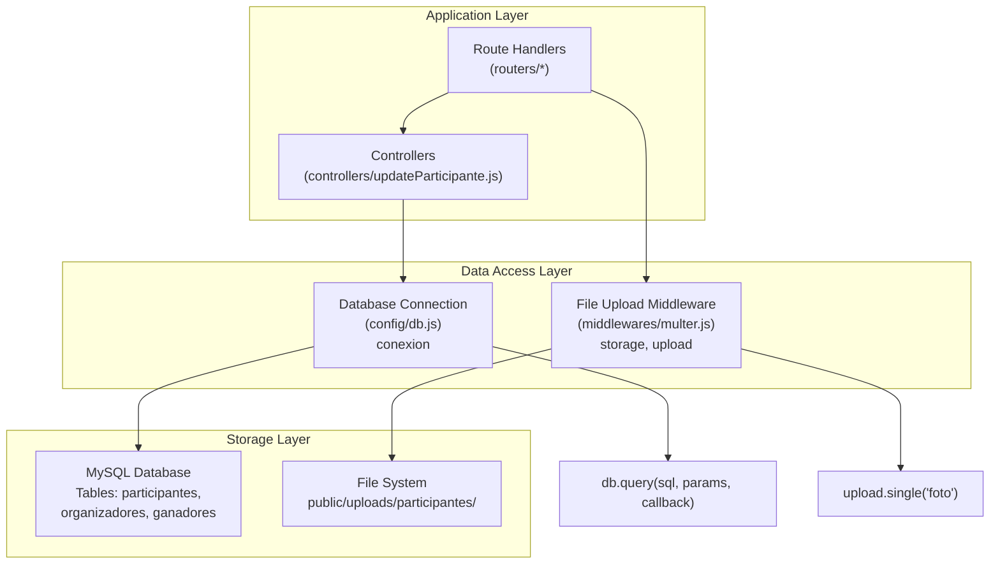
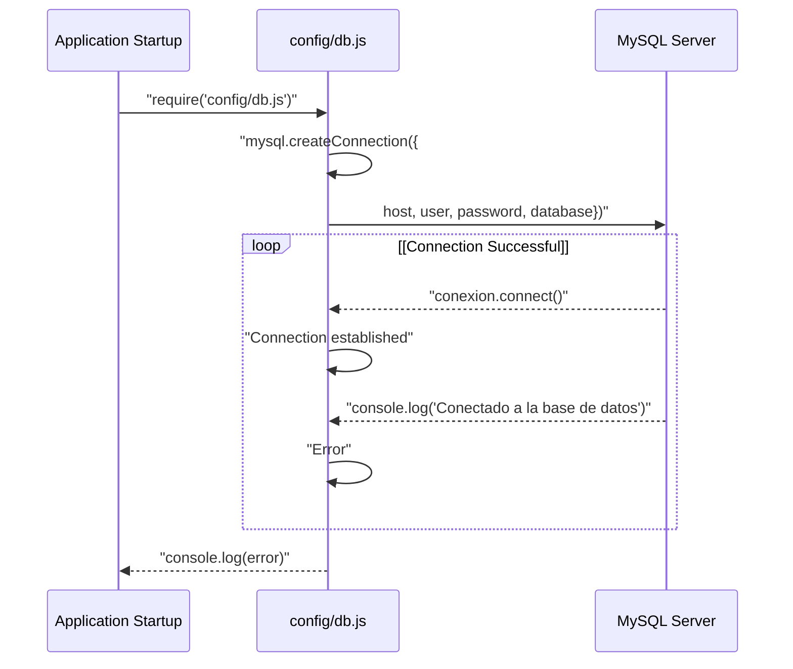
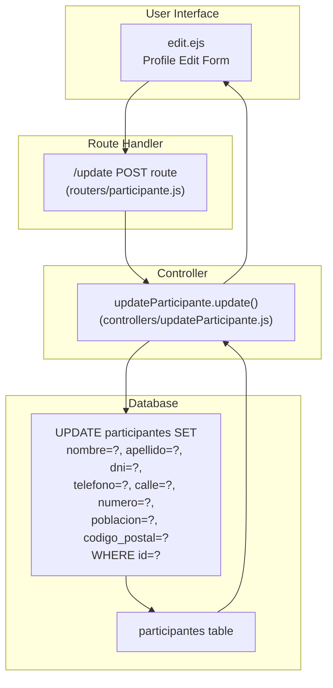
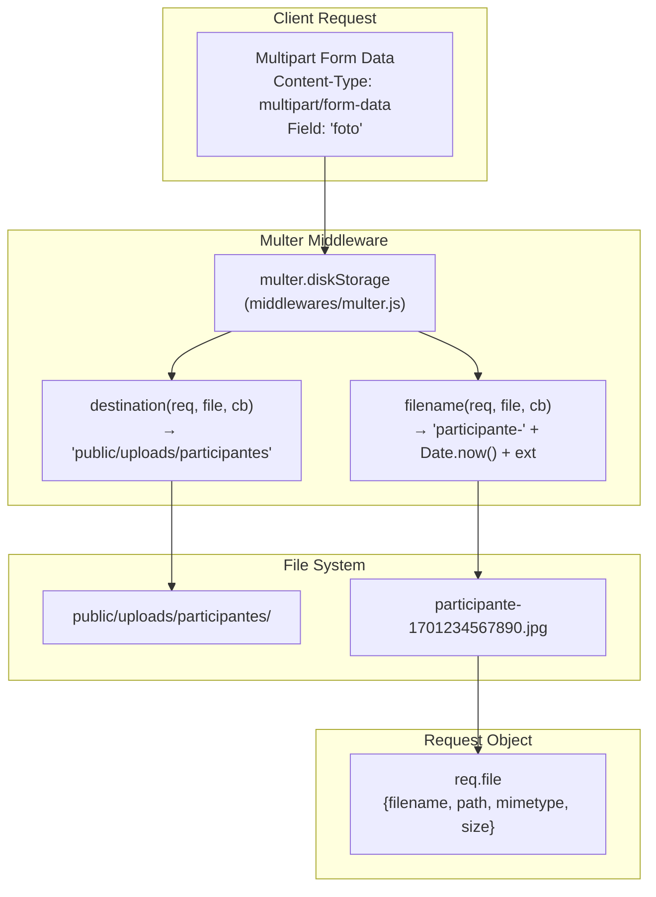
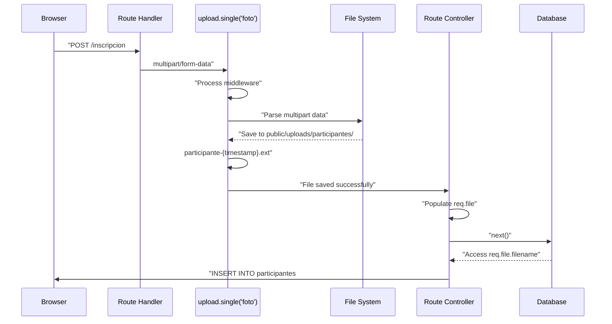
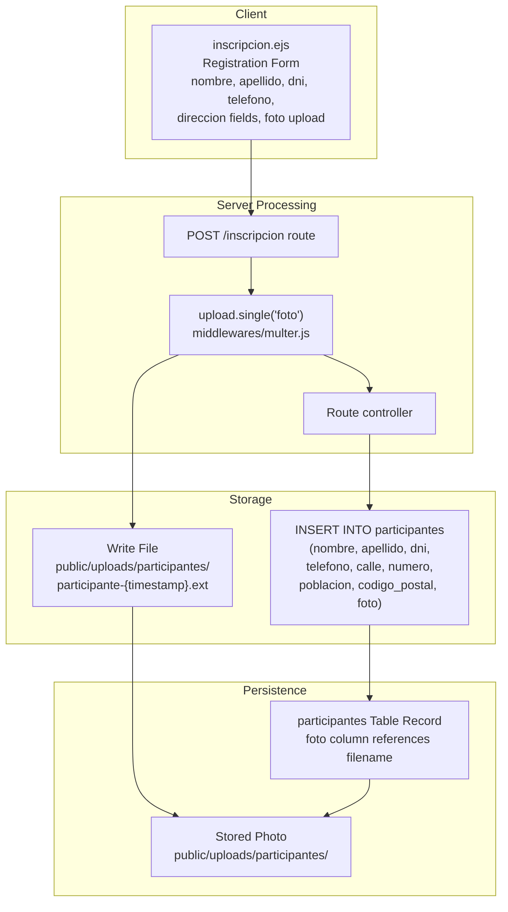
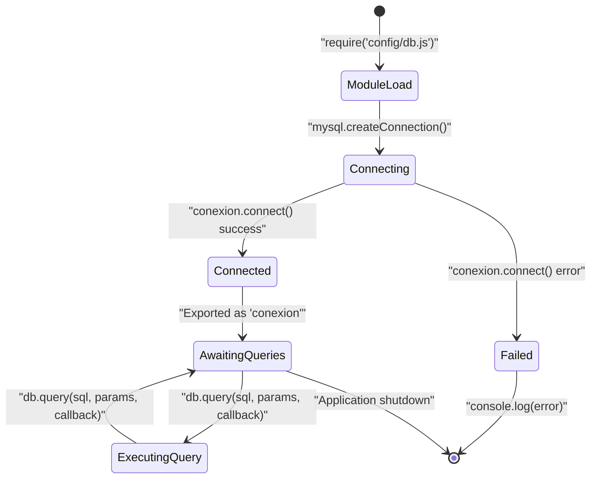

# Data Management

> **Relevant source files**
> * [config/db.js](https://github.com/Lourdes12587/Proyecto-Node.js/blob/3a172be7/config/db.js)
> * [controllers/updateParticipante.js](https://github.com/Lourdes12587/Proyecto-Node.js/blob/3a172be7/controllers/updateParticipante.js)
> * [middlewares/multer.js](https://github.com/Lourdes12587/Proyecto-Node.js/blob/3a172be7/middlewares/multer.js)
> * [middlewares/verifyAdmin.js](https://github.com/Lourdes12587/Proyecto-Node.js/blob/3a172be7/middlewares/verifyAdmin.js)
> * [middlewares/verifyToken.js](https://github.com/Lourdes12587/Proyecto-Node.js/blob/3a172be7/middlewares/verifyToken.js)
> * [public/css/edit.css](https://github.com/Lourdes12587/Proyecto-Node.js/blob/3a172be7/public/css/edit.css)

## Purpose and Scope

This document covers the data management subsystems of the HAPPY RUNNER 42K application, including database connection configuration, CRUD operations for participant records, and the file upload system for participant and winner photographs. Data management encompasses structured data persistence in MySQL and unstructured file storage on the filesystem.

For authentication and session management aspects, see [Authentication & Authorization](/Lourdes12587/Proyecto-Node.js/3-authentication-and-authorization). For the middleware layer that guards data access, see [Middleware Layer](/Lourdes12587/Proyecto-Node.js/2.2-middleware-layer). For specific user interface interactions with data, see [User Interfaces](/Lourdes12587/Proyecto-Node.js/4-user-interfaces).

---

## Data Management Architecture

The application employs a dual-layer data management strategy: structured relational data in MySQL and unstructured binary data (photos) in the filesystem. All database operations flow through a centralized connection module, while file uploads are handled by dedicated multer middleware.



**Sources:** [config/db.js L1-L18](https://github.com/Lourdes12587/Proyecto-Node.js/blob/3a172be7/config/db.js#L1-L18)

 [controllers/updateParticipante.js L1-L19](https://github.com/Lourdes12587/Proyecto-Node.js/blob/3a172be7/controllers/updateParticipante.js#L1-L19)

 [middlewares/multer.js L1-L15](https://github.com/Lourdes12587/Proyecto-Node.js/blob/3a172be7/middlewares/multer.js#L1-L15)

---

## Database Connection Configuration

The application establishes a single MySQL connection using the `mysql2` library, configured through environment variables for security and deployment flexibility.

### Connection Module Structure

The [config/db.js L1-L18](https://github.com/Lourdes12587/Proyecto-Node.js/blob/3a172be7/config/db.js#L1-L18)

 module exports a `conexion` object that represents the MySQL connection pool:

| Configuration Parameter | Environment Variable | Purpose |
| --- | --- | --- |
| `host` | `DB_HOST` | Database server hostname |
| `user` | `DB_USER` | Database authentication username |
| `password` | `DB_PASS` | Database authentication password |
| `database` | `DB_NAME` | Target database name |

The connection is initialized immediately upon module load [config/db.js L10-L16](https://github.com/Lourdes12587/Proyecto-Node.js/blob/3a172be7/config/db.js#L10-L16)

 logging success or error to the console. This eager initialization ensures database connectivity is verified at application startup rather than on first query.



**Sources:** [config/db.js L1-L18](https://github.com/Lourdes12587/Proyecto-Node.js/blob/3a172be7/config/db.js#L1-L18)

---

## Database Schema and Tables

The application uses three primary tables to manage event data:

### participantes Table

Stores registration data for marathon participants. Fields include:

* `id` (primary key)
* `nombre` (first name)
* `apellido` (last name)
* `dni` (national identification number, used for authentication)
* `telefono` (phone number)
* `calle`, `numero`, `poblacion`, `codigo_postal` (address components)
* `foto` (filename of uploaded participant photo)

### organizadores Table

Stores administrator/organizer accounts with hashed passwords. Used for admin authentication via username-based login.

### ganadores Table

Links winner positions (1st, 2nd, 3rd place) to participant records:

* `position` (winner placement)
* `participant_id` (foreign key to participantes table)
* `foto` (optional winner-specific photo)

**Sources:** High-level diagrams (Diagram 3: Data Management and User Journeys)

---

## CRUD Operations: Participant Data

The application performs Create, Read, Update, and Delete operations on participant records through various route handlers and controllers.

### Update Operation Flow

The `updateParticipante` controller handles participant profile modifications:



The update controller extracts parameters from the request body and constructs a parameterized SQL query [controllers/updateParticipante.js L7-L9](https://github.com/Lourdes12587/Proyecto-Node.js/blob/3a172be7/controllers/updateParticipante.js#L7-L9)

 Parameterized queries prevent SQL injection by separating SQL structure from user-supplied data.

**Sources:** [controllers/updateParticipante.js L1-L19](https://github.com/Lourdes12587/Proyecto-Node.js/blob/3a172be7/controllers/updateParticipante.js#L1-L19)

---

## Query Pattern and Error Handling

All database operations follow a consistent callback-based pattern using the `conexion.query()` method:

```mermaid
sequenceDiagram
  participant Controller Function
  participant db.query()
  participant MySQL Database
  participant Express Response

  Controller Function->>db.query(): "query(sql, params, callback)"
  db.query()->>MySQL Database: "Execute SQL with parameters"
  loop [Query Successful]
    MySQL Database-->>db.query(): "result object"
    db.query()->>Controller Function: "callback(null, result)"
    Controller Function->>Controller Function: "console.log('success message')"
    Controller Function->>Express Response: "res.redirect() or res.render()"
    MySQL Database-->>db.query(): "error object"
    db.query()->>Controller Function: "callback(err, null)"
    Controller Function->>Controller Function: "console.error('Error message', err)"
    Controller Function->>Express Response: "res.redirect(error page)"
  end
```

The update controller demonstrates this pattern [controllers/updateParticipante.js L10-L17](https://github.com/Lourdes12587/Proyecto-Node.js/blob/3a172be7/controllers/updateParticipante.js#L10-L17)

:

* On error: logs to console and redirects to `/perfil`
* On success: logs confirmation and redirects to `/perfil`

This approach provides basic error recovery but does not expose detailed error messages to users, maintaining security while ensuring the application remains operational.

**Sources:** [controllers/updateParticipante.js L10-L17](https://github.com/Lourdes12587/Proyecto-Node.js/blob/3a172be7/controllers/updateParticipante.js#L10-L17)

---

## File Upload System

The application uses `multer` middleware to handle multipart form data containing file uploads. This system is critical for participant registration and winner photo management.

### Multer Configuration

The [middlewares/multer.js L1-L15](https://github.com/Lourdes12587/Proyecto-Node.js/blob/3a172be7/middlewares/multer.js#L1-L15)

 module configures `multer.diskStorage` with two key functions:

| Function | Purpose | Implementation |
| --- | --- | --- |
| `destination` | Specifies storage directory | Returns `'public/uploads/participantes'` |
| `filename` | Generates unique filenames | Returns `'participante-' + Date.now() + ext` |



**Sources:** [middlewares/multer.js L1-L15](https://github.com/Lourdes12587/Proyecto-Node.js/blob/3a172be7/middlewares/multer.js#L1-L15)

### File Naming Strategy

The filename generation function [middlewares/multer.js L9-L12](https://github.com/Lourdes12587/Proyecto-Node.js/blob/3a172be7/middlewares/multer.js#L9-L12)

 employs timestamp-based naming to ensure uniqueness:

1. Extract original file extension using `path.extname(file.originalname)`
2. Construct filename: `participante-{timestamp}{extension}`
3. Example: `participante-1701234567890.jpg`

This strategy prevents filename collisions even if multiple users upload files simultaneously, as `Date.now()` returns milliseconds since epoch. The prefix `participante-` provides namespace separation if the directory later stores other file types.

**Sources:** [middlewares/multer.js L9-L12](https://github.com/Lourdes12587/Proyecto-Node.js/blob/3a172be7/middlewares/multer.js#L9-L12)

---

## File Upload Integration

The `upload` object exported from the multer configuration is used as route middleware to process file uploads before request handlers execute:



The middleware populates `req.file` with metadata including:

* `filename`: Generated filename (e.g., `participante-1701234567890.jpg`)
* `path`: Full filesystem path
* `mimetype`: MIME type of uploaded file
* `size`: File size in bytes

Controllers then reference `req.file.filename` when inserting database records, creating a link between the participant record and their stored photo.

**Sources:** [middlewares/multer.js L1-L15](https://github.com/Lourdes12587/Proyecto-Node.js/blob/3a172be7/middlewares/multer.js#L1-L15)

---

## Data Validation and Security

### Input Validation

The application relies on HTML5 form validation attributes in EJS templates (e.g., `required`, `pattern`, `type="email"`) for client-side validation. Server-side validation is implicit through SQL schema constraints and parameterized queries.

### SQL Injection Prevention

All database queries use parameterized statements with the `?` placeholder syntax [controllers/updateParticipante.js L8-L9](https://github.com/Lourdes12587/Proyecto-Node.js/blob/3a172be7/controllers/updateParticipante.js#L8-L9)

 The `mysql2` library automatically escapes parameters before query execution, preventing SQL injection attacks even if user input contains malicious SQL syntax.

Example from updateParticipante controller:

```sql
UPDATE participantes SET nombre=?, apellido=?, dni=?, ... WHERE id=?
```

Parameters array: `[nombre, apellido, dni, telefono, calle, numero, poblacion, codigo_postal, id]`

### File Upload Security

The multer configuration [middlewares/multer.js L5-L13](https://github.com/Lourdes12587/Proyecto-Node.js/blob/3a172be7/middlewares/multer.js#L5-L13)

 does not explicitly filter file types or limit file sizes. This presents potential security considerations:

| Concern | Current State | Mitigation Strategy |
| --- | --- | --- |
| File type validation | Not implemented | Could add `fileFilter` function to multer config |
| File size limits | Not implemented | Could add `limits: { fileSize: n }` to multer config |
| Malicious file names | Handled | Filename is completely replaced with timestamp pattern |

The timestamp-based naming strategy eliminates filename-related attacks (e.g., directory traversal via `../../etc/passwd`) by discarding the original filename entirely.

**Sources:** [controllers/updateParticipante.js L7-L9](https://github.com/Lourdes12587/Proyecto-Node.js/blob/3a172be7/controllers/updateParticipante.js#L7-L9)

 [middlewares/multer.js L5-L13](https://github.com/Lourdes12587/Proyecto-Node.js/blob/3a172be7/middlewares/multer.js#L5-L13)

---

## Data Flow: Complete Registration Cycle

The following diagram illustrates how participant data and photos flow through the system during registration:



The participant record's `foto` column stores only the filename (e.g., `participante-1701234567890.jpg`), not the full path. When rendering profile pages, templates construct the full URL as `/uploads/participantes/{filename}`, which Express serves via static file middleware.

**Sources:** [middlewares/multer.js L1-L15](https://github.com/Lourdes12587/Proyecto-Node.js/blob/3a172be7/middlewares/multer.js#L1-L15)

 High-level diagrams (Diagram 3)

---

## Data Integrity and Referential Relationships

### Winner-Participant Relationship

The `ganadores` table maintains referential integrity with the `participantes` table through the `participant_id` foreign key:

```css
#mermaid-q356j1dc0tf{font-family:ui-sans-serif,-apple-system,system-ui,Segoe UI,Helvetica;font-size:16px;fill:#333;}@keyframes edge-animation-frame{from{stroke-dashoffset:0;}}@keyframes dash{to{stroke-dashoffset:0;}}#mermaid-q356j1dc0tf .edge-animation-slow{stroke-dasharray:9,5!important;stroke-dashoffset:900;animation:dash 50s linear infinite;stroke-linecap:round;}#mermaid-q356j1dc0tf .edge-animation-fast{stroke-dasharray:9,5!important;stroke-dashoffset:900;animation:dash 20s linear infinite;stroke-linecap:round;}#mermaid-q356j1dc0tf .error-icon{fill:#dddddd;}#mermaid-q356j1dc0tf .error-text{fill:#222222;stroke:#222222;}#mermaid-q356j1dc0tf .edge-thickness-normal{stroke-width:1px;}#mermaid-q356j1dc0tf .edge-thickness-thick{stroke-width:3.5px;}#mermaid-q356j1dc0tf .edge-pattern-solid{stroke-dasharray:0;}#mermaid-q356j1dc0tf .edge-thickness-invisible{stroke-width:0;fill:none;}#mermaid-q356j1dc0tf .edge-pattern-dashed{stroke-dasharray:3;}#mermaid-q356j1dc0tf .edge-pattern-dotted{stroke-dasharray:2;}#mermaid-q356j1dc0tf .marker{fill:#999;stroke:#999;}#mermaid-q356j1dc0tf .marker.cross{stroke:#999;}#mermaid-q356j1dc0tf svg{font-family:ui-sans-serif,-apple-system,system-ui,Segoe UI,Helvetica;font-size:16px;}#mermaid-q356j1dc0tf p{margin:0;}#mermaid-q356j1dc0tf .entityBox{fill:#ffffff;stroke:#dddddd;}#mermaid-q356j1dc0tf .relationshipLabelBox{fill:#dddddd;opacity:0.7;background-color:#dddddd;}#mermaid-q356j1dc0tf .relationshipLabelBox rect{opacity:0.5;}#mermaid-q356j1dc0tf .labelBkg{background-color:rgba(221, 221, 221, 0.5);}#mermaid-q356j1dc0tf .edgeLabel .label{fill:#dddddd;font-size:14px;}#mermaid-q356j1dc0tf .label{font-family:ui-sans-serif,-apple-system,system-ui,Segoe UI,Helvetica;color:#333;}#mermaid-q356j1dc0tf .edge-pattern-dashed{stroke-dasharray:8,8;}#mermaid-q356j1dc0tf .node rect,#mermaid-q356j1dc0tf .node circle,#mermaid-q356j1dc0tf .node ellipse,#mermaid-q356j1dc0tf .node polygon{fill:#ffffff;stroke:#dddddd;stroke-width:1px;}#mermaid-q356j1dc0tf .relationshipLine{stroke:#999;stroke-width:1;fill:none;}#mermaid-q356j1dc0tf .marker{fill:none!important;stroke:#999!important;stroke-width:1;}#mermaid-q356j1dc0tf :root{--mermaid-font-family:"trebuchet ms",verdana,arial,sans-serif;}winner_ofparticipantesintidPKvarcharnombrevarcharapellidovarchardniUKvarchartelefonovarcharcallevarcharnumerovarcharpoblacionvarcharcodigo_postalvarcharfotoganadoresintidPKintpositionintparticipant_idFKvarcharfotoorganizadoresintidPKvarcharusernameUKvarcharpassword
```

This design ensures:

* Winners must be existing participants (foreign key constraint)
* Participant data (name, DNI) is maintained in one location
* Winner-specific photos can differ from registration photos
* A participant can win multiple positions (though business logic may prevent this)

**Sources:** High-level diagrams (Diagram 3: Data Management and User Journeys)

---

## Database Connection Lifecycle

The MySQL connection established by [config/db.js L1-L18](https://github.com/Lourdes12587/Proyecto-Node.js/blob/3a172be7/config/db.js#L1-L18)

 remains open for the application's entire lifecycle. The `mysql2` library maintains this connection and automatically handles reconnection if network interruptions occur.



No explicit connection pooling is configured. For production deployments handling concurrent users, migrating to `mysql2.createPool()` would provide better resource management and automatic connection recycling.

**Sources:** [config/db.js L1-L18](https://github.com/Lourdes12587/Proyecto-Node.js/blob/3a172be7/config/db.js#L1-L18)

---

## Error Handling Patterns

Database operations throughout the application follow a consistent error handling pattern:

| Error Scenario | Detection Method | Recovery Action | User Feedback |
| --- | --- | --- | --- |
| Query execution failure | `err` parameter in callback | Log error to console | Redirect to safe page (e.g., `/perfil`) |
| Connection failure | `error` in connect callback | Log at startup | Application may not start correctly |
| File upload failure | Multer error handling | (Not explicitly handled) | Default Express error handler |

The updateParticipante controller demonstrates typical error handling [controllers/updateParticipante.js L11-L13](https://github.com/Lourdes12587/Proyecto-Node.js/blob/3a172be7/controllers/updateParticipante.js#L11-L13)

:

```
if (err) {
  console.error("Error al actualizar:", err);
  return res.redirect("/perfil");
}
```

This approach prioritizes application stability over detailed user error messages, preventing information leakage while ensuring users are not left on broken pages.

**Sources:** [controllers/updateParticipante.js L10-L17](https://github.com/Lourdes12587/Proyecto-Node.js/blob/3a172be7/controllers/updateParticipante.js#L10-L17)

 [config/db.js L10-L16](https://github.com/Lourdes12587/Proyecto-Node.js/blob/3a172be7/config/db.js#L10-L16)