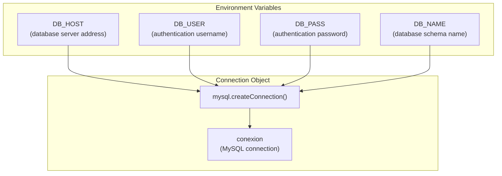
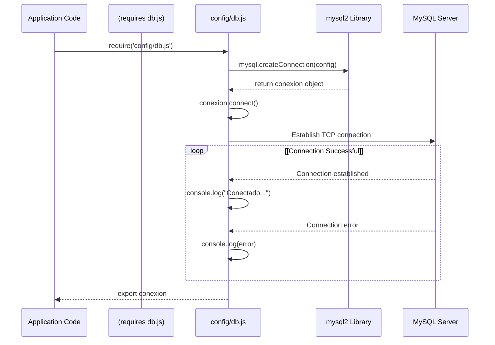
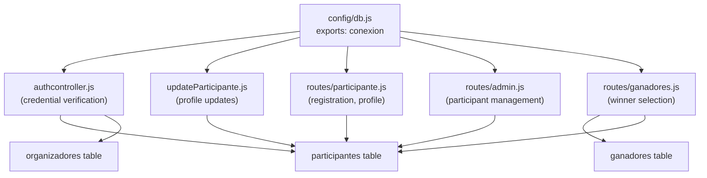

# Database Layer

> **Relevant source files**
> * [config/db.js](https://github.com/Lourdes12587/Proyecto-Node.js/blob/3a172be7/config/db.js)

## Purpose and Scope

This document describes the database layer configuration for the HAPPY RUNNER 42K application, including the MySQL connection setup, environment-based configuration, and connection lifecycle. The database layer provides the foundation for data persistence across the application.

For information about how data is queried and manipulated by business logic, see [Data Management](/Lourdes12587/Proyecto-Node.js/6-data-management). For details on authentication queries against the `participantes` and `organizadores` tables, see [Authentication & Authorization](/Lourdes12587/Proyecto-Node.js/3-authentication-and-authorization).

---

## Connection Module

The database layer is implemented as a single module that creates and exports a MySQL connection object. The module is located at [config/db.js L1-L18](https://github.com/Lourdes12587/Proyecto-Node.js/blob/3a172be7/config/db.js#L1-L18)

 and serves as the sole entry point for database operations throughout the application.

### Module Structure

The connection module uses the `mysql2` library and creates a connection using the `createConnection()` method rather than a connection pool.

| Component | Implementation | Location |
| --- | --- | --- |
| Database Library | `mysql2` | [config/db.js L1](https://github.com/Lourdes12587/Proyecto-Node.js/blob/3a172be7/config/db.js#L1-L1) |
| Connection Object | `conexion` | [config/db.js L3-L8](https://github.com/Lourdes12587/Proyecto-Node.js/blob/3a172be7/config/db.js#L3-L8) |
| Connection Method | `mysql.createConnection()` | [config/db.js L3](https://github.com/Lourdes12587/Proyecto-Node.js/blob/3a172be7/config/db.js#L3-L3) |
| Module Export | `conexion` | [config/db.js L18](https://github.com/Lourdes12587/Proyecto-Node.js/blob/3a172be7/config/db.js#L18-L18) |

**Sources:** [config/db.js L1-L18](https://github.com/Lourdes12587/Proyecto-Node.js/blob/3a172be7/config/db.js#L1-L18)

---

## Connection Configuration

The database connection is configured using environment variables, allowing for different configurations across development, testing, and production environments without code changes.

### Configuration Parameters



The configuration object passed to `mysql.createConnection()` at [config/db.js L3-L8](https://github.com/Lourdes12587/Proyecto-Node.js/blob/3a172be7/config/db.js#L3-L8)

 contains four required parameters:

| Parameter | Environment Variable | Purpose |
| --- | --- | --- |
| `host` | `process.env.DB_HOST` | Database server hostname or IP address |
| `user` | `process.env.DB_USER` | MySQL username for authentication |
| `password` | `process.env.DB_PASS` | MySQL password for authentication |
| `database` | `process.env.DB_NAME` | Target database schema name |

**Sources:** [config/db.js L3-L8](https://github.com/Lourdes12587/Proyecto-Node.js/blob/3a172be7/config/db.js#L3-L8)

---

## Connection Lifecycle

The database connection is established synchronously when the module is first imported. The connection lifecycle follows a simple initialization pattern with error handling.

### Initialization Flow



The `conexion.connect()` method is invoked at [config/db.js L10-L16](https://github.com/Lourdes12587/Proyecto-Node.js/blob/3a172be7/config/db.js#L10-L16)

 with an error-first callback. If the connection succeeds, the console displays "Conectado a la base de datos". If the connection fails, the error object is logged but does not terminate the application.

**Sources:** [config/db.js L10-L16](https://github.com/Lourdes12587/Proyecto-Node.js/blob/3a172be7/config/db.js#L10-L16)

---

## Database Schema

The MySQL database contains three primary tables that support the application's functionality:

```css
#mermaid-oqxgxmfd5t{font-family:ui-sans-serif,-apple-system,system-ui,Segoe UI,Helvetica;font-size:16px;fill:#333;}@keyframes edge-animation-frame{from{stroke-dashoffset:0;}}@keyframes dash{to{stroke-dashoffset:0;}}#mermaid-oqxgxmfd5t .edge-animation-slow{stroke-dasharray:9,5!important;stroke-dashoffset:900;animation:dash 50s linear infinite;stroke-linecap:round;}#mermaid-oqxgxmfd5t .edge-animation-fast{stroke-dasharray:9,5!important;stroke-dashoffset:900;animation:dash 20s linear infinite;stroke-linecap:round;}#mermaid-oqxgxmfd5t .error-icon{fill:#dddddd;}#mermaid-oqxgxmfd5t .error-text{fill:#222222;stroke:#222222;}#mermaid-oqxgxmfd5t .edge-thickness-normal{stroke-width:1px;}#mermaid-oqxgxmfd5t .edge-thickness-thick{stroke-width:3.5px;}#mermaid-oqxgxmfd5t .edge-pattern-solid{stroke-dasharray:0;}#mermaid-oqxgxmfd5t .edge-thickness-invisible{stroke-width:0;fill:none;}#mermaid-oqxgxmfd5t .edge-pattern-dashed{stroke-dasharray:3;}#mermaid-oqxgxmfd5t .edge-pattern-dotted{stroke-dasharray:2;}#mermaid-oqxgxmfd5t .marker{fill:#999;stroke:#999;}#mermaid-oqxgxmfd5t .marker.cross{stroke:#999;}#mermaid-oqxgxmfd5t svg{font-family:ui-sans-serif,-apple-system,system-ui,Segoe UI,Helvetica;font-size:16px;}#mermaid-oqxgxmfd5t p{margin:0;}#mermaid-oqxgxmfd5t .entityBox{fill:#ffffff;stroke:#dddddd;}#mermaid-oqxgxmfd5t .relationshipLabelBox{fill:#dddddd;opacity:0.7;background-color:#dddddd;}#mermaid-oqxgxmfd5t .relationshipLabelBox rect{opacity:0.5;}#mermaid-oqxgxmfd5t .labelBkg{background-color:rgba(221, 221, 221, 0.5);}#mermaid-oqxgxmfd5t .edgeLabel .label{fill:#dddddd;font-size:14px;}#mermaid-oqxgxmfd5t .label{font-family:ui-sans-serif,-apple-system,system-ui,Segoe UI,Helvetica;color:#333;}#mermaid-oqxgxmfd5t .edge-pattern-dashed{stroke-dasharray:8,8;}#mermaid-oqxgxmfd5t .node rect,#mermaid-oqxgxmfd5t .node circle,#mermaid-oqxgxmfd5t .node ellipse,#mermaid-oqxgxmfd5t .node polygon{fill:#ffffff;stroke:#dddddd;stroke-width:1px;}#mermaid-oqxgxmfd5t .relationshipLine{stroke:#999;stroke-width:1;fill:none;}#mermaid-oqxgxmfd5t .marker{fill:none!important;stroke:#999!important;stroke-width:1;}#mermaid-oqxgxmfd5t :root{--mermaid-font-family:"trebuchet ms",verdana,arial,sans-serif;}selected as winnerparticipantesintidPKstringnombrestringapellidostringdnistringtelefonostringdireccionstringfotoganadoresintidPKstringpositionintparticipant_idFKstringfotoorganizadoresintidPKstringusernamestringpasswordstringrol
```

| Table | Purpose | Key Relationships |
| --- | --- | --- |
| `participantes` | Stores marathon participant registration data including personal information and photo paths | Referenced by `ganadores.participant_id` |
| `organizadores` | Stores administrator credentials with bcrypt-hashed passwords | Standalone authentication table |
| `ganadores` | Stores race winner information with positions (1st, 2nd, 3rd) and optional winner-specific photos | Foreign key to `participantes.id` |

**Sources:** Inferred from high-level system diagrams and authentication flow

---

## Connection Usage Pattern

The `conexion` object exported from [config/db.js L18](https://github.com/Lourdes12587/Proyecto-Node.js/blob/3a172be7/config/db.js#L18-L18)

 is imported by controllers and route handlers that need to execute SQL queries. The connection provides a `query()` method for executing SQL statements.

### Consumer Modules



Controllers and routes import the connection using `require()`:

```javascript
const conexion = require('../config/db');
```

The `conexion.query()` method accepts a SQL string and optional parameters, returning results through a callback function following the error-first pattern.

**Sources:** [config/db.js L18](https://github.com/Lourdes12587/Proyecto-Node.js/blob/3a172be7/config/db.js#L18-L18)

 inferred from high-level architecture diagrams

---

## Connection Characteristics

### Single Connection Model

The database layer uses a single persistent connection rather than a connection pool. This design has specific characteristics:

| Characteristic | Implication |
| --- | --- |
| Connection Type | Single `mysql.createConnection()` call |
| Concurrency | Sequential query execution on single connection |
| Lifecycle | Connection maintained for application lifetime |
| Reconnection | No automatic reconnection on connection loss |
| Resource Usage | Minimal connection overhead for low-traffic scenarios |

This approach is suitable for applications with moderate query volumes where connection pooling overhead is unnecessary.

**Sources:** [config/db.js L3](https://github.com/Lourdes12587/Proyecto-Node.js/blob/3a172be7/config/db.js#L3-L3)

---

## Error Handling

The connection error handling is implemented at the connection establishment phase only. The `conexion.connect()` callback at [config/db.js L10-L16](https://github.com/Lourdes12587/Proyecto-Node.js/blob/3a172be7/config/db.js#L10-L16)

 logs errors to the console but does not implement retry logic or graceful degradation.

### Error Scenarios

| Scenario | Behavior | Impact |
| --- | --- | --- |
| Invalid credentials | Error logged, connection remains unusable | Application queries will fail |
| Network unavailable | Error logged, connection remains unusable | Application queries will fail |
| Database does not exist | Error logged, connection remains unusable | Application queries will fail |
| Connection succeeds | Success message logged | Normal operation |

Subsequent query-level errors must be handled by the consuming code that invokes `conexion.query()`.

**Sources:** [config/db.js L10-L16](https://github.com/Lourdes12587/Proyecto-Node.js/blob/3a172be7/config/db.js#L10-L16)

---

## Environment Variable Requirements

The database module requires four environment variables to be set before the application starts. These variables should be defined in a `.env` file or the deployment environment.

### Required Variables

| Variable | Format | Example |
| --- | --- | --- |
| `DB_HOST` | Hostname or IP address | `localhost` or `192.168.1.100` |
| `DB_USER` | MySQL username | `marathon_app` |
| `DB_PASS` | MySQL password | `secure_password_123` |
| `DB_NAME` | Database schema name | `happy_runner_42k` |

Without these variables, the `createConnection()` call at [config/db.js L3-L8](https://github.com/Lourdes12587/Proyecto-Node.js/blob/3a172be7/config/db.js#L3-L8)

 will use `undefined` values, causing connection failures.

**Sources:** [config/db.js L4-L7](https://github.com/Lourdes12587/Proyecto-Node.js/blob/3a172be7/config/db.js#L4-L7)