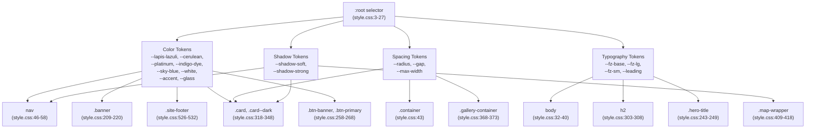
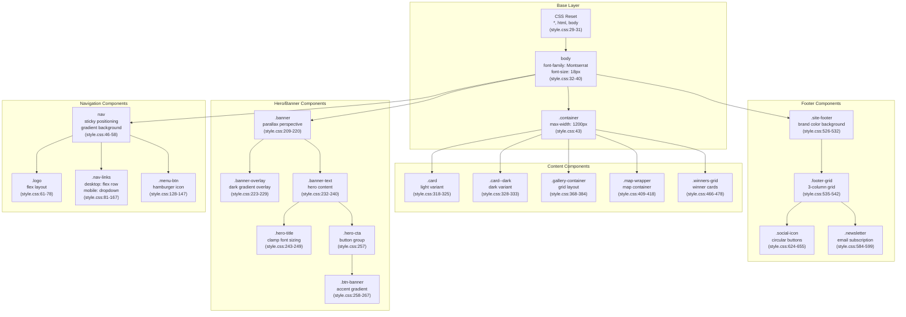
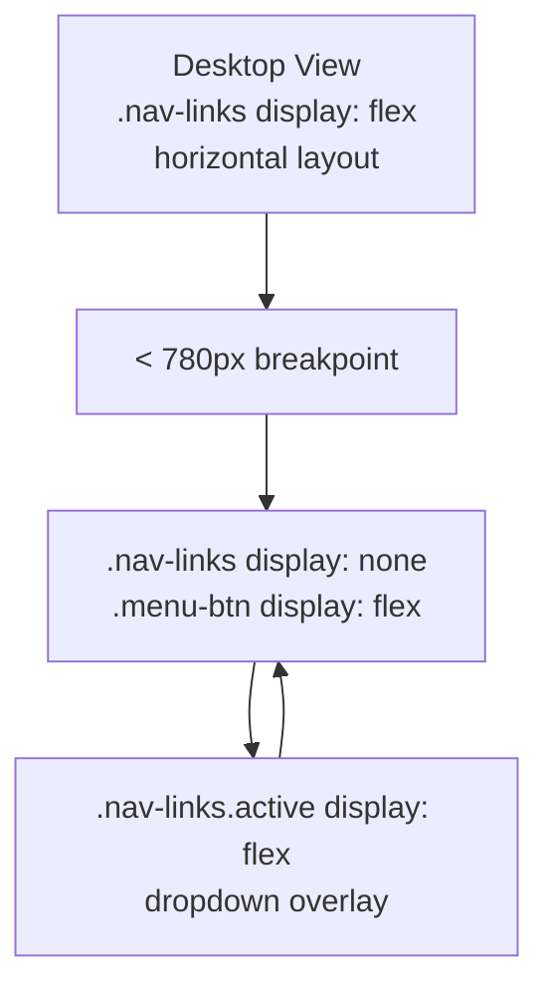

# Design System

> **Relevant source files**
> * [public/css/login.css](https://github.com/Lourdes12587/Proyecto-Node.js/blob/3a172be7/public/css/login.css)
> * [public/css/style.css](https://github.com/Lourdes12587/Proyecto-Node.js/blob/3a172be7/public/css/style.css)

## Purpose and Scope

This document describes the HAPPY RUNNER 42K application's design system, which provides a unified visual language through CSS custom properties, global styles, and reusable design patterns. The design system is implemented primarily in [public/css/style.css](https://github.com/Lourdes12587/Proyecto-Node.js/blob/3a172be7/public/css/style.css)

 and establishes design tokens for colors, typography, spacing, and shadows that are consistently applied across all interfaces.

For page-specific component styling, see [Component Styles](/Lourdes12587/Proyecto-Node.js/5.2-component-styles). For complete user interface implementations, see [User Interfaces](/Lourdes12587/Proyecto-Node.js/4-user-interfaces).

---

## Design Token Architecture

The design system is built on CSS custom properties (CSS variables) defined in the `:root` selector, making them globally accessible throughout the application. This approach ensures consistency and simplifies theme maintenance.

### Color Palette

The application uses a cohesive blue-based color scheme with an accent color for call-to-action elements. All colors are defined as CSS custom properties in [public/css/style.css L3-L11](https://github.com/Lourdes12587/Proyecto-Node.js/blob/3a172be7/public/css/style.css#L3-L11)

 and [public/css/login.css L1-L10](https://github.com/Lourdes12587/Proyecto-Node.js/blob/3a172be7/public/css/login.css#L1-L10)

:

| Token Variable | Hex Value | Usage |
| --- | --- | --- |
| `--lapis-lazuli` | `#2f6690ff` | Primary brand color, navigation backgrounds |
| `--cerulean` | `#3a7ca5ff` | Secondary brand color, gradients |
| `--platinum` | `#d9dcd6ff` | Neutral background, text on dark backgrounds |
| `--indigo-dye` | `#16425bff` | Dark text, footer backgrounds |
| `--sky-blue` | `#81c3d7ff` | Accents, highlights, interactive elements |
| `--white` | `#ffffff` | Pure white backgrounds, text on dark |
| `--accent` | `#d2643c` | Call-to-action buttons, emphasized elements |
| `--glass` | `rgba(255,255,255,0.96)` | Semi-transparent overlays |

**Sources:** [public/css/style.css L3-L11](https://github.com/Lourdes12587/Proyecto-Node.js/blob/3a172be7/public/css/style.css#L3-L11)

 [public/css/login.css L1-L10](https://github.com/Lourdes12587/Proyecto-Node.js/blob/3a172be7/public/css/login.css#L1-L10)

### Spacing and Layout Tokens

Layout consistency is achieved through standardized spacing values defined in [public/css/style.css L13-L16](https://github.com/Lourdes12587/Proyecto-Node.js/blob/3a172be7/public/css/style.css#L13-L16)

:

| Token Variable | Value | Purpose |
| --- | --- | --- |
| `--radius` | `14px` | Standard border radius for cards and components |
| `--gap` | `1rem` | Standard spacing between elements |
| `--max-width` | `1200px` | Maximum content width for readability |

**Sources:** [public/css/style.css L13-L16](https://github.com/Lourdes12587/Proyecto-Node.js/blob/3a172be7/public/css/style.css#L13-L16)

### Typography System

The typography system uses Montserrat as the primary font family with scalable font sizes defined in [public/css/style.css L22-L27](https://github.com/Lourdes12587/Proyecto-Node.js/blob/3a172be7/public/css/style.css#L22-L27)

:

| Token Variable | Value | Application |
| --- | --- | --- |
| `--fz-base` | `18px` | Base body text size (increased for readability) |
| `--fz-lg` | `1.25rem` | Large text, lead paragraphs |
| `--fz-sm` | `0.95rem` | Small text, captions, metadata |
| `--leading` | `1.55` | Line height for optimal readability |

The font stack is defined as: `"Montserrat", system-ui, -apple-system, "Segoe UI", Roboto, "Helvetica Neue", Arial` in [public/css/style.css L34](https://github.com/Lourdes12587/Proyecto-Node.js/blob/3a172be7/public/css/style.css#L34-L34)

 providing graceful fallbacks to system fonts.

**Sources:** [public/css/style.css L22-L27](https://github.com/Lourdes12587/Proyecto-Node.js/blob/3a172be7/public/css/style.css#L22-L27)

 [public/css/style.css L34](https://github.com/Lourdes12587/Proyecto-Node.js/blob/3a172be7/public/css/style.css#L34-L34)

### Shadow Tokens

Two shadow levels provide depth hierarchy in [public/css/style.css L18-L20](https://github.com/Lourdes12587/Proyecto-Node.js/blob/3a172be7/public/css/style.css#L18-L20)

:

| Token Variable | Value | Usage |
| --- | --- | --- |
| `--shadow-soft` | `0 12px 32px rgba(10,30,45,0.08)` | Default cards, subtle elevation |
| `--shadow-strong` | `0 20px 60px rgba(10,30,45,0.14)` | Hover states, emphasized components |

**Sources:** [public/css/style.css L18-L20](https://github.com/Lourdes12587/Proyecto-Node.js/blob/3a172be7/public/css/style.css#L18-L20)

---

## Design Token Dependency Graph



**Sources:** [public/css/style.css L3-L27](https://github.com/Lourdes12587/Proyecto-Node.js/blob/3a172be7/public/css/style.css#L3-L27)

 [public/css/style.css L46-L58](https://github.com/Lourdes12587/Proyecto-Node.js/blob/3a172be7/public/css/style.css#L46-L58)

 [public/css/style.css L209-L220](https://github.com/Lourdes12587/Proyecto-Node.js/blob/3a172be7/public/css/style.css#L209-L220)

 [public/css/style.css L318-L348](https://github.com/Lourdes12587/Proyecto-Node.js/blob/3a172be7/public/css/style.css#L318-L348)

---

## Global Base Styles

### CSS Reset and Base Configuration

The design system implements a minimal CSS reset in [public/css/style.css L29-L40](https://github.com/Lourdes12587/Proyecto-Node.js/blob/3a172be7/public/css/style.css#L29-L40)

 and [public/css/login.css L13-L23](https://github.com/Lourdes12587/Proyecto-Node.js/blob/3a172be7/public/css/login.css#L13-L23)

:

* **Box Sizing**: `box-sizing: border-box` applied universally via `*` selector [public/css/style.css L30](https://github.com/Lourdes12587/Proyecto-Node.js/blob/3a172be7/public/css/style.css#L30-L30)
* **Full Height Layout**: `html, body { height: 100%; }` enables full viewport layouts [public/css/style.css L31](https://github.com/Lourdes12587/Proyecto-Node.js/blob/3a172be7/public/css/style.css#L31-L31)
* **Body Defaults**: Zero margin, Montserrat font family, 18px base font size, 1.55 line height [public/css/style.css L32-L40](https://github.com/Lourdes12587/Proyecto-Node.js/blob/3a172be7/public/css/style.css#L32-L40)
* **Background**: Linear gradient from `var(--platinum)` to `#f4fbff` [public/css/style.css L38](https://github.com/Lourdes12587/Proyecto-Node.js/blob/3a172be7/public/css/style.css#L38-L38)
* **Font Smoothing**: `-webkit-font-smoothing: antialiased` for improved rendering [public/css/style.css L39](https://github.com/Lourdes12587/Proyecto-Node.js/blob/3a172be7/public/css/style.css#L39-L39)

**Sources:** [public/css/style.css L29-L40](https://github.com/Lourdes12587/Proyecto-Node.js/blob/3a172be7/public/css/style.css#L29-L40)

 [public/css/login.css L13-L23](https://github.com/Lourdes12587/Proyecto-Node.js/blob/3a172be7/public/css/login.css#L13-L23)

### Container System

The `.container` utility class provides consistent content width constraints in [public/css/style.css L43](https://github.com/Lourdes12587/Proyecto-Node.js/blob/3a172be7/public/css/style.css#L43-L43)

:

```css
.container {
  width: calc(100% - 2rem);
  max-width: var(--max-width);
  margin: 0 auto;
  padding: 0 1rem;
}
```

This pattern ensures content remains readable on large screens while maintaining appropriate padding on mobile devices.

**Sources:** [public/css/style.css L43](https://github.com/Lourdes12587/Proyecto-Node.js/blob/3a172be7/public/css/style.css#L43-L43)

---

## Component Design Patterns

### Navigation Bar Pattern

The navigation bar uses a sticky positioning pattern with gradient background defined in [public/css/style.css L46-L58](https://github.com/Lourdes12587/Proyecto-Node.js/blob/3a172be7/public/css/style.css#L46-L58)

 and [public/css/login.css L28-L35](https://github.com/Lourdes12587/Proyecto-Node.js/blob/3a172be7/public/css/login.css#L28-L35)

:

* **Positioning**: `position: sticky; top: 0; z-index: 120` keeps navigation accessible while scrolling
* **Background**: `linear-gradient(90deg, var(--lapis-lazuli), var(--cerulean))` creates brand gradient
* **Shadow**: `box-shadow: 0 4px 20px rgba(0, 0, 0, 0.1)` provides depth separation
* **Layout**: Flexbox with `justify-content: space-between` for logo and navigation links

**Sources:** [public/css/style.css L46-L58](https://github.com/Lourdes12587/Proyecto-Node.js/blob/3a172be7/public/css/style.css#L46-L58)

 [public/css/login.css L28-L35](https://github.com/Lourdes12587/Proyecto-Node.js/blob/3a172be7/public/css/login.css#L28-L35)

### Card System

The design system implements two card variants in [public/css/style.css L318-L348](https://github.com/Lourdes12587/Proyecto-Node.js/blob/3a172be7/public/css/style.css#L318-L348)

:

#### Standard Card (.card)

* **Background**: `linear-gradient(180deg, rgba(255,255,255,0.98), #fbfdff)` - subtle light gradient
* **Border**: `1px solid rgba(22,66,91,0.06)` - minimal border for definition
* **Shadow**: `var(--shadow-soft)` for subtle elevation
* **Border Radius**: `var(--radius)` (14px)
* **Padding**: `1.25rem`
* **Transition**: `transform .18s ease, box-shadow .18s ease` for interaction feedback

#### Dark Card (.card--dark)

* **Background**: `linear-gradient(180deg, rgba(6,24,36,0.92), rgba(14,34,48,0.94))` - dark gradient
* **Border**: `1px solid rgba(255,255,255,0.04)` - subtle light border
* **Shadow**: `var(--shadow-strong)` for emphasized elevation
* **Text Color**: `var(--white)` for contrast on dark background

**Sources:** [public/css/style.css L318-L348](https://github.com/Lourdes12587/Proyecto-Node.js/blob/3a172be7/public/css/style.css#L318-L348)

### Button System

The design system provides multiple button patterns:

#### Primary Button (.btn-primary)

Defined in [public/css/style.css L600-L615](https://github.com/Lourdes12587/Proyecto-Node.js/blob/3a172be7/public/css/style.css#L600-L615)

:

* **Background**: `var(--sky-blue)`
* **Border Radius**: `999px` (fully rounded)
* **Padding**: `0.6rem 1rem`
* **Font Weight**: `800` (extra bold)
* **Hover Effect**: `translateY(-3px) scale(1.02)` with shadow enhancement

#### Banner CTA (.btn-banner)

Defined in [public/css/style.css L258-L267](https://github.com/Lourdes12587/Proyecto-Node.js/blob/3a172be7/public/css/style.css#L258-L267)

:

* **Background**: `linear-gradient(180deg, var(--accent), #ff8a64)` - warm gradient
* **Shadow**: `0 18px 48px rgba(255,107,53,0.12)` - prominent depth
* **Hover Effect**: `translateY(-6px) scale(1.02)` with enhanced shadow

#### Outline Button (.btn-outline)

Defined in [public/css/style.css L268-L274](https://github.com/Lourdes12587/Proyecto-Node.js/blob/3a172be7/public/css/style.css#L268-L274)

:

* **Border**: `2px solid rgba(255,255,255,0.12)` - transparent border
* **Background**: Transparent
* **Color**: `var(--white)`

**Sources:** [public/css/style.css L258-L274](https://github.com/Lourdes12587/Proyecto-Node.js/blob/3a172be7/public/css/style.css#L258-L274)

 [public/css/style.css L600-L615](https://github.com/Lourdes12587/Proyecto-Node.js/blob/3a172be7/public/css/style.css#L600-L615)

---

## CSS Component Relationship Map



**Sources:** [public/css/style.css L29-L721](https://github.com/Lourdes12587/Proyecto-Node.js/blob/3a172be7/public/css/style.css#L29-L721)

---

## Responsive Design Strategy

### Breakpoint System

The design system uses three primary breakpoints for responsive behavior:

| Breakpoint | Screen Width | Primary Adjustments |
| --- | --- | --- |
| Large tablets | `max-width: 980px` | Two-column layouts, smaller hero text |
| Tablets/Large phones | `max-width: 780px` | Mobile navigation menu, stacked grids |
| Small phones | `max-width: 680px` | Single column, reduced image heights |

**Implementation in style.css:**

* **980px breakpoint** [public/css/style.css L498-L502](https://github.com/Lourdes12587/Proyecto-Node.js/blob/3a172be7/public/css/style.css#L498-L502) : Converts grid layouts to single column, adjusts hero title sizing, reduces map height
* **780px breakpoint** [public/css/style.css L150-L167](https://github.com/Lourdes12587/Proyecto-Node.js/blob/3a172be7/public/css/style.css#L150-L167) : Activates hamburger menu, converts navigation to dropdown overlay
* **680px breakpoint** [public/css/style.css L503-L508](https://github.com/Lourdes12587/Proyecto-Node.js/blob/3a172be7/public/css/style.css#L503-L508) : Further reduces gallery image heights, banner padding, and map dimensions

**Implementation in login.css:**

* **480px breakpoint** [public/css/login.css L153-L159](https://github.com/Lourdes12587/Proyecto-Node.js/blob/3a172be7/public/css/login.css#L153-L159) : Reduces login container padding and font sizes

**Sources:** [public/css/style.css L498-L508](https://github.com/Lourdes12587/Proyecto-Node.js/blob/3a172be7/public/css/style.css#L498-L508)

 [public/css/style.css L150-L167](https://github.com/Lourdes12587/Proyecto-Node.js/blob/3a172be7/public/css/style.css#L150-L167)

 [public/css/login.css L153-L159](https://github.com/Lourdes12587/Proyecto-Node.js/blob/3a172be7/public/css/login.css#L153-L159)

### Mobile Navigation Pattern

The mobile navigation system is implemented in [public/css/style.css L150-L167](https://github.com/Lourdes12587/Proyecto-Node.js/blob/3a172be7/public/css/style.css#L150-L167)

:



The hamburger icon (`.menu-btn`) uses three `div` elements styled in [public/css/style.css L141-L147](https://github.com/Lourdes12587/Proyecto-Node.js/blob/3a172be7/public/css/style.css#L141-L147)

 that can animate into an X pattern through JavaScript interaction.

**Sources:** [public/css/style.css L128-L167](https://github.com/Lourdes12587/Proyecto-Node.js/blob/3a172be7/public/css/style.css#L128-L167)

### Flexible Typography

The design system uses `clamp()` functions for fluid typography that scales smoothly between breakpoints:

* **Hero Title** [public/css/style.css L244](https://github.com/Lourdes12587/Proyecto-Node.js/blob/3a172be7/public/css/style.css#L244-L244) : `font-size: clamp(2rem, 5.2vw, 3.6rem)` scales from 2rem to 3.6rem based on viewport width
* **Section Headings** [public/css/style.css L304](https://github.com/Lourdes12587/Proyecto-Node.js/blob/3a172be7/public/css/style.css#L304-L304) : `font-size: clamp(1.25rem, 2.2vw, 1.6rem)` for consistent heading hierarchy

This approach eliminates the need for explicit breakpoint-based font size adjustments while ensuring text remains readable at all screen sizes.

**Sources:** [public/css/style.css L244](https://github.com/Lourdes12587/Proyecto-Node.js/blob/3a172be7/public/css/style.css#L244-L244)

 [public/css/style.css L304](https://github.com/Lourdes12587/Proyecto-Node.js/blob/3a172be7/public/css/style.css#L304-L304)

---

## Accessibility Features

### Focus Indicators

The design system provides consistent focus indicators for keyboard navigation in [public/css/style.css L495](https://github.com/Lourdes12587/Proyecto-Node.js/blob/3a172be7/public/css/style.css#L495-L495)

 and [public/css/style.css L170-L177](https://github.com/Lourdes12587/Proyecto-Node.js/blob/3a172be7/public/css/style.css#L170-L177)

:

```
a:focus, button:focus, input:focus {
  outline: 3px solid rgba(129,195,215,0.16);
  outline-offset: 3px;
  border-radius: 8px;
}
```

Specific components implement additional focus states:

* **Navigation links** [public/css/style.css L105-L110](https://github.com/Lourdes12587/Proyecto-Node.js/blob/3a172be7/public/css/style.css#L105-L110) : Background highlight on focus
* **Social icons** [public/css/style.css L652-L655](https://github.com/Lourdes12587/Proyecto-Node.js/blob/3a172be7/public/css/style.css#L652-L655) : Enhanced outline with 4px offset
* **Menu button** [public/css/style.css L171-L177](https://github.com/Lourdes12587/Proyecto-Node.js/blob/3a172be7/public/css/style.css#L171-L177) : Visible outline for keyboard users

**Sources:** [public/css/style.css L495](https://github.com/Lourdes12587/Proyecto-Node.js/blob/3a172be7/public/css/style.css#L495-L495)

 [public/css/style.css L170-L177](https://github.com/Lourdes12587/Proyecto-Node.js/blob/3a172be7/public/css/style.css#L170-L177)

 [public/css/style.css L105-L110](https://github.com/Lourdes12587/Proyecto-Node.js/blob/3a172be7/public/css/style.css#L105-L110)

 [public/css/style.css L652-L655](https://github.com/Lourdes12587/Proyecto-Node.js/blob/3a172be7/public/css/style.css#L652-L655)

### Reduced Motion Support

The design system respects user preferences for reduced motion via `prefers-reduced-motion` media query in [public/css/style.css L511-L513](https://github.com/Lourdes12587/Proyecto-Node.js/blob/3a172be7/public/css/style.css#L511-L513)

:

```
@media (prefers-reduced-motion: reduce){
  * { 
    transition: none !important; 
    animation: none !important; 
    transform: none !important; 
  }
}
```

This disables all transitions, animations, and transform effects for users who have enabled reduced motion in their operating system settings, improving accessibility for users with vestibular disorders or motion sensitivity.

**Sources:** [public/css/style.css L511-L513](https://github.com/Lourdes12587/Proyecto-Node.js/blob/3a172be7/public/css/style.css#L511-L513)

### Screen Reader Support

The design system includes utility classes for screen reader content in [public/css/style.css L702-L706](https://github.com/Lourdes12587/Proyecto-Node.js/blob/3a172be7/public/css/style.css#L702-L706)

:

```css
.sr-only {
  position: absolute !important;
  width: 1px; height: 1px; padding: 0; margin: -1px;
  overflow: hidden; clip: rect(0 0 0 0); 
  white-space: nowrap; border: 0;
}
```

This `.sr-only` class visually hides content while keeping it accessible to screen readers, commonly used for icon button labels and supplementary navigation information.

**Sources:** [public/css/style.css L702-L706](https://github.com/Lourdes12587/Proyecto-Node.js/blob/3a172be7/public/css/style.css#L702-L706)

---

## Animation and Transition System

### Standard Transition Patterns

The design system applies consistent transition timing across interactive elements:

| Element Type | Transition Properties | Duration | Easing Function |
| --- | --- | --- | --- |
| Cards | `transform, box-shadow` | `0.18s` | `ease` |
| Buttons | `transform, box-shadow, opacity` | `0.12s` - `0.25s` | `ease` or `cubic-bezier(0.2, 0.9, 0.3, 1)` |
| Navigation links | `all` | `0.25s` | `ease` |
| Input focus | `box-shadow, border-color, transform` | `0.09s` - `0.15s` | `ease` |
| Gallery images | `transform, filter` | `0.5s` - `0.36s` | `ease` |

**Sources:** [public/css/style.css L324](https://github.com/Lourdes12587/Proyecto-Node.js/blob/3a172be7/public/css/style.css#L324-L324)

 [public/css/style.css L108](https://github.com/Lourdes12587/Proyecto-Node.js/blob/3a172be7/public/css/style.css#L108-L108)

 [public/css/login.css L86](https://github.com/Lourdes12587/Proyecto-Node.js/blob/3a172be7/public/css/login.css#L86-L86)

 [public/css/style.css L379-L383](https://github.com/Lourdes12587/Proyecto-Node.js/blob/3a172be7/public/css/style.css#L379-L383)

### Hover Effects

Interactive elements implement multi-property hover states:

* **Cards** [public/css/style.css L364](https://github.com/Lourdes12587/Proyecto-Node.js/blob/3a172be7/public/css/style.css#L364-L364) : `translateY(-10px)` with `var(--shadow-strong)`
* **Buttons** [public/css/style.css L111-L114](https://github.com/Lourdes12587/Proyecto-Node.js/blob/3a172be7/public/css/style.css#L111-L114)  [public/css/style.css L267](https://github.com/Lourdes12587/Proyecto-Node.js/blob/3a172be7/public/css/style.css#L267-L267) : Vertical translation with scale enhancement
* **Gallery figures** [public/css/style.css L382-L383](https://github.com/Lourdes12587/Proyecto-Node.js/blob/3a172be7/public/css/style.css#L382-L383) : Container translates, image scales and brightens
* **Social icons** [public/css/style.css L645-L651](https://github.com/Lourdes12587/Proyecto-Node.js/blob/3a172be7/public/css/style.css#L645-L651) : `translateY(-6px) scale(1.05)` with shadow and background changes

**Sources:** [public/css/style.css L364](https://github.com/Lourdes12587/Proyecto-Node.js/blob/3a172be7/public/css/style.css#L364-L364)

 [public/css/style.css L267](https://github.com/Lourdes12587/Proyecto-Node.js/blob/3a172be7/public/css/style.css#L267-L267)

 [public/css/style.css L382-L383](https://github.com/Lourdes12587/Proyecto-Node.js/blob/3a172be7/public/css/style.css#L382-L383)

 [public/css/style.css L645-L651](https://github.com/Lourdes12587/Proyecto-Node.js/blob/3a172be7/public/css/style.css#L645-L651)

---

## Login Page Design System Extension

The login page stylesheet [public/css/login.css](https://github.com/Lourdes12587/Proyecto-Node.js/blob/3a172be7/public/css/login.css)

 extends the base design system with authentication-specific patterns while maintaining token consistency.

### Centered Authentication Layout

The login page uses a flexbox-based centering approach in [public/css/login.css L37-L56](https://github.com/Lourdes12587/Proyecto-Node.js/blob/3a172be7/public/css/login.css#L37-L56)

:

* **Auth Wrapper** (`.auth-wrapper`): `display: flex; align-items: center; justify-content: center` with `min-height: calc(100vh - 150px)` to account for header and footer
* **Login Container** (`.login-container`): `max-width: 420px` with gradient background, border radius, and shadow for visual separation

**Sources:** [public/css/login.css L37-L56](https://github.com/Lourdes12587/Proyecto-Node.js/blob/3a172be7/public/css/login.css#L37-L56)

### Form Component Styling

The login form implements consistent input and button styling in [public/css/login.css L68-L114](https://github.com/Lourdes12587/Proyecto-Node.js/blob/3a172be7/public/css/login.css#L68-L114)

:

* **Input Fields** [public/css/login.css L77-L93](https://github.com/Lourdes12587/Proyecto-Node.js/blob/3a172be7/public/css/login.css#L77-L93) : * `border-radius: 10px` for soft edges * Focus state with `border-color: var(--cerulean)` and shadow * `transform: translateY(-1px)` on focus for subtle feedback
* **Submit Button** [public/css/login.css L96-L114](https://github.com/Lourdes12587/Proyecto-Node.js/blob/3a172be7/public/css/login.css#L96-L114) : * Full width with `border-radius: 999px` (pill shape) * Gradient background matching brand colors * Hover state with `translateY(-3px) scale(1.01)` and enhanced shadow

**Sources:** [public/css/login.css L68-L114](https://github.com/Lourdes12587/Proyecto-Node.js/blob/3a172be7/public/css/login.css#L68-L114)

### SweetAlert2 Customization

Custom classes for SweetAlert2 modal styling are defined in [public/css/login.css L135-L149](https://github.com/Lourdes12587/Proyecto-Node.js/blob/3a172be7/public/css/login.css#L135-L149)

:

| Class | Purpose | Key Styles |
| --- | --- | --- |
| `.swal2-border-rounded` | Modal container | `border-radius: 16px`, Montserrat font |
| `.swal2-title-custom` | Alert title | `font-weight: 700`, `font-size: 1.6rem`, text shadow |
| `.swal2-content-custom` | Alert content | `font-size: 1rem`, platinum color |

**Sources:** [public/css/login.css L135-L149](https://github.com/Lourdes12587/Proyecto-Node.js/blob/3a172be7/public/css/login.css#L135-L149)

---

## Design System File Structure

```mermaid
flowchart TD

BaseTokens[":root tokens<br>style.css:3-27"]
GlobalStyles["Global Styles<br>style.css:29-58"]
NavigationStyles["Navigation<br>style.css:46-206"]
HeroStyles["Hero/Banner<br>style.css:208-298"]
ContentStyles["Content Components<br>style.css:300-384"]
MapStyles["Map Section<br>style.css:387-463"]
WinnerStyles["Winners Section<br>style.css:465-486"]
FooterStyles["Footer<br>style.css:525-720"]
LoginExtension["Login Extension<br>login.css:1-182"]
Body["body styles"]
ContainerUtil[".container utility"]
NavBar["nav element"]
NavLogo[".logo component"]
NavLinksDesktop[".nav-links desktop"]
NavLinksMobile[".nav-links mobile"]
HamburgerMenu[".menu-btn"]
BannerSection[".banner"]
BannerOverlayStyle[".banner-overlay"]
HeroText[".hero-title"]
CTAButtons[".btn-banner, .btn-outline"]
CountdownBadges[".countdown, .badge"]
CardComponents[".card, .card--dark"]
DetailBlocks[".detail"]
CategoryGrid[".categories-grid"]
GalleryGrid[".gallery-container"]
MapContainer["#map element"]
MapWrapperStyle[".map-wrapper"]
LeafletCustom["Leaflet popup styles"]
WinnerGrid[".winners-grid"]
WinnerCardComponent[".winner-card"]
DorsalBadge[".dorsal-badge"]
FooterBase[".site-footer"]
FooterGridLayout[".footer-grid"]
FooterBrand[".footer-brand"]
FooterSocial[".social-icon"]
FooterNewsletter[".newsletter"]
LoginTokens[":root duplicate tokens"]
LoginLayout[".auth-wrapper"]
LoginForm[".login-container"]
LoginInputs["input styles"]
LoginButton["submit button"]
SweetAlertCustom["SweetAlert2 classes"]
ResponsiveLayer["Responsive Rules<br>@media queries"]
AccessibilityLayer["Accessibility Rules<br>focus, prefers-reduced-motion"]

BaseTokens --> GlobalStyles
BaseTokens --> NavigationStyles
BaseTokens --> HeroStyles
BaseTokens --> ContentStyles
BaseTokens --> MapStyles
BaseTokens --> WinnerStyles
BaseTokens --> FooterStyles
BaseTokens --> LoginExtension
GlobalStyles --> Body
GlobalStyles --> ContainerUtil
NavigationStyles --> NavBar
NavigationStyles --> NavLogo
NavigationStyles --> NavLinksDesktop
NavigationStyles --> NavLinksMobile
NavigationStyles --> HamburgerMenu
HeroStyles --> BannerSection
HeroStyles --> BannerOverlayStyle
HeroStyles --> HeroText
HeroStyles --> CTAButtons
HeroStyles --> CountdownBadges
ContentStyles --> CardComponents
ContentStyles --> DetailBlocks
ContentStyles --> CategoryGrid
ContentStyles --> GalleryGrid
MapStyles --> MapContainer
MapStyles --> MapWrapperStyle
MapStyles --> LeafletCustom
WinnerStyles --> WinnerGrid
WinnerStyles --> WinnerCardComponent
WinnerStyles --> DorsalBadge
FooterStyles --> FooterBase
FooterStyles --> FooterGridLayout
FooterStyles --> FooterBrand
FooterStyles --> FooterSocial
FooterStyles --> FooterNewsletter
LoginExtension --> LoginTokens
LoginExtension --> LoginLayout
LoginExtension --> LoginForm
LoginExtension --> LoginInputs
LoginExtension --> LoginButton
LoginExtension --> SweetAlertCustom
ResponsiveLayer --> NavigationStyles
ResponsiveLayer --> HeroStyles
ResponsiveLayer --> ContentStyles
ResponsiveLayer --> MapStyles
ResponsiveLayer --> FooterStyles
ResponsiveLayer --> LoginExtension
AccessibilityLayer --> GlobalStyles
AccessibilityLayer --> NavigationStyles
AccessibilityLayer --> FooterStyles
```



**Sources:** [public/css/style.css L1-L721](https://github.com/Lourdes12587/Proyecto-Node.js/blob/3a172be7/public/css/style.css#L1-L721)

 [public/css/login.css L1-L182](https://github.com/Lourdes12587/Proyecto-Node.js/blob/3a172be7/public/css/login.css#L1-L182)