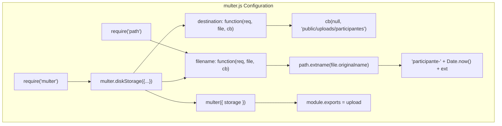
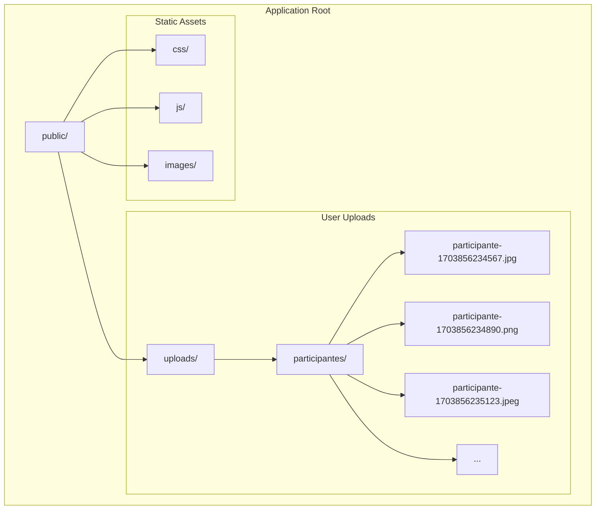
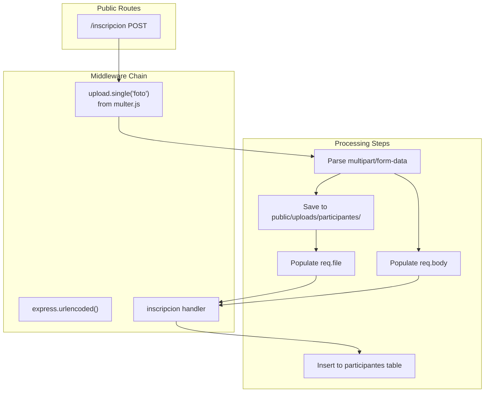

# File Upload System

> **Relevant source files**
> * [middlewares/multer.js](https://github.com/Lourdes12587/Proyecto-Node.js/blob/3a172be7/middlewares/multer.js)
> * [middlewares/verifyAdmin.js](https://github.com/Lourdes12587/Proyecto-Node.js/blob/3a172be7/middlewares/verifyAdmin.js)
> * [middlewares/verifyToken.js](https://github.com/Lourdes12587/Proyecto-Node.js/blob/3a172be7/middlewares/verifyToken.js)
> * [public/css/edit.css](https://github.com/Lourdes12587/Proyecto-Node.js/blob/3a172be7/public/css/edit.css)
> * [views/inscripcion.ejs](https://github.com/Lourdes12587/Proyecto-Node.js/blob/3a172be7/views/inscripcion.ejs)

## Purpose and Scope

This document describes the file upload system used for handling participant profile photos during registration. The system uses the `multer` middleware library to process multipart/form-data uploads, generating unique timestamped filenames and storing images in a dedicated directory structure. For information about how participant data is stored and managed beyond file uploads, see [Participant Data](/Lourdes12587/Proyecto-Node.js/6.1-participant-data). For details on the registration form interface itself, see [Registration Flow](/Lourdes12587/Proyecto-Node.js/4.1.2-registration-flow).

## Multer Middleware Configuration

The file upload system is implemented through a dedicated multer middleware configuration located at [middlewares/multer.js L1-L15](https://github.com/Lourdes12587/Proyecto-Node.js/blob/3a172be7/middlewares/multer.js#L1-L15)

 This middleware intercepts file uploads and handles storage operations before the request reaches route handlers.

### Storage Engine

The system uses `multer.diskStorage()` to configure a disk-based storage engine rather than keeping files in memory. This approach is suitable for the application's needs, where uploaded photos are permanently stored on the server filesystem.

**Configuration Structure:**

| Configuration Aspect | Implementation |
| --- | --- |
| Storage Type | `multer.diskStorage()` |
| Destination Function | Returns `'public/uploads/participantes'` |
| Filename Function | Generates `'participante-' + Date.now() + ext` |
| Module Export | `multer({ storage })` instance |

The storage configuration object provides two callback functions that control where and how files are saved: [middlewares/multer.js L5-L13](https://github.com/Lourdes12587/Proyecto-Node.js/blob/3a172be7/middlewares/multer.js#L5-L13)

**Sources:** [middlewares/multer.js L1-L15](https://github.com/Lourdes12587/Proyecto-Node.js/blob/3a172be7/middlewares/multer.js#L1-L15)

### File Naming Strategy

The filename generation function implements a timestamp-based naming convention to ensure uniqueness and prevent filename collisions:

```
participante-{timestamp}.{extension}
```

The function extracts the original file extension using `path.extname(file.originalname)` and combines it with the prefix `'participante-'` and the current timestamp from `Date.now()`: [middlewares/multer.js L9-L12](https://github.com/Lourdes12587/Proyecto-Node.js/blob/3a172be7/middlewares/multer.js#L9-L12)

 This approach guarantees unique filenames even when multiple participants upload files simultaneously, as `Date.now()` returns milliseconds since the Unix epoch.

**Example Generated Filenames:**

* `participante-1703856234567.jpg`
* `participante-1703856234890.png`
* `participante-1703856235123.jpeg`

**Sources:** [middlewares/multer.js L9-L12](https://github.com/Lourdes12587/Proyecto-Node.js/blob/3a172be7/middlewares/multer.js#L9-L12)

### Destination Directory

All participant photos are stored in `public/uploads/participantes/`: [middlewares/multer.js L7](https://github.com/Lourdes12587/Proyecto-Node.js/blob/3a172be7/middlewares/multer.js#L7-L7)

 This directory structure serves multiple purposes:

1. **Public Accessibility:** The `public/` prefix indicates files are served statically by Express, making them accessible via HTTP URLs
2. **Logical Organization:** The `uploads/` subdirectory separates user-generated content from application assets
3. **Entity Separation:** The `participantes/` subdirectory isolates participant photos from other upload types (e.g., winner photos)

The destination is returned via the callback function `cb(null, 'public/uploads/participantes')`, where the `null` first argument indicates no error: [middlewares/multer.js L6-L8](https://github.com/Lourdes12587/Proyecto-Node.js/blob/3a172be7/middlewares/multer.js#L6-L8)

**Sources:** [middlewares/multer.js L6-L8](https://github.com/Lourdes12587/Proyecto-Node.js/blob/3a172be7/middlewares/multer.js#L6-L8)

## Multer Configuration Architecture



**Sources:** [middlewares/multer.js L1-L15](https://github.com/Lourdes12587/Proyecto-Node.js/blob/3a172be7/middlewares/multer.js#L1-L15)

## Integration with Registration Form

The registration form at `views/inscripcion.ejs` integrates with the multer middleware through proper form encoding and input configuration.

### Form Configuration

The form element specifies `enctype="multipart/form-data"` to enable file upload capability: [views/inscripcion.ejs L22](https://github.com/Lourdes12587/Proyecto-Node.js/blob/3a172be7/views/inscripcion.ejs#L22-L22)

 This encoding type instructs the browser to send form data as a multipart MIME message, which multer can parse.

```
<form action="/inscripcion" method="POST" enctype="multipart/form-data">
```

**Key Form Attributes:**

| Attribute | Value | Purpose |
| --- | --- | --- |
| `action` | `/inscripcion` | POST endpoint for form submission |
| `method` | `POST` | HTTP method for data transmission |
| `enctype` | `multipart/form-data` | Enables file upload parsing |

**Sources:** [views/inscripcion.ejs L22](https://github.com/Lourdes12587/Proyecto-Node.js/blob/3a172be7/views/inscripcion.ejs#L22-L22)

### File Input Field

The file input field is positioned prominently at the top of the form with the label "Foto para dorsal/perfil": [views/inscripcion.ejs L24-L27](https://github.com/Lourdes12587/Proyecto-Node.js/blob/3a172be7/views/inscripcion.ejs#L24-L27)

 The field configuration enforces image file selection:

```
<input type="file" name="foto" accept="image/*" required>
```

**Input Specifications:**

| Attribute | Value | Effect |
| --- | --- | --- |
| `type` | `file` | Renders file picker UI |
| `name` | `foto` | Field name in multipart data |
| `accept` | `image/*` | Browser-level filter for image files |
| `required` | (boolean) | Prevents form submission without file |

The `name="foto"` attribute is crucial as it determines how the route handler accesses the uploaded file through multer's `req.file` object.

**Sources:** [views/inscripcion.ejs L24-L27](https://github.com/Lourdes12587/Proyecto-Node.js/blob/3a172be7/views/inscripcion.ejs#L24-L27)

## File Upload Request Flow

The following diagram illustrates how file uploads are processed through the application stack, from form submission to file storage:

```mermaid
sequenceDiagram
  participant Browser
  participant app.js
  participant /inscripcion Route
  participant multer.single('foto')
  participant multer.diskStorage
  participant public/uploads/participantes/
  participant Route Handler
  participant MySQL DB

  Browser->>app.js: "POST /inscripcion
  app.js->>/inscripcion Route: Content-Type: multipart/form-data"
  /inscripcion Route->>multer.single('foto'): "Route to /inscripcion"
  multer.single('foto')->>multer.single('foto'): "Apply middleware"
  multer.single('foto')->>multer.diskStorage: "Parse multipart data"
  multer.diskStorage-->>multer.single('foto'): "Call destination(req, file, cb)"
  multer.single('foto')->>multer.diskStorage: "'public/uploads/participantes'"
  multer.diskStorage->>multer.diskStorage: "Call filename(req, file, cb)"
  multer.diskStorage-->>multer.single('foto'): "Generate 'participante-' + Date.now() + ext"
  multer.single('foto')->>public/uploads/participantes/: "'participante-1703856234567.jpg'"
  public/uploads/participantes/-->>multer.single('foto'): "Write file to disk"
  multer.single('foto')->>multer.single('foto'): "File saved successfully"
  multer.single('foto')->>Route Handler: "Populate req.file object"
  Route Handler->>Route Handler: "next()"
  Route Handler->>MySQL DB: "Access req.file.filename"
  MySQL DB-->>Route Handler: "INSERT participant with foto path"
  Route Handler->>Browser: "Success"
```

**Sources:** [middlewares/multer.js L1-L15](https://github.com/Lourdes12587/Proyecto-Node.js/blob/3a172be7/middlewares/multer.js#L1-L15)

 [views/inscripcion.ejs L22-L27](https://github.com/Lourdes12587/Proyecto-Node.js/blob/3a172be7/views/inscripcion.ejs#L22-L27)

## File Storage Structure

The file storage system maintains a simple, flat directory structure:



This structure allows participant photos to be served via URLs like `/uploads/participantes/participante-1703856234567.jpg` due to Express's static file serving configured for the `public/` directory.

**Sources:** [middlewares/multer.js L7](https://github.com/Lourdes12587/Proyecto-Node.js/blob/3a172be7/middlewares/multer.js#L7-L7)

## Multer Middleware Usage Pattern

The multer middleware instance exported from [middlewares/multer.js L15](https://github.com/Lourdes12587/Proyecto-Node.js/blob/3a172be7/middlewares/multer.js#L15-L15)

 is applied to routes that handle file uploads. The typical usage pattern is:

```javascript
const upload = require('./middlewares/multer');

router.post('/inscripcion', upload.single('foto'), (req, res) => {
  // req.file contains uploaded file information
  // req.body contains other form fields
});
```

The `upload.single('foto')` method call configures multer to:

1. Expect exactly one file with the field name `'foto'`
2. Make the file information available via `req.file`
3. Continue processing if upload succeeds, or return error if it fails

### req.file Object Structure

After successful upload, `req.file` contains:

| Property | Example Value | Description |
| --- | --- | --- |
| `fieldname` | `'foto'` | Field name specified in form |
| `originalname` | `'profile.jpg'` | Original filename from user's computer |
| `encoding` | `'7bit'` | File encoding |
| `mimetype` | `'image/jpeg'` | MIME type detected by multer |
| `destination` | `'public/uploads/participantes'` | Storage directory |
| `filename` | `'participante-1703856234567.jpg'` | Generated filename |
| `path` | `'public/uploads/participantes/participante-1703856234567.jpg'` | Full file path |
| `size` | `245678` | File size in bytes |

**Sources:** [middlewares/multer.js L1-L15](https://github.com/Lourdes12587/Proyecto-Node.js/blob/3a172be7/middlewares/multer.js#L1-L15)

## Security Considerations

The current implementation includes basic security measures but has areas that could be enhanced:

### Implemented Protections

1. **File Extension Preservation:** The system preserves the original file extension: [middlewares/multer.js L10](https://github.com/Lourdes12587/Proyecto-Node.js/blob/3a172be7/middlewares/multer.js#L10-L10)  This allows proper file type identification but relies on client-provided data.
2. **Timestamp-Based Naming:** Using `Date.now()` for filenames prevents path traversal attacks since the filename is entirely server-generated: [middlewares/multer.js L11](https://github.com/Lourdes12587/Proyecto-Node.js/blob/3a172be7/middlewares/multer.js#L11-L11)
3. **Isolated Storage Directory:** Participant uploads are segregated in a dedicated directory: [middlewares/multer.js L7](https://github.com/Lourdes12587/Proyecto-Node.js/blob/3a172be7/middlewares/multer.js#L7-L7)  preventing accidental mixing with application code or system files.

### Client-Side Validation

The registration form includes browser-level file type filtering with `accept="image/*"`: [views/inscripcion.ejs L26](https://github.com/Lourdes12587/Proyecto-Node.js/blob/3a172be7/views/inscripcion.ejs#L26-L26)

 This provides immediate user feedback but is not a security control, as it can be bypassed by modifying the HTML or sending requests directly.

### Missing Server-Side Validations

The current implementation lacks several server-side security controls:

* **MIME Type Validation:** No verification that uploaded files are actually images
* **File Size Limits:** No configured limit on upload size (default multer limit applies)
* **File Content Inspection:** No validation of image file headers or content
* **Malicious File Prevention:** No scanning for embedded scripts or malware

**Sources:** [middlewares/multer.js L1-L15](https://github.com/Lourdes12587/Proyecto-Node.js/blob/3a172be7/middlewares/multer.js#L1-L15)

 [views/inscripcion.ejs L24-L27](https://github.com/Lourdes12587/Proyecto-Node.js/blob/3a172be7/views/inscripcion.ejs#L24-L27)

## File Access and Serving

Uploaded participant photos are served statically through Express's static middleware. Since files are stored in `public/uploads/participantes/`, they become accessible at URLs with the path prefix `/uploads/participantes/`.

### URL Construction Pattern

To display a participant's photo:

```
/uploads/participantes/{filename}
```

Where `{filename}` is the value stored in the database's `foto` column (e.g., `participante-1703856234567.jpg`).

### Example Usage in Views

In profile and display pages, participant photos are referenced using this URL pattern:

```
" alt="Participant Photo">
```

The Express static file middleware automatically resolves these URLs to the physical files in the `public/` directory.

**Sources:** [middlewares/multer.js L7](https://github.com/Lourdes12587/Proyecto-Node.js/blob/3a172be7/middlewares/multer.js#L7-L7)

## Integration with Authentication Middleware

While the multer middleware itself handles file processing, routes that use it are typically protected by authentication middleware. The upload functionality intersects with authentication in two scenarios:

1. **Participant Registration:** The `/inscripcion` route using multer is public (no authentication required) since new participants need to register: [views/inscripcion.ejs L22](https://github.com/Lourdes12587/Proyecto-Node.js/blob/3a172be7/views/inscripcion.ejs#L22-L22)
2. **Profile Updates:** If profile editing allows photo changes, those routes would be protected by `verifyToken` middleware (see [Role-Based Access Control](/Lourdes12587/Proyecto-Node.js/3.2-role-based-access-control)) to ensure only authenticated participants can modify their data

This separation means the multer middleware focuses solely on file processing, while authentication concerns are handled by separate middleware layers.

**Sources:** [middlewares/multer.js L1-L15](https://github.com/Lourdes12587/Proyecto-Node.js/blob/3a172be7/middlewares/multer.js#L1-L15)

 [views/inscripcion.ejs L22](https://github.com/Lourdes12587/Proyecto-Node.js/blob/3a172be7/views/inscripcion.ejs#L22-L22)

## Middleware Composition Diagram



**Sources:** [middlewares/multer.js L1-L15](https://github.com/Lourdes12587/Proyecto-Node.js/blob/3a172be7/middlewares/multer.js#L1-L15)

 [views/inscripcion.ejs L22](https://github.com/Lourdes12587/Proyecto-Node.js/blob/3a172be7/views/inscripcion.ejs#L22-L22)