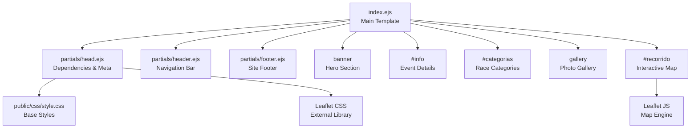
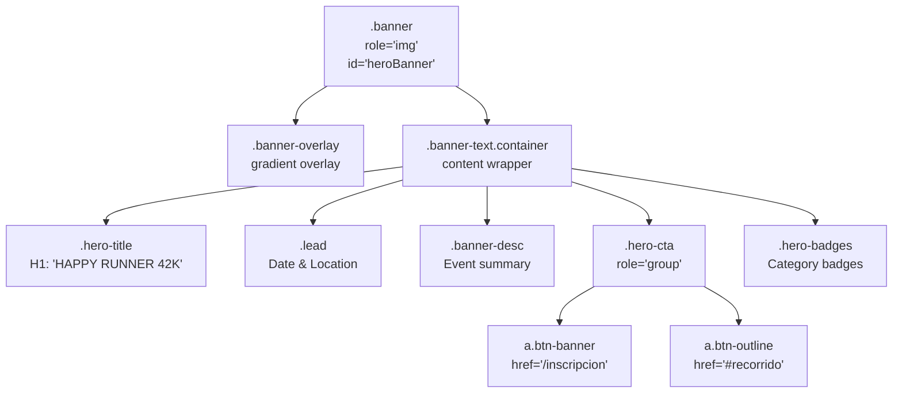
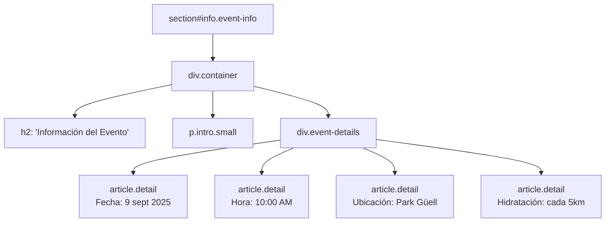
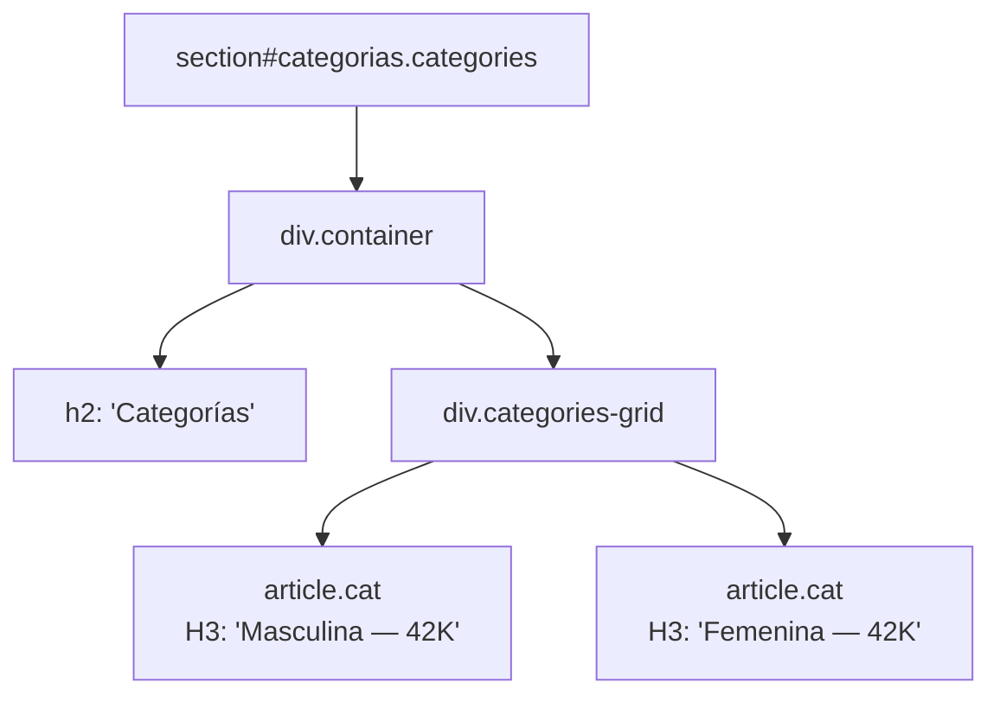
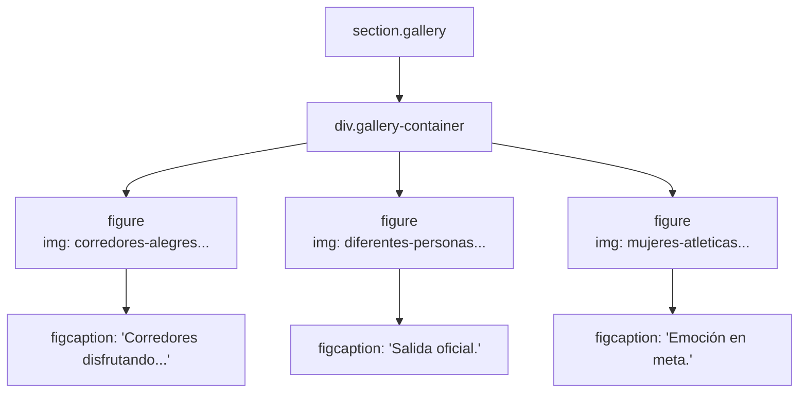
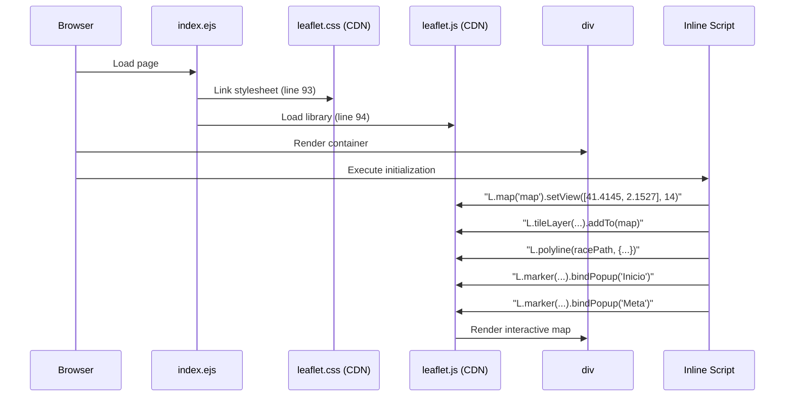

# Landing Page

> **Relevant source files**
> * [public/css/style.css](https://github.com/Lourdes12587/Proyecto-Node.js/blob/3a172be7/public/css/style.css)
> * [views/index.ejs](https://github.com/Lourdes12587/Proyecto-Node.js/blob/3a172be7/views/index.ejs)

## Purpose and Scope

This document details the landing page implementation for the HAPPY RUNNER 42K marathon management application. The landing page serves as the primary entry point for visitors, displaying event information, registration calls-to-action, photo gallery, race categories, and an interactive map of the race route. It is implemented in `views/index.ejs` and styled with `public/css/style.css`.

For participant registration functionality, see [4.1.2](/Lourdes12587/Proyecto-Node.js/4.1.2-registration-flow). For authentication-related navigation behavior, see [3.2](/Lourdes12587/Proyecto-Node.js/3.2-role-based-access-control). For shared layout components (header, footer), see [4.3](/Lourdes12587/Proyecto-Node.js/4.3-shared-components).

## Page Structure Overview

The landing page follows a vertical scrolling single-page layout composed of multiple sections. Each section is semantically structured using HTML5 elements and includes EJS partial inclusions for shared components.



**Sources:** [views/index.ejs L1-L119](https://github.com/Lourdes12587/Proyecto-Node.js/blob/3a172be7/views/index.ejs#L1-L119)

 [public/css/style.css L1-L721](https://github.com/Lourdes12587/Proyecto-Node.js/blob/3a172be7/public/css/style.css#L1-L721)

## Template Composition

The landing page uses EJS partial inclusion to compose the final HTML document:

| Partial Include | Line Reference | Purpose |
| --- | --- | --- |
| `partials/head` | [views/index.ejs L1](https://github.com/Lourdes12587/Proyecto-Node.js/blob/3a172be7/views/index.ejs#L1-L1) | Loads external dependencies (Bootstrap, Leaflet, Font Awesome, Boxicons) and establishes base meta tags |
| `partials/header` | [views/index.ejs L3](https://github.com/Lourdes12587/Proyecto-Node.js/blob/3a172be7/views/index.ejs#L3-L3) | Renders role-based navigation bar with logo, menu items, and authentication links |
| `partials/footer` | [views/index.ejs L118](https://github.com/Lourdes12587/Proyecto-Node.js/blob/3a172be7/views/index.ejs#L118-L118) | Displays footer with brand info, social links, newsletter signup, and legal information |

**Sources:** [views/index.ejs L1-L3](https://github.com/Lourdes12587/Proyecto-Node.js/blob/3a172be7/views/index.ejs#L1-L3)

 [views/index.ejs L118](https://github.com/Lourdes12587/Proyecto-Node.js/blob/3a172be7/views/index.ejs#L118-L118)

## Hero Banner Section

The hero banner occupies the top of the page and provides immediate visual impact with event branding, key details, and primary call-to-action buttons.

### Visual Structure

The banner is implemented using a `.banner` class container with parallax-style background image and overlay:



**Banner Implementation Details:**

* Background image: `/resources/img/bunner.jpg` ([public/css/style.css L215](https://github.com/Lourdes12587/Proyecto-Node.js/blob/3a172be7/public/css/style.css#L215-L215) )
* Min-height: `72vh` with cover positioning ([public/css/style.css L211-L217](https://github.com/Lourdes12587/Proyecto-Node.js/blob/3a172be7/public/css/style.css#L211-L217) )
* Overlay gradient: `rgba(6,24,36,0.72)` to `rgba(17,46,66,0.45)` with 2px blur ([public/css/style.css L226-L228](https://github.com/Lourdes12587/Proyecto-Node.js/blob/3a172be7/public/css/style.css#L226-L228) )
* Content z-index: `2` positioned above overlay ([public/css/style.css L234](https://github.com/Lourdes12587/Proyecto-Node.js/blob/3a172be7/public/css/style.css#L234-L234) )

**Sources:** [views/index.ejs L5-L26](https://github.com/Lourdes12587/Proyecto-Node.js/blob/3a172be7/views/index.ejs#L5-L26)

 [public/css/style.css L208-L287](https://github.com/Lourdes12587/Proyecto-Node.js/blob/3a172be7/public/css/style.css#L208-L287)

### Typography and Content Hierarchy

The hero section uses a hierarchical typographic scale defined in CSS custom properties:

| Element | Class | Font Size | Weight | Line Reference |
| --- | --- | --- | --- | --- |
| Main Title | `.hero-title` | `clamp(2rem, 5.2vw, 3.6rem)` | 800 | [public/css/style.css L244-L249](https://github.com/Lourdes12587/Proyecto-Node.js/blob/3a172be7/public/css/style.css#L244-L249) |
| Accent Span | `.accent` | Inherits | Inherits | [public/css/style.css L250](https://github.com/Lourdes12587/Proyecto-Node.js/blob/3a172be7/public/css/style.css#L250-L250) |
| Lead Text | `.lead` | `var(--fz-lg)` (1.25rem) | 700 | [public/css/style.css L253](https://github.com/Lourdes12587/Proyecto-Node.js/blob/3a172be7/public/css/style.css#L253-L253) |
| Description | `.banner-desc` | 1rem | Normal | [public/css/style.css L254](https://github.com/Lourdes12587/Proyecto-Node.js/blob/3a172be7/public/css/style.css#L254-L254) |

The accent color (`--accent: #d2643c`) is applied to the "42K" text element ([views/index.ejs L9](https://github.com/Lourdes12587/Proyecto-Node.js/blob/3a172be7/views/index.ejs#L9-L9)

 [public/css/style.css L10](https://github.com/Lourdes12587/Proyecto-Node.js/blob/3a172be7/public/css/style.css#L10-L10)

).

**Sources:** [views/index.ejs L9-L12](https://github.com/Lourdes12587/Proyecto-Node.js/blob/3a172be7/views/index.ejs#L9-L12)

 [public/css/style.css L22-L27](https://github.com/Lourdes12587/Proyecto-Node.js/blob/3a172be7/public/css/style.css#L22-L27)

 [public/css/style.css L243-L254](https://github.com/Lourdes12587/Proyecto-Node.js/blob/3a172be7/public/css/style.css#L243-L254)

### Call-to-Action Buttons

Two primary CTA buttons are rendered within the `.hero-cta` group:

1. **Primary CTA** (`.btn-banner`): Links to `/inscripcion` with gradient background ([views/index.ejs L15](https://github.com/Lourdes12587/Proyecto-Node.js/blob/3a172be7/views/index.ejs#L15-L15) ) * Gradient: `linear-gradient(180deg, var(--accent), #ff8a64)` ([public/css/style.css L259](https://github.com/Lourdes12587/Proyecto-Node.js/blob/3a172be7/public/css/style.css#L259-L259) ) * Shadow: `0 18px 48px rgba(255,107,53,0.12)` ([public/css/style.css L264](https://github.com/Lourdes12587/Proyecto-Node.js/blob/3a172be7/public/css/style.css#L264-L264) ) * Hover effect: `translateY(-6px) scale(1.02)` ([public/css/style.css L267](https://github.com/Lourdes12587/Proyecto-Node.js/blob/3a172be7/public/css/style.css#L267-L267) )
2. **Secondary CTA** (`.btn-outline`): Anchor link to `#recorrido` section ([views/index.ejs L16](https://github.com/Lourdes12587/Proyecto-Node.js/blob/3a172be7/views/index.ejs#L16-L16) ) * Border: `2px solid rgba(255,255,255,0.12)` ([public/css/style.css L269](https://github.com/Lourdes12587/Proyecto-Node.js/blob/3a172be7/public/css/style.css#L269-L269) ) * Weight: 700 ([public/css/style.css L273](https://github.com/Lourdes12587/Proyecto-Node.js/blob/3a172be7/public/css/style.css#L273-L273) )

**Sources:** [views/index.ejs L14-L17](https://github.com/Lourdes12587/Proyecto-Node.js/blob/3a172be7/views/index.ejs#L14-L17)

 [public/css/style.css L257-L274](https://github.com/Lourdes12587/Proyecto-Node.js/blob/3a172be7/public/css/style.css#L257-L274)

### Category Badges

Two badge elements display race categories using the `.badge` class with glassmorphism styling:

* Background: `linear-gradient(90deg, rgba(255,255,255,0.06), rgba(255,255,255,0.03))` ([public/css/style.css L293](https://github.com/Lourdes12587/Proyecto-Node.js/blob/3a172be7/public/css/style.css#L293-L293) )
* Border: `1px solid rgba(255,255,255,0.04)` ([public/css/style.css L296](https://github.com/Lourdes12587/Proyecto-Node.js/blob/3a172be7/public/css/style.css#L296-L296) )
* Content: "Masculina • 42K" and "Femenina • 42K" ([views/index.ejs L21-L22](https://github.com/Lourdes12587/Proyecto-Node.js/blob/3a172be7/views/index.ejs#L21-L22) )

**Sources:** [views/index.ejs L20-L23](https://github.com/Lourdes12587/Proyecto-Node.js/blob/3a172be7/views/index.ejs#L20-L23)

 [public/css/style.css L289-L297](https://github.com/Lourdes12587/Proyecto-Node.js/blob/3a172be7/public/css/style.css#L289-L297)

## Event Information Section

The `#info` section provides structured event details using an article-based card layout.



### Grid Layout

The `.event-details` container uses flexbox with wrapping:

* Display: `flex` with `gap: 1rem` and `flex-wrap: wrap` ([public/css/style.css L314](https://github.com/Lourdes12587/Proyecto-Node.js/blob/3a172be7/public/css/style.css#L314-L314) )
* Each `.detail` card: `flex: 1 1 220px` with responsive growth ([public/css/style.css L351](https://github.com/Lourdes12587/Proyecto-Node.js/blob/3a172be7/public/css/style.css#L351-L351) )
* Card styling: `border-radius: 12px` with soft shadow ([public/css/style.css L319-L325](https://github.com/Lourdes12587/Proyecto-Node.js/blob/3a172be7/public/css/style.css#L319-L325) )

**Card Content Structure:**

* H3 for label (e.g., "Fecha", "Hora")
* P for value (e.g., "9 de septiembre 2025", "10:00 AM")

**Sources:** [views/index.ejs L29-L53](https://github.com/Lourdes12587/Proyecto-Node.js/blob/3a172be7/views/index.ejs#L29-L53)

 [public/css/style.css L314](https://github.com/Lourdes12587/Proyecto-Node.js/blob/3a172be7/public/css/style.css#L314-L314)

 [public/css/style.css L319-L351](https://github.com/Lourdes12587/Proyecto-Node.js/blob/3a172be7/public/css/style.css#L319-L351)

## Categories Section

The `#categorias` section displays race categories using enhanced card components with hover effects.

### Implementation



### Styling Characteristics

The `.cat` class provides enhanced card styling compared to basic `.detail` cards:

| Property | Value | Line Reference |
| --- | --- | --- |
| Flex basis | `1 1 300px` | [public/css/style.css L356](https://github.com/Lourdes12587/Proyecto-Node.js/blob/3a172be7/public/css/style.css#L356-L356) |
| Padding | `1.25rem` | [public/css/style.css L358](https://github.com/Lourdes12587/Proyecto-Node.js/blob/3a172be7/public/css/style.css#L358-L358) |
| Background | `linear-gradient(180deg, var(--white), #fbfdff)` | [public/css/style.css L361](https://github.com/Lourdes12587/Proyecto-Node.js/blob/3a172be7/public/css/style.css#L361-L361) |
| Transition | `transform .28s cubic-bezier(.2,.9,.3,1)` | [public/css/style.css L362](https://github.com/Lourdes12587/Proyecto-Node.js/blob/3a172be7/public/css/style.css#L362-L362) |
| Hover transform | `translateY(-10px)` | [public/css/style.css L364](https://github.com/Lourdes12587/Proyecto-Node.js/blob/3a172be7/public/css/style.css#L364-L364) |

**Sources:** [views/index.ejs L55-L69](https://github.com/Lourdes12587/Proyecto-Node.js/blob/3a172be7/views/index.ejs#L55-L69)

 [public/css/style.css L354-L366](https://github.com/Lourdes12587/Proyecto-Node.js/blob/3a172be7/public/css/style.css#L354-L366)

## Photo Gallery Section

The gallery section implements a responsive grid layout for event photography.

### Grid Configuration



### CSS Grid Implementation

* Grid template: `repeat(auto-fit, minmax(240px, 1fr))` ([public/css/style.css L370](https://github.com/Lourdes12587/Proyecto-Node.js/blob/3a172be7/public/css/style.css#L370-L370) )
* Gap: `1rem` ([public/css/style.css L371](https://github.com/Lourdes12587/Proyecto-Node.js/blob/3a172be7/public/css/style.css#L371-L371) )
* Image height: `260px` with `object-fit: cover` ([public/css/style.css L381](https://github.com/Lourdes12587/Proyecto-Node.js/blob/3a172be7/public/css/style.css#L381-L381) )
* Hover effects: * Figure: `translateY(-10px)` with shadow elevation ([public/css/style.css L382](https://github.com/Lourdes12587/Proyecto-Node.js/blob/3a172be7/public/css/style.css#L382-L382) ) * Image: `scale(1.05)` with brightness increase ([public/css/style.css L383](https://github.com/Lourdes12587/Proyecto-Node.js/blob/3a172be7/public/css/style.css#L383-L383) )

**Image Attributes:**

* `loading="lazy"` for performance optimization ([views/index.ejs L75-L77](https://github.com/Lourdes12587/Proyecto-Node.js/blob/3a172be7/views/index.ejs#L75-L77) )
* Alt text for accessibility
* Semantic `<figcaption>` for descriptions

**Sources:** [views/index.ejs L71-L81](https://github.com/Lourdes12587/Proyecto-Node.js/blob/3a172be7/views/index.ejs#L71-L81)

 [public/css/style.css L367-L385](https://github.com/Lourdes12587/Proyecto-Node.js/blob/3a172be7/public/css/style.css#L367-L385)

## Interactive Race Map

The race route section integrates Leaflet.js to display an interactive map showing the marathon path from start to finish.

### Leaflet Integration Flow



### Map Initialization Parameters

**Map Container:**

* Element ID: `map` ([views/index.ejs L87](https://github.com/Lourdes12587/Proyecto-Node.js/blob/3a172be7/views/index.ejs#L87-L87) )
* Initial view: `[41.4145, 2.1527]` (Park Güell coordinates) with zoom level 14 ([views/index.ejs L97](https://github.com/Lourdes12587/Proyecto-Node.js/blob/3a172be7/views/index.ejs#L97-L97) )
* Tile layer: OpenStreetMap with attribution ([views/index.ejs L99-L101](https://github.com/Lourdes12587/Proyecto-Node.js/blob/3a172be7/views/index.ejs#L99-L101) )

**Race Path Coordinates:**

```javascript
var racePath = [
    [41.4145, 2.1527], // Inicio
    [41.4150, 2.1535],
    [41.4155, 2.1545],
    [41.4160, 2.1555]  // Meta
];
```

([views/index.ejs L103-L108](https://github.com/Lourdes12587/Proyecto-Node.js/blob/3a172be7/views/index.ejs#L103-L108)

)

**Polyline Styling:**

* Color: `red`
* Weight: `5`
* Opacity: `0.8` ([views/index.ejs L110](https://github.com/Lourdes12587/Proyecto-Node.js/blob/3a172be7/views/index.ejs#L110-L110) )

**Markers:**

* Start marker: `racePath[0]` with popup "Inicio" (auto-opened) ([views/index.ejs L114](https://github.com/Lourdes12587/Proyecto-Node.js/blob/3a172be7/views/index.ejs#L114-L114) )
* Finish marker: `racePath[racePath.length - 1]` with popup "Meta" ([views/index.ejs L115](https://github.com/Lourdes12587/Proyecto-Node.js/blob/3a172be7/views/index.ejs#L115-L115) )

**Sources:** [views/index.ejs L83-L116](https://github.com/Lourdes12587/Proyecto-Node.js/blob/3a172be7/views/index.ejs#L83-L116)

### Map Styling

The map container receives specific styling for visual consistency:

| Property | Value | Line Reference |
| --- | --- | --- |
| Width | `100%` | [views/index.ejs L87](https://github.com/Lourdes12587/Proyecto-Node.js/blob/3a172be7/views/index.ejs#L87-L87) |
| Height | `400px` (base), `450px` (wrapper) | [views/index.ejs L87](https://github.com/Lourdes12587/Proyecto-Node.js/blob/3a172be7/views/index.ejs#L87-L87) <br>  [public/css/style.css L423](https://github.com/Lourdes12587/Proyecto-Node.js/blob/3a172be7/public/css/style.css#L423-L423) |
| Border radius | `14px` | [public/css/style.css L424](https://github.com/Lourdes12587/Proyecto-Node.js/blob/3a172be7/public/css/style.css#L424-L424) |
| Border | `2px solid rgba(22,66,91,0.08)` | [public/css/style.css L426](https://github.com/Lourdes12587/Proyecto-Node.js/blob/3a172be7/public/css/style.css#L426-L426) |
| Box shadow | `0 12px 40px rgba(10,40,60,0.12)` | [public/css/style.css L427](https://github.com/Lourdes12587/Proyecto-Node.js/blob/3a172be7/public/css/style.css#L427-L427) |

**Wrapper Container** (`.map-wrapper`):

* Max-width: `1000px` with centered margin ([public/css/style.css L410-L412](https://github.com/Lourdes12587/Proyecto-Node.js/blob/3a172be7/public/css/style.css#L410-L412) )
* Background: `#fff` with elevated shadow ([public/css/style.css L414-L415](https://github.com/Lourdes12587/Proyecto-Node.js/blob/3a172be7/public/css/style.css#L414-L415) )
* Animation: `fadeIn .6s ease-out` ([public/css/style.css L417](https://github.com/Lourdes12587/Proyecto-Node.js/blob/3a172be7/public/css/style.css#L417-L417) )

**Sources:** [views/index.ejs L87](https://github.com/Lourdes12587/Proyecto-Node.js/blob/3a172be7/views/index.ejs#L87-L87)

 [public/css/style.css L388-L463](https://github.com/Lourdes12587/Proyecto-Node.js/blob/3a172be7/public/css/style.css#L388-L463)

### Custom Popup Styling

Leaflet popup elements are customized via CSS overrides:

* `.leaflet-popup-content-wrapper`: White background with border radius `10px` and shadow ([public/css/style.css L431-L437](https://github.com/Lourdes12587/Proyecto-Node.js/blob/3a172be7/public/css/style.css#L431-L437) )
* `.leaflet-popup-tip`: Matching white background ([public/css/style.css L440-L442](https://github.com/Lourdes12587/Proyecto-Node.js/blob/3a172be7/public/css/style.css#L440-L442) )
* Content: Font weight `600` with indigo-dye color ([public/css/style.css L435](https://github.com/Lourdes12587/Proyecto-Node.js/blob/3a172be7/public/css/style.css#L435-L435) )

**Sources:** [public/css/style.css L430-L442](https://github.com/Lourdes12587/Proyecto-Node.js/blob/3a172be7/public/css/style.css#L430-L442)

## CSS Architecture

The landing page styling is built on a comprehensive design system defined in CSS custom properties.

### Design Tokens

```mermaid
flowchart TD

RootVars[":root CSS Variables"]
ColorPalette["Color Palette"]
Spacing["Spacing System"]
Typography["Typography Scale"]
Effects["Shadow & Effects"]
LapisLazuli["--lapis-lazuli: #2f6690ff"]
Cerulean["--cerulean: #3a7ca5ff"]
IndigoDye["--indigo-dye: #16425bff"]
SkyBlue["--sky-blue: #81c3d7ff"]
Accent["--accent: #d2643c"]
Radius["--radius: 14px"]
Gap["--gap: 1rem"]
MaxWidth["--max-width: 1200px"]
FzBase["--fz-base: 18px"]
FzLg["--fz-lg: 1.25rem"]
Leading["--leading: 1.55"]
ShadowSoft["--shadow-soft"]
ShadowStrong["--shadow-strong"]

RootVars --> ColorPalette
RootVars --> Spacing
RootVars --> Typography
RootVars --> Effects
ColorPalette --> LapisLazuli
ColorPalette --> Cerulean
ColorPalette --> IndigoDye
ColorPalette --> SkyBlue
ColorPalette --> Accent
Spacing --> Radius
Spacing --> Gap
Spacing --> MaxWidth
Typography --> FzBase
Typography --> FzLg
Typography --> Leading
Effects --> ShadowSoft
Effects --> ShadowStrong
```



**Color Palette Definition:**
All primary colors are defined at [public/css/style.css L3-L11](https://github.com/Lourdes12587/Proyecto-Node.js/blob/3a172be7/public/css/style.css#L3-L11)

 The accent color `#d2643c` provides contrast for CTAs and highlights.

**Typography System:**

* Base font size increased to `18px` for improved readability ([public/css/style.css L23](https://github.com/Lourdes12587/Proyecto-Node.js/blob/3a172be7/public/css/style.css#L23-L23) )
* Line height: `1.55` for comfortable reading ([public/css/style.css L26](https://github.com/Lourdes12587/Proyecto-Node.js/blob/3a172be7/public/css/style.css#L26-L26) )
* Font family: "Montserrat" with system fallbacks ([public/css/style.css L34](https://github.com/Lourdes12587/Proyecto-Node.js/blob/3a172be7/public/css/style.css#L34-L34) )

**Shadows:**

* Soft shadow: `0 12px 32px rgba(10,30,45,0.08)` ([public/css/style.css L19](https://github.com/Lourdes12587/Proyecto-Node.js/blob/3a172be7/public/css/style.css#L19-L19) )
* Strong shadow: `0 20px 60px rgba(10,30,45,0.14)` ([public/css/style.css L20](https://github.com/Lourdes12587/Proyecto-Node.js/blob/3a172be7/public/css/style.css#L20-L20) )

**Sources:** [public/css/style.css L3-L27](https://github.com/Lourdes12587/Proyecto-Node.js/blob/3a172be7/public/css/style.css#L3-L27)

### Responsive Breakpoints

The stylesheet implements mobile-first responsive design with three primary breakpoints:

| Breakpoint | Scope | Key Changes |
| --- | --- | --- |
| `max-width: 980px` | Tablet | Column stacking for event details and categories, reduced hero font size, map height to 420px |
| `max-width: 780px` | Mobile | Hamburger menu activation, nav-links dropdown, adjusted padding |
| `max-width: 680px` | Small mobile | Gallery image height reduction (260px → 200px), banner min-height to 55vh, map height to 320px |

**Navigation Responsive Behavior:**

* Menu button (`.menu-btn`) displays below 780px ([public/css/style.css L151](https://github.com/Lourdes12587/Proyecto-Node.js/blob/3a172be7/public/css/style.css#L151-L151) )
* Nav links convert to dropdown positioned absolutely ([public/css/style.css L152-L162](https://github.com/Lourdes12587/Proyecto-Node.js/blob/3a172be7/public/css/style.css#L152-L162) )
* Active state toggled via `.active` class ([public/css/style.css L164](https://github.com/Lourdes12587/Proyecto-Node.js/blob/3a172be7/public/css/style.css#L164-L164) )

**Sources:** [public/css/style.css L150-L167](https://github.com/Lourdes12587/Proyecto-Node.js/blob/3a172be7/public/css/style.css#L150-L167)

 [public/css/style.css L498-L508](https://github.com/Lourdes12587/Proyecto-Node.js/blob/3a172be7/public/css/style.css#L498-L508)

## Accessibility Features

The landing page implements WCAG 2.1 accessibility guidelines through semantic markup and ARIA attributes.

### Semantic Structure

* Hero banner: `role="img"` with `aria-label="Corredores en Barcelona"` ([views/index.ejs L6](https://github.com/Lourdes12587/Proyecto-Node.js/blob/3a172be7/views/index.ejs#L6-L6) )
* Overlay: `aria-hidden="true"` to hide decorative element from screen readers ([views/index.ejs L7](https://github.com/Lourdes12587/Proyecto-Node.js/blob/3a172be7/views/index.ejs#L7-L7) )
* CTA group: `role="group"` with `aria-label="Llamados a la acción"` ([views/index.ejs L14](https://github.com/Lourdes12587/Proyecto-Node.js/blob/3a172be7/views/index.ejs#L14-L14) )
* Badges: `aria-hidden="true"` as decorative content ([views/index.ejs L20](https://github.com/Lourdes12587/Proyecto-Node.js/blob/3a172be7/views/index.ejs#L20-L20) )

### Keyboard Navigation

Focus states are enhanced with consistent outline styling:

```
a:focus, button:focus, input:focus {
  outline: 3px solid rgba(129,195,215,0.16);
  outline-offset: 3px;
  border-radius: 8px;
}
```

([public/css/style.css L495](https://github.com/Lourdes12587/Proyecto-Node.js/blob/3a172be7/public/css/style.css#L495-L495)

)

### Motion Preferences

The stylesheet respects `prefers-reduced-motion` media query:

```
@media (prefers-reduced-motion: reduce) {
  * {
    transition: none !important;
    animation: none !important;
    transform: none !important;
  }
}
```

([public/css/style.css L511-L513](https://github.com/Lourdes12587/Proyecto-Node.js/blob/3a172be7/public/css/style.css#L511-L513)

)

### Image Optimization

* Lazy loading: `loading="lazy"` on gallery images ([views/index.ejs L75-L77](https://github.com/Lourdes12587/Proyecto-Node.js/blob/3a172be7/views/index.ejs#L75-L77) )
* Alt text: Descriptive alt attributes for all images
* Figcaptions: Semantic captions for gallery items

**Sources:** [views/index.ejs L6-L7](https://github.com/Lourdes12587/Proyecto-Node.js/blob/3a172be7/views/index.ejs#L6-L7)

 [views/index.ejs L14](https://github.com/Lourdes12587/Proyecto-Node.js/blob/3a172be7/views/index.ejs#L14-L14)

 [views/index.ejs L20](https://github.com/Lourdes12587/Proyecto-Node.js/blob/3a172be7/views/index.ejs#L20-L20)

 [views/index.ejs L75-L77](https://github.com/Lourdes12587/Proyecto-Node.js/blob/3a172be7/views/index.ejs#L75-L77)

 [public/css/style.css L495](https://github.com/Lourdes12587/Proyecto-Node.js/blob/3a172be7/public/css/style.css#L495-L495)

 [public/css/style.css L511-L513](https://github.com/Lourdes12587/Proyecto-Node.js/blob/3a172be7/public/css/style.css#L511-L513)

## External Dependencies

The landing page relies on external libraries loaded via CDN:

| Library | Purpose | Load Location |
| --- | --- | --- |
| Leaflet CSS | Map styling | [views/index.ejs L93](https://github.com/Lourdes12587/Proyecto-Node.js/blob/3a172be7/views/index.ejs#L93-L93) |
| Leaflet JS | Interactive mapping engine | [views/index.ejs L94](https://github.com/Lourdes12587/Proyecto-Node.js/blob/3a172be7/views/index.ejs#L94-L94) |
| Font Awesome | Icon fonts | [public/css/style.css L1](https://github.com/Lourdes12587/Proyecto-Node.js/blob/3a172be7/public/css/style.css#L1-L1) |
| Bootstrap | UI framework (via partials/head) | Referenced in head partial |
| Boxicons | Additional icon set (via partials/head) | Referenced in head partial |

**Tile Provider:**

* OpenStreetMap tiles with attribution requirement ([views/index.ejs L99-L101](https://github.com/Lourdes12587/Proyecto-Node.js/blob/3a172be7/views/index.ejs#L99-L101) )

**Sources:** [views/index.ejs L93-L94](https://github.com/Lourdes12587/Proyecto-Node.js/blob/3a172be7/views/index.ejs#L93-L94)

 [views/index.ejs L99-L101](https://github.com/Lourdes12587/Proyecto-Node.js/blob/3a172be7/views/index.ejs#L99-L101)

 [public/css/style.css L1](https://github.com/Lourdes12587/Proyecto-Node.js/blob/3a172be7/public/css/style.css#L1-L1)