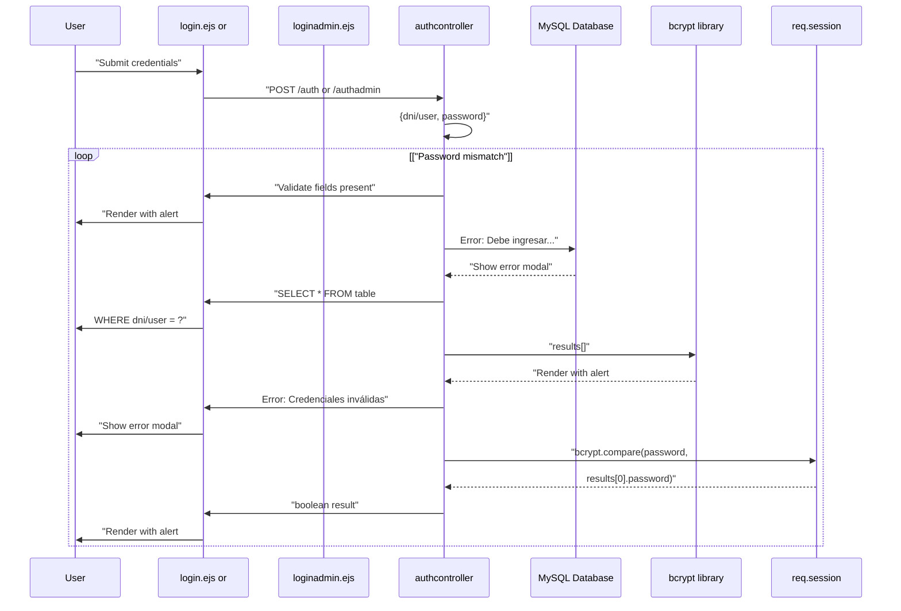

# Login System

> **Relevant source files**
> * [controllers/authcontroller.js](https://github.com/Lourdes12587/Proyecto-Node.js/blob/3a172be7/controllers/authcontroller.js)
> * [views/login.ejs](https://github.com/Lourdes12587/Proyecto-Node.js/blob/3a172be7/views/login.ejs)
> * [views/loginadmin.ejs](https://github.com/Lourdes12587/Proyecto-Node.js/blob/3a172be7/views/loginadmin.ejs)

## Purpose and Scope

This document details the dual login mechanisms implemented in the HAPPY RUNNER 42K application. The system provides separate authentication pathways for participants (runners) and administrators (event organizers), each with distinct credential formats and access patterns. Participant authentication uses DNI (national identity number) as the username, while administrator authentication uses a standard username-based approach.

For information about how authenticated sessions are managed after login, see [Session Management](/Lourdes12587/Proyecto-Node.js/3.3-session-management). For details on how roles are enforced throughout the application, see [Role-Based Access Control](/Lourdes12587/Proyecto-Node.js/3.2-role-based-access-control).

**Sources:** [controllers/authcontroller.js L1-L91](https://github.com/Lourdes12587/Proyecto-Node.js/blob/3a172be7/controllers/authcontroller.js#L1-L91)

 [views/login.ejs L1-L58](https://github.com/Lourdes12587/Proyecto-Node.js/blob/3a172be7/views/login.ejs#L1-L58)

 [views/loginadmin.ejs L1-L55](https://github.com/Lourdes12587/Proyecto-Node.js/blob/3a172be7/views/loginadmin.ejs#L1-L55)

---

## Login System Architecture

The application implements two independent login endpoints, each backed by separate database tables and credential formats:

| Aspect | Participant Login | Admin Login |
| --- | --- | --- |
| **Route** | `/auth` | `/authadmin` |
| **View Template** | `login.ejs` | `loginadmin.ejs` |
| **Controller Function** | `authcontroller.loginParticipante` | `authcontroller.loginAdmin` |
| **Database Table** | `participantes` | `organizadores` |
| **Username Field** | `dni` (numeric ID) | `user` (string username) |
| **Password Storage** | bcrypt hash in `password` column | bcrypt hash in `password` column |
| **Session Role** | `"participante"` | `"admin"` |
| **Success Redirect** | `/perfil` | `/admin` |
| **Failure Redirect** | `/login` (re-render) | `/loginadmin` (re-render) |

**Sources:** [controllers/authcontroller.js L1-L91](https://github.com/Lourdes12587/Proyecto-Node.js/blob/3a172be7/controllers/authcontroller.js#L1-L91)

 [views/login.ejs L8](https://github.com/Lourdes12587/Proyecto-Node.js/blob/3a172be7/views/login.ejs#L8-L8)

 [views/loginadmin.ejs L8](https://github.com/Lourdes12587/Proyecto-Node.js/blob/3a172be7/views/loginadmin.ejs#L8-L8)

---

## Authentication Flow Diagram

```mermaid
flowchart TD

AdminForm["loginadmin.ejs<br>Form: /authadmin"]
AdminPost["POST /authadmin"]
LoginAdminFunc["authcontroller.loginAdmin()"]
AdminDB["organizadores table<br>SELECT * WHERE user = ?"]
AdminBcrypt["bcrypt.compare()<br>password vs results[0].password"]
AdminSession["Session Variables:<br>loggedin=true<br>user=results[0].user<br>rol='admin'"]
AdminSuccess["Redirect to /admin"]
ParticipantForm["login.ejs<br>Form: /auth"]
ParticipantPost["POST /auth"]
LoginPartFunc["authcontroller.loginParticipante()"]
ParticipantDB["participantes table<br>SELECT * WHERE dni = ?"]
ParticipantBcrypt["bcrypt.compare()<br>password vs results[0].password"]
ParticipantSession["Session Variables:<br>loggedin=true<br>dni=results[0].dni<br>rol='participante'"]
ParticipantSuccess["Redirect to /perfil"]

subgraph subGraph1 ["Admin Login"]
    AdminForm
    AdminPost
    LoginAdminFunc
    AdminDB
    AdminBcrypt
    AdminSession
    AdminSuccess
    AdminForm --> AdminPost
    AdminPost --> LoginAdminFunc
    LoginAdminFunc --> AdminDB
    AdminDB --> AdminBcrypt
    AdminBcrypt --> AdminSession
    AdminSession --> AdminSuccess
    AdminBcrypt --> AdminForm
end

subgraph subGraph0 ["Participant Login"]
    ParticipantForm
    ParticipantPost
    LoginPartFunc
    ParticipantDB
    ParticipantBcrypt
    ParticipantSession
    ParticipantSuccess
    ParticipantForm --> ParticipantPost
    ParticipantPost --> LoginPartFunc
    LoginPartFunc --> ParticipantDB
    ParticipantDB --> ParticipantBcrypt
    ParticipantBcrypt --> ParticipantSession
    ParticipantSession --> ParticipantSuccess
    ParticipantBcrypt --> ParticipantForm
end
```



**Sources:** [controllers/authcontroller.js L1-L91](https://github.com/Lourdes12587/Proyecto-Node.js/blob/3a172be7/controllers/authcontroller.js#L1-L91)

 [views/login.ejs L8](https://github.com/Lourdes12587/Proyecto-Node.js/blob/3a172be7/views/login.ejs#L8-L8)

 [views/loginadmin.ejs L8](https://github.com/Lourdes12587/Proyecto-Node.js/blob/3a172be7/views/loginadmin.ejs#L8-L8)

---

## Participant Login Flow

### Controller Implementation

The `loginParticipante` function in [controllers/authcontroller.js L1-L45](https://github.com/Lourdes12587/Proyecto-Node.js/blob/3a172be7/controllers/authcontroller.js#L1-L45)

 handles participant authentication. The process follows these steps:

1. **Input Validation** [controllers/authcontroller.js L4-L12](https://github.com/Lourdes12587/Proyecto-Node.js/blob/3a172be7/controllers/authcontroller.js#L4-L12) * Extracts `dni` and `password` from `req.body` * Returns error if either field is missing * Renders `login.ejs` with SweetAlert2 error parameters
2. **Database Query** [controllers/authcontroller.js L14](https://github.com/Lourdes12587/Proyecto-Node.js/blob/3a172be7/controllers/authcontroller.js#L14-L14) * Queries `participantes` table: `SELECT * FROM participantes WHERE dni = ?` * Uses parameterized query to prevent SQL injection
3. **Credential Verification** [controllers/authcontroller.js L17-L28](https://github.com/Lourdes12587/Proyecto-Node.js/blob/3a172be7/controllers/authcontroller.js#L17-L28) * Checks if query returned results (`results.length === 0`) * Uses `bcrypt.compare(password, results[0].password)` for password validation * Both checks must pass for successful authentication
4. **Session Initialization** [controllers/authcontroller.js L31-L33](https://github.com/Lourdes12587/Proyecto-Node.js/blob/3a172be7/controllers/authcontroller.js#L31-L33) * Sets `req.session.loggedin = true` * Stores `req.session.dni = results[0].dni` * Assigns `req.session.rol = "participante"`
5. **Success Response** [controllers/authcontroller.js L35-L43](https://github.com/Lourdes12587/Proyecto-Node.js/blob/3a172be7/controllers/authcontroller.js#L35-L43) * Renders `login.ejs` with success alert parameters * Sets `ruta: "perfil"` to redirect to profile page * Uses 1500ms timer for automatic redirect

**Sources:** [controllers/authcontroller.js L1-L45](https://github.com/Lourdes12587/Proyecto-Node.js/blob/3a172be7/controllers/authcontroller.js#L1-L45)

### View Template

The participant login interface is defined in [views/login.ejs L1-L58](https://github.com/Lourdes12587/Proyecto-Node.js/blob/3a172be7/views/login.ejs#L1-L58)

 Key elements include:

* **Form Configuration** [views/login.ejs L8](https://github.com/Lourdes12587/Proyecto-Node.js/blob/3a172be7/views/login.ejs#L8-L8) * Form submits to `/auth` via POST method * Input field `dni` for participant identification * Password input field
* **Field Labels** [views/login.ejs L10-L11](https://github.com/Lourdes12587/Proyecto-Node.js/blob/3a172be7/views/login.ejs#L10-L11) * Label text: "Ingrese su usuario:" (Enter your username) * Placeholder: "Ingrese su DNI" (Enter your DNI)
* **SweetAlert2 Integration** [views/login.ejs L24-L54](https://github.com/Lourdes12587/Proyecto-Node.js/blob/3a172be7/views/login.ejs#L24-L54) * Conditional rendering based on `alert` variable existence * Displays `alertTitle`, `alertMessage`, and `alertIcon` * Auto-redirects on success using `window.location = '/<%= ruta %>'`

**Sources:** [views/login.ejs L1-L58](https://github.com/Lourdes12587/Proyecto-Node.js/blob/3a172be7/views/login.ejs#L1-L58)

---

## Admin Login Flow

### Controller Implementation

The `loginAdmin` function in [controllers/authcontroller.js L47-L91](https://github.com/Lourdes12587/Proyecto-Node.js/blob/3a172be7/controllers/authcontroller.js#L47-L91)

 mirrors the participant login structure with different credentials:

1. **Input Validation** [controllers/authcontroller.js L50-L58](https://github.com/Lourdes12587/Proyecto-Node.js/blob/3a172be7/controllers/authcontroller.js#L50-L58) * Extracts `user` and `password` from `req.body` * Validates both fields are present
2. **Database Query** [controllers/authcontroller.js L60](https://github.com/Lourdes12587/Proyecto-Node.js/blob/3a172be7/controllers/authcontroller.js#L60-L60) * Queries `organizadores` table: `SELECT * FROM organizadores WHERE user = ?` * Uses string-based username lookup instead of numeric DNI
3. **Credential Verification** [controllers/authcontroller.js L63-L74](https://github.com/Lourdes12587/Proyecto-Node.js/blob/3a172be7/controllers/authcontroller.js#L63-L74) * Identical bcrypt comparison: `bcrypt.compare(password, results[0].password)` * Returns error with `loginadmin` route on failure
4. **Session Initialization** [controllers/authcontroller.js L77-L79](https://github.com/Lourdes12587/Proyecto-Node.js/blob/3a172be7/controllers/authcontroller.js#L77-L79) * Sets `req.session.loggedin = true` * Stores `req.session.user = results[0].user` * Assigns `req.session.rol = "admin"` (critical for role-based access)
5. **Success Response** [controllers/authcontroller.js L81-L89](https://github.com/Lourdes12587/Proyecto-Node.js/blob/3a172be7/controllers/authcontroller.js#L81-L89) * Renders `loginadmin.ejs` with success parameters * Sets `ruta: "admin"` to redirect to admin panel * Message: "Login de administrador correcto"

**Sources:** [controllers/authcontroller.js L47-L91](https://github.com/Lourdes12587/Proyecto-Node.js/blob/3a172be7/controllers/authcontroller.js#L47-L91)

### View Template

The admin login interface is defined in [views/loginadmin.ejs L1-L55](https://github.com/Lourdes12587/Proyecto-Node.js/blob/3a172be7/views/loginadmin.ejs#L1-L55)

 Notable differences from participant login:

* **Form Configuration** [views/loginadmin.ejs L8](https://github.com/Lourdes12587/Proyecto-Node.js/blob/3a172be7/views/loginadmin.ejs#L8-L8) * Form submits to `/authadmin` via POST * Input field `user` instead of `dni`
* **Interface Labeling** [views/loginadmin.ejs L9-L10](https://github.com/Lourdes12587/Proyecto-Node.js/blob/3a172be7/views/loginadmin.ejs#L9-L10) * Header: "ADMINISTRADORES" * Label: "Ingrese su usuario:" (Enter your username) * Generic username placeholder, not DNI-specific
* **SweetAlert2 Configuration** [views/loginadmin.ejs L22-L50](https://github.com/Lourdes12587/Proyecto-Node.js/blob/3a172be7/views/loginadmin.ejs#L22-L50) * Identical alert styling to participant login * Same branded color scheme and animation

**Sources:** [views/loginadmin.ejs L1-L55](https://github.com/Lourdes12587/Proyecto-Node.js/blob/3a172be7/views/loginadmin.ejs#L1-L55)

---

## Credential Validation Sequence

The following sequence diagram illustrates the detailed validation flow for both login types:



**Sources:** [controllers/authcontroller.js L1-L91](https://github.com/Lourdes12587/Proyecto-Node.js/blob/3a172be7/controllers/authcontroller.js#L1-L91)

---

## Password Security Implementation

Both login functions use bcrypt for secure password comparison:

```
// From authcontroller.js
!(await bcrypt.compare(password, results[0].password))
```

This implementation:

* Never compares plaintext passwords directly
* Uses asynchronous bcrypt comparison with `await`
* Compares user-submitted password against hashed value from database
* Returns boolean indicating match status
* Negation operator (`!`) treats mismatch as authentication failure

The bcrypt comparison occurs at:

* Participant login: [controllers/authcontroller.js L19](https://github.com/Lourdes12587/Proyecto-Node.js/blob/3a172be7/controllers/authcontroller.js#L19-L19)
* Admin login: [controllers/authcontroller.js L65](https://github.com/Lourdes12587/Proyecto-Node.js/blob/3a172be7/controllers/authcontroller.js#L65-L65)

Both implementations use identical logic, ensuring consistent security across user types.

**Sources:** [controllers/authcontroller.js L19](https://github.com/Lourdes12587/Proyecto-Node.js/blob/3a172be7/controllers/authcontroller.js#L19-L19)

 [controllers/authcontroller.js L65](https://github.com/Lourdes12587/Proyecto-Node.js/blob/3a172be7/controllers/authcontroller.js#L65-L65)

---

## Session Variable Assignment

Upon successful authentication, the system initializes session variables that persist throughout the user's session. The variables differ based on login type:

### Participant Session Variables

Set in [controllers/authcontroller.js L31-L33](https://github.com/Lourdes12587/Proyecto-Node.js/blob/3a172be7/controllers/authcontroller.js#L31-L33)

:

| Variable | Value | Purpose |
| --- | --- | --- |
| `req.session.loggedin` | `true` | Indicates authenticated state |
| `req.session.dni` | `results[0].dni` | Participant identifier for queries |
| `req.session.rol` | `"participante"` | Role flag for middleware authorization |

### Admin Session Variables

Set in [controllers/authcontroller.js L77-L79](https://github.com/Lourdes12587/Proyecto-Node.js/blob/3a172be7/controllers/authcontroller.js#L77-L79)

:

| Variable | Value | Purpose |
| --- | --- | --- |
| `req.session.loggedin` | `true` | Indicates authenticated state |
| `req.session.user` | `results[0].user` | Admin username for display |
| `req.session.rol` | `"admin"` | Role flag for `verifyAdmin` middleware |

The `rol` value is critical for the authorization system. Middleware functions check this value to enforce role-based access control (see [Role-Based Access Control](/Lourdes12587/Proyecto-Node.js/3.2-role-based-access-control)).

**Sources:** [controllers/authcontroller.js L31-L33](https://github.com/Lourdes12587/Proyecto-Node.js/blob/3a172be7/controllers/authcontroller.js#L31-L33)

 [controllers/authcontroller.js L77-L79](https://github.com/Lourdes12587/Proyecto-Node.js/blob/3a172be7/controllers/authcontroller.js#L77-L79)

---

## User Feedback System

Both login views use SweetAlert2 for displaying authentication results. The alert system is conditionally rendered when the `alert` variable exists in the view context.

### Alert Configuration

The SweetAlert2 configuration in both templates [views/login.ejs L26-L50](https://github.com/Lourdes12587/Proyecto-Node.js/blob/3a172be7/views/login.ejs#L26-L50)

 and [views/loginadmin.ejs L23-L47](https://github.com/Lourdes12587/Proyecto-Node.js/blob/3a172be7/views/loginadmin.ejs#L23-L47)

 includes:

| Parameter | Description | Value Source |
| --- | --- | --- |
| `title` | Alert heading | `<%= alertTitle %>` from controller |
| `text` | Message body | `<%= alertMessage %>` from controller |
| `icon` | Icon type | `<%= alertIcon %>` ("error" or "success") |
| `timer` | Auto-close delay | `<%= timer %>` (1500ms on success) |
| `showConfirmButton` | Show OK button | `<%= showConfirmButton %>` (false on success) |

### Controller Alert Parameters

Error responses [controllers/authcontroller.js L5-L11](https://github.com/Lourdes12587/Proyecto-Node.js/blob/3a172be7/controllers/authcontroller.js#L5-L11)

 [controllers/authcontroller.js L21-L27](https://github.com/Lourdes12587/Proyecto-Node.js/blob/3a172be7/controllers/authcontroller.js#L21-L27)

:

```yaml
{
    alert: true,
    alertTitle: "Error",
    alertMessage: "Credenciales inválidas", // or "Debe ingresar DNI y contraseña"
    alertIcon: "error",
    ruta: "login" // or "loginadmin"
}
```

Success responses [controllers/authcontroller.js L35-L43](https://github.com/Lourdes12587/Proyecto-Node.js/blob/3a172be7/controllers/authcontroller.js#L35-L43)

 [controllers/authcontroller.js L81-L89](https://github.com/Lourdes12587/Proyecto-Node.js/blob/3a172be7/controllers/authcontroller.js#L81-L89)

:

```yaml
{
    alert: true,
    alertTitle: "Éxito",
    alertMessage: "Login correcto", // or "Login de administrador correcto"
    alertIcon: "success",
    showConfirmButton: false,
    timer: 1500,
    ruta: "perfil" // or "admin"
}
```

The `ruta` parameter determines the redirect destination: [views/login.ejs L51](https://github.com/Lourdes12587/Proyecto-Node.js/blob/3a172be7/views/login.ejs#L51-L51)

 executes `window.location = '/<%= ruta %>'` after the alert.

**Sources:** [views/login.ejs L24-L54](https://github.com/Lourdes12587/Proyecto-Node.js/blob/3a172be7/views/login.ejs#L24-L54)

 [views/loginadmin.ejs L22-L50](https://github.com/Lourdes12587/Proyecto-Node.js/blob/3a172be7/views/loginadmin.ejs#L22-L50)

 [controllers/authcontroller.js L5-L43](https://github.com/Lourdes12587/Proyecto-Node.js/blob/3a172be7/controllers/authcontroller.js#L5-L43)

 [controllers/authcontroller.js L50-L89](https://github.com/Lourdes12587/Proyecto-Node.js/blob/3a172be7/controllers/authcontroller.js#L50-L89)

---

## Database Table Structure

The login system queries two separate tables for authentication:

### Participantes Table

Queried by `loginParticipante` [controllers/authcontroller.js L14](https://github.com/Lourdes12587/Proyecto-Node.js/blob/3a172be7/controllers/authcontroller.js#L14-L14)

:

* **Lookup Column:** `dni` (participant's national ID number)
* **Password Column:** `password` (bcrypt hash)
* **Additional Columns:** `nombre`, `apellido`, `telefono`, `direccion`, `foto`

### Organizadores Table

Queried by `loginAdmin` [controllers/authcontroller.js L60](https://github.com/Lourdes12587/Proyecto-Node.js/blob/3a172be7/controllers/authcontroller.js#L60-L60)

:

* **Lookup Column:** `user` (admin username)
* **Password Column:** `password` (bcrypt hash)
* **Additional Columns:** Implementation-specific organizer data

Both queries use parameterized SQL to prevent injection attacks:

```sql
SELECT * FROM participantes WHERE dni = ?
SELECT * FROM organizadores WHERE user = ?
```

**Sources:** [controllers/authcontroller.js L14](https://github.com/Lourdes12587/Proyecto-Node.js/blob/3a172be7/controllers/authcontroller.js#L14-L14)

 [controllers/authcontroller.js L60](https://github.com/Lourdes12587/Proyecto-Node.js/blob/3a172be7/controllers/authcontroller.js#L60-L60)

---

## Error Handling

The authentication system implements consistent error handling across both login types:

### Validation Errors

Missing field errors [controllers/authcontroller.js L4-L12](https://github.com/Lourdes12587/Proyecto-Node.js/blob/3a172be7/controllers/authcontroller.js#L4-L12)

 [controllers/authcontroller.js L50-L58](https://github.com/Lourdes12587/Proyecto-Node.js/blob/3a172be7/controllers/authcontroller.js#L50-L58)

:

* **Condition:** `!dni || !password` or `!user || !password`
* **Message:** "Debe ingresar DNI y contraseña" / "Debe ingresar Usuario y contraseña"
* **Behavior:** Re-renders login form with error alert, does not set session

### Authentication Errors

Invalid credential errors [controllers/authcontroller.js L17-L28](https://github.com/Lourdes12587/Proyecto-Node.js/blob/3a172be7/controllers/authcontroller.js#L17-L28)

 [controllers/authcontroller.js L63-L74](https://github.com/Lourdes12587/Proyecto-Node.js/blob/3a172be7/controllers/authcontroller.js#L63-L74)

:

* **Condition:** `results.length === 0` OR bcrypt comparison fails
* **Message:** "Credenciales inválidas" (consistent message for both scenarios)
* **Security:** Does not distinguish between non-existent user and wrong password
* **Behavior:** Re-renders login form, preserves form state

### Database Errors

SQL errors [controllers/authcontroller.js L15](https://github.com/Lourdes12587/Proyecto-Node.js/blob/3a172be7/controllers/authcontroller.js#L15-L15)

 [controllers/authcontroller.js L61](https://github.com/Lourdes12587/Proyecto-Node.js/blob/3a172be7/controllers/authcontroller.js#L61-L61)

:

* **Handling:** `if (err) throw err;`
* **Behavior:** Throws unhandled exception, likely resulting in 500 error
* **Note:** Production systems should implement more robust error handling

**Sources:** [controllers/authcontroller.js L1-L91](https://github.com/Lourdes12587/Proyecto-Node.js/blob/3a172be7/controllers/authcontroller.js#L1-L91)

---

## Login View Styling

Both login templates share the same CSS file [views/login.ejs L5](https://github.com/Lourdes12587/Proyecto-Node.js/blob/3a172be7/views/login.ejs#L5-L5)

 [views/loginadmin.ejs L5](https://github.com/Lourdes12587/Proyecto-Node.js/blob/3a172be7/views/loginadmin.ejs#L5-L5)

:

```
<link rel="stylesheet" href="/resources/css/login.css">
```

This provides consistent visual presentation across both authentication interfaces. The templates also include shared partials:

* `partials/head` [views/login.ejs L1](https://github.com/Lourdes12587/Proyecto-Node.js/blob/3a172be7/views/login.ejs#L1-L1)  - Bootstrap, Font Awesome, global dependencies
* `partials/header` [views/login.ejs L3](https://github.com/Lourdes12587/Proyecto-Node.js/blob/3a172be7/views/login.ejs#L3-L3)  - Navigation bar (role-aware)
* `partials/footer` [views/login.ejs L57](https://github.com/Lourdes12587/Proyecto-Node.js/blob/3a172be7/views/login.ejs#L57-L57)  - Footer content

The SweetAlert2 modal styling [views/login.ejs L30-L49](https://github.com/Lourdes12587/Proyecto-Node.js/blob/3a172be7/views/login.ejs#L30-L49)

 uses application brand colors:

* Background: Linear gradient from `#2f6690ff` to `#3a7ca5ff`
* Text color: `#ffffff`
* Icon color: `#81c3d7ff`
* Confirm button: `#16425bff`
* Backdrop: Semi-transparent with runner animation GIF

**Sources:** [views/login.ejs L1-L58](https://github.com/Lourdes12587/Proyecto-Node.js/blob/3a172be7/views/login.ejs#L1-L58)

 [views/loginadmin.ejs L1-L55](https://github.com/Lourdes12587/Proyecto-Node.js/blob/3a172be7/views/loginadmin.ejs#L1-L55)

---

## Integration Points

The login system integrates with several other application components:

1. **Session Management** [Session Management](/Lourdes12587/Proyecto-Node.js/3.3-session-management) * Sets session variables consumed by `cookie-session` middleware * Session data persists for 24 hours (configured in application server)
2. **Authorization Middleware** [Role-Based Access Control](/Lourdes12587/Proyecto-Node.js/3.2-role-based-access-control) * `verifyToken` checks `req.session.loggedin` status * `verifyAdmin` validates `req.session.rol === "admin"`
3. **Header Navigation** [Shared Components](/Lourdes12587/Proyecto-Node.js/4.3-shared-components) * `partials/header.ejs` displays different menu items based on `rol` value * Reads from `res.locals.rol` (populated from session)
4. **Protected Routes** * Participant routes require `verifyToken` middleware * Admin routes require `verifyAdmin` middleware * Successful login enables access to role-appropriate interfaces

**Sources:** [controllers/authcontroller.js L31-L33](https://github.com/Lourdes12587/Proyecto-Node.js/blob/3a172be7/controllers/authcontroller.js#L31-L33)

 [controllers/authcontroller.js L77-L79](https://github.com/Lourdes12587/Proyecto-Node.js/blob/3a172be7/controllers/authcontroller.js#L77-L79)