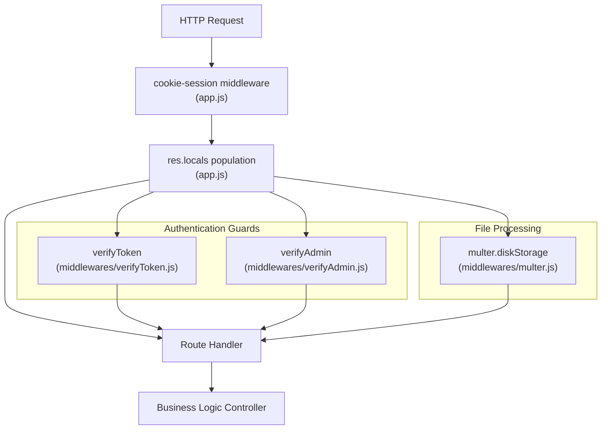
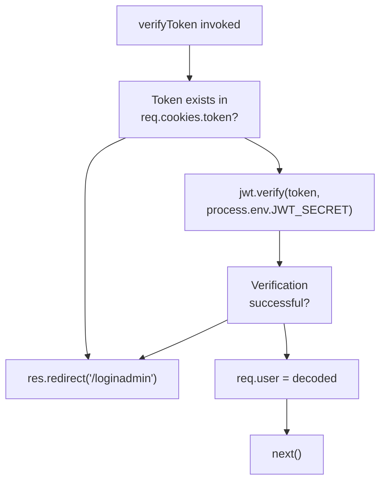
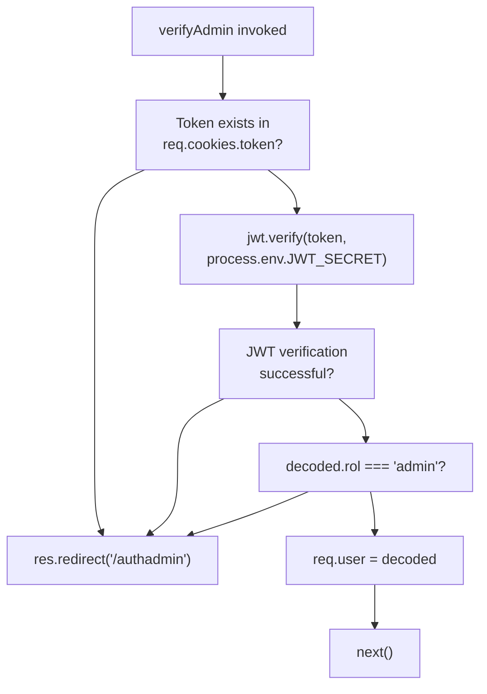
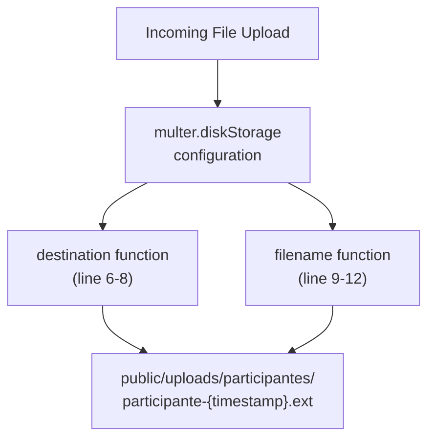

# Middleware Layer

> **Relevant source files**
> * [middlewares/multer.js](https://github.com/Lourdes12587/Proyecto-Node.js/blob/3a172be7/middlewares/multer.js)
> * [middlewares/verifyAdmin.js](https://github.com/Lourdes12587/Proyecto-Node.js/blob/3a172be7/middlewares/verifyAdmin.js)
> * [middlewares/verifyToken.js](https://github.com/Lourdes12587/Proyecto-Node.js/blob/3a172be7/middlewares/verifyToken.js)
> * [public/css/edit.css](https://github.com/Lourdes12587/Proyecto-Node.js/blob/3a172be7/public/css/edit.css)

## Purpose and Scope

This document details the middleware layer that sits between the Express.js router and the business logic controllers. The middleware layer provides three critical cross-cutting concerns: general authentication (`verifyToken`), role-based authorization (`verifyAdmin`), and file upload processing (`multer`).

For information about the overall application server configuration and route delegation, see [Application Server](/Lourdes12587/Proyecto-Node.js/2.1-application-server). For session management configuration that works alongside these middlewares, see [Session Management](/Lourdes12587/Proyecto-Node.js/3.3-session-management).

---

## Middleware Stack Architecture

The application implements three specialized middleware functions that intercept and process requests before they reach route handlers. These middlewares are located in the `middlewares/` directory and are selectively applied to routes based on protection requirements.

### Middleware Stack Diagram



**Sources:** [middlewares/verifyToken.js L1-L18](https://github.com/Lourdes12587/Proyecto-Node.js/blob/3a172be7/middlewares/verifyToken.js#L1-L18)

 [middlewares/verifyAdmin.js L1-L17](https://github.com/Lourdes12587/Proyecto-Node.js/blob/3a172be7/middlewares/verifyAdmin.js#L1-L17)

 [middlewares/multer.js L1-L15](https://github.com/Lourdes12587/Proyecto-Node.js/blob/3a172be7/middlewares/multer.js#L1-L15)

---

## Authentication Middleware

### verifyToken Middleware

The `verifyToken` middleware provides general authentication for any logged-in user (participants or administrators). It validates JWT tokens stored in cookies and populates `req.user` with decoded token data.

| Aspect | Implementation |
| --- | --- |
| **Location** | [middlewares/verifyToken.js L1-L18](https://github.com/Lourdes12587/Proyecto-Node.js/blob/3a172be7/middlewares/verifyToken.js#L1-L18) |
| **Token Source** | `req.cookies.token` extracted from HTTP cookies |
| **Verification** | `jwt.verify(token, process.env.JWT_SECRET)` |
| **Success Action** | Populates `req.user` with decoded token data, calls `next()` |
| **Failure Action** | Redirects to `/loginadmin` |

#### verifyToken Flow



**Implementation Details:**

The token retrieval occurs at [middlewares/verifyToken.js L4](https://github.com/Lourdes12587/Proyecto-Node.js/blob/3a172be7/middlewares/verifyToken.js#L4-L4)

 where `req.cookies.token` is accessed. If the token is missing, an immediate redirect occurs at [middlewares/verifyToken.js L6](https://github.com/Lourdes12587/Proyecto-Node.js/blob/3a172be7/middlewares/verifyToken.js#L6-L6)

 The JWT verification uses `process.env.JWT_SECRET` as the signing key at [middlewares/verifyToken.js L10](https://github.com/Lourdes12587/Proyecto-Node.js/blob/3a172be7/middlewares/verifyToken.js#L10-L10)

 with any verification errors caught at [middlewares/verifyToken.js L13-L15](https://github.com/Lourdes12587/Proyecto-Node.js/blob/3a172be7/middlewares/verifyToken.js#L13-L15)

 triggering the same redirect behavior.

**Sources:** [middlewares/verifyToken.js L1-L18](https://github.com/Lourdes12587/Proyecto-Node.js/blob/3a172be7/middlewares/verifyToken.js#L1-L18)

---

### verifyAdmin Middleware

The `verifyAdmin` middleware implements role-based access control by adding an additional authorization layer beyond token verification. It ensures only users with `rol === "admin"` can access protected administrative routes.

| Aspect | Implementation |
| --- | --- |
| **Location** | [middlewares/verifyAdmin.js L1-L17](https://github.com/Lourdes12587/Proyecto-Node.js/blob/3a172be7/middlewares/verifyAdmin.js#L1-L17) |
| **Token Source** | `req.cookies.token` extracted from HTTP cookies |
| **Verification** | `jwt.verify(token, process.env.JWT_SECRET)` |
| **Role Check** | `decoded.rol !== "admin"` |
| **Success Action** | Populates `req.user` with decoded token data, calls `next()` |
| **Failure Action** | Redirects to `/authadmin` |

#### verifyAdmin Authorization Flow



**Key Differences from verifyToken:**

1. **Different Redirect Target:** `verifyAdmin` redirects to `/authadmin` [middlewares/verifyAdmin.js L5-L13](https://github.com/Lourdes12587/Proyecto-Node.js/blob/3a172be7/middlewares/verifyAdmin.js#L5-L13)  instead of `/loginadmin`
2. **Additional Role Check:** After successful JWT verification, `decoded.rol` is compared against `"admin"` at [middlewares/verifyAdmin.js L9](https://github.com/Lourdes12587/Proyecto-Node.js/blob/3a172be7/middlewares/verifyAdmin.js#L9-L9)
3. **Stricter Access Control:** Only tokens with `rol === "admin"` proceed to the route handler

**Sources:** [middlewares/verifyAdmin.js L1-L17](https://github.com/Lourdes12587/Proyecto-Node.js/blob/3a172be7/middlewares/verifyAdmin.js#L1-L17)

---

## File Upload Middleware

### multer Configuration

The `multer` middleware handles file uploads for participant photo registration. It configures disk storage with custom destination paths and filename generation strategies.

#### Storage Configuration



**Sources:** [middlewares/multer.js L1-L15](https://github.com/Lourdes12587/Proyecto-Node.js/blob/3a172be7/middlewares/multer.js#L1-L15)

#### Configuration Details

| Configuration | Implementation |
| --- | --- |
| **Storage Type** | `multer.diskStorage` at [middlewares/multer.js L5](https://github.com/Lourdes12587/Proyecto-Node.js/blob/3a172be7/middlewares/multer.js#L5-L5) |
| **Destination** | `'public/uploads/participantes'` at [middlewares/multer.js L7](https://github.com/Lourdes12587/Proyecto-Node.js/blob/3a172be7/middlewares/multer.js#L7-L7) |
| **Filename Strategy** | `'participante-' + Date.now() + ext` at [middlewares/multer.js L11](https://github.com/Lourdes12587/Proyecto-Node.js/blob/3a172be7/middlewares/multer.js#L11-L11) |
| **Extension Extraction** | `path.extname(file.originalname)` at [middlewares/multer.js L10](https://github.com/Lourdes12587/Proyecto-Node.js/blob/3a172be7/middlewares/multer.js#L10-L10) |
| **Export** | `multer({ storage })` at [middlewares/multer.js L15](https://github.com/Lourdes12587/Proyecto-Node.js/blob/3a172be7/middlewares/multer.js#L15-L15) |

#### Filename Generation Process

The filename generation logic at [middlewares/multer.js L9-L12](https://github.com/Lourdes12587/Proyecto-Node.js/blob/3a172be7/middlewares/multer.js#L9-L12)

 follows this pattern:

1. Extract the original file extension using `path.extname(file.originalname)`
2. Generate a unique timestamp using `Date.now()`
3. Concatenate prefix `'participante-'`, timestamp, and extension
4. Example output: `participante-1703524892341.jpg`

This strategy ensures:

* **Uniqueness:** Timestamps prevent filename collisions
* **Traceability:** The `participante-` prefix identifies file origin
* **Format Preservation:** Original file extension is maintained

**Sources:** [middlewares/multer.js L1-L15](https://github.com/Lourdes12587/Proyecto-Node.js/blob/3a172be7/middlewares/multer.js#L1-L15)

---

## Middleware Integration Patterns

### Route Protection Patterns

The middleware stack is applied to routes using three distinct patterns:

#### Pattern 1: Public Routes (No Middleware)

```javascript
router.get('/info', (req, res) => { ... })
```

Public routes bypass all authentication and authorization middleware. Examples include landing page, event information, and registration forms.

#### Pattern 2: General Authentication (verifyToken)

```javascript
router.get('/perfil', verifyToken, (req, res) => { ... })
```

Participant-facing protected routes use `verifyToken` to ensure the user is authenticated. This pattern is applied to profile viewing and editing interfaces.

#### Pattern 3: Admin-Only Access (verifyAdmin)

```javascript
router.get('/admin', verifyAdmin, (req, res) => { ... })
```

Administrative routes use `verifyAdmin` to enforce both authentication and role-based authorization. This pattern protects participant management, winner selection, and organizer registration interfaces.

#### Pattern 4: File Upload with Authentication

```javascript
router.post('/inscripcion', upload.single('foto'), (req, res) => { ... })
```

Registration routes combine `upload.single('foto')` with the route handler to process file uploads. The `upload` instance exported from [middlewares/multer.js L15](https://github.com/Lourdes12587/Proyecto-Node.js/blob/3a172be7/middlewares/multer.js#L15-L15)

 is applied using the `single()` method, which expects a form field named `'foto'`.

### Middleware Composition Table

| Route Pattern | Middleware Stack | Protected Resource |
| --- | --- | --- |
| `/` | None | Landing page |
| `/info` | None | Event information |
| `/inscripcion` | `upload.single('foto')` | Registration form + photo upload |
| `/login` | None | Participant login form |
| `/loginadmin` | None | Admin login form |
| `/perfil` | `verifyToken` | Participant profile view |
| `/editparti/:id` | `verifyToken` | Participant profile edit |
| `/admin` | `verifyAdmin` | Admin participant management |
| `/editadmin/:id` | `verifyAdmin` | Admin participant edit |
| `/delete/:id` | `verifyAdmin` | Admin participant deletion |
| `/register` | `verifyAdmin` | Organizer registration |

**Sources:** Based on analysis of authentication patterns in [middlewares/verifyToken.js L1-L18](https://github.com/Lourdes12587/Proyecto-Node.js/blob/3a172be7/middlewares/verifyToken.js#L1-L18)

 [middlewares/verifyAdmin.js L1-L17](https://github.com/Lourdes12587/Proyecto-Node.js/blob/3a172be7/middlewares/verifyAdmin.js#L1-L17)

 [middlewares/multer.js L1-L15](https://github.com/Lourdes12587/Proyecto-Node.js/blob/3a172be7/middlewares/multer.js#L1-L15)

---

## Security Considerations

### JWT Token Security

Both authentication middlewares rely on JWT tokens stored in HTTP cookies:

* **Secret Key:** `process.env.JWT_SECRET` used for token signing and verification
* **Token Location:** `req.cookies.token` accessed by both middlewares
* **Token Validation:** `jwt.verify()` throws errors for expired, malformed, or invalid tokens

### Error Handling Strategy

All middleware failures result in redirects rather than error responses:

| Middleware | Error Condition | Redirect Target |
| --- | --- | --- |
| `verifyToken` | Missing token | `/loginadmin` |
| `verifyToken` | Invalid JWT | `/loginadmin` |
| `verifyAdmin` | Missing token | `/authadmin` |
| `verifyAdmin` | Invalid JWT | `/authadmin` |
| `verifyAdmin` | Non-admin role | `/authadmin` |

This redirect-on-failure strategy ensures:

* **User Experience:** Failed authentication redirects to login rather than showing error pages
* **Security:** Error details are not exposed to potential attackers
* **Consistency:** All authentication failures follow the same redirect pattern

**Sources:** [middlewares/verifyToken.js L5-L15](https://github.com/Lourdes12587/Proyecto-Node.js/blob/3a172be7/middlewares/verifyToken.js#L5-L15)

 [middlewares/verifyAdmin.js L5-L14](https://github.com/Lourdes12587/Proyecto-Node.js/blob/3a172be7/middlewares/verifyAdmin.js#L5-L14)

---

## File Storage Security

The multer configuration implements basic file handling security:

1. **Controlled Destination:** Files are restricted to `public/uploads/participantes/` directory [middlewares/multer.js L7](https://github.com/Lourdes12587/Proyecto-Node.js/blob/3a172be7/middlewares/multer.js#L7-L7)
2. **Filename Sanitization:** Original filenames are discarded in favor of generated names [middlewares/multer.js L11](https://github.com/Lourdes12587/Proyecto-Node.js/blob/3a172be7/middlewares/multer.js#L11-L11)
3. **Extension Preservation:** Original file extensions are preserved to maintain file type information [middlewares/multer.js L10](https://github.com/Lourdes12587/Proyecto-Node.js/blob/3a172be7/middlewares/multer.js#L10-L10)

**Limitations:** The current implementation does not include:

* File type validation (MIME type checking)
* File size limits
* Malicious file content scanning
* Extension whitelist validation

**Sources:** [middlewares/multer.js L1-L15](https://github.com/Lourdes12587/Proyecto-Node.js/blob/3a172be7/middlewares/multer.js#L1-L15)