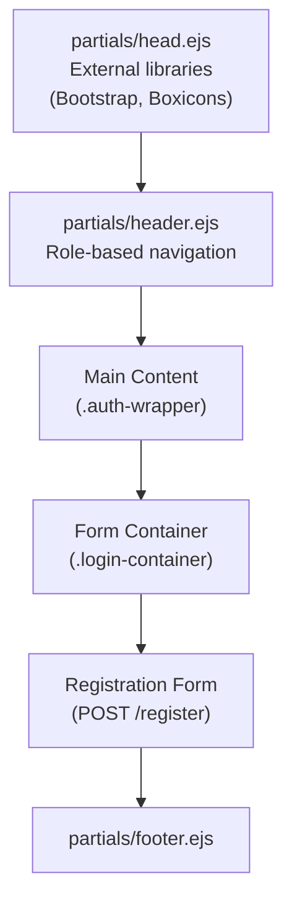
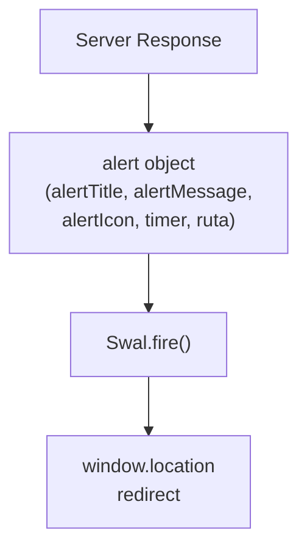
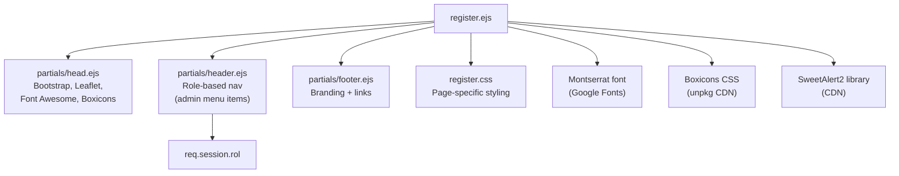

# Organizer Registration

> **Relevant source files**
> * [public/css/register.css](https://github.com/Lourdes12587/Proyecto-Node.js/blob/3a172be7/public/css/register.css)
> * [views/register.ejs](https://github.com/Lourdes12587/Proyecto-Node.js/blob/3a172be7/views/register.ejs)

## Purpose and Scope

This document describes the organizer registration interface and process, which allows existing administrators to create new organizer accounts. Organizers are admin users who can manage participants, select race winners, and perform other administrative functions within the HAPPY RUNNER 42K marathon management system.

For information about participant registration, see [Participant Registration Flow](/Lourdes12587/Proyecto-Node.js/4.1.2-registration-flow). For details about how organizer accounts authenticate, see [Login System](/Lourdes12587/Proyecto-Node.js/3.1-login-system). For an overview of all admin interfaces, see [Admin Interfaces](/Lourdes12587/Proyecto-Node.js/4.2-admin-interfaces).

**Sources:** [views/register.ejs L1-L72](https://github.com/Lourdes12587/Proyecto-Node.js/blob/3a172be7/views/register.ejs#L1-L72)

 [public/css/register.css L1-L179](https://github.com/Lourdes12587/Proyecto-Node.js/blob/3a172be7/public/css/register.css#L1-L179)

---

## Access Control

The organizer registration interface is protected by the `verifyAdmin` middleware, ensuring that only authenticated administrators can create new organizer accounts. This prevents unauthorized account creation and maintains the integrity of the admin user base.

| Aspect | Implementation |
| --- | --- |
| **Route Protection** | `verifyAdmin` middleware guard |
| **User Role Required** | `rol === "admin"` in session |
| **Access Denial Behavior** | Redirect to `/authadmin` or `/loginadmin` |
| **Session Validation** | JWT token verification via `process.env.JWT_SECRET` |

The registration form is rendered at the `/register` route (GET) and processes submissions at the same route (POST), both protected by admin authentication.

**Sources:** High-level architecture diagrams, authentication flow context

---

## Registration Interface

The organizer registration interface is implemented in `register.ejs` and styled by `register.css`. The page follows the same visual design language as other authentication pages (login.ejs, loginadmin.ejs), creating a cohesive user experience.

### Page Structure



**Sources:** [views/register.ejs L1-L72](https://github.com/Lourdes12587/Proyecto-Node.js/blob/3a172be7/views/register.ejs#L1-L72)

### Layout Components

The page uses the standard partial inclusion pattern:

| Component | Purpose | Location |
| --- | --- | --- |
| `partials/head` | Loads Bootstrap, Boxicons, Montserrat font | [views/register.ejs L1](https://github.com/Lourdes12587/Proyecto-Node.js/blob/3a172be7/views/register.ejs#L1-L1) |
| `partials/header` | Displays role-based navigation | [views/register.ejs L8](https://github.com/Lourdes12587/Proyecto-Node.js/blob/3a172be7/views/register.ejs#L8-L8) |
| `.auth-wrapper` | Centers form vertically and horizontally | [views/register.ejs L10](https://github.com/Lourdes12587/Proyecto-Node.js/blob/3a172be7/views/register.ejs#L10-L10) |
| `.login-container` | Form container with styling | [views/register.ejs L11](https://github.com/Lourdes12587/Proyecto-Node.js/blob/3a172be7/views/register.ejs#L11-L11) |
| `partials/footer` | Footer with branding | [views/register.ejs L70](https://github.com/Lourdes12587/Proyecto-Node.js/blob/3a172be7/views/register.ejs#L70-L70) |

The `.auth-wrapper` uses flexbox to center the form both horizontally and vertically, with `min-height: calc(100vh - 150px)` accounting for header and footer space [public/css/register.css L28-L34](https://github.com/Lourdes12587/Proyecto-Node.js/blob/3a172be7/public/css/register.css#L28-L34)

**Sources:** [views/register.ejs L1-L10](https://github.com/Lourdes12587/Proyecto-Node.js/blob/3a172be7/views/register.ejs#L1-L10)

 [public/css/register.css L28-L46](https://github.com/Lourdes12587/Proyecto-Node.js/blob/3a172be7/public/css/register.css#L28-L46)

---

## Form Fields and Validation

The registration form collects three fields to create a new organizer account. The form uses `novalidate` to bypass browser validation in favor of server-side validation with `express-validator` [views/register.ejs L15](https://github.com/Lourdes12587/Proyecto-Node.js/blob/3a172be7/views/register.ejs#L15-L15)

### Field Schema

| Field Name | Input Type | HTML `name` | Placeholder | Required | Description |
| --- | --- | --- | --- | --- | --- |
| **Usuario** | `text` | `user` | "Ingrese su usuario" | Yes | Unique username for login |
| **Nombre** | `text` | `nombre` | "Ingrese su nombre" | Yes | Display name for the organizer |
| **Contraseña** | `password` | `password` | "Ingrese su contraseña" | Yes | Password (stored as bcrypt hash) |

**Sources:** [views/register.ejs L15-L28](https://github.com/Lourdes12587/Proyecto-Node.js/blob/3a172be7/views/register.ejs#L15-L28)

### Form Persistence

The form implements value persistence on validation failure. When server-side validation fails, the form re-renders with previously submitted values pre-populated using the `valores` object:

```
value="<% if (typeof valores !== 'undefined') { %><%= valores.user %><% } %>"
```

This pattern is applied to all three input fields [views/register.ejs L18](https://github.com/Lourdes12587/Proyecto-Node.js/blob/3a172be7/views/register.ejs#L18-L18)

 [views/register.ejs L22](https://github.com/Lourdes12587/Proyecto-Node.js/blob/3a172be7/views/register.ejs#L22-L22)

 [views/register.ejs L26](https://github.com/Lourdes12587/Proyecto-Node.js/blob/3a172be7/views/register.ejs#L26-L26)

 preventing users from re-entering information after validation errors.

**Sources:** [views/register.ejs L16-L26](https://github.com/Lourdes12587/Proyecto-Node.js/blob/3a172be7/views/register.ejs#L16-L26)

### Validation Error Display

Server-side validation errors from `express-validator` are displayed below the form using the `validaciones` array. Each validation error appears in a styled `.form-alert` container:

```javascript
<% if (typeof validaciones !== 'undefined') { %>
  <div class="validation-list" aria-live="polite">
    <% validaciones.forEach(v => { %>
      <div class="form-alert"><strong><%= v.msg %></strong></div>
    <% }) %>
  </div>
<% } %>
```

The validation display includes ARIA live region attributes for accessibility [views/register.ejs L30-L37](https://github.com/Lourdes12587/Proyecto-Node.js/blob/3a172be7/views/register.ejs#L30-L37)

**Sources:** [views/register.ejs L30-L38](https://github.com/Lourdes12587/Proyecto-Node.js/blob/3a172be7/views/register.ejs#L30-L38)

 [public/css/register.css L115-L125](https://github.com/Lourdes12587/Proyecto-Node.js/blob/3a172be7/public/css/register.css#L115-L125)

---

## Request Flow and Data Processing

The following diagram illustrates the complete flow from form submission to database persistence and user feedback.

### Registration Process Flow

```mermaid
sequenceDiagram
  participant Browser
  participant Express Server
  participant verifyAdmin
  participant Middleware
  participant /register
  participant Route Handler
  participant express-validator
  participant bcrypt
  participant organizadores
  participant Table

  Browser->>Express Server: "GET /register"
  Express Server->>verifyAdmin: "Check admin session"
  loop ["Not Admin"]
    verifyAdmin-->>Browser: "Redirect /authadmin"
    verifyAdmin->>/register: "Proceed"
    /register-->>Browser: "Render register.ejs"
    Browser->>Express Server: "POST /register
    Express Server->>verifyAdmin: (user, nombre, password)"
    verifyAdmin->>express-validator: "Verify admin token"
    express-validator->>/register: "Validate fields"
    /register-->>Browser: "validaciones array"
    express-validator->>/register: "Re-render with errors
    /register->>organizadores: (valores, validaciones)"
    organizadores-->>/register: "Fields valid"
    /register-->>Browser: "SELECT user=?"
    organizadores-->>/register: "Duplicate found"
    /register->>bcrypt: "SweetAlert error
    bcrypt-->>/register: (alert object)"
    /register->>organizadores: "No duplicate"
    organizadores-->>/register: "Hash password"
    /register-->>Browser: "Hashed password"
  end
```

**Sources:** [views/register.ejs L15-L67](https://github.com/Lourdes12587/Proyecto-Node.js/blob/3a172be7/views/register.ejs#L15-L67)

 authentication flow context

### Database Operations

The registration process interacts with the `organizadores` table:

| Operation | SQL Pattern | Purpose |
| --- | --- | --- |
| **Duplicate Check** | `SELECT * FROM organizadores WHERE user = ?` | Prevent duplicate usernames |
| **Insert Record** | `INSERT INTO organizadores (user, nombre, password) VALUES (?, ?, ?)` | Create new organizer account |
| **Password Storage** | Bcrypt hash (not plaintext) | Secure password storage |

**Sources:** Database layer context from high-level diagrams

---

## Visual Design System

The registration page follows the application's established design system, utilizing CSS custom properties defined at the root level.

### Color Palette

```css
:root {
  --lapis-lazuli: #2f6690ff;
  --cerulean:     #3a7ca5ff;
  --platinum:     #d9dcd6ff;
  --indigo-dye:   #16425bff;
  --sky-blue:     #81c3d7ff;
  --white: #ffffff;
  --muted-shadow: rgba(22,66,91,0.08);
}
```

These tokens ensure visual consistency across all authentication interfaces [public/css/register.css L1-L9](https://github.com/Lourdes12587/Proyecto-Node.js/blob/3a172be7/public/css/register.css#L1-L9)

### Form Container Styling

| CSS Class | Purpose | Key Properties |
| --- | --- | --- |
| `.auth-wrapper` | Vertical/horizontal centering | `display: flex; align-items: center; justify-content: center` |
| `.login-container` | Form card container | `max-width: 420px; border-radius: 14px; box-shadow: 0 10px 30px` |
| `.cta-btn` | Submit button | `background: linear-gradient(90deg, var(--lapis-lazuli), var(--cerulean))` |

The `.login-container` class is reused from the login interfaces, maintaining visual consistency [public/css/register.css L37-L46](https://github.com/Lourdes12587/Proyecto-Node.js/blob/3a172be7/public/css/register.css#L37-L46)

**Sources:** [public/css/register.css L1-L109](https://github.com/Lourdes12587/Proyecto-Node.js/blob/3a172be7/public/css/register.css#L1-L109)

### Input Interaction States

Input fields feature enhanced interaction feedback:

```css
.login-container input:focus {
  border-color: var(--cerulean);
  box-shadow: 0 8px 22px rgba(58,124,165,0.10);
  transform: translateY(-1px);
}
```

The focus state includes border color change, shadow elevation, and subtle upward translation [public/css/register.css L87-L91](https://github.com/Lourdes12587/Proyecto-Node.js/blob/3a172be7/public/css/register.css#L87-L91)

### Responsive Behavior

The interface adapts for mobile devices at the 480px breakpoint:

| Element | Desktop | Mobile (<480px) |
| --- | --- | --- |
| `.auth-wrapper` padding | `48px 16px` | `28px 12px` |
| `.login-container` max-width | `420px` | `360px` |
| `.login-container` padding | `28px 22px` | `20px 14px` |
| Title font size | `1.4rem` | `1.2rem` |

**Sources:** [public/css/register.css L160-L166](https://github.com/Lourdes12587/Proyecto-Node.js/blob/3a172be7/public/css/register.css#L160-L166)

---

## Success and Error Feedback

The registration process uses SweetAlert2 for user feedback, providing visual confirmation of success or detailed error messages.

### Alert Configuration



**Sources:** [views/register.ejs L44-L67](https://github.com/Lourdes12587/Proyecto-Node.js/blob/3a172be7/views/register.ejs#L44-L67)

### Alert Object Structure

The server passes an `alert` object to the view when rendering feedback:

| Property | Purpose | Example Values |
| --- | --- | --- |
| `alert` | Boolean flag | `true` (show alert), `undefined` (no alert) |
| `alertTitle` | Alert heading | "REGISTRO EXITOSO", "ERROR" |
| `alertMessage` | Detailed message | "El usuario ya existe" |
| `alertIcon` | SweetAlert icon type | "success", "error", "warning" |
| `timer` | Auto-close timer (ms) | `3000`, `false` |
| `showConfirmButton` | Display confirm button | `true`, `false` |
| `ruta` | Redirect path after alert | `"admin"`, `"register"` |

**Sources:** [views/register.ejs L44-L67](https://github.com/Lourdes12587/Proyecto-Node.js/blob/3a172be7/views/register.ejs#L44-L67)

### Alert Styling Customization

SweetAlert2 popups are customized to match the application's color scheme:

```css
Swal.fire({
  background: 'linear-gradient(135deg, #2f6690ff, #3a7ca5ff)', // lapis-lazuli to cerulean
  color: '#ffffff',
  iconColor: '#81c3d7ff', // sky-blue
  confirmButtonColor: '#16425bff', // indigo-dye
  customClass: {
    popup: 'swal2-border-rounded',
    title: 'swal2-title-custom',
    content: 'swal2-content-custom'
  }
})
```

Custom CSS classes provide additional styling [public/css/register.css L128-L157](https://github.com/Lourdes12587/Proyecto-Node.js/blob/3a172be7/public/css/register.css#L128-L157)

 including rounded borders, custom font families, and shadow effects.

**Sources:** [views/register.ejs L46-L62](https://github.com/Lourdes12587/Proyecto-Node.js/blob/3a172be7/views/register.ejs#L46-L62)

 [public/css/register.css L140-L156](https://github.com/Lourdes12587/Proyecto-Node.js/blob/3a172be7/public/css/register.css#L140-L156)

### Post-Alert Navigation

After the alert closes (either automatically via timer or user confirmation), the page redirects to the specified `ruta`:

```javascript
.then(() => {
  window.location = '/<%= ruta %>';
});
```

Successful registrations typically redirect to `/admin`, while errors may remain on `/register` [views/register.ejs L63-L65](https://github.com/Lourdes12587/Proyecto-Node.js/blob/3a172be7/views/register.ejs#L63-L65)

**Sources:** [views/register.ejs L63-L65](https://github.com/Lourdes12587/Proyecto-Node.js/blob/3a172be7/views/register.ejs#L63-L65)

---

## Typography and Fonts

The registration page explicitly loads the Montserrat font family from Google Fonts:

```
<link href="https://fonts.googleapis.com/css2?family=Montserrat:wght@400;600;800&display=swap" rel="stylesheet">
```

Font weights used:

* **400**: Regular body text
* **600**: Labels and helper text
* **800**: Headings and button text

The Montserrat font is applied globally to the `body` element with fallbacks: `"Montserrat", system-ui, -apple-system, "Segoe UI", Roboto, "Helvetica Neue", Arial` [public/css/register.css L16](https://github.com/Lourdes12587/Proyecto-Node.js/blob/3a172be7/public/css/register.css#L16-L16)

**Sources:** [views/register.ejs L4](https://github.com/Lourdes12587/Proyecto-Node.js/blob/3a172be7/views/register.ejs#L4-L4)

 [public/css/register.css L14-L22](https://github.com/Lourdes12587/Proyecto-Node.js/blob/3a172be7/public/css/register.css#L14-L22)

---

## Integration with Shared Components

The registration page integrates with the application's shared partial system, ensuring consistent navigation and layout.

### Component Diagram



**Sources:** [views/register.ejs L1-L72](https://github.com/Lourdes12587/Proyecto-Node.js/blob/3a172be7/views/register.ejs#L1-L72)

### Header Navigation Context

The `header.ejs` partial adjusts navigation items based on `res.locals.rol`, which is populated from `req.session.rol`. For admin users accessing `/register`, the header displays admin-appropriate navigation options (participant management, winner management, logout).

**Sources:** [views/register.ejs L8](https://github.com/Lourdes12587/Proyecto-Node.js/blob/3a172be7/views/register.ejs#L8-L8)

 header component context

---

## Security Considerations

### Authentication Layer

* **Pre-condition**: User must be authenticated as admin before accessing `/register` routes
* **Middleware**: `verifyAdmin` validates JWT token from cookies
* **Session validation**: Checks `req.session.rol === "admin"`
* **Token source**: `JWT_SECRET` environment variable

### Password Security

* **Hashing algorithm**: bcrypt
* **Storage**: Password hashes stored in `organizadores.password` column
* **Plain text**: Never stored or transmitted after form submission

### Duplicate Prevention

The route handler queries the database before insertion to prevent duplicate usernames:

```sql
SELECT * FROM organizadores WHERE user = ?
```

If a match is found, the registration is rejected with an error alert.

**Sources:** Authentication flow context, database operations from high-level diagrams

---

## File Structure Summary

| File | Purpose | Lines of Code |
| --- | --- | --- |
| `views/register.ejs` | Registration form template | 72 |
| `public/css/register.css` | Page-specific styling | 179 |

Both files work together to provide the complete organizer registration experience, from visual presentation to form submission and feedback handling.

**Sources:** [views/register.ejs L1-L72](https://github.com/Lourdes12587/Proyecto-Node.js/blob/3a172be7/views/register.ejs#L1-L72)

 [public/css/register.css L1-L179](https://github.com/Lourdes12587/Proyecto-Node.js/blob/3a172be7/public/css/register.css#L1-L179)