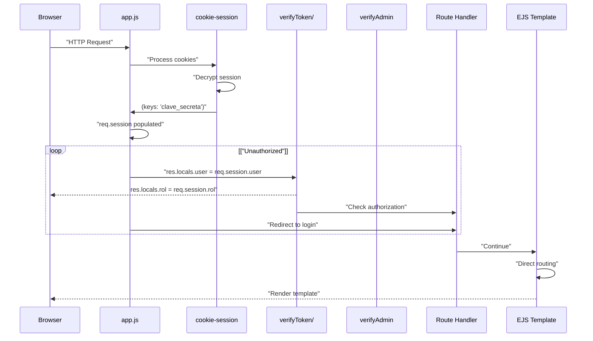

# Overview

> **Relevant source files**
> * [app.js](https://github.com/Lourdes12587/Proyecto-Node.js/blob/3a172be7/app.js)
> * [views/index.ejs](https://github.com/Lourdes12587/Proyecto-Node.js/blob/3a172be7/views/index.ejs)
> * [views/partials/header.ejs](https://github.com/Lourdes12587/Proyecto-Node.js/blob/3a172be7/views/partials/header.ejs)

## Purpose and Scope

This document provides a high-level overview of the HAPPY RUNNER 42K marathon management application. It introduces the system's purpose, technology stack, architectural organization, and core user roles. For detailed information about specific subsystems, see the following related pages:

* Authentication mechanisms: [Authentication & Authorization](/Lourdes12587/Proyecto-Node.js/3-authentication-and-authorization)
* User interface components: [User Interfaces](/Lourdes12587/Proyecto-Node.js/4-user-interfaces)
* Data handling and storage: [Data Management](/Lourdes12587/Proyecto-Node.js/6-data-management)
* Application server configuration: [Application Server](/Lourdes12587/Proyecto-Node.js/2.1-application-server)

---

## System Purpose

HAPPY RUNNER 42K is a web-based marathon event management system designed to handle participant registration and administrative operations for a 42-kilometer running event in Barcelona. The system serves two distinct user populations:

**Participants** can:

* Discover event information (date, location, race route)
* Register for the marathon with photo upload
* Manage their personal profile and registration data
* View event details and winner announcements

**Administrators** can:

* View and manage all participant registrations
* Edit or delete participant records
* Select and announce race winners (1st, 2nd, 3rd place)
* Register additional organizer accounts
* Upload winner-specific photos

The application implements role-based access control to enforce separation between public content, participant-only features, and administrator-only operations.

**Sources:** [app.js L1-L47](https://github.com/Lourdes12587/Proyecto-Node.js/blob/3a172be7/app.js#L1-L47)

 [views/partials/header.ejs L1-L33](https://github.com/Lourdes12587/Proyecto-Node.js/blob/3a172be7/views/partials/header.ejs#L1-L33)

 [views/index.ejs L1-L119](https://github.com/Lourdes12587/Proyecto-Node.js/blob/3a172be7/views/index.ejs#L1-L119)

---

## Technology Stack

The application is built using the following core technologies and dependencies:

| Category | Technology | Purpose |
| --- | --- | --- |
| **Runtime** | Node.js | Server-side JavaScript execution |
| **Web Framework** | Express.js | HTTP server and routing |
| **Template Engine** | EJS | Server-side HTML rendering |
| **Database** | MySQL | Relational data storage |
| **Session Management** | `cookie-session` | Stateless encrypted cookies |
| **Authentication** | JWT (JSON Web Tokens) | Token-based authentication |
| **Password Security** | `bcryptjs` | Password hashing and comparison |
| **File Upload** | `multer` | Multipart form data handling |
| **Frontend Framework** | Bootstrap 5 | Responsive UI components |
| **Mapping** | Leaflet.js | Interactive race route maps |
| **Icons** | Font Awesome, Boxicons | UI iconography |

**Sources:** [app.js L1-L11](https://github.com/Lourdes12587/Proyecto-Node.js/blob/3a172be7/app.js#L1-L11)

---

## Application Structure

### System Component Map

The following diagram shows the primary components of the system and their relationships, using actual file paths and code entities from the codebase:

```mermaid
flowchart TD

AppJS["app.js<br>(Express server)"]
IndexRouter["/src/routers/index.js"]
AuthRouter["/src/routers/auth.js"]
ParticipanteRouter["/src/routers/participante.js"]
AdminRouter["/src/routers/admin.js"]
GanadoresRouter["/src/routers/ganadores.js"]
VerifyToken["verifyToken<br>(JWT validation)"]
VerifyAdmin["verifyAdmin<br>(role check)"]
MulterUpload["multer<br>(file upload)"]
CookieSession["cookie-session<br>(session mgmt)"]
AuthController["authcontroller.js"]
UpdateController["updateParticipante.js"]
IndexEJS["views/index.ejs"]
LoginEJS["views/login.ejs"]
InscripcionEJS["views/inscripcion.ejs"]
PerfilEJS["views/perfil.ejs"]
AdminEJS["views/admin.ejs"]
InfoEJS["views/info.ejs"]
Partials["views/partials/<br>head, header, footer"]
CSS["public/css/*.css"]
Images["public/img/"]
Uploads["public/uploads/participantes/"]
DB["MySQL Database<br>participantes<br>organizadores<br>ganadores"]

AppJS --> IndexRouter
AppJS --> AuthRouter
AppJS --> ParticipanteRouter
AppJS --> AdminRouter
AppJS --> GanadoresRouter
AppJS --> CookieSession
IndexRouter --> IndexEJS
IndexRouter --> InfoEJS
AuthRouter --> AuthController
AuthController --> DB
ParticipanteRouter --> VerifyToken
ParticipanteRouter --> MulterUpload
ParticipanteRouter --> UpdateController
ParticipanteRouter --> InscripcionEJS
ParticipanteRouter --> PerfilEJS
AdminRouter --> VerifyAdmin
AdminRouter --> AdminEJS
GanadoresRouter --> VerifyAdmin
UpdateController --> DB
IndexEJS --> CSS
InscripcionEJS --> CSS
PerfilEJS --> CSS
AdminEJS --> CSS
IndexEJS --> Images
MulterUpload --> Uploads

subgraph subGraph6 ["Data Layer"]
    DB
end

subgraph subGraph5 ["Static Assets"]
    CSS
    Images
    Uploads
end

subgraph Views ["Views"]
    IndexEJS
    LoginEJS
    InscripcionEJS
    PerfilEJS
    AdminEJS
    InfoEJS
    Partials
    IndexEJS --> Partials
    LoginEJS --> Partials
    InscripcionEJS --> Partials
    PerfilEJS --> Partials
    AdminEJS --> Partials
    InfoEJS --> Partials
end

subgraph Controllers ["Controllers"]
    AuthController
    UpdateController
end

subgraph Middleware ["Middleware"]
    VerifyToken
    VerifyAdmin
    MulterUpload
    CookieSession
end

subgraph subGraph1 ["Routing Layer"]
    IndexRouter
    AuthRouter
    ParticipanteRouter
    AdminRouter
    GanadoresRouter
end

subgraph subGraph0 ["Entry Point"]
    AppJS
end
```



The system follows a layered architecture where [app.js L1-L47](https://github.com/Lourdes12587/Proyecto-Node.js/blob/3a172be7/app.js#L1-L47)

 serves as the central entry point, delegating to five specialized router modules. Each router handles a specific domain:

* **index.js**: Public pages (landing, event info)
* **auth.js**: Authentication endpoints (login, logout)
* **participante.js**: Participant operations (registration, profile editing)
* **admin.js**: Administrator operations (participant management)
* **ganadores.js**: Winner management operations

**Sources:** [app.js L40-L44](https://github.com/Lourdes12587/Proyecto-Node.js/blob/3a172be7/app.js#L40-L44)

---

## Core User Roles and Access Patterns

### Role-Based Route Mapping

The following diagram illustrates how user roles map to specific routes, middleware guards, and views:

```mermaid
flowchart TD

Public["Unauthenticated<br>Users"]
Participant["Authenticated<br>rol='participante'"]
Admin["Authenticated<br>rol='admin'"]
RouteIndex["GET /<br>(index.ejs)"]
RouteInfo["GET /info<br>(info.ejs)"]
RouteInscripcion["GET /inscripcion<br>(inscripcion.ejs)"]
RouteLogin["GET /login<br>(login.ejs)"]
RouteLoginAdmin["GET /loginadmin<br>(loginadmin.ejs)"]
RoutePerfil["GET /perfil<br>(perfil.ejs)<br>via verifyToken"]
RouteEdit["GET /edit<br>(edit.ejs)<br>via verifyToken"]
RouteUpdate["POST /update<br>via updateParticipante"]
RouteAdmin["GET /admin<br>(admin.ejs)<br>via verifyAdmin"]
RouteEditAdmin["GET /editadmin/:id<br>via verifyAdmin"]
RouteDelete["GET /delete/:id<br>via verifyAdmin"]
RouteRegister["GET /register<br>(register.ejs)<br>via verifyAdmin"]
RouteGanadores["ganadores routes<br>via verifyAdmin"]

Public --> RouteIndex
Public --> RouteInfo
Public --> RouteInscripcion
Public --> RouteLogin
Public --> RouteLoginAdmin
Participant --> RoutePerfil
Participant --> RouteEdit
Participant --> RouteUpdate
Admin --> RouteAdmin
Admin --> RouteEditAdmin
Admin --> RouteDelete
Admin --> RouteRegister
Admin --> RouteGanadores

subgraph subGraph5 ["Admin Routes"]
    RouteAdmin
    RouteEditAdmin
    RouteDelete
    RouteRegister
    RouteGanadores
end

subgraph subGraph4 ["Participant Routes"]
    RoutePerfil
    RouteEdit
    RouteUpdate
end

subgraph subGraph3 ["Public Routes"]
    RouteIndex
    RouteInfo
    RouteInscripcion
    RouteLogin
    RouteLoginAdmin
end

subgraph subGraph2 ["Admin Role"]
    Admin
end

subgraph subGraph1 ["Participant Role"]
    Participant
end

subgraph subGraph0 ["Public Access"]
    Public
end
```



### Role Determination

User roles are established during the authentication process and stored in the session:

1. **Unauthenticated users** access public routes without restriction
2. **Participants** authenticate via `POST /auth` with DNI credentials, receiving `rol='participante'` in session
3. **Administrators** authenticate via `POST /authadmin` with username credentials, receiving `rol='admin'` in session

The session data is made globally available to all views through middleware in [app.js L22-L26](https://github.com/Lourdes12587/Proyecto-Node.js/blob/3a172be7/app.js#L22-L26)

 which populates `res.locals.user` and `res.locals.rol`. This enables the header navigation in [views/partials/header.ejs L18-L30](https://github.com/Lourdes12587/Proyecto-Node.js/blob/3a172be7/views/partials/header.ejs#L18-L30)

 to dynamically display role-appropriate menu items:

* **Lines 18-21**: Unauthenticated users see registration, participant login, and admin login
* **Lines 22-24**: Participants see profile link and logout
* **Lines 25-29**: Admins see organizer registration, admin panel, winner management, and logout

**Sources:** [app.js L22-L26](https://github.com/Lourdes12587/Proyecto-Node.js/blob/3a172be7/app.js#L22-L26)

 [views/partials/header.ejs L18-L30](https://github.com/Lourdes12587/Proyecto-Node.js/blob/3a172be7/views/partials/header.ejs#L18-L30)

---

## Request Lifecycle Overview

### Typical Request Flow



The request lifecycle follows these stages:

1. **Session Decryption**: [app.js L12-L16](https://github.com/Lourdes12587/Proyecto-Node.js/blob/3a172be7/app.js#L12-L16)  configures `cookie-session` with a 24-hour `maxAge` and secret key `'clave_secreta'`
2. **Local Variables Population**: [app.js L22-L26](https://github.com/Lourdes12587/Proyecto-Node.js/blob/3a172be7/app.js#L22-L26)  extracts session data into `res.locals` for view access
3. **Authorization Check**: Protected routes pass through `verifyToken` or `verifyAdmin` middleware
4. **Route Handling**: Request reaches the appropriate router module
5. **View Rendering**: EJS templates render with access to session data via `user` and `rol` variables

**Sources:** [app.js L12-L26](https://github.com/Lourdes12587/Proyecto-Node.js/blob/3a172be7/app.js#L12-L26)

---

## Key Subsystems

The application is organized into several interconnected subsystems:

| Subsystem | Description | Documentation |
| --- | --- | --- |
| **Authentication** | Dual login system (DNI-based for participants, username-based for admins), JWT tokens, bcrypt password hashing | [Authentication & Authorization](/Lourdes12587/Proyecto-Node.js/3-authentication-and-authorization) |
| **Session Management** | Cookie-based sessions with 24-hour expiration, role storage | [Session Management](/Lourdes12587/Proyecto-Node.js/3.3-session-management) |
| **Authorization** | Role-based access control via `verifyToken` and `verifyAdmin` middleware | [Role-Based Access Control](/Lourdes12587/Proyecto-Node.js/3.2-role-based-access-control) |
| **Participant Registration** | Form handling, photo upload via multer, database insertion | [Registration Flow](/Lourdes12587/Proyecto-Node.js/4.1.2-registration-flow) |
| **Profile Management** | View and edit participant data, update controller | [Profile Management](/Lourdes12587/Proyecto-Node.js/4.1.3-profile-management) |
| **Admin Panel** | Participant list with search, edit, and delete operations | [Admin Panel](/Lourdes12587/Proyecto-Node.js/4.2.1-admin-panel) |
| **Winner Management** | Select winners from participant pool, upload winner photos | [Winner Management](/Lourdes12587/Proyecto-Node.js/4.2.2-winner-management) |
| **File Upload** | Multer-based photo upload with timestamp naming | [File Upload System](/Lourdes12587/Proyecto-Node.js/6.2-file-upload-system) |
| **View Rendering** | EJS templating with shared partials (head, header, footer) | [Shared Components](/Lourdes12587/Proyecto-Node.js/4.3-shared-components) |
| **Static Asset Serving** | CSS, images, and uploaded files via Express static middleware | [Application Server](/Lourdes12587/Proyecto-Node.js/2.1-application-server) |

**Sources:** [app.js L1-L47](https://github.com/Lourdes12587/Proyecto-Node.js/blob/3a172be7/app.js#L1-L47)

 [views/partials/header.ejs L1-L33](https://github.com/Lourdes12587/Proyecto-Node.js/blob/3a172be7/views/partials/header.ejs#L1-L33)

---

## Directory Structure

```sql
proyecto-node.js/
├── app.js                          # Express server entry point
├── env/
│   └── .env                        # Environment variables (JWT_SECRET, DB config)
├── src/
│   ├── routers/
│   │   ├── index.js                # Public routes (/, /info)
│   │   ├── auth.js                 # Authentication routes
│   │   ├── participante.js         # Participant routes (protected)
│   │   ├── admin.js                # Admin routes (protected)
│   │   └── ganadores.js            # Winner management routes (protected)
│   ├── middlewares/
│   │   ├── verifyToken.js          # JWT verification middleware
│   │   └── verifyAdmin.js          # Admin role verification middleware
│   └── controllers/
│       ├── authcontroller.js       # Login/logout logic
│       └── updateParticipante.js   # Update participant data
├── views/
│   ├── partials/
│   │   ├── head.ejs                # HTML head with external libraries
│   │   ├── header.ejs              # Navigation with role-based menu
│   │   └── footer.ejs              # Page footer
│   ├── index.ejs                   # Landing page
│   ├── info.ejs                    # Event info and winners
│   ├── inscripcion.ejs             # Registration form
│   ├── login.ejs                   # Participant login
│   ├── loginadmin.ejs              # Admin login
│   ├── perfil.ejs                  # Participant profile view
│   ├── edit.ejs                    # Participant profile edit
│   ├── admin.ejs                   # Admin participant management
│   └── register.ejs                # Organizer registration
├── public/
│   ├── css/                        # Page-specific stylesheets
│   ├── img/                        # Static images
│   └── uploads/
│       └── participantes/          # Uploaded participant photos
└── package.json                    # Node.js dependencies
```

**Sources:** [app.js L32-L44](https://github.com/Lourdes12587/Proyecto-Node.js/blob/3a172be7/app.js#L32-L44)

 [views/index.ejs L1](https://github.com/Lourdes12587/Proyecto-Node.js/blob/3a172be7/views/index.ejs#L1-L1)

 [views/partials/header.ejs L1](https://github.com/Lourdes12587/Proyecto-Node.js/blob/3a172be7/views/partials/header.ejs#L1-L1)

---

## Navigation Flow

The following table summarizes the primary navigation paths through the application:

| User Type | Entry Point | Available Actions | Protected By |
| --- | --- | --- | --- |
| **Anonymous** | `GET /` (landing page) | View event info, register, navigate to login | None |
| **Registering Participant** | `GET /inscripcion` | Fill form, upload photo, submit registration | None |
| **Participant Login** | `GET /login` → `POST /auth` | Enter DNI/password | None |
| **Authenticated Participant** | `GET /perfil` | View profile, edit data, logout | `verifyToken` |
| **Admin Login** | `GET /loginadmin` → `POST /authadmin` | Enter username/password | None |
| **Authenticated Admin** | `GET /admin` | View all participants, search, edit, delete, manage winners, register organizers | `verifyAdmin` |

**Sources:** [views/partials/header.ejs L16-L30](https://github.com/Lourdes12587/Proyecto-Node.js/blob/3a172be7/views/partials/header.ejs#L16-L30)

---

## External Dependencies

The application integrates several external services and libraries:

### Client-Side Libraries

Loaded via [views/partials/head.ejs](https://github.com/Lourdes12587/Proyecto-Node.js/blob/3a172be7/views/partials/head.ejs)

:

* **Bootstrap 5.3.0**: CSS framework for responsive design
* **Leaflet.js**: Interactive maps for displaying race routes
* **Font Awesome 6.4.0**: Icon library for UI elements
* **Boxicons 2.1.4**: Additional icon set for navigation

### Server-Side Packages

Key dependencies from `package.json`:

* **express**: Web application framework
* **ejs**: Embedded JavaScript templating
* **mysql**: Database driver for MySQL connections
* **bcryptjs**: Password hashing and verification
* **jsonwebtoken**: JWT creation and verification
* **cookie-session**: Session management via encrypted cookies
* **cookie-parser**: Cookie parsing middleware
* **multer**: File upload handling
* **dotenv**: Environment variable management

**Sources:** [app.js L1-L11](https://github.com/Lourdes12587/Proyecto-Node.js/blob/3a172be7/app.js#L1-L11)

---

## Database Schema Overview

The application uses three primary MySQL tables:

| Table | Purpose | Key Fields |
| --- | --- | --- |
| **participantes** | Store registered participants | `id`, `nombre`, `apellido`, `dni`, `telefono`, `direccion`, `foto` |
| **organizadores** | Store admin/organizer accounts | `id`, `username`, `password` (bcrypt-hashed) |
| **ganadores** | Store race winners | `id`, `position` (1st/2nd/3rd), `participant_id` (FK), `foto` |

The `ganadores` table references `participantes` via foreign key, allowing admins to select winners from the existing participant pool. See [Participant Data](/Lourdes12587/Proyecto-Node.js/6.1-participant-data) for detailed schema information.

**Sources:** Based on authentication and data management flows described in architecture diagrams.

---

## Summary

HAPPY RUNNER 42K is a full-stack web application that demonstrates:

* **Clear separation of concerns** through modular routing and middleware
* **Role-based access control** with session-based authentication
* **File upload capabilities** for participant and winner photos
* **Responsive design** using Bootstrap and custom CSS
* **Interactive features** including Leaflet maps for race route visualization
* **Administrative tools** for participant management and winner selection

The system architecture prioritizes security through middleware guards, maintainability through modular code organization, and usability through role-specific interfaces. For detailed information on specific subsystems, consult the child pages listed in the table of contents.

**Sources:** [app.js L1-L47](https://github.com/Lourdes12587/Proyecto-Node.js/blob/3a172be7/app.js#L1-L47)

 [views/index.ejs L1-L119](https://github.com/Lourdes12587/Proyecto-Node.js/blob/3a172be7/views/index.ejs#L1-L119)

 [views/partials/header.ejs L1-L33](https://github.com/Lourdes12587/Proyecto-Node.js/blob/3a172be7/views/partials/header.ejs#L1-L33)