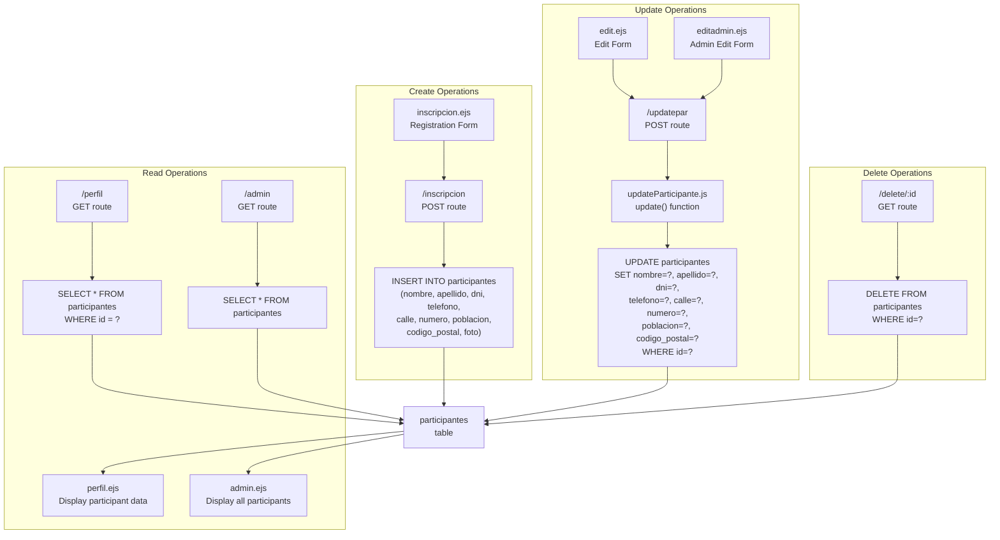

# Participant Data

> **Relevant source files**
> * [controllers/updateParticipante.js](https://github.com/Lourdes12587/Proyecto-Node.js/blob/3a172be7/controllers/updateParticipante.js)
> * [views/admin.ejs](https://github.com/Lourdes12587/Proyecto-Node.js/blob/3a172be7/views/admin.ejs)

## Purpose and Scope

This document describes the structure, storage, and manipulation of participant data in the HAPPY RUNNER 42K application. It covers the database schema for the `participantes` table, CRUD operations for participant records, and the `updateParticipante.js` controller responsible for data modifications.

For information about participant photo storage and file upload mechanics, see [File Upload System](/Lourdes12587/Proyecto-Node.js/6.2-file-upload-system). For details on how participant data is initially captured during registration, see [Registration Flow](/Lourdes12587/Proyecto-Node.js/4.1.2-registration-flow). For information on participant self-service interfaces, see [Profile Management](/Lourdes12587/Proyecto-Node.js/4.1.3-profile-management). For information on administrative participant management, see [Admin Panel](/Lourdes12587/Proyecto-Node.js/4.2.1-admin-panel).

---

## Data Structure

The `participantes` table stores all registered participant information. Each participant record contains identification data, contact information, and address details.

### Database Schema

The following table describes the fields stored in the `participantes` table:

| Field | Type | Purpose | Notes |
| --- | --- | --- | --- |
| `id` | Integer (PK) | Unique participant identifier | Auto-incrementing primary key; serves as dorsal number |
| `nombre` | String | First name | Required field |
| `apellido` | String | Last name | Required field |
| `dni` | String | National ID number | Unique identifier used for login authentication |
| `telefono` | String | Phone number | Contact information |
| `calle` | String | Street name | Address component |
| `numero` | String | Street number | Address component |
| `poblacion` | String | City/Town | Address component |
| `codigo_postal` | String | Postal code | Address component |
| `foto` | String | Photo filename | File path to participant photo in `public/uploads/participantes/` |

Sources: [views/admin.ejs L26-L49](https://github.com/Lourdes12587/Proyecto-Node.js/blob/3a172be7/views/admin.ejs#L26-L49)

 [controllers/updateParticipante.js L5-L9](https://github.com/Lourdes12587/Proyecto-Node.js/blob/3a172be7/controllers/updateParticipante.js#L5-L9)

### Participant Data Entity Model

```css
#mermaid-unausykavsk{font-family:ui-sans-serif,-apple-system,system-ui,Segoe UI,Helvetica;font-size:16px;fill:#333;}@keyframes edge-animation-frame{from{stroke-dashoffset:0;}}@keyframes dash{to{stroke-dashoffset:0;}}#mermaid-unausykavsk .edge-animation-slow{stroke-dasharray:9,5!important;stroke-dashoffset:900;animation:dash 50s linear infinite;stroke-linecap:round;}#mermaid-unausykavsk .edge-animation-fast{stroke-dasharray:9,5!important;stroke-dashoffset:900;animation:dash 20s linear infinite;stroke-linecap:round;}#mermaid-unausykavsk .error-icon{fill:#dddddd;}#mermaid-unausykavsk .error-text{fill:#222222;stroke:#222222;}#mermaid-unausykavsk .edge-thickness-normal{stroke-width:1px;}#mermaid-unausykavsk .edge-thickness-thick{stroke-width:3.5px;}#mermaid-unausykavsk .edge-pattern-solid{stroke-dasharray:0;}#mermaid-unausykavsk .edge-thickness-invisible{stroke-width:0;fill:none;}#mermaid-unausykavsk .edge-pattern-dashed{stroke-dasharray:3;}#mermaid-unausykavsk .edge-pattern-dotted{stroke-dasharray:2;}#mermaid-unausykavsk .marker{fill:#999;stroke:#999;}#mermaid-unausykavsk .marker.cross{stroke:#999;}#mermaid-unausykavsk svg{font-family:ui-sans-serif,-apple-system,system-ui,Segoe UI,Helvetica;font-size:16px;}#mermaid-unausykavsk p{margin:0;}#mermaid-unausykavsk .entityBox{fill:#ffffff;stroke:#dddddd;}#mermaid-unausykavsk .relationshipLabelBox{fill:#dddddd;opacity:0.7;background-color:#dddddd;}#mermaid-unausykavsk .relationshipLabelBox rect{opacity:0.5;}#mermaid-unausykavsk .labelBkg{background-color:rgba(221, 221, 221, 0.5);}#mermaid-unausykavsk .edgeLabel .label{fill:#dddddd;font-size:14px;}#mermaid-unausykavsk .label{font-family:ui-sans-serif,-apple-system,system-ui,Segoe UI,Helvetica;color:#333;}#mermaid-unausykavsk .edge-pattern-dashed{stroke-dasharray:8,8;}#mermaid-unausykavsk .node rect,#mermaid-unausykavsk .node circle,#mermaid-unausykavsk .node ellipse,#mermaid-unausykavsk .node polygon{fill:#ffffff;stroke:#dddddd;stroke-width:1px;}#mermaid-unausykavsk .relationshipLine{stroke:#999;stroke-width:1;fill:none;}#mermaid-unausykavsk .marker{fill:none!important;stroke:#999!important;stroke-width:1;}#mermaid-unausykavsk :root{--mermaid-font-family:"trebuchet ms",verdana,arial,sans-serif;}can_becomeparticipantesintidPKAuto-increment dorsal numberstringnombreFirst namestringapellidoLast namestringdniUKUnique login credentialstringtelefonoContact phonestringcalleStreet namestringnumeroStreet numberstringpoblacionCity/Townstringcodigo_postalPostal codestringfotoPhoto filename pathganadoresintidPKstringposition1st/2nd/3rdintparticipant_idFKstringfotoWinner photo path
```

**Diagram: Participant Entity Relationship**

The `participantes` table serves as the primary registry for all race participants. The `id` field doubles as the participant's dorsal/bib number for the race. The `dni` field is used as the unique login credential for participant authentication. The `foto` field stores the filename (not full path) of the uploaded participant photo. Participants can optionally be designated as winners, creating a relationship with the `ganadores` table.

Sources: [views/admin.ejs L26-L49](https://github.com/Lourdes12587/Proyecto-Node.js/blob/3a172be7/views/admin.ejs#L26-L49)

---

## CRUD Operations

Participant data undergoes four primary operations throughout its lifecycle: creation during registration, retrieval for display, modification through profile editing or admin actions, and deletion by administrators.

### CRUD Operation Flow



**Diagram: Participant Data CRUD Flow**

This diagram maps each CRUD operation to its specific route, view, and SQL query. Create operations occur through the `/inscripcion` POST route. Read operations happen via two routes: `/perfil` for individual participant data and `/admin` for all participants. Update operations funnel through the `updateParticipante.js` controller regardless of whether initiated by the participant or an administrator. Delete operations are accessible only via the `/delete/:id` route, which is restricted to administrators.

Sources: [controllers/updateParticipante.js L1-L19](https://github.com/Lourdes12587/Proyecto-Node.js/blob/3a172be7/controllers/updateParticipante.js#L1-L19)

 [views/admin.ejs L51-L56](https://github.com/Lourdes12587/Proyecto-Node.js/blob/3a172be7/views/admin.ejs#L51-L56)

### Create: Registration

New participant records are created during the registration process. The registration form captures all required fields and submits them to the `/inscripcion` POST route, which executes an `INSERT` query. The photo field is populated by the multer middleware during the registration process.

For detailed information about the registration flow and form validation, see [Registration Flow](/Lourdes12587/Proyecto-Node.js/4.1.2-registration-flow). For photo upload mechanics, see [File Upload System](/Lourdes12587/Proyecto-Node.js/6.2-file-upload-system).

### Read: Data Retrieval

Participant data is retrieved in two primary contexts:

1. **Individual Profile View**: The `/perfil` route executes a `SELECT` query filtered by the authenticated participant's `id` (stored in session). The query retrieves all fields for display in `perfil.ejs`.
2. **Admin Panel View**: The `/admin` route executes a `SELECT * FROM participantes` query to retrieve all registered participants. The data is rendered in `admin.ejs` with a searchable table interface.

The admin table displays all participant fields including the dorsal number (`id`), personal information (`nombre`, `apellido`, `dni`), contact details (`telefono`), and complete address breakdown (`calle`, `numero`, `poblacion`, `codigo_postal`).

Sources: [views/admin.ejs L38-L60](https://github.com/Lourdes12587/Proyecto-Node.js/blob/3a172be7/views/admin.ejs#L38-L60)

### Update: Data Modification

Participant data can be modified through two interfaces:

1. **Self-Service Editing**: Participants edit their own data via `edit.ejs`
2. **Administrative Editing**: Administrators edit any participant's data via `editadmin.ejs`

Both interfaces submit to the same `/updatepar` POST route, which delegates to the `updateParticipante.js` controller.

### Delete: Record Removal

Participant deletion is an administrative-only operation. The admin panel provides a delete button for each participant row at [views/admin.ejs L54-L56](https://github.com/Lourdes12587/Proyecto-Node.js/blob/3a172be7/views/admin.ejs#L54-L56)

 Clicking the delete button triggers a confirmation dialog and navigates to `/delete/:id`, which removes the record from the database.

Sources: [views/admin.ejs L54-L56](https://github.com/Lourdes12587/Proyecto-Node.js/blob/3a172be7/views/admin.ejs#L54-L56)

---

## updateParticipante Controller

The `updateParticipante.js` controller is responsible for processing participant data modifications. It receives form data, constructs an UPDATE query, and redirects to the profile page upon completion.

### Controller Function Signature

```javascript
exports.update = (req, res) => { ... }
```

The `update` function is the sole export from `updateParticipante.js`. It accepts Express request and response objects.

Sources: [controllers/updateParticipante.js L4](https://github.com/Lourdes12587/Proyecto-Node.js/blob/3a172be7/controllers/updateParticipante.js#L4-L4)

### Update Operation Sequence

```mermaid
sequenceDiagram
  participant edit.ejs or
  participant editadmin.ejs
  participant /updatepar
  participant POST route
  participant updateParticipante.js
  participant update()
  participant MySQL Database
  participant participantes table
  participant Browser
  participant Redirect

  edit.ejs or->>/updatepar: POST form data
  /updatepar->>updateParticipante.js: (id, nombre, apellido, dni,
  updateParticipante.js->>updateParticipante.js: telefono, calle, numero,
  updateParticipante.js->>MySQL Database: poblacion, codigo_postal)
  loop [Update Success]
    MySQL Database-->>updateParticipante.js: req.body with all fields
    updateParticipante.js->>updateParticipante.js: Extract fields from req.body
    updateParticipante.js->>Browser: UPDATE participantes
    MySQL Database-->>updateParticipante.js: SET fields WHERE id=?
    updateParticipante.js->>updateParticipante.js: Query result
    updateParticipante.js->>Browser: console.log("Datos actualizados correctamente")
  end
```

**Diagram: Update Operation Flow**

The update sequence begins when a user submits either the self-service edit form (`edit.ejs`) or admin edit form (`editadmin.ejs`). Both forms POST to `/updatepar`, passing all modifiable fields plus the participant `id`. The controller extracts these fields from `req.body` and constructs a parameterized SQL query. Regardless of success or failure, the controller redirects to `/perfil`, logging the outcome to the console.

Sources: [controllers/updateParticipante.js L1-L19](https://github.com/Lourdes12587/Proyecto-Node.js/blob/3a172be7/controllers/updateParticipante.js#L1-L19)

### Implementation Details

The controller implements the following logic:

1. **Field Extraction**: Destructures `id`, `nombre`, `apellido`, `dni`, `telefono`, `calle`, `numero`, `poblacion`, and `codigo_postal` from `req.body` at [controllers/updateParticipante.js L5](https://github.com/Lourdes12587/Proyecto-Node.js/blob/3a172be7/controllers/updateParticipante.js#L5-L5)
2. **Parameterized Query**: Constructs an UPDATE statement with positional placeholders (`?`) to prevent SQL injection at [controllers/updateParticipante.js L7-L9](https://github.com/Lourdes12587/Proyecto-Node.js/blob/3a172be7/controllers/updateParticipante.js#L7-L9)
3. **Field Order**: The query parameters are ordered: `nombre`, `apellido`, `dni`, `telefono`, `calle`, `numero`, `poblacion`, `codigo_postal`, `id` (WHERE clause)
4. **Error Handling**: Catches database errors and logs them with `console.error` at [controllers/updateParticipante.js L12](https://github.com/Lourdes12587/Proyecto-Node.js/blob/3a172be7/controllers/updateParticipante.js#L12-L12)
5. **Response**: Always redirects to `/perfil` regardless of operation outcome at [controllers/updateParticipante.js L13-L16](https://github.com/Lourdes12587/Proyecto-Node.js/blob/3a172be7/controllers/updateParticipante.js#L13-L16)

### Notable Behavior

* **Photo Field Exclusion**: The `foto` field is not included in the UPDATE query, meaning participant photos cannot be changed after initial registration. Photo updates would require separate file upload handling.
* **No Response Differentiation**: Both successful updates and errors result in a redirect to `/perfil`. Users do not receive explicit feedback about operation success or failure in the interface.
* **Unified Update Path**: There is no distinction between participant self-updates and admin updates at the controller level. Both use the same function and SQL query.

Sources: [controllers/updateParticipante.js L5-L18](https://github.com/Lourdes12587/Proyecto-Node.js/blob/3a172be7/controllers/updateParticipante.js#L5-L18)

---

## Data Access Patterns

The following table summarizes how different user roles access participant data:

| Operation | Role | Route | View | Access Control |
| --- | --- | --- | --- | --- |
| View Own Profile | Participant | `GET /perfil` | `perfil.ejs` | `verifyToken` middleware |
| Edit Own Profile | Participant | `GET /edit``POST /updatepar` | `edit.ejs` | `verifyToken` middleware |
| View All Participants | Admin | `GET /admin` | `admin.ejs` | `verifyAdmin` middleware |
| Edit Any Participant | Admin | `GET /editadmin/:id``POST /updatepar` | `editadmin.ejs` | `verifyAdmin` middleware |
| Delete Participant | Admin | `GET /delete/:id` | Redirect | `verifyAdmin` middleware |

Participants can only view and modify their own data. The system identifies "their own data" by matching the session's participant `id` with the database record. Administrators have full access to view, edit, and delete any participant record.

For details on authentication and authorization mechanisms, see [Role-Based Access Control](/Lourdes12587/Proyecto-Node.js/3.2-role-based-access-control).

Sources: [views/admin.ejs L51-L56](https://github.com/Lourdes12587/Proyecto-Node.js/blob/3a172be7/views/admin.ejs#L51-L56)

---

## Search and Filtering

The admin panel implements client-side search functionality for participant data. The search input filters the participant table based on user input.

### Client-Side Search Implementation

The search functionality is implemented in JavaScript embedded within `admin.ejs` at [views/admin.ejs L67-L78](https://github.com/Lourdes12587/Proyecto-Node.js/blob/3a172be7/views/admin.ejs#L67-L78)

 Key components:

* **Search Input**: HTML input with `id="searchInput"` at [views/admin.ejs L18](https://github.com/Lourdes12587/Proyecto-Node.js/blob/3a172be7/views/admin.ejs#L18-L18)
* **Target Table**: tbody with `id="participantesTable"` at [views/admin.ejs L38](https://github.com/Lourdes12587/Proyecto-Node.js/blob/3a172be7/views/admin.ejs#L38-L38)
* **Search Logic**: Filters table rows by checking if any cell text includes the search term

The search is case-insensitive and searches across all visible columns (dorsal number, name, surname, DNI, phone, and all address fields). Rows that don't match the search term are hidden using `row.style.display = 'none'`.

### Participant Count Badge

The admin panel displays a total participant count badge at [views/admin.ejs L19](https://github.com/Lourdes12587/Proyecto-Node.js/blob/3a172be7/views/admin.ejs#L19-L19)

 The count is calculated server-side using `<%= participantes.length %>`, showing the number of records returned by the database query. This count does not dynamically update as the client-side search filters rows.

Sources: [views/admin.ejs L18-L19](https://github.com/Lourdes12587/Proyecto-Node.js/blob/3a172be7/views/admin.ejs#L18-L19)

 [views/admin.ejs L67-L78](https://github.com/Lourdes12587/Proyecto-Node.js/blob/3a172be7/views/admin.ejs#L67-L78)

---

## Database Connection

All participant data operations use the MySQL database connection configured in the `db` module. The `updateParticipante.js` controller imports this connection at [controllers/updateParticipante.js L1](https://github.com/Lourdes12587/Proyecto-Node.js/blob/3a172be7/controllers/updateParticipante.js#L1-L1)

:

```javascript
const db = require("../config/db");
```

The `db` object provides the `query()` method used to execute SQL statements. For comprehensive information about database configuration and connection management, see [Database Layer](/Lourdes12587/Proyecto-Node.js/2.3-database-layer).

Sources: [controllers/updateParticipante.js L1](https://github.com/Lourdes12587/Proyecto-Node.js/blob/3a172be7/controllers/updateParticipante.js#L1-L1)