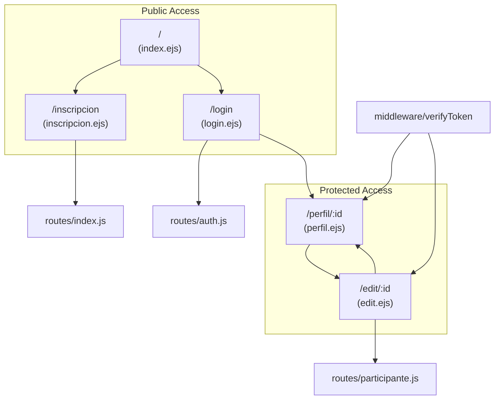
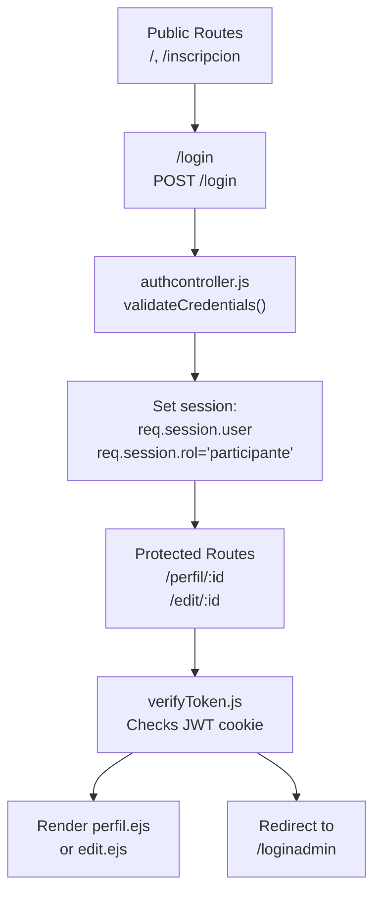
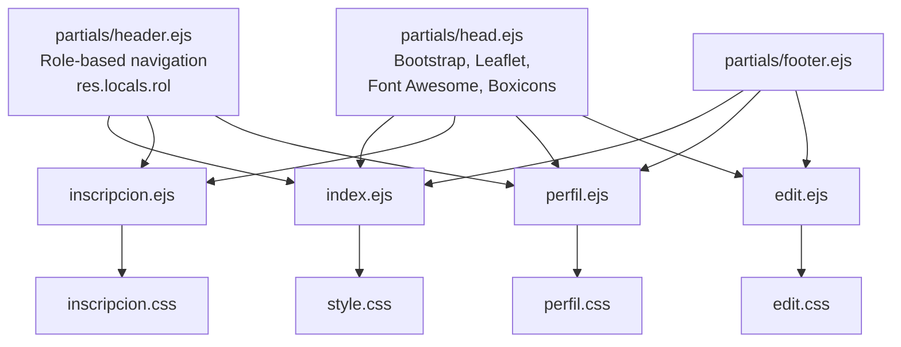
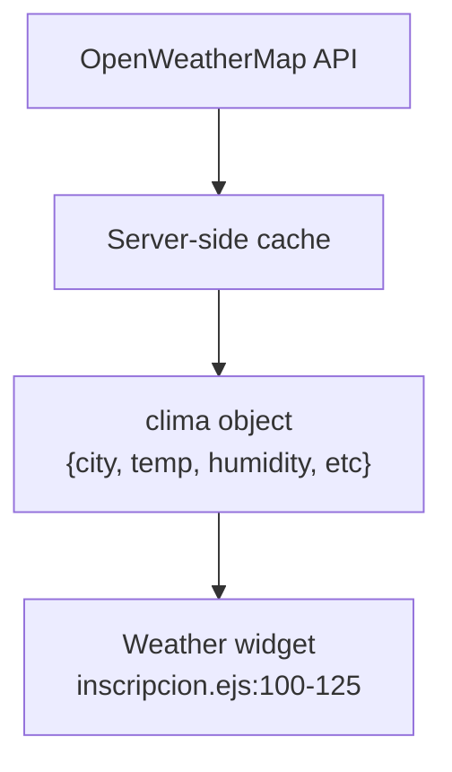

# Participant Interfaces

> **Relevant source files**
> * [views/index.ejs](https://github.com/Lourdes12587/Proyecto-Node.js/blob/3a172be7/views/index.ejs)
> * [views/inscripcion.ejs](https://github.com/Lourdes12587/Proyecto-Node.js/blob/3a172be7/views/inscripcion.ejs)
> * [views/perfil.ejs](https://github.com/Lourdes12587/Proyecto-Node.js/blob/3a172be7/views/perfil.ejs)

## Purpose and Scope

This document provides an overview of all user interfaces accessible to marathon participants in the HAPPY RUNNER 42K application. These interfaces enable participants to discover the event, register for the race, log in, and manage their profiles. For authentication mechanisms, see [Authentication & Authorization](/Lourdes12587/Proyecto-Node.js/3-authentication-and-authorization). For detailed information about individual interfaces, see [Landing Page](/Lourdes12587/Proyecto-Node.js/4.1.1-landing-page), [Registration Flow](/Lourdes12587/Proyecto-Node.js/4.1.2-registration-flow), and [Profile Management](/Lourdes12587/Proyecto-Node.js/4.1.3-profile-management). For administrator-only interfaces, see [Admin Interfaces](/Lourdes12587/Proyecto-Node.js/4.2-admin-interfaces).

## Interface Overview

The participant experience consists of three primary interfaces accessed through distinct routes:

| Interface | Route | View Template | Authentication Required | Primary Purpose |
| --- | --- | --- | --- | --- |
| Landing Page | `/` | `views/index.ejs` | No | Event discovery and information |
| Registration Form | `/inscripcion` | `views/inscripcion.ejs` | No | Participant registration and photo upload |
| Profile View | `/perfil/:id` | `views/perfil.ejs` | Yes (`verifyToken`) | Display participant data |
| Profile Edit | `/edit/:id` | `views/edit.ejs` | Yes (`verifyToken`) | Update participant information |

All participant interfaces follow a consistent template structure utilizing shared EJS partials defined in `views/partials/` and page-specific CSS files located in `public/resources/css/`.

## Navigation Flow and Route Architecture

The following diagram maps the complete participant journey through the application, showing actual route paths, view templates, and the authentication boundary:



**Sources:** [views/index.ejs L1-L118](https://github.com/Lourdes12587/Proyecto-Node.js/blob/3a172be7/views/index.ejs#L1-L118)

 [views/inscripcion.ejs L1-L161](https://github.com/Lourdes12587/Proyecto-Node.js/blob/3a172be7/views/inscripcion.ejs#L1-L161)

 [views/perfil.ejs L1-L33](https://github.com/Lourdes12587/Proyecto-Node.js/blob/3a172be7/views/perfil.ejs#L1-L33)

## Authentication Boundary

Participant interfaces are divided into public and protected sections. The authentication enforcement mechanism uses middleware guards and session validation:



The `verifyToken` middleware [middleware/verifyToken.js](https://github.com/Lourdes12587/Proyecto-Node.js/blob/3a172be7/middleware/verifyToken.js)

 checks for a valid JWT token in cookies and validates the user session. Upon successful authentication via `/login`, the system sets `req.session.rol = 'participante'` which distinguishes participant access from admin access.

**Sources:** [app.js](https://github.com/Lourdes12587/Proyecto-Node.js/blob/3a172be7/app.js)

 [middleware/verifyToken.js](https://github.com/Lourdes12587/Proyecto-Node.js/blob/3a172be7/middleware/verifyToken.js)

 [routes/auth.js](https://github.com/Lourdes12587/Proyecto-Node.js/blob/3a172be7/routes/auth.js)

## Template Composition Architecture

All participant interfaces utilize a modular EJS template system with shared partials for consistent layout and functionality:



Each template follows this inclusion pattern:

* Line 1: `<%- include('partials/head') %>` loads external library dependencies
* Line 3: `<%- include('partials/header') %>` provides navigation (role-aware)
* Final line: `<%- include('partials/footer') %>` closes the document

Page-specific CSS is linked within each template using `<link rel="stylesheet" href="/resources/css/[page].css">`.

**Sources:** [views/index.ejs L1-L3](https://github.com/Lourdes12587/Proyecto-Node.js/blob/3a172be7/views/index.ejs#L1-L3)

 [views/inscripcion.ejs L1-L3](https://github.com/Lourdes12587/Proyecto-Node.js/blob/3a172be7/views/inscripcion.ejs#L1-L3)

 [views/perfil.ejs L1-L3](https://github.com/Lourdes12587/Proyecto-Node.js/blob/3a172be7/views/perfil.ejs#L1-L3)

 [views/partials/](https://github.com/Lourdes12587/Proyecto-Node.js/blob/3a172be7/views/partials/)

## Landing Page Interface

The landing page (`views/index.ejs`) serves as the primary entry point for participants. It provides event information, promotional content, and calls-to-action for registration.

### Key Components

| Component | Implementation | Lines |
| --- | --- | --- |
| Hero Banner | `.banner` with overlay and event title | [views/index.ejs L5-L26](https://github.com/Lourdes12587/Proyecto-Node.js/blob/3a172be7/views/index.ejs#L5-L26) |
| Call-to-Action | Buttons for `/inscripcion` and scroll to `#recorrido` | [views/index.ejs L14-L17](https://github.com/Lourdes12587/Proyecto-Node.js/blob/3a172be7/views/index.ejs#L14-L17) |
| Event Information | Date, time, location, hydration details | [views/index.ejs L29-L53](https://github.com/Lourdes12587/Proyecto-Node.js/blob/3a172be7/views/index.ejs#L29-L53) |
| Categories | Male and female 42K divisions | [views/index.ejs L55-L69](https://github.com/Lourdes12587/Proyecto-Node.js/blob/3a172be7/views/index.ejs#L55-L69) |
| Photo Gallery | Three promotional images with captions | [views/index.ejs L71-L81](https://github.com/Lourdes12587/Proyecto-Node.js/blob/3a172be7/views/index.ejs#L71-L81) |
| Race Map | Leaflet interactive map showing race route | [views/index.ejs L83-L116](https://github.com/Lourdes12587/Proyecto-Node.js/blob/3a172be7/views/index.ejs#L83-L116) |

### External Integrations

The landing page integrates Leaflet.js for interactive mapping:

```mermaid
flowchart TD

LeafletCSS["Leaflet CSS<br>unpkg.com/leaflet"]
LeafletJS["Leaflet JS<br>unpkg.com/leaflet"]
MapDiv[""]
MapInit["L.map('map').setView()"]
RacePath["racePath array<br>coordinates"]
Polyline["L.polyline(racePath)"]
Markers["L.marker()<br>Inicio and Meta"]

LeafletCSS --> MapDiv
LeafletJS --> MapInit
MapInit --> MapDiv
RacePath --> Polyline
Polyline --> MapInit
Markers --> MapInit
```

The map is initialized at Park Güell coordinates `[41.4145, 2.1527]` and displays a red polyline representing the race route with start and finish markers.

**Sources:** [views/index.ejs L93-L116](https://github.com/Lourdes12587/Proyecto-Node.js/blob/3a172be7/views/index.ejs#L93-L116)

## Registration Interface

The registration form (`views/inscripcion.ejs`) handles new participant enrollment with file upload capabilities and real-time weather information.

### Form Structure

The registration form includes the following fields submitted via `POST /inscripcion`:

| Field | Input Type | Name Attribute | Validation |
| --- | --- | --- | --- |
| Profile Photo | `file` | `foto` | `accept="image/*" required` |
| First Name | `text` | `nombre` | Server-side validation |
| Last Name | `text` | `apellido` | Server-side validation |
| DNI | `text` | `dni` | Unique constraint |
| Phone | `text` | `telefono` | Server-side validation |
| Street | `text` | `calle` | Server-side validation |
| Number | `text` | `numero` | Server-side validation |
| City | `text` | `poblacion` | Server-side validation |
| Postal Code | `text` | `codigo_postal` | Server-side validation |
| Password | `password` | `password` | Hashed with bcrypt |

Form submission uses `enctype="multipart/form-data"` [views/inscripcion.ejs L22](https://github.com/Lourdes12587/Proyecto-Node.js/blob/3a172be7/views/inscripcion.ejs#L22-L22)

 to enable file upload processing by multer middleware.

### Weather Widget Integration

A weather widget displays current conditions for Barcelona, populated server-side:



The `clima` variable is injected by the server and includes: `city`, `temp`, `feels_like`, `humidity`, `description`, `wind_speed`, `clouds`, and `icon` (OpenWeatherMap icon code). If cached data is used, a `cached` flag indicates stale data [views/inscripcion.ejs L118-L120](https://github.com/Lourdes12587/Proyecto-Node.js/blob/3a172be7/views/inscripcion.ejs#L118-L120)

### Validation and Feedback

Server-side validation errors are displayed using Bootstrap alert components [views/inscripcion.ejs L87-L96](https://github.com/Lourdes12587/Proyecto-Node.js/blob/3a172be7/views/inscripcion.ejs#L87-L96)

:

```html
<% if (typeof validaciones !== 'undefined' && Array.isArray(validaciones) && validaciones.length) { %>
  <% validaciones.forEach(function(validacion) { %>
    <div class="alert alert-danger alert-dismissible fade show" role="alert">
      <strong><%= validacion.msg %></strong>
      <button type="button" class="btn-close" data-bs-dismiss="alert"></button>
    </div>
  <% }); %>
<% } %>
```

Success messages use SweetAlert2 [views/inscripcion.ejs L130-L155](https://github.com/Lourdes12587/Proyecto-Node.js/blob/3a172be7/views/inscripcion.ejs#L130-L155)

 with custom styling matching the application's color scheme (`#2f6690ff`, `#3a7ca5ff`, `#81c3d7ff`).

**Sources:** [views/inscripcion.ejs L1-L161](https://github.com/Lourdes12587/Proyecto-Node.js/blob/3a172be7/views/inscripcion.ejs#L1-L161)

## Profile Management Interfaces

Two interfaces enable participants to view and edit their profile data: `perfil.ejs` (read-only display) and `edit.ejs` (edit form).

### Profile Display (perfil.ejs)

The profile page displays participant information in a read-only card layout:

```

```

The profile displays:

* **Participant Photo**: Served from `/uploads/participantes/<%= user.foto %>` if available [views/perfil.ejs L12-L13](https://github.com/Lourdes12587/Proyecto-Node.js/blob/3a172be7/views/perfil.ejs#L12-L13)  otherwise shows a Boxicons user placeholder [views/perfil.ejs L15](https://github.com/Lourdes12587/Proyecto-Node.js/blob/3a172be7/views/perfil.ejs#L15-L15)
* **Dorsal Number**: Displays `user.id` as the race bib number [views/perfil.ejs L21](https://github.com/Lourdes12587/Proyecto-Node.js/blob/3a172be7/views/perfil.ejs#L21-L21)
* **Personal Information**: Name, DNI, phone, full address [views/perfil.ejs L19-L26](https://github.com/Lourdes12587/Proyecto-Node.js/blob/3a172be7/views/perfil.ejs#L19-L26)
* **Edit Action**: Link to `/edit/<%= user.id %>` [views/perfil.ejs L28](https://github.com/Lourdes12587/Proyecto-Node.js/blob/3a172be7/views/perfil.ejs#L28-L28)

The `user` object is available via `res.locals.user` set by middleware in `app.js`, ensuring the session user data is accessible throughout the request lifecycle.

### Profile Editing

The edit interface (referenced but not shown in provided files) allows participants to update their information via the `updateParticipante.js` controller. Updated data is validated and persisted to the `participantes` table, with photo updates handled through multer middleware. Upon successful update, the system redirects back to `/perfil/:id`.

**Sources:** [views/perfil.ejs L1-L33](https://github.com/Lourdes12587/Proyecto-Node.js/blob/3a172be7/views/perfil.ejs#L1-L33)

## Styling System

Each participant interface has a dedicated CSS file following a naming convention:

| Interface | CSS File | Key Styles |
| --- | --- | --- |
| Landing | `public/resources/css/style.css` | Hero banner, event info sections, gallery grid |
| Registration | `public/resources/css/inscripcion.css` | Form layout, weather widget, motivational banner |
| Profile | `public/resources/css/perfil.css` | Profile card, photo display, data rows |
| Edit | `public/resources/css/edit.css` | Edit form styling, button styles |

For comprehensive styling system documentation, see [Design System](/Lourdes12587/Proyecto-Node.js/5.1-design-system) and [Component Styles](/Lourdes12587/Proyecto-Node.js/5.2-component-styles).

**Sources:** [views/index.ejs L1](https://github.com/Lourdes12587/Proyecto-Node.js/blob/3a172be7/views/index.ejs#L1-L1)

 [views/inscripcion.ejs L7](https://github.com/Lourdes12587/Proyecto-Node.js/blob/3a172be7/views/inscripcion.ejs#L7-L7)

 [views/perfil.ejs L5](https://github.com/Lourdes12587/Proyecto-Node.js/blob/3a172be7/views/perfil.ejs#L5-L5)

## Data Flow Summary

Participant interface data flows follow these patterns:

### Registration Data Flow

1. User submits form with photo → `POST /inscripcion`
2. Multer middleware processes file upload → saves to `public/uploads/participantes/`
3. Form data validated by express-validator
4. Password hashed with bcrypt
5. Record inserted into `participantes` table
6. Success alert displayed with SweetAlert2

### Profile View Data Flow

1. User navigates to `/perfil/:id`
2. `verifyToken` middleware validates authentication
3. Route handler fetches participant data from `participantes` table
4. `perfil.ejs` rendered with `user` object from session
5. Photo served from static file path `/uploads/participantes/`

### Profile Update Data Flow

1. User submits edit form → `POST /edit/:id`
2. `verifyToken` middleware validates authentication
3. `updateParticipante.js` controller processes update
4. Optional photo upload handled by multer
5. Database record updated in `participantes` table
6. Redirect to `/perfil/:id`

**Sources:** [routes/index.js](https://github.com/Lourdes12587/Proyecto-Node.js/blob/3a172be7/routes/index.js)

 [routes/participante.js](https://github.com/Lourdes12587/Proyecto-Node.js/blob/3a172be7/routes/participante.js)

 [controllers/updateParticipante.js](https://github.com/Lourdes12587/Proyecto-Node.js/blob/3a172be7/controllers/updateParticipante.js)