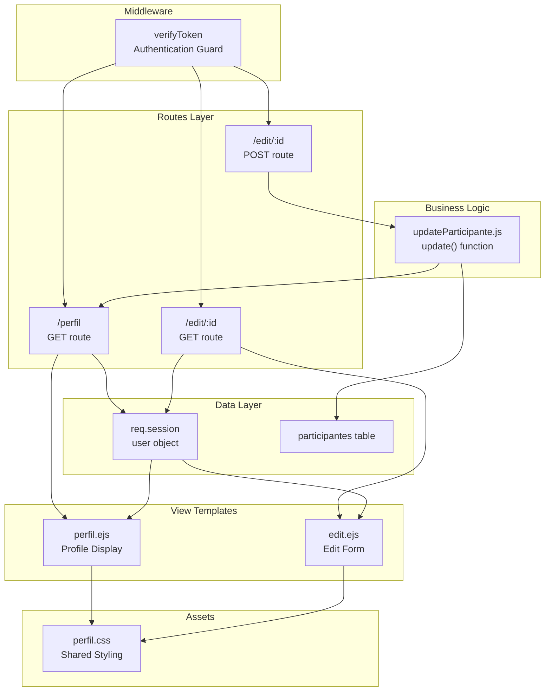
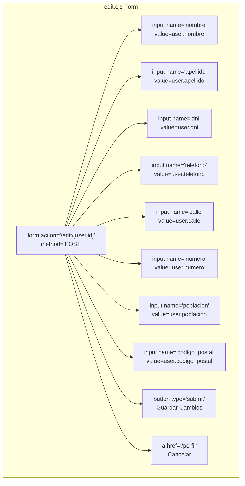
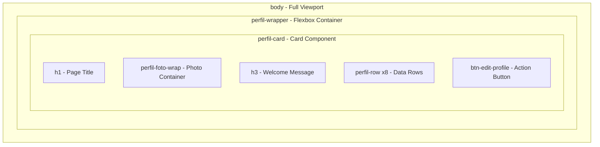

# Profile Management

> **Relevant source files**
> * [controllers/updateParticipante.js](https://github.com/Lourdes12587/Proyecto-Node.js/blob/3a172be7/controllers/updateParticipante.js)
> * [public/css/perfil.css](https://github.com/Lourdes12587/Proyecto-Node.js/blob/3a172be7/public/css/perfil.css)
> * [views/edit.ejs](https://github.com/Lourdes12587/Proyecto-Node.js/blob/3a172be7/views/edit.ejs)
> * [views/perfil.ejs](https://github.com/Lourdes12587/Proyecto-Node.js/blob/3a172be7/views/perfil.ejs)

## Purpose and Scope

This document describes the participant profile management system, which allows authenticated participants to view their registration information and update their personal data. The system consists of two interfaces: a read-only profile display page and an edit form. This functionality is protected by the `verifyToken` middleware and only accessible to logged-in participants.

For information about the initial registration process where this data is created, see [Registration Flow](/Lourdes12587/Proyecto-Node.js/4.1.2-registration-flow). For administrator-level participant management, see [Admin Panel](/Lourdes12587/Proyecto-Node.js/4.2.1-admin-panel).

**Sources:** [views/perfil.ejs L1-L32](https://github.com/Lourdes12587/Proyecto-Node.js/blob/3a172be7/views/perfil.ejs#L1-L32)

 [views/edit.ejs L1-L44](https://github.com/Lourdes12587/Proyecto-Node.js/blob/3a172be7/views/edit.ejs#L1-L44)

 [controllers/updateParticipante.js L1-L19](https://github.com/Lourdes12587/Proyecto-Node.js/blob/3a172be7/controllers/updateParticipante.js#L1-L19)

---

## System Architecture

The profile management system follows a standard view-edit-update pattern with distinct responsibilities across the presentation and business logic layers.



**Sources:** [views/perfil.ejs L1-L32](https://github.com/Lourdes12587/Proyecto-Node.js/blob/3a172be7/views/perfil.ejs#L1-L32)

 [views/edit.ejs L1-L44](https://github.com/Lourdes12587/Proyecto-Node.js/blob/3a172be7/views/edit.ejs#L1-L44)

 [controllers/updateParticipante.js L4-L18](https://github.com/Lourdes12587/Proyecto-Node.js/blob/3a172be7/controllers/updateParticipante.js#L4-L18)

---

## Profile Display Interface

The profile viewing interface (`perfil.ejs`) presents participant data in a card-based layout with read-only information display.

### Data Structure

The profile page renders the following participant fields from the session `user` object:

| Field | Display Label | Description |
| --- | --- | --- |
| `id` | Número Dorsal | Participant's unique race bib number |
| `nombre` | Bienvenido/a | First name displayed in welcome message |
| `apellido` | Bienvenido/a | Last name displayed in welcome message |
| `dni` | DNI | National identification document number |
| `telefono` | Teléfono | Contact phone number |
| `calle` | Dirección | Street name (combined with `numero`) |
| `numero` | Dirección | Street number (combined with `calle`) |
| `poblacion` | Población | City or town name |
| `codigo_postal` | Código Postal | Postal/ZIP code |
| `foto` | (Photo) | Profile photo filename (optional) |

**Sources:** [views/perfil.ejs L19-L26](https://github.com/Lourdes12587/Proyecto-Node.js/blob/3a172be7/views/perfil.ejs#L19-L26)

### Photo Display Logic

The profile photo is rendered conditionally based on whether the participant uploaded a photo during registration:

* **With Photo**: Displays image from `/uploads/participantes/<%= user.foto %>` in a circular frame [views/perfil.ejs L12-L13](https://github.com/Lourdes12587/Proyecto-Node.js/blob/3a172be7/views/perfil.ejs#L12-L13)
* **Without Photo**: Shows a placeholder icon using Boxicons (`bx bxs-user`) [views/perfil.ejs L15](https://github.com/Lourdes12587/Proyecto-Node.js/blob/3a172be7/views/perfil.ejs#L15-L15)

Both photo states use the `.perfil-foto` or `.perfil-foto-placeholder` CSS classes, which enforce 100x100px dimensions with circular borders [public/css/perfil.css L50-L59](https://github.com/Lourdes12587/Proyecto-Node.js/blob/3a172be7/public/css/perfil.css#L50-L59)

**Sources:** [views/perfil.ejs L11-L17](https://github.com/Lourdes12587/Proyecto-Node.js/blob/3a172be7/views/perfil.ejs#L11-L17)

 [public/css/perfil.css L50-L59](https://github.com/Lourdes12587/Proyecto-Node.js/blob/3a172be7/public/css/perfil.css#L50-L59)

### Navigation to Edit Mode

The profile page includes an "Editar mi perfil" button that links to `/edit/<%= user.id %>` [views/perfil.ejs L28](https://github.com/Lourdes12587/Proyecto-Node.js/blob/3a172be7/views/perfil.ejs#L28-L28)

 This button uses the `.btn-edit-profile` class with gradient styling and hover effects [public/css/perfil.css L75-L93](https://github.com/Lourdes12587/Proyecto-Node.js/blob/3a172be7/public/css/perfil.css#L75-L93)

**Sources:** [views/perfil.ejs L28](https://github.com/Lourdes12587/Proyecto-Node.js/blob/3a172be7/views/perfil.ejs#L28-L28)

 [public/css/perfil.css L75-L93](https://github.com/Lourdes12587/Proyecto-Node.js/blob/3a172be7/public/css/perfil.css#L75-L93)

---

## Profile Edit Interface

The edit interface (`edit.ejs`) provides a form-based approach to updating participant information. The form structure mirrors the profile display but enables field modification.

### Form Structure



Each input field is pre-populated with the current value from `user` object [views/edit.ejs L14-L36](https://github.com/Lourdes12587/Proyecto-Node.js/blob/3a172be7/views/edit.ejs#L14-L36)

 All fields use Bootstrap's `.form-control` class for consistent styling.

**Sources:** [views/edit.ejs L11-L40](https://github.com/Lourdes12587/Proyecto-Node.js/blob/3a172be7/views/edit.ejs#L11-L40)

### Form Fields and Validation

The edit form includes eight editable text fields:

1. **nombre** - First name [views/edit.ejs L14](https://github.com/Lourdes12587/Proyecto-Node.js/blob/3a172be7/views/edit.ejs#L14-L14)
2. **apellido** - Last name [views/edit.ejs L17](https://github.com/Lourdes12587/Proyecto-Node.js/blob/3a172be7/views/edit.ejs#L17-L17)
3. **dni** - National ID [views/edit.ejs L20](https://github.com/Lourdes12587/Proyecto-Node.js/blob/3a172be7/views/edit.ejs#L20-L20)
4. **telefono** - Phone number [views/edit.ejs L23](https://github.com/Lourdes12587/Proyecto-Node.js/blob/3a172be7/views/edit.ejs#L23-L23)
5. **calle** - Street name [views/edit.ejs L26](https://github.com/Lourdes12587/Proyecto-Node.js/blob/3a172be7/views/edit.ejs#L26-L26)
6. **numero** - Street number [views/edit.ejs L29](https://github.com/Lourdes12587/Proyecto-Node.js/blob/3a172be7/views/edit.ejs#L29-L29)
7. **poblacion** - City/town [views/edit.ejs L32](https://github.com/Lourdes12587/Proyecto-Node.js/blob/3a172be7/views/edit.ejs#L32-L32)
8. **codigo_postal** - Postal code [views/edit.ejs L35](https://github.com/Lourdes12587/Proyecto-Node.js/blob/3a172be7/views/edit.ejs#L35-L35)

Note that the participant's `id` and `foto` are not editable through this interface. The participant ID is used in the form action URL but not modifiable. Photo updates are not currently supported through the profile edit interface.

**Sources:** [views/edit.ejs L11-L36](https://github.com/Lourdes12587/Proyecto-Node.js/blob/3a172be7/views/edit.ejs#L11-L36)

### Action Buttons

The form provides two action buttons:

| Button | Type | Action | Class |
| --- | --- | --- | --- |
| Guardar Cambios | Submit | POST to `/edit/:id` | `.btn-edit-profile` |
| Cancelar | Link | Navigate to `/perfil` | `.btn .btn-danger` |

**Sources:** [views/edit.ejs L38-L39](https://github.com/Lourdes12587/Proyecto-Node.js/blob/3a172be7/views/edit.ejs#L38-L39)

---

## Data Update Flow

The update process follows a server-side controller pattern with database persistence and redirect-based feedback.

### Update Sequence

```mermaid
sequenceDiagram
  participant Browser
  participant edit.ejs
  participant /edit/:id POST route
  participant updateParticipante.update()
  participant participantes table
  participant /perfil GET route

  Browser->>edit.ejs: "User modifies form fields"
  Browser->>/edit/:id POST route: "POST /edit/:id
  /edit/:id POST route->>updateParticipante.update(): {nombre, apellido, dni...}"
  updateParticipante.update()->>updateParticipante.update(): "req.body contains form data"
  note over updateParticipante.update(): "nombre, apellido, dni, telefono,
  updateParticipante.update()->>participantes table: "Extract fields from req.body"
  loop ["Update Successful"]
    participantes table-->>updateParticipante.update(): "UPDATE participantes SET
    updateParticipante.update()->>updateParticipante.update(): nombre=?, apellido=?, dni=?, ...
    updateParticipante.update()-->>Browser: WHERE id=?"
    Browser->>/perfil GET route: "Result object"
    /perfil GET route-->>Browser: "console.log('Datos actualizados')"
    participantes table-->>updateParticipante.update(): "res.redirect('/perfil')"
    updateParticipante.update()->>updateParticipante.update(): "GET /perfil"
    updateParticipante.update()-->>Browser: "Render updated profile"
    note over Browser: "User sees unchanged profile
  end
```

**Sources:** [controllers/updateParticipante.js L4-L18](https://github.com/Lourdes12587/Proyecto-Node.js/blob/3a172be7/controllers/updateParticipante.js#L4-L18)

### Update Controller Implementation

The `update` function in [controllers/updateParticipante.js L4-L18](https://github.com/Lourdes12587/Proyecto-Node.js/blob/3a172be7/controllers/updateParticipante.js#L4-L18)

 performs the following operations:

1. **Extract form data** from `req.body` via destructuring [controllers/updateParticipante.js L5](https://github.com/Lourdes12587/Proyecto-Node.js/blob/3a172be7/controllers/updateParticipante.js#L5-L5)
2. **Execute UPDATE query** with parameterized values [controllers/updateParticipante.js L7-L9](https://github.com/Lourdes12587/Proyecto-Node.js/blob/3a172be7/controllers/updateParticipante.js#L7-L9)
3. **Handle errors** by logging and redirecting [controllers/updateParticipante.js L11-L14](https://github.com/Lourdes12587/Proyecto-Node.js/blob/3a172be7/controllers/updateParticipante.js#L11-L14)
4. **Confirm success** with console log and redirect [controllers/updateParticipante.js L15-L16](https://github.com/Lourdes12587/Proyecto-Node.js/blob/3a172be7/controllers/updateParticipante.js#L15-L16)

The SQL query uses parameterized placeholders (`?`) to prevent SQL injection:

```sql
UPDATE participantes 
SET nombre=?, apellido=?, dni=?, telefono=?, calle=?, numero=?, poblacion=?, codigo_postal=? 
WHERE id=?
```

**Sources:** [controllers/updateParticipante.js L7-L9](https://github.com/Lourdes12587/Proyecto-Node.js/blob/3a172be7/controllers/updateParticipante.js#L7-L9)

### Error Handling Limitations

The current implementation has minimal error handling:

* Database errors are logged to console but not displayed to users [controllers/updateParticipante.js L12-L13](https://github.com/Lourdes12587/Proyecto-Node.js/blob/3a172be7/controllers/updateParticipante.js#L12-L13)
* Both success and error cases redirect to `/perfil` [controllers/updateParticipante.js L13-L16](https://github.com/Lourdes12587/Proyecto-Node.js/blob/3a172be7/controllers/updateParticipante.js#L13-L16)
* Users receive no explicit feedback about whether their update succeeded or failed
* No validation occurs on the server side before database insertion

**Sources:** [controllers/updateParticipante.js L10-L17](https://github.com/Lourdes12587/Proyecto-Node.js/blob/3a172be7/controllers/updateParticipante.js#L10-L17)

---

## Styling and Visual Design

Both profile pages share the same stylesheet (`perfil.css`), creating visual consistency between view and edit modes.

### Design System

The stylesheet defines a color palette using CSS custom properties [public/css/perfil.css L1-L8](https://github.com/Lourdes12587/Proyecto-Node.js/blob/3a172be7/public/css/perfil.css#L1-L8)

:

| Variable | Hex Value | Usage |
| --- | --- | --- |
| `--sky-blue` | #81c3d7ff | Background gradients |
| `--platinum` | #e5e5e5ff | Background gradients, row backgrounds |
| `--indigo-dye` | #16425bff | Primary text, borders |
| `--lapis-lazuli` | #2f6690ff | Headings, buttons |
| `--cerulean` | #3a7ca5ff | Subheadings, button gradients |
| `--white` | #ffffff | Button text, card backgrounds |

**Sources:** [public/css/perfil.css L1-L8](https://github.com/Lourdes12587/Proyecto-Node.js/blob/3a172be7/public/css/perfil.css#L1-L8)

### Layout Components

The profile interface uses a centered card layout:



**Key CSS Classes:**

* **`.perfil-wrapper`** [public/css/perfil.css L21-L27](https://github.com/Lourdes12587/Proyecto-Node.js/blob/3a172be7/public/css/perfil.css#L21-L27) : Flex container that centers content vertically and horizontally with 48px top/bottom padding
* **`.perfil-card`** [public/css/perfil.css L29-L44](https://github.com/Lourdes12587/Proyecto-Node.js/blob/3a172be7/public/css/perfil.css#L29-L44) : Max-width 380px card with gradient background, rounded corners (16px), box shadow, and hover effect that lifts the card 6px
* **`.perfil-row`** [public/css/perfil.css L61-L71](https://github.com/Lourdes12587/Proyecto-Node.js/blob/3a172be7/public/css/perfil.css#L61-L71) : Individual data display rows with flex layout (`justify-content: space-between`) and gradient background
* **`.btn-edit-profile`** [public/css/perfil.css L75-L92](https://github.com/Lourdes12587/Proyecto-Node.js/blob/3a172be7/public/css/perfil.css#L75-L92) : Full-width button with gradient background, pill shape (999px border-radius), and lift effect on hover

**Sources:** [public/css/perfil.css L21-L92](https://github.com/Lourdes12587/Proyecto-Node.js/blob/3a172be7/public/css/perfil.css#L21-L92)

### Photo Styling

Profile photos use circular framing with consistent dimensions:

* **Dimensions**: 100x100px enforced via `!important` [public/css/perfil.css L51-L52](https://github.com/Lourdes12587/Proyecto-Node.js/blob/3a172be7/public/css/perfil.css#L51-L52)
* **Shape**: Circular via `border-radius: 50%` [public/css/perfil.css L53](https://github.com/Lourdes12587/Proyecto-Node.js/blob/3a172be7/public/css/perfil.css#L53-L53)
* **Cropping**: `object-fit: cover` ensures photos fill frame [public/css/perfil.css L54](https://github.com/Lourdes12587/Proyecto-Node.js/blob/3a172be7/public/css/perfil.css#L54-L54)
* **Border**: 3px solid border in `--lapis-lazuli` color [public/css/perfil.css L55](https://github.com/Lourdes12587/Proyecto-Node.js/blob/3a172be7/public/css/perfil.css#L55-L55)
* **Placeholder**: Uses same dimensions with gray background and centered icon [public/css/perfil.css L59](https://github.com/Lourdes12587/Proyecto-Node.js/blob/3a172be7/public/css/perfil.css#L59-L59)

**Sources:** [public/css/perfil.css L50-L59](https://github.com/Lourdes12587/Proyecto-Node.js/blob/3a172be7/public/css/perfil.css#L50-L59)

### Responsive Behavior

The card-based layout adapts to different screen sizes:

* Full viewport height layout with `min-height: 100vh` on body [public/css/perfil.css L18](https://github.com/Lourdes12587/Proyecto-Node.js/blob/3a172be7/public/css/perfil.css#L18-L18)
* Card width constrained to 380px maximum [public/css/perfil.css L31](https://github.com/Lourdes12587/Proyecto-Node.js/blob/3a172be7/public/css/perfil.css#L31-L31)
* Horizontal padding of 16px on wrapper prevents edge overflow [public/css/perfil.css L26](https://github.com/Lourdes12587/Proyecto-Node.js/blob/3a172be7/public/css/perfil.css#L26-L26)
* Text within rows wraps naturally due to flex layout with space-between alignment [public/css/perfil.css L70](https://github.com/Lourdes12587/Proyecto-Node.js/blob/3a172be7/public/css/perfil.css#L70-L70)

**Sources:** [public/css/perfil.css L10-L31](https://github.com/Lourdes12587/Proyecto-Node.js/blob/3a172be7/public/css/perfil.css#L10-L31)

---

## Integration with Application Flow

Profile management integrates with the broader authentication and session management system:

1. **Authentication Requirement**: Both `/perfil` and `/edit/:id` routes are protected by `verifyToken` middleware (see [Role-Based Access Control](/Lourdes12587/Proyecto-Node.js/3.2-role-based-access-control))
2. **Session Data Access**: The `user` object is populated in `res.locals` from session data, making it available to EJS templates
3. **Post-Login Redirect**: After successful participant login, users are typically redirected to `/perfil` (see [Login System](/Lourdes12587/Proyecto-Node.js/3.1-login-system))
4. **Shared Layout**: Both pages include the standard `partials/head`, `partials/header`, and `partials/footer` (see [Shared Components](/Lourdes12587/Proyecto-Node.js/4.3-shared-components))

**Sources:** [views/perfil.ejs L1-L32](https://github.com/Lourdes12587/Proyecto-Node.js/blob/3a172be7/views/perfil.ejs#L1-L32)

 [views/edit.ejs L1-L44](https://github.com/Lourdes12587/Proyecto-Node.js/blob/3a172be7/views/edit.ejs#L1-L44)

---

## Limitations and Considerations

The current profile management implementation has several constraints:

### Data Modification Constraints

* **Photo Updates Not Supported**: Users cannot change their profile photo after initial registration. The photo field is stored in the database but not exposed in the edit form [views/edit.ejs L11-L40](https://github.com/Lourdes12587/Proyecto-Node.js/blob/3a172be7/views/edit.ejs#L11-L40)
* **No Validation**: Server-side validation is absent; any form data is directly inserted into the database [controllers/updateParticipante.js L7-L9](https://github.com/Lourdes12587/Proyecto-Node.js/blob/3a172be7/controllers/updateParticipante.js#L7-L9)
* **ID Modification Risk**: While the ID is not exposed as an editable field, the form action uses the ID from the URL parameter rather than validating against the authenticated user's session ID

### User Experience Gaps

* **No Success/Error Messages**: Users receive no visual confirmation of whether updates succeeded [controllers/updateParticipante.js L13-L16](https://github.com/Lourdes12587/Proyecto-Node.js/blob/3a172be7/controllers/updateParticipante.js#L13-L16)
* **Silent Error Handling**: Database errors are logged but not communicated to users [controllers/updateParticipante.js L11-L14](https://github.com/Lourdes12587/Proyecto-Node.js/blob/3a172be7/controllers/updateParticipante.js#L11-L14)
* **No Field Validation**: Client-side and server-side validation are both missing (e.g., phone number format, postal code format)
* **No Optimistic Updates**: The page must be fully reloaded to see changes

### Security Considerations

* **Authorization Check Missing**: The update controller does not verify that the authenticated user's ID matches the ID being updated
* **SQL Injection Protection**: Uses parameterized queries, which provides protection [controllers/updateParticipante.js L8](https://github.com/Lourdes12587/Proyecto-Node.js/blob/3a172be7/controllers/updateParticipante.js#L8-L8)
* **No Input Sanitization**: Form inputs are not sanitized before database insertion

**Sources:** [controllers/updateParticipante.js L4-L18](https://github.com/Lourdes12587/Proyecto-Node.js/blob/3a172be7/controllers/updateParticipante.js#L4-L18)

 [views/edit.ejs L11-L40](https://github.com/Lourdes12587/Proyecto-Node.js/blob/3a172be7/views/edit.ejs#L11-L40)