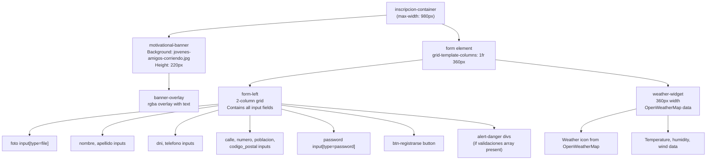
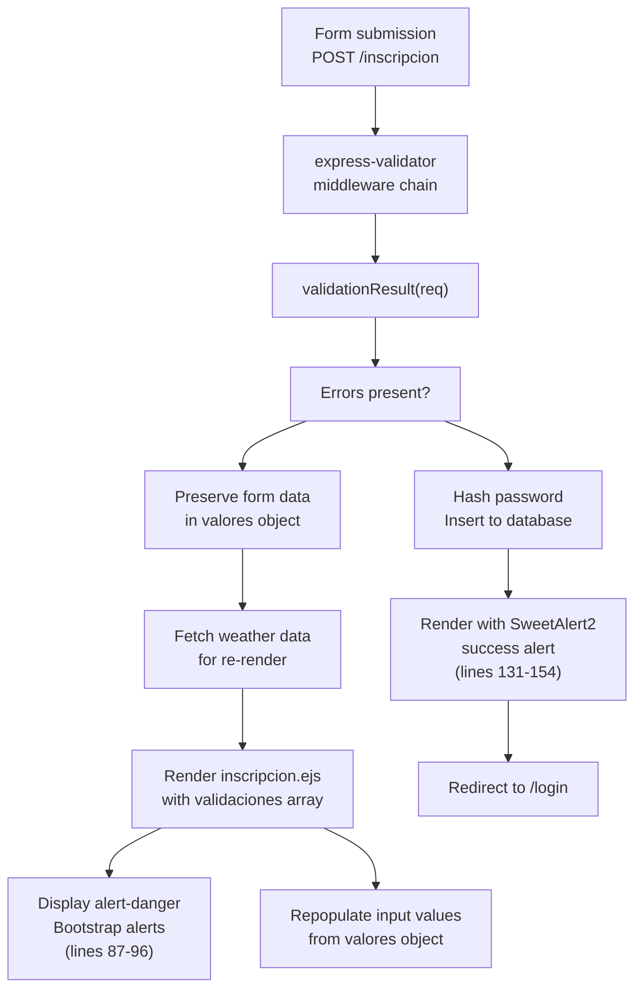
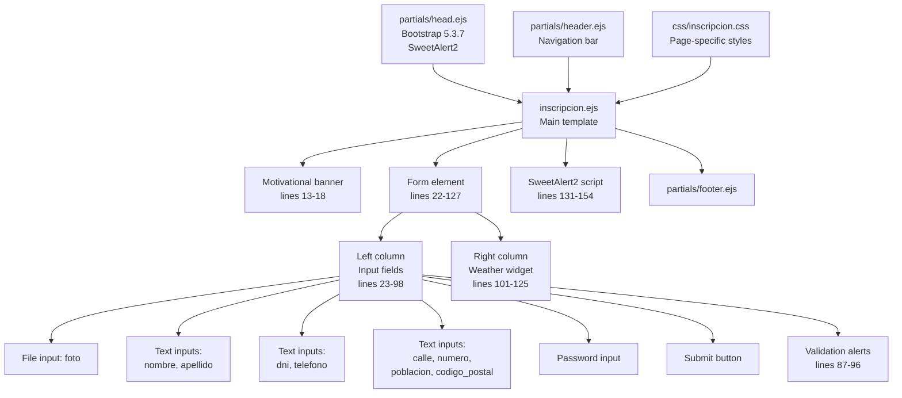

# Registration Flow

> **Relevant source files**
> * [middlewares/multer.js](https://github.com/Lourdes12587/Proyecto-Node.js/blob/3a172be7/middlewares/multer.js)
> * [middlewares/verifyAdmin.js](https://github.com/Lourdes12587/Proyecto-Node.js/blob/3a172be7/middlewares/verifyAdmin.js)
> * [middlewares/verifyToken.js](https://github.com/Lourdes12587/Proyecto-Node.js/blob/3a172be7/middlewares/verifyToken.js)
> * [public/css/edit.css](https://github.com/Lourdes12587/Proyecto-Node.js/blob/3a172be7/public/css/edit.css)
> * [public/css/inscripcion.css](https://github.com/Lourdes12587/Proyecto-Node.js/blob/3a172be7/public/css/inscripcion.css)
> * [views/inscripcion.ejs](https://github.com/Lourdes12587/Proyecto-Node.js/blob/3a172be7/views/inscripcion.ejs)

## Purpose and Scope

This document describes the participant registration flow in the HAPPY RUNNER 42K application, covering form submission, photo upload, validation feedback, and weather widget integration. The registration interface allows new participants to create accounts by providing personal information and uploading a profile photo.

For information about post-registration authentication, see [Login System](/Lourdes12587/Proyecto-Node.js/3.1-login-system). For details on profile editing after registration, see [Profile Management](/Lourdes12587/Proyecto-Node.js/4.1.3-profile-management). For technical details on the file upload infrastructure, see [File Upload System](/Lourdes12587/Proyecto-Node.js/6.2-file-upload-system).

---

## Registration Endpoint and Route Handler

The registration flow begins when users access the registration form at `/inscripcion`. The route accepts both GET (to display the form) and POST (to process submissions) requests. The POST route includes the multer middleware for handling multipart form data with file uploads.

**Route Configuration:**

* **GET** `/inscripcion` - Renders the registration form with weather data
* **POST** `/inscripcion` - Processes form submission with `upload.single('foto')` middleware

The multer middleware is configured in [middlewares/multer.js L1-L15](https://github.com/Lourdes12587/Proyecto-Node.js/blob/3a172be7/middlewares/multer.js#L1-L15)

 with disk storage, saving uploaded photos to `public/uploads/participantes/` with the naming pattern `participante-{timestamp}{extension}`.

**Sources:** views/inscripcion.ejs:22, middlewares/multer.js:1-15

---

## Form Structure and Data Fields

The registration form collects participant information across multiple categories: identification, contact details, address components, authentication credentials, and a profile photo.

### Required Form Fields

| Field Name | Input Type | Purpose | Database Column |
| --- | --- | --- | --- |
| `foto` | file | Profile/dorsal photo | `foto` |
| `nombre` | text | First name | `nombre` |
| `apellido` | text | Last name | `apellido` |
| `dni` | text | National ID (unique identifier) | `dni` |
| `telefono` | text | Phone number | `telefono` |
| `calle` | text | Street name | Part of `direccion` |
| `numero` | text | Street number | Part of `direccion` |
| `poblacion` | text | City/town | Part of `direccion` |
| `codigo_postal` | text | Postal code | Part of `direccion` |
| `password` | password | Account password (hashed) | `password` |

The form at [views/inscripcion.ejs L24-L81](https://github.com/Lourdes12587/Proyecto-Node.js/blob/3a172be7/views/inscripcion.ejs#L24-L81)

 uses a two-column grid layout implemented in [public/css/inscripcion.css L79-L92](https://github.com/Lourdes12587/Proyecto-Node.js/blob/3a172be7/public/css/inscripcion.css#L79-L92)

 The left column contains the form fields, while the right column displays a weather widget.

**Sources:** views/inscripcion.ejs:22-86, public/css/inscripcion.css:79-92

---

## Registration Request Flow

The following diagram illustrates the complete request lifecycle from form submission to database persistence and user feedback.

```mermaid
sequenceDiagram
  participant Browser
  participant /inscripcion Route
  participant multer.single('foto')
  participant express-validator
  participant public/uploads/participantes/
  participant bcrypt
  participant MySQL participantes
  participant OpenWeatherMap API

  Browser->>/inscripcion Route: "POST /inscripcion"
  /inscripcion Route->>multer.single('foto'): "multipart/form-data"
  multer.single('foto')->>multer.single('foto'): "Process upload"
  multer.single('foto')->>public/uploads/participantes/: "Parse file field: foto"
  public/uploads/participantes/-->>multer.single('foto'): "Save as participante-{timestamp}.ext"
  multer.single('foto')->>express-validator: "File path returned"
  express-validator->>express-validator: "req.file populated"
  loop ["Validation Errors"]
    express-validator->>OpenWeatherMap API: "Validate all fields"
    OpenWeatherMap API-->>express-validator: "(nombre, apellido, dni, etc.)"
    express-validator-->>Browser: "Fetch weather for re-render"
    express-validator->>bcrypt: "Weather data"
    bcrypt-->>express-validator: "Re-render inscripcion.ejs"
    express-validator->>MySQL participantes: "with validaciones array"
    MySQL participantes-->>express-validator: "and preserved valores"
    express-validator-->>Browser: "Hash password"
  end
```

**Sources:** views/inscripcion.ejs:22, middlewares/multer.js:5-12, views/inscripcion.ejs:87-96, views/inscripcion.ejs:131-154

---

## Photo Upload Process

The registration form requires participants to upload a profile photo, which is used for their race dorsal and profile display. The upload mechanism uses multer middleware with disk storage configuration.

### Multer Configuration Details

The storage configuration at [middlewares/multer.js L5-L13](https://github.com/Lourdes12587/Proyecto-Node.js/blob/3a172be7/middlewares/multer.js#L5-L13)

 defines:

1. **Destination:** `public/uploads/participantes` directory
2. **Filename Generation:** `participante-` prefix + `Date.now()` timestamp + original file extension
3. **File Field:** `foto` (accepts `image/*` MIME types)

The filename generation strategy ensures unique filenames by using millisecond timestamps, preventing filename collisions when multiple users register simultaneously.

**Example Generated Filename:**

```
participante-1703251234567.jpg
```

The uploaded file path is stored in the database's `foto` column as a relative path (e.g., `/uploads/participantes/participante-1703251234567.jpg`).

**Sources:** middlewares/multer.js:1-15, views/inscripcion.ejs:25-26

---

## Form Layout and UI Components

The registration interface consists of three primary visual components: a motivational banner, the form grid, and a weather widget.



The form uses a responsive grid layout defined at [public/css/inscripcion.css L79-L85](https://github.com/Lourdes12587/Proyecto-Node.js/blob/3a172be7/public/css/inscripcion.css#L79-L85)

 On screens wider than 980px, the form displays in two columns: form fields on the left (spanning 2 sub-columns) and the weather widget on the right (fixed 360px width). On mobile devices (≤980px), the layout collapses to a single column with the weather widget repositioned above the form fields.

**Sources:** views/inscripcion.ejs:10-127, public/css/inscripcion.css:52-64, public/css/inscripcion.css:79-92, public/css/inscripcion.css:161-179, public/css/inscripcion.css:251-263

---

## Validation and Error Handling

The registration form implements server-side validation using express-validator. When validation fails, the form is re-rendered with error messages and preserved field values.

### Validation Flow



### Error Display Mechanism

When validation errors occur, the server passes two objects to the EJS template:

1. **`validaciones` array:** Contains validation error objects with `msg` property
2. **`valores` object:** Contains submitted form values for field repopulation

The template iterates over the `validaciones` array at [views/inscripcion.ejs L87-L96](https://github.com/Lourdes12587/Proyecto-Node.js/blob/3a172be7/views/inscripcion.ejs#L87-L96)

 to display Bootstrap alert components. Each input field checks for a corresponding value in the `valores` object to preserve user input, as seen in the pattern: `value="<%= (typeof valores !== 'undefined' && valores.nombre) ? valores.nombre : '' %>"` at [views/inscripcion.ejs L32](https://github.com/Lourdes12587/Proyecto-Node.js/blob/3a172be7/views/inscripcion.ejs#L32-L32)

**Sources:** views/inscripcion.ejs:87-96, views/inscripcion.ejs:31-80

---

## Success Feedback with SweetAlert2

Upon successful registration, the system displays a styled success modal using SweetAlert2 library and automatically redirects to the login page.

The alert configuration at [views/inscripcion.ejs L131-L154](https://github.com/Lourdes12587/Proyecto-Node.js/blob/3a172be7/views/inscripcion.ejs#L131-L154)

 receives the following variables from the server:

| Variable | Purpose | Example Value |
| --- | --- | --- |
| `alert` | Boolean flag to trigger alert | `true` |
| `alertMessage` | Message text | "Registro exitoso" |
| `alertIcon` | Icon type | "success" |
| `showConfirmButton` | Display confirm button | `false` |
| `timer` | Auto-close timer (ms) | `2000` |
| `ruta` | Redirect destination | "login" |

The alert uses a custom gradient background (`linear-gradient(135deg, #2f6690ff, #3a7ca5ff)`) matching the application's color scheme defined in [public/css/inscripcion.css L4-L26](https://github.com/Lourdes12587/Proyecto-Node.js/blob/3a172be7/public/css/inscripcion.css#L4-L26)

 After the timer expires or the user confirms, the `.then()` callback executes the redirect to `/<%= ruta %>`.

**Sources:** views/inscripcion.ejs:131-154, public/css/inscripcion.css:4-26

---

## Weather Widget Integration

The registration page includes a real-time weather widget that displays current conditions for the marathon location. This feature helps participants understand race-day weather conditions during registration.

### Weather Data Structure

The server injects a `clima` object into the template with the following properties:

| Property | Source | Display Location |
| --- | --- | --- |
| `city` | OpenWeatherMap city name | Widget title (line 103) |
| `icon` | Weather icon code | Icon image (lines 105-109) |
| `temp` | Current temperature (°C) | Temperature stat (line 111) |
| `feels_like` | Feels-like temperature (°C) | Sensation stat (line 112) |
| `humidity` | Humidity percentage | Humidity stat (line 113) |
| `description` | Weather description | Description text (line 114) |
| `wind_speed` | Wind speed (m/s) | Wind stat (line 115) |
| `clouds` | Cloud coverage percentage | Cloud stat (line 116) |

The weather icon is fetched from OpenWeatherMap's CDN using the pattern `https://openweathermap.org/img/wn/{icon}@2x.png` at [views/inscripcion.ejs L107](https://github.com/Lourdes12587/Proyecto-Node.js/blob/3a172be7/views/inscripcion.ejs#L107-L107)

### Caching Indicator

The widget displays a "(Datos en cache)" message when weather data is served from cache rather than fresh API calls, indicated by the `cached` variable at [views/inscripcion.ejs L118-L120](https://github.com/Lourdes12587/Proyecto-Node.js/blob/3a172be7/views/inscripcion.ejs#L118-L120)

**Widget Styling:**

* Gradient background: [public/css/inscripcion.css L175](https://github.com/Lourdes12587/Proyecto-Node.js/blob/3a172be7/public/css/inscripcion.css#L175-L175)
* Hover transformation: [public/css/inscripcion.css L181-L184](https://github.com/Lourdes12587/Proyecto-Node.js/blob/3a172be7/public/css/inscripcion.css#L181-L184)
* Floating icon animation: [public/css/inscripcion.css L202-L205](https://github.com/Lourdes12587/Proyecto-Node.js/blob/3a172be7/public/css/inscripcion.css#L202-L205)
* Stat grid layout: [public/css/inscripcion.css L207-L212](https://github.com/Lourdes12587/Proyecto-Node.js/blob/3a172be7/public/css/inscripcion.css#L207-L212)

**Sources:** views/inscripcion.ejs:101-125, public/css/inscripcion.css:161-239

---

## Visual Design Elements

### Motivational Banner

The registration page features a full-width motivational banner with background imagery to encourage registration. The banner component at [views/inscripcion.ejs L13-L18](https://github.com/Lourdes12587/Proyecto-Node.js/blob/3a172be7/views/inscripcion.ejs#L13-L18)

 displays:

* **Background Image:** `jovenes-amigos-corriendo-durante-una-maraton.jpg` (marathon runners)
* **Overlay:** Semi-transparent dark overlay (`rgba(22,66,91,0.48)`)
* **Headline:** "¡Prepárate para la gran carrera!"
* **Subtext:** "Visualiza la meta, siente la emoción y anima a inscribirte hoy."

Styling is defined at [public/css/inscripcion.css L251-L293](https://github.com/Lourdes12587/Proyecto-Node.js/blob/3a172be7/public/css/inscripcion.css#L251-L293)

 with responsive height adjustments for mobile devices.

### Form Input Styling

All form inputs follow a consistent visual design:

* **Background:** Subtle gradient `linear-gradient(180deg,#ffffff,#f7fbff)` ([public/css/inscripcion.css L115](https://github.com/Lourdes12587/Proyecto-Node.js/blob/3a172be7/public/css/inscripcion.css#L115-L115) )
* **Border:** Light border `rgba(22,66,91,0.12)` with rounded corners (12px radius)
* **Focus State:** Elevated with `translateY(-3px)` and stronger shadow ([public/css/inscripcion.css L122-L128](https://github.com/Lourdes12587/Proyecto-Node.js/blob/3a172be7/public/css/inscripcion.css#L122-L128) )
* **Transition:** Smooth transforms on interaction

### Submit Button

The "INSCRIBIRSE" button at [views/inscripcion.ejs L84](https://github.com/Lourdes12587/Proyecto-Node.js/blob/3a172be7/views/inscripcion.ejs#L84-L84)

 features:

* Pill-shaped design (`border-radius: 999px`)
* Gradient background matching the application theme
* Hover elevation effect (`translateY(-5px)`)
* Styling defined at [public/css/inscripcion.css L133-L148](https://github.com/Lourdes12587/Proyecto-Node.js/blob/3a172be7/public/css/inscripcion.css#L133-L148)

**Sources:** views/inscripcion.ejs:13-18, public/css/inscripcion.css:133-148, public/css/inscripcion.css:251-293

---

## Responsive Behavior

The registration interface adapts to different screen sizes through media queries defined in the stylesheet.

### Breakpoint Adjustments

**At 980px and below** ([public/css/inscripcion.css L302-L306](https://github.com/Lourdes12587/Proyecto-Node.js/blob/3a172be7/public/css/inscripcion.css#L302-L306)

):

* Form grid collapses from two columns to single column
* Weather widget reordered above form fields (`order: -1`)
* Form fields stack vertically

**At 768px and below** ([public/css/inscripcion.css L308-L312](https://github.com/Lourdes12587/Proyecto-Node.js/blob/3a172be7/public/css/inscripcion.css#L308-L312)

):

* Motivational banner height reduces from 220px to 160px
* Banner headline font size reduces to 1.5rem
* Banner text size reduces to 1rem

The responsive strategy ensures usability across desktop, tablet, and mobile devices while maintaining visual hierarchy and component readability.

**Sources:** public/css/inscripcion.css:302-312

---

## Component Composition Diagram



**Sources:** views/inscripcion.ejs:1-161, public/css/inscripcion.css:1-313