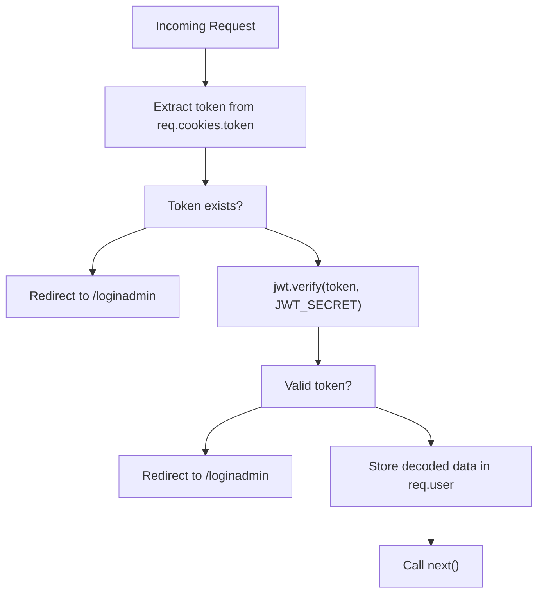
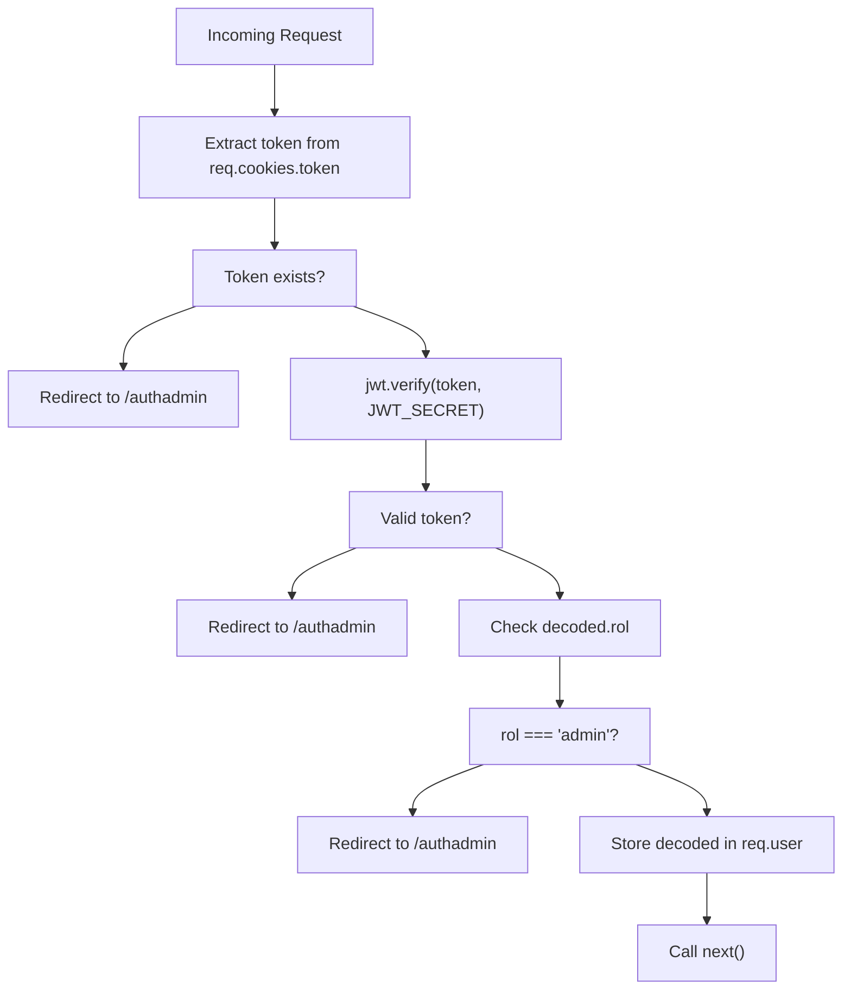
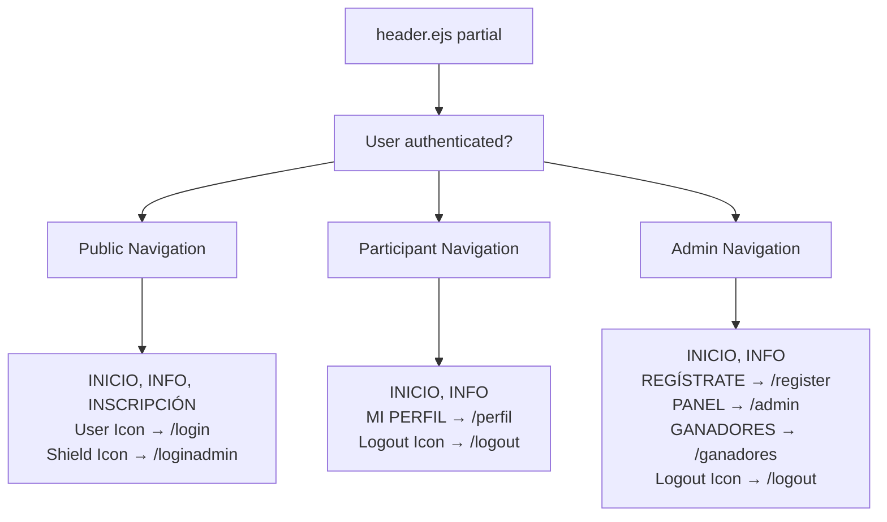
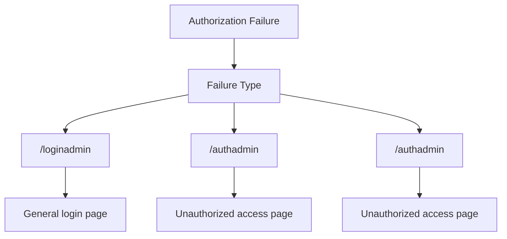

# Role-Based Access Control

> **Relevant source files**
> * [middlewares/multer.js](https://github.com/Lourdes12587/Proyecto-Node.js/blob/3a172be7/middlewares/multer.js)
> * [middlewares/verifyAdmin.js](https://github.com/Lourdes12587/Proyecto-Node.js/blob/3a172be7/middlewares/verifyAdmin.js)
> * [middlewares/verifyToken.js](https://github.com/Lourdes12587/Proyecto-Node.js/blob/3a172be7/middlewares/verifyToken.js)
> * [public/css/edit.css](https://github.com/Lourdes12587/Proyecto-Node.js/blob/3a172be7/public/css/edit.css)
> * [views/partials/header.ejs](https://github.com/Lourdes12587/Proyecto-Node.js/blob/3a172be7/views/partials/header.ejs)

## Purpose and Scope

This document details the role-based access control (RBAC) system that enforces authorization in the HAPPY RUNNER 42K application. The system distinguishes between two user roles (`participante` and `admin`) and uses middleware guards to protect routes and conditionally render UI elements based on authenticated user roles.

For information about the login mechanisms that establish user sessions, see [Login System](/Lourdes12587/Proyecto-Node.js/3.1-login-system). For details on session data storage and lifecycle, see [Session Management](/Lourdes12587/Proyecto-Node.js/3.3-session-management).

---

## Role Definitions

The application defines two distinct user roles stored in session and JWT token payloads:

| Role | Value | User Type | Database Table | Login Route |
| --- | --- | --- | --- | --- |
| Participant | `"participante"` | Event participants | `participantes` | `/login` |
| Administrator | `"admin"` | Event organizers | `organizadores` | `/loginadmin` |

The role value is set during authentication by the `authcontroller.js` and stored in both the session object (`req.session.rol`) and JWT token payload (`decoded.rol`).

**Sources:** [views/partials/header.ejs L22-L30](https://github.com/Lourdes12587/Proyecto-Node.js/blob/3a172be7/views/partials/header.ejs#L22-L30)

 [middlewares/verifyAdmin.js L9](https://github.com/Lourdes12587/Proyecto-Node.js/blob/3a172be7/middlewares/verifyAdmin.js#L9-L9)

---

## Middleware Guards

The system implements two JWT-based middleware guards that intercept requests to protected routes:

### verifyToken Middleware

The `verifyToken` middleware provides general authentication verification for any logged-in user (both participants and admins):



**Implementation details:**

* Location: [middlewares/verifyToken.js L3-L16](https://github.com/Lourdes12587/Proyecto-Node.js/blob/3a172be7/middlewares/verifyToken.js#L3-L16)
* Token source: `req.cookies.token` (set during login)
* Secret key: `process.env.JWT_SECRET` (environment variable)
* Success behavior: Populates `req.user` with decoded token payload and proceeds
* Failure behavior: Redirects to `/loginadmin` for both missing and invalid tokens

**Sources:** [middlewares/verifyToken.js L1-L19](https://github.com/Lourdes12587/Proyecto-Node.js/blob/3a172be7/middlewares/verifyToken.js#L1-L19)

### verifyAdmin Middleware

The `verifyAdmin` middleware extends authentication with role-based authorization, ensuring only users with `rol === "admin"` can proceed:



**Implementation details:**

* Location: [middlewares/verifyAdmin.js L3-L15](https://github.com/Lourdes12587/Proyecto-Node.js/blob/3a172be7/middlewares/verifyAdmin.js#L3-L15)
* Additional check: `decoded.rol !== "admin"` triggers rejection
* Failure redirect: `/authadmin` (distinct from general auth failures)
* Cascading verification: Performs both token validation and role check

**Sources:** [middlewares/verifyAdmin.js L1-L17](https://github.com/Lourdes12587/Proyecto-Node.js/blob/3a172be7/middlewares/verifyAdmin.js#L1-L17)

---

## Route Protection Patterns

### Protected Route Application

Middleware guards are applied to route handlers in the Express routing layer. The system uses two protection patterns:

| Pattern | Middleware | Applied To | Purpose |
| --- | --- | --- | --- |
| General Auth | `verifyToken` | Participant routes | Requires any logged-in user |
| Admin-Only | `verifyAdmin` | Administrative routes | Requires admin role |

**Example route protection structure:**

```
Router Configuration:
├── /perfil (GET)           → verifyToken → Participant profile view
├── /edit (GET/POST)        → verifyToken → Participant profile editing
├── /admin (GET)            → verifyAdmin → Participant management panel
├── /register (GET/POST)    → verifyAdmin → Organizer registration
├── /ganadores (GET/POST)   → verifyAdmin → Winner management
└── /editadmin/:id (POST)   → verifyAdmin → Admin participant editing
```

**Sources:** Referenced from Diagram 2 in high-level architecture

---

## Access Decision Flow

The following sequence diagram illustrates the complete authorization decision process for a protected route request:

```mermaid
sequenceDiagram
  participant Browser
  participant Express Router
  participant verifyToken / verifyAdmin
  participant jsonwebtoken.verify()
  participant Route Handler

  Browser->>Express Router: "GET /admin (with cookie)"
  Express Router->>verifyToken / verifyAdmin: "Intercept request"
  verifyToken / verifyAdmin->>verifyToken / verifyAdmin: "Extract req.cookies.token"
  loop ["Role not admin"]
    verifyToken / verifyAdmin->>Browser: "302 Redirect to /loginadmin or /authadmin"
    verifyToken / verifyAdmin->>jsonwebtoken.verify(): "verify(token, JWT_SECRET)"
    jsonwebtoken.verify()-->>verifyToken / verifyAdmin: "throw VerificationError"
    verifyToken / verifyAdmin->>Browser: "302 Redirect to /loginadmin or /authadmin"
    jsonwebtoken.verify()-->>verifyToken / verifyAdmin: "Return decoded payload"
    verifyToken / verifyAdmin->>verifyToken / verifyAdmin: "decoded.rol === 'admin'?"
    verifyToken / verifyAdmin->>Browser: "302 Redirect to /authadmin"
    verifyToken / verifyAdmin->>verifyToken / verifyAdmin: "req.user = decoded"
    verifyToken / verifyAdmin->>Route Handler: "next()"
    Route Handler->>Browser: "200 OK with response"
    verifyToken / verifyAdmin->>verifyToken / verifyAdmin: "req.user = decoded"
    verifyToken / verifyAdmin->>Route Handler: "next()"
    Route Handler->>Browser: "200 OK with response"
  end
```

**Sources:** [middlewares/verifyToken.js L3-L16](https://github.com/Lourdes12587/Proyecto-Node.js/blob/3a172be7/middlewares/verifyToken.js#L3-L16)

 [middlewares/verifyAdmin.js L3-L15](https://github.com/Lourdes12587/Proyecto-Node.js/blob/3a172be7/middlewares/verifyAdmin.js#L3-L15)

---

## Role-Based Navigation Rendering

The `header.ejs` partial implements conditional navigation rendering based on the authenticated user's role:

### Navigation Menu Structure



### Implementation Details

The header uses EJS conditional blocks to render different navigation items:

1. **Unauthenticated state** (`!user`): [views/partials/header.ejs L18-L21](https://github.com/Lourdes12587/Proyecto-Node.js/blob/3a172be7/views/partials/header.ejs#L18-L21) * Shows registration link * Shows participant login icon (`/login`) * Shows admin login icon (`/loginadmin`)
2. **Participant role** (`rol === 'participante'`): [views/partials/header.ejs L22-L24](https://github.com/Lourdes12587/Proyecto-Node.js/blob/3a172be7/views/partials/header.ejs#L22-L24) * Shows profile link (`/perfil`) * Shows logout icon * Hides admin-only links
3. **Admin role** (`rol === 'admin'`): [views/partials/header.ejs L25-L30](https://github.com/Lourdes12587/Proyecto-Node.js/blob/3a172be7/views/partials/header.ejs#L25-L30) * Shows organizer registration (`/register`) * Shows admin panel (`/admin`) * Shows winner management (`/ganadores`) * Shows logout icon

**Data source:** The `user` and `rol` variables are populated from `res.locals` by middleware in `app.js`, which reads from `req.session`.

**Sources:** [views/partials/header.ejs L18-L30](https://github.com/Lourdes12587/Proyecto-Node.js/blob/3a172be7/views/partials/header.ejs#L18-L30)

---

## JWT Token Payload Structure

When authentication succeeds, the `authcontroller.js` generates a JWT token containing role information:

| Field | Type | Description | Example Value |
| --- | --- | --- | --- |
| `id` | Number | User ID from database | `42` |
| `nombre` | String | User's first name (participante) or username (admin) | `"Juan"` or `"admin_user"` |
| `rol` | String | User role identifier | `"participante"` or `"admin"` |
| `iat` | Number | Issued at timestamp | `1699564800` |
| `exp` | Number | Expiration timestamp | `1699651200` |

The middleware guards decode this payload to access the `rol` field for authorization decisions.

**Sources:** Referenced from Diagram 5 (Request Lifecycle) and middleware implementations

---

## Redirect Strategy

The system uses different redirect targets based on the type of authorization failure:



**Redirect behavior:**

* `verifyToken` failures → `/loginadmin`: [middlewares/verifyToken.js L6](https://github.com/Lourdes12587/Proyecto-Node.js/blob/3a172be7/middlewares/verifyToken.js#L6-L6)  [middlewares/verifyToken.js L14](https://github.com/Lourdes12587/Proyecto-Node.js/blob/3a172be7/middlewares/verifyToken.js#L14-L14)
* `verifyAdmin` token failures → `/authadmin`: [middlewares/verifyAdmin.js L5](https://github.com/Lourdes12587/Proyecto-Node.js/blob/3a172be7/middlewares/verifyAdmin.js#L5-L5)  [middlewares/verifyAdmin.js L13](https://github.com/Lourdes12587/Proyecto-Node.js/blob/3a172be7/middlewares/verifyAdmin.js#L13-L13)
* `verifyAdmin` role check failures → `/authadmin`: [middlewares/verifyAdmin.js L9](https://github.com/Lourdes12587/Proyecto-Node.js/blob/3a172be7/middlewares/verifyAdmin.js#L9-L9)

This distinction allows the UI to differentiate between "not logged in" and "insufficient privileges" scenarios.

**Sources:** [middlewares/verifyToken.js L1-L19](https://github.com/Lourdes12587/Proyecto-Node.js/blob/3a172be7/middlewares/verifyToken.js#L1-L19)

 [middlewares/verifyAdmin.js L1-L17](https://github.com/Lourdes12587/Proyecto-Node.js/blob/3a172be7/middlewares/verifyAdmin.js#L1-L17)

---

## Session-View Data Binding

The Express application populates `res.locals` with session data for all views:

```
// Executed on every request in app.js middleware chain:
res.locals.user = req.session.user || null;
res.locals.rol = req.session.rol || null;
```

This makes `user` and `rol` variables globally available to all EJS templates without explicit passing from route handlers. The header partial leverages these variables for conditional rendering as documented in the Navigation Rendering section.

**Sources:** Referenced from Diagram 5 (Request Lifecycle and Session Management)

---

## Authorization Summary Table

| Resource Type | Route Pattern | Middleware | Required Role | Redirect on Failure |
| --- | --- | --- | --- | --- |
| Public pages | `/`, `/info`, `/inscripcion` | None | None | N/A |
| Participant profile | `/perfil` | `verifyToken` | Any authenticated | `/loginadmin` |
| Profile editing | `/edit` | `verifyToken` | Any authenticated | `/loginadmin` |
| Admin panel | `/admin` | `verifyAdmin` | `admin` | `/authadmin` |
| Winner management | `/ganadores` | `verifyAdmin` | `admin` | `/authadmin` |
| Organizer registration | `/register` | `verifyAdmin` | `admin` | `/authadmin` |
| Admin edit participant | `/editadmin/:id` | `verifyAdmin` | `admin` | `/authadmin` |
| Delete participant | `/delete/:id` | `verifyAdmin` | `admin` | `/authadmin` |

**Sources:** Referenced from Diagram 2 (Authentication and Authorization Flow)