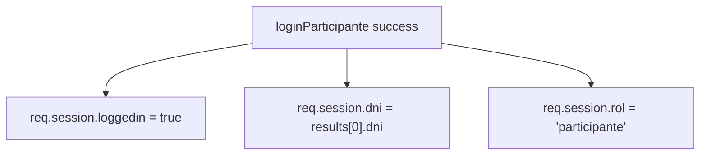
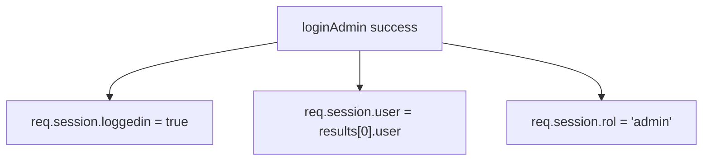
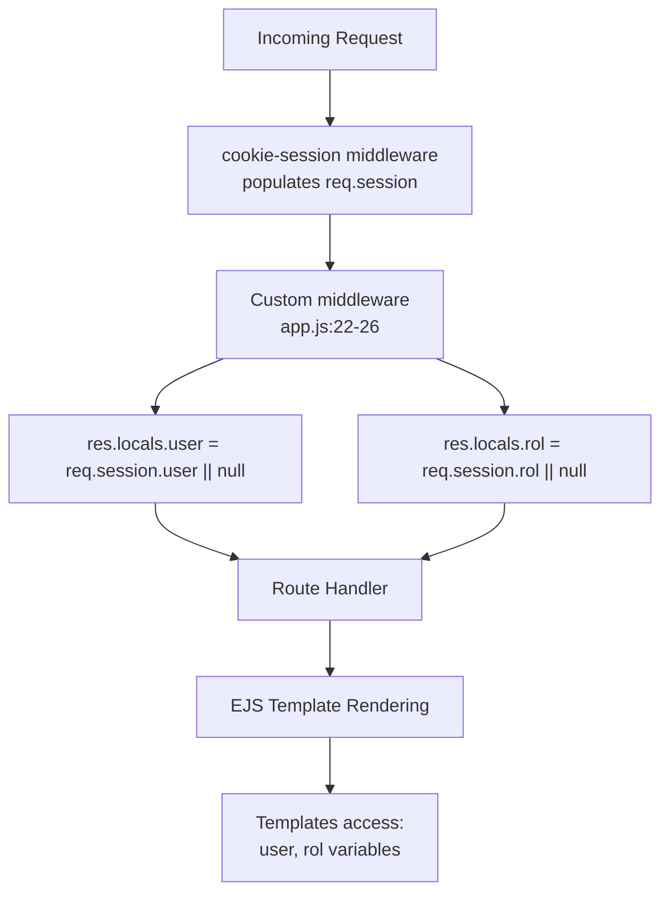
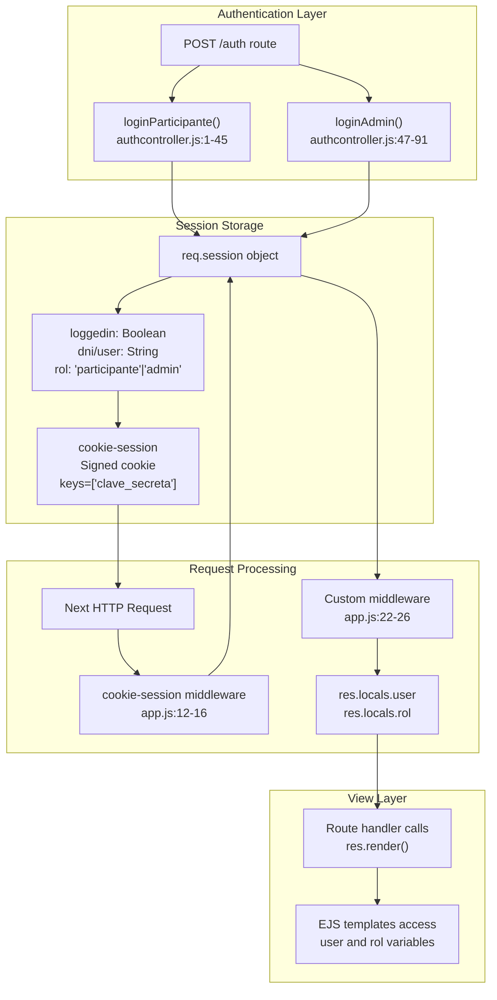

# Session Management

> **Relevant source files**
> * [app.js](https://github.com/Lourdes12587/Proyecto-Node.js/blob/3a172be7/app.js)
> * [controllers/authcontroller.js](https://github.com/Lourdes12587/Proyecto-Node.js/blob/3a172be7/controllers/authcontroller.js)

## Purpose and Scope

This document describes the session management implementation in the HAPPY RUNNER 42K application. Session management maintains authenticated user state across HTTP requests using cookie-based sessions with the `cookie-session` middleware. The system stores user identity, role information, and authentication status to enable role-based access control and personalized user experiences.

For information about how sessions are created during authentication, see [Login System](/Lourdes12587/Proyecto-Node.js/3.1-login-system). For details on how session data enforces access control, see [Role-Based Access Control](/Lourdes12587/Proyecto-Node.js/3.2-role-based-access-control).

---

## Session Configuration

The application configures session management using the `cookie-session` middleware package. Configuration occurs in [app.js L9-L16](https://github.com/Lourdes12587/Proyecto-Node.js/blob/3a172be7/app.js#L9-L16)

 with the following parameters:

```yaml
cookieSession({
    name: 'session',
    keys: ['clave_secreta'],  
    maxAge: 24 * 60 * 60 * 1000 
})
```

### Configuration Parameters

| Parameter | Value | Purpose |
| --- | --- | --- |
| `name` | `'session'` | Cookie name sent to client browser |
| `keys` | `['clave_secreta']` | Signing key array for cookie signature verification |
| `maxAge` | `24 * 60 * 60 * 1000` | Session expiration in milliseconds (24 hours) |

The `cookie-session` middleware stores session data directly in the cookie rather than using server-side session storage. Each request includes the session cookie, which is cryptographically signed using the `keys` array to prevent tampering. The middleware automatically validates the signature and populates `req.session` with the decoded session data.

**Sources:** [app.js L9-L16](https://github.com/Lourdes12587/Proyecto-Node.js/blob/3a172be7/app.js#L9-L16)

---

## Session Data Structure

Session data varies based on user role. The system stores different identifiers for participants (DNI-based) versus administrators (username-based), along with a common role indicator.

### Participant Session Schema



**Participant Session Properties:**

| Property | Type | Description | Set Location |
| --- | --- | --- | --- |
| `loggedin` | Boolean | Authentication status flag | [controllers/authcontroller.js L31](https://github.com/Lourdes12587/Proyecto-Node.js/blob/3a172be7/controllers/authcontroller.js#L31-L31) |
| `dni` | String | Participant's DNI identifier | [controllers/authcontroller.js L32](https://github.com/Lourdes12587/Proyecto-Node.js/blob/3a172be7/controllers/authcontroller.js#L32-L32) |
| `rol` | String | Role value: `"participante"` | [controllers/authcontroller.js L33](https://github.com/Lourdes12587/Proyecto-Node.js/blob/3a172be7/controllers/authcontroller.js#L33-L33) |

### Administrator Session Schema



**Administrator Session Properties:**

| Property | Type | Description | Set Location |
| --- | --- | --- | --- |
| `loggedin` | Boolean | Authentication status flag | [controllers/authcontroller.js L77](https://github.com/Lourdes12587/Proyecto-Node.js/blob/3a172be7/controllers/authcontroller.js#L77-L77) |
| `user` | String | Administrator username | [controllers/authcontroller.js L78](https://github.com/Lourdes12587/Proyecto-Node.js/blob/3a172be7/controllers/authcontroller.js#L78-L78) |
| `rol` | String | Role value: `"admin"` | [controllers/authcontroller.js L79](https://github.com/Lourdes12587/Proyecto-Node.js/blob/3a172be7/controllers/authcontroller.js#L79-L79) |

The `rol` property serves as the primary discriminator for role-based access control. Middleware guards check this value to enforce authorization rules (see [Role-Based Access Control](/Lourdes12587/Proyecto-Node.js/3.2-role-based-access-control)).

**Sources:** [controllers/authcontroller.js L31-L33](https://github.com/Lourdes12587/Proyecto-Node.js/blob/3a172be7/controllers/authcontroller.js#L31-L33)

 [controllers/authcontroller.js L77-L79](https://github.com/Lourdes12587/Proyecto-Node.js/blob/3a172be7/controllers/authcontroller.js#L77-L79)

---

## Session Lifecycle

The session lifecycle encompasses initialization during authentication, persistence across requests, and automatic expiration.

```

```

### Lifecycle Stages

**1. Session Initialization**

Sessions are created during successful authentication in `authcontroller.js`. The `loginParticipante` function [controllers/authcontroller.js L1-L45](https://github.com/Lourdes12587/Proyecto-Node.js/blob/3a172be7/controllers/authcontroller.js#L1-L45)

 handles participant logins, while `loginAdmin` [controllers/authcontroller.js L47-L91](https://github.com/Lourdes12587/Proyecto-Node.js/blob/3a172be7/controllers/authcontroller.js#L47-L91)

 handles administrator logins. Both functions follow the same pattern:

* Validate credentials against database
* Set `req.session.loggedin = true`
* Store user identifier (`dni` or `user`)
* Set `req.session.rol` to appropriate role

**2. Session Persistence**

On each request, `cookie-session` middleware [app.js L12-L16](https://github.com/Lourdes12587/Proyecto-Node.js/blob/3a172be7/app.js#L12-L16)

:

* Extracts the session cookie from request headers
* Verifies the cryptographic signature using `keys: ['clave_secreta']`
* Deserializes session data into `req.session` object
* Makes session data available to route handlers and subsequent middleware

**3. Session Expiration**

Sessions automatically expire after 24 hours (`maxAge: 24 * 60 * 60 * 1000` milliseconds). The browser discards expired cookies, and subsequent requests arrive without valid session data. Middleware guards redirect unauthenticated requests to appropriate login pages.

**Sources:** [app.js L12-L16](https://github.com/Lourdes12587/Proyecto-Node.js/blob/3a172be7/app.js#L12-L16)

 [controllers/authcontroller.js L31-L33](https://github.com/Lourdes12587/Proyecto-Node.js/blob/3a172be7/controllers/authcontroller.js#L31-L33)

 [controllers/authcontroller.js L77-L79](https://github.com/Lourdes12587/Proyecto-Node.js/blob/3a172be7/controllers/authcontroller.js#L77-L79)

---

## View Integration via res.locals

Session data integrates with the EJS view layer through `res.locals` population. Middleware in [app.js L22-L26](https://github.com/Lourdes12587/Proyecto-Node.js/blob/3a172be7/app.js#L22-L26)

 extracts session properties and makes them available to all rendered templates.



### res.locals Population

The middleware at [app.js L22-L26](https://github.com/Lourdes12587/Proyecto-Node.js/blob/3a172be7/app.js#L22-L26)

 runs on every request:

```javascript
app.use((req, res, next) => {
  res.locals.user = req.session.user || null;
  res.locals.rol = req.session.rol || null;
  next();
});
```

This pattern provides fallback values when no session exists (unauthenticated requests). EJS templates can safely reference `user` and `rol` variables without explicit null checks.

### Template Usage Patterns

**Role-Based Navigation**

The `header.ejs` partial uses `res.locals.rol` to render different navigation menus:

```
<% if (rol === 'admin') { %>
    <!-- Admin-specific navigation items -->
<% } else if (rol === 'participante') { %>
    <!-- Participant-specific navigation items -->
<% } else { %>
    <!-- Public navigation items -->
<% } %>
```

**Conditional Rendering**

Templates use `res.locals.user` to determine authentication status:

```
<% if (user) { %>
    <!-- Content for authenticated users -->
<% } else { %>
    <!-- Content for guests -->
<% } %>
```

The `res.locals` pattern ensures session data propagates to all views without explicit parameter passing in route handlers. This reduces code duplication and maintains consistency across the application.

**Sources:** [app.js L22-L26](https://github.com/Lourdes12587/Proyecto-Node.js/blob/3a172be7/app.js#L22-L26)

---

## Session Data Flow

This diagram shows the complete flow of session data from creation through view rendering, mapping natural language concepts to specific code entities:



**Sources:** [app.js L12-L16](https://github.com/Lourdes12587/Proyecto-Node.js/blob/3a172be7/app.js#L12-L16)

 [app.js L22-L26](https://github.com/Lourdes12587/Proyecto-Node.js/blob/3a172be7/app.js#L22-L26)

 [controllers/authcontroller.js L1-L45](https://github.com/Lourdes12587/Proyecto-Node.js/blob/3a172be7/controllers/authcontroller.js#L1-L45)

 [controllers/authcontroller.js L47-L91](https://github.com/Lourdes12587/Proyecto-Node.js/blob/3a172be7/controllers/authcontroller.js#L47-L91)

---

## Security Considerations

### Cookie Signing

The `cookie-session` middleware signs cookies using the `keys` array [app.js L14](https://github.com/Lourdes12587/Proyecto-Node.js/blob/3a172be7/app.js#L14-L14)

 The current implementation uses a single key `'clave_secreta'`. The signature prevents:

* **Cookie Tampering**: Clients cannot modify session data (e.g., changing `rol` from `"participante"` to `"admin"`) without invalidating the signature
* **Session Forgery**: Attackers cannot create valid session cookies without knowing the signing key

### Security Limitations

**Current Implementation Issues:**

| Issue | Impact | Recommendation |
| --- | --- | --- |
| Hardcoded signing key | Key exposed in source code | Move to environment variable (`process.env.SESSION_SECRET`) |
| No HTTPS enforcement | Cookies transmitted in plaintext over HTTP | Add `secure: true` flag in production |
| Missing `httpOnly` flag | Cookies accessible via JavaScript | Enable `httpOnly: true` to prevent XSS attacks |
| No `sameSite` policy | Vulnerable to CSRF attacks | Set `sameSite: 'strict'` or `'lax'` |

### Session Expiration

The 24-hour `maxAge` [app.js L15](https://github.com/Lourdes12587/Proyecto-Node.js/blob/3a172be7/app.js#L15-L15)

 balances security and user convenience. Users remain authenticated for one day without re-login. After expiration:

* Browser discards the cookie
* `req.session` becomes empty object
* Middleware guards detect missing `loggedin` flag
* Unauthenticated requests redirect to login pages

No server-side session invalidation exists. Users cannot explicitly "logout" to destroy sessions before expiration. Implementing logout requires clearing session data:

```
req.session = null;  // Clears all session data
```

**Sources:** [app.js L12-L16](https://github.com/Lourdes12587/Proyecto-Node.js/blob/3a172be7/app.js#L12-L16)

---

## Session Management Summary

The HAPPY RUNNER 42K application implements cookie-based session management with the following characteristics:

| Aspect | Implementation |
| --- | --- |
| **Middleware** | `cookie-session` package |
| **Storage** | Client-side cookies (signed, not encrypted) |
| **Duration** | 24 hours |
| **Signing Key** | `'clave_secreta'` (hardcoded) |
| **Session Properties** | `loggedin`, `dni`/`user`, `rol` |
| **View Integration** | `res.locals` population via custom middleware |
| **Role Discrimination** | `rol` property: `"participante"` or `"admin"` |

The session system enables stateful authentication without server-side session storage, integrating tightly with role-based access control and view rendering systems.

**Sources:** [app.js L9-L26](https://github.com/Lourdes12587/Proyecto-Node.js/blob/3a172be7/app.js#L9-L26)

 [controllers/authcontroller.js L31-L33](https://github.com/Lourdes12587/Proyecto-Node.js/blob/3a172be7/controllers/authcontroller.js#L31-L33)

 [controllers/authcontroller.js L77-L79](https://github.com/Lourdes12587/Proyecto-Node.js/blob/3a172be7/controllers/authcontroller.js#L77-L79)