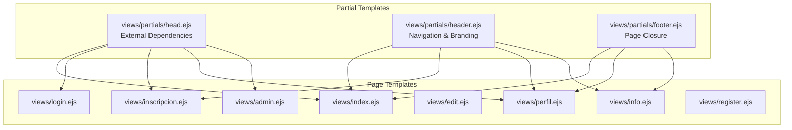
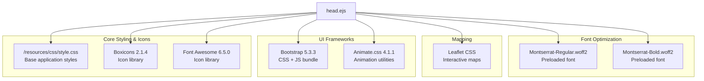
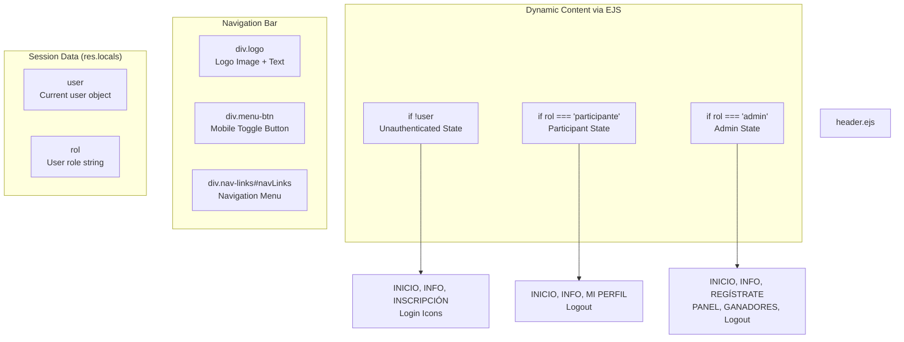
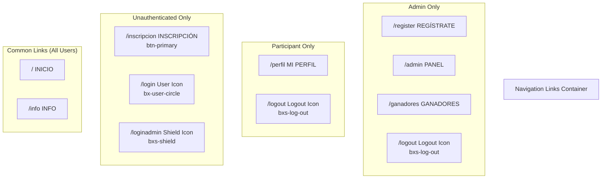

# Shared Components

> **Relevant source files**
> * [views/partials/head.ejs](https://github.com/Lourdes12587/Proyecto-Node.js/blob/3a172be7/views/partials/head.ejs)
> * [views/partials/header.ejs](https://github.com/Lourdes12587/Proyecto-Node.js/blob/3a172be7/views/partials/header.ejs)

## Purpose and Scope

This document describes the reusable EJS partial templates that provide consistent layout and functionality across all pages in the HAPPY RUNNER 42K application. These shared components establish a modular frontend architecture where common elements are defined once and included across multiple views.

The shared components consist of:

* **Head partial**: Centralizes external library loading, meta tags, and global dependencies
* **Header partial**: Implements role-based navigation and application branding
* **Footer partial**: Provides consistent page closure (referenced in architecture but not detailed here)

For information about the full page templates that consume these partials, see [Participant Interfaces](/Lourdes12587/Proyecto-Node.js/4.1-participant-interfaces) and [Admin Interfaces](/Lourdes12587/Proyecto-Node.js/4.2-admin-interfaces). For styling of these components, see [Design System](/Lourdes12587/Proyecto-Node.js/5.1-design-system).

---

## Partial Inclusion Architecture

The application uses EJS's partial inclusion mechanism to compose pages from reusable components. Each full page template includes shared partials, reducing code duplication and ensuring consistency.

**Partial Inclusion Pattern Diagram**



Sources: System architecture diagrams, `views/partials/head.ejs`, `views/partials/header.ejs`

---

## Head Partial

The `head.ejs` partial defines the HTML document head section, loading all external dependencies and establishing global page configuration. This partial is included in every page template, providing a single source of truth for library versions and meta tags.

### Document Configuration

The head partial establishes basic HTML5 document structure with UTF-8 encoding and responsive viewport configuration:

| Configuration | Value | Purpose |
| --- | --- | --- |
| Character Set | `utf-8` | UTF-8 encoding for international character support |
| Viewport | `width=device-width, initial-scale=1` | Responsive mobile-first rendering |
| IE Compatibility | `IE=edge` | Forces latest IE rendering engine |
| Page Title | "Happy Runner" | Browser tab title |
| Meta Description | Marathon event details | SEO optimization |

[views/partials/head.ejs L4-L8](https://github.com/Lourdes12587/Proyecto-Node.js/blob/3a172be7/views/partials/head.ejs#L4-L8)

### External Library Dependencies

The head partial loads six external library dependencies in a specific order to ensure proper initialization:

**External Library Loading Sequence**



**Detailed Library Configuration:**

| Library | Version | CDN/Local | Purpose in Application |
| --- | --- | --- | --- |
| `style.css` | Local | `/resources/css/style.css` | Base application styles, design tokens |
| Boxicons | 2.1.4 | unpkg.com | User interface icons (login, logout, profile) |
| Leaflet | Latest | unpkg.com | Interactive race route maps on landing and info pages |
| Montserrat Fonts | Custom | Local `/fonts/` | Primary typography, preloaded for performance |
| Animate.css | 4.1.1 | cdnjs | CSS animation utilities for transitions |
| Font Awesome | 6.5.0 | cdnjs | Additional icon set for UI elements |
| Bootstrap | 5.3.3 | jsdelivr | CSS framework and JavaScript components |

[views/partials/head.ejs L9-L17](https://github.com/Lourdes12587/Proyecto-Node.js/blob/3a172be7/views/partials/head.ejs#L9-L17)

### Font Preloading Strategy

The head partial implements font preloading for performance optimization. The `rel="preload"` directive instructs the browser to download Montserrat font files early in the page load process, preventing flash of unstyled text (FOUT):

* **Montserrat-Regular.woff2**: [views/partials/head.ejs L12](https://github.com/Lourdes12587/Proyecto-Node.js/blob/3a172be7/views/partials/head.ejs#L12-L12)
* **Montserrat-Bold.woff2**: [views/partials/head.ejs L13](https://github.com/Lourdes12587/Proyecto-Node.js/blob/3a172be7/views/partials/head.ejs#L13-L13)

Both fonts use `crossorigin` attribute to ensure proper CORS handling for font files.

### SEO and Metadata

The meta description provides search engine optimization with event-specific details:

```
"Maratón 42K Ciudad de Barcelona — 29 Nov 2025. Categorías masculina y femenina. 
Inscripciones abiertas. Kit oficial y puntos de hidratación."
```

This includes the event date (November 29, 2025), location (Barcelona), race categories, and key participant benefits.

Sources: `views/partials/head.ejs`

---

## Header Partial

The `header.ejs` partial implements the application's primary navigation bar with dynamic role-based menu items. This component closes the HTML `<head>` section and opens the `<body>`, establishing the page's visual hierarchy.

### Component Structure

**Header Component Architecture**



### Logo and Branding

The logo component combines the application icon with text branding:

* **Image**: `/resources/img/happy.png` displays the Happy Runner logo
* **Text**: "Happy Runner" span provides text-based branding
* **Container**: `.logo` div wrapper for styling and layout

[views/partials/header.ejs L6-L9](https://github.com/Lourdes12587/Proyecto-Node.js/blob/3a172be7/views/partials/header.ejs#L6-L9)

### Mobile Menu Toggle

The header includes a hamburger menu button for mobile responsiveness:

* **Element**: `.menu-btn` div with `onclick="toggleMenu()"` handler
* **Structure**: Three nested `<div>` elements create the hamburger icon lines
* **Target**: Toggles visibility of `#navLinks` navigation container

[views/partials/header.ejs L10-L14](https://github.com/Lourdes12587/Proyecto-Node.js/blob/3a172be7/views/partials/header.ejs#L10-L14)

### Role-Based Navigation System

The navigation menu dynamically renders different link sets based on the user's authentication state and role. The system reads `user` and `rol` variables from `res.locals`, which are populated by middleware on each request.

**Navigation Menu Variations Table**

| User State | Condition | Links Displayed |
| --- | --- | --- |
| **Unauthenticated** | `!user` | INICIO, INFO, INSCRIPCIÓN, User login icon, Admin login icon |
| **Participant** | `rol === 'participante'` | INICIO, INFO, MI PERFIL, Logout icon |
| **Administrator** | `rol === 'admin'` | INICIO, INFO, REGÍSTRATE, PANEL, GANADORES, Logout |

**Navigation Routes by Role**



### EJS Conditional Logic

The header partial uses EJS conditionals to determine which navigation items to render:

1. **Check for unauthenticated user**: [views/partials/header.ejs L18-L21](https://github.com/Lourdes12587/Proyecto-Node.js/blob/3a172be7/views/partials/header.ejs#L18-L21) * Renders registration link with `.btn-primary` class * Shows participant login icon (`bx-user-circle`) * Shows admin login icon (`bxs-shield`)
2. **Check for participant role**: [views/partials/header.ejs L22-L24](https://github.com/Lourdes12587/Proyecto-Node.js/blob/3a172be7/views/partials/header.ejs#L22-L24) * Displays "MI PERFIL" link to `/perfil` * Shows logout icon (`bxs-log-out`)
3. **Check for admin role**: [views/partials/header.ejs L25-L29](https://github.com/Lourdes12587/Proyecto-Node.js/blob/3a172be7/views/partials/header.ejs#L25-L29) * "REGÍSTRATE" link for registering new organizers * "PANEL" link to admin dashboard at `/admin` * "GANADORES" link to winner management * Logout icon

### Icon Integration

The header uses Boxicons for user interface icons:

| Icon Class | Visual | Purpose | Roles |
| --- | --- | --- | --- |
| `bx-user-circle` | User avatar | Participant login | Unauthenticated |
| `bxs-shield` | Shield | Admin login | Unauthenticated |
| `bxs-log-out` | Exit arrow | Logout action | Participant, Admin |

These icons are rendered as `<i>` elements within anchor tags.

### Session Variable Dependencies

The header partial depends on two `res.locals` variables populated by middleware in the application server:

* **`user`**: Object containing current user data (or `null`/`undefined` if not authenticated)
* **`rol`**: String indicating user role (`'participante'` or `'admin'`)

These variables are set by middleware that reads session data from `req.session` and makes it available to all EJS views. See [Session Management](/Lourdes12587/Proyecto-Node.js/3.3-session-management) for details on how these variables are populated.

Sources: `views/partials/header.ejs`

---

## Integration with Page Templates

Shared components are integrated into page templates using EJS include syntax. The typical pattern is:

```
<%- include('partials/head') %>
<%- include('partials/header') %>

<!-- Page-specific content -->

<%- include('partials/footer') %>
```

The `<%-` syntax executes the include directive and renders unescaped HTML, while `<%=` would escape HTML entities.

### Inclusion Patterns by Page Type

Different page types include different combinations of partials:

| Page Type | Head | Header | Footer | Reason |
| --- | --- | --- | --- | --- |
| Landing (`index.ejs`) | ✓ | ✓ | ✓ | Full layout with navigation |
| Login pages | ✓ | ✗ | ✗ | Focused authentication flow |
| Registration | ✓ | ✓ | ✗ | Public page with navigation |
| Profile pages | ✓ | ✓ | ✓ | Authenticated user pages |
| Admin pages | ✓ | ✓ | ✗ | Admin-specific layout |
| Info page | ✓ | ✓ | ✓ | Public information page |

This selective inclusion allows pages to maintain consistency while adapting layout to their specific context.

Sources: System architecture diagrams

---

## Styling and Customization

While the head partial loads the base `style.css` stylesheet, individual pages can supplement this with additional page-specific stylesheets loaded after the shared components. This creates a cascade where:

1. **Global styles** from `style.css` apply to all elements, including shared components
2. **Page-specific styles** override or extend global styles as needed

The navigation bar in `header.ejs` uses classes like `.logo`, `.menu-btn`, and `.nav-links` that are styled in `style.css`. The `.btn-primary` class on the registration link provides consistent button styling across the application.

For detailed information about the styling system, see [Design System](/Lourdes12587/Proyecto-Node.js/5.1-design-system) and [Component Styles](/Lourdes12587/Proyecto-Node.js/5.2-component-styles).

Sources: `views/partials/head.ejs`, `views/partials/header.ejs`