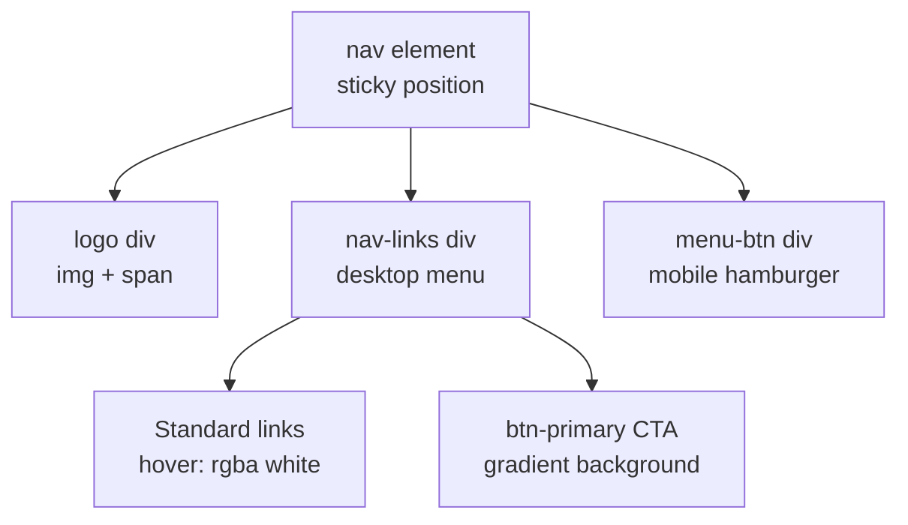
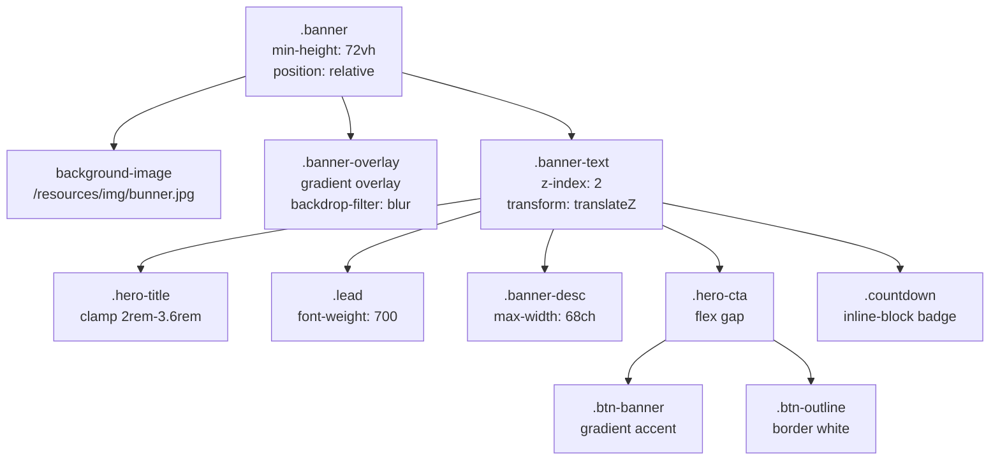
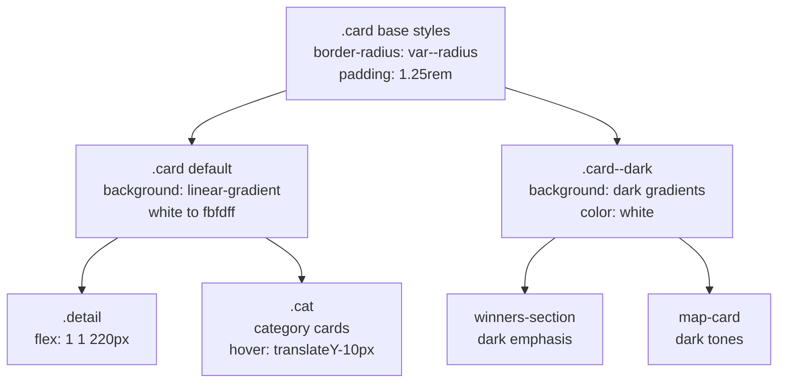
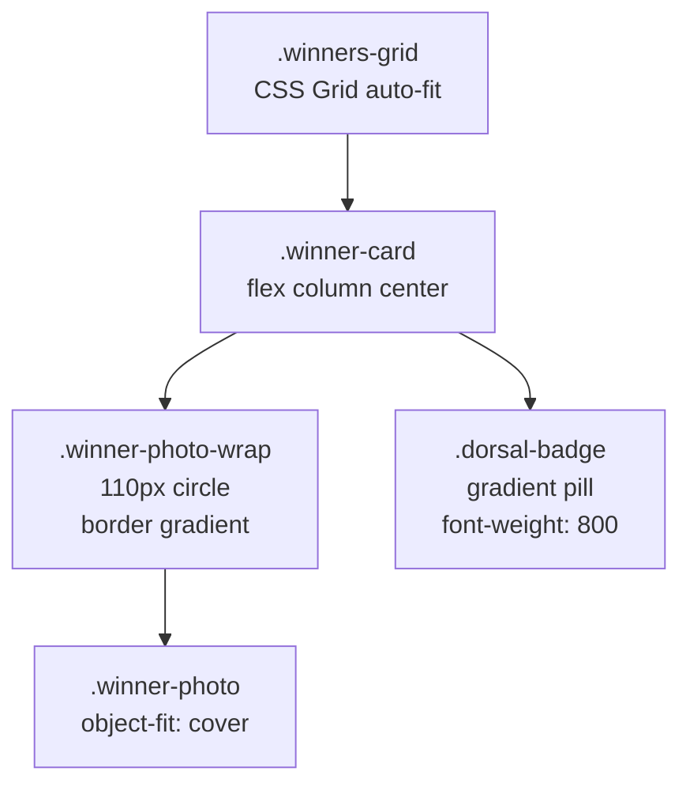
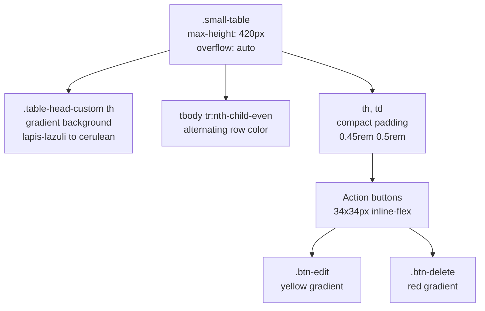
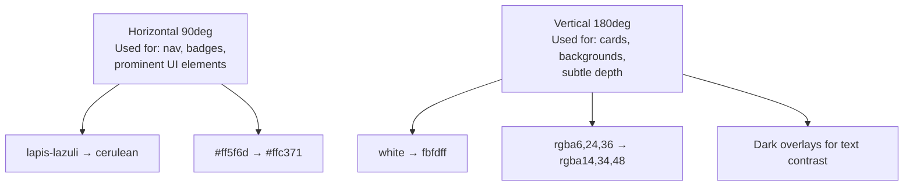
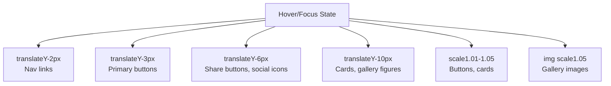
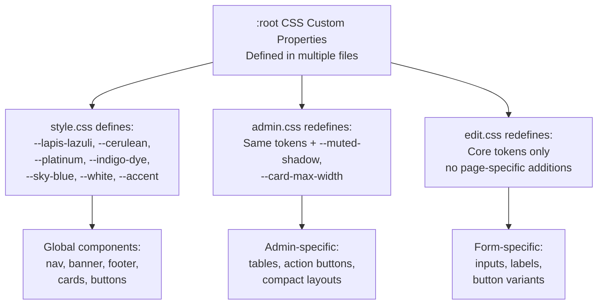

# Styling System

> **Relevant source files**
> * [middlewares/multer.js](https://github.com/Lourdes12587/Proyecto-Node.js/blob/3a172be7/middlewares/multer.js)
> * [middlewares/verifyAdmin.js](https://github.com/Lourdes12587/Proyecto-Node.js/blob/3a172be7/middlewares/verifyAdmin.js)
> * [middlewares/verifyToken.js](https://github.com/Lourdes12587/Proyecto-Node.js/blob/3a172be7/middlewares/verifyToken.js)
> * [public/css/admin.css](https://github.com/Lourdes12587/Proyecto-Node.js/blob/3a172be7/public/css/admin.css)
> * [public/css/edit.css](https://github.com/Lourdes12587/Proyecto-Node.js/blob/3a172be7/public/css/edit.css)
> * [public/css/style.css](https://github.com/Lourdes12587/Proyecto-Node.js/blob/3a172be7/public/css/style.css)

## Purpose and Scope

This document describes the CSS architecture and styling system used throughout the HAPPY RUNNER 42K application. The styling system is built on a foundation of CSS custom properties (design tokens), modular page-specific stylesheets, and responsive design patterns. All styles follow a consistent design language centered around a blue/teal color palette and modern gradient effects.

For information about the EJS view templates that these styles are applied to, see [User Interfaces](/Lourdes12587/Proyecto-Node.js/4-user-interfaces). For details about external library integration (Bootstrap, Leaflet, Font Awesome), see [Shared Components](/Lourdes12587/Proyecto-Node.js/4.3-shared-components).

---

## CSS Architecture Overview

The styling system follows a modular architecture where a base stylesheet defines global design tokens and reusable patterns, while page-specific stylesheets handle component-level customization.

### Stylesheet Organization

```

```

**Sources:** [public/css/style.css L1-L721](https://github.com/Lourdes12587/Proyecto-Node.js/blob/3a172be7/public/css/style.css#L1-L721)

 [public/css/admin.css L1-L157](https://github.com/Lourdes12587/Proyecto-Node.js/blob/3a172be7/public/css/admin.css#L1-L157)

 [public/css/edit.css L1-L150](https://github.com/Lourdes12587/Proyecto-Node.js/blob/3a172be7/public/css/edit.css#L1-L150)

---

## Design Token System

The application uses CSS custom properties defined in `:root` blocks to maintain a consistent design language across all pages. These tokens are accessible globally and ensure visual coherence.

### Core Color Palette

| Token Name | Value | Usage |
| --- | --- | --- |
| `--lapis-lazuli` | `#2f6690ff` | Primary brand color, navigation gradients, headings |
| `--cerulean` | `#3a7ca5ff` | Secondary brand color, gradient endpoints |
| `--platinum` | `#d9dcd6ff` | Background tints, subtle overlays |
| `--indigo-dye` | `#16425bff` | Dark text, strong contrast elements |
| `--sky-blue` | `#81c3d7ff` | Accent color, badges, highlights |
| `--white` | `#ffffff` | Text on dark backgrounds, card backgrounds |
| `--accent` | `#d2643c` | Call-to-action elements (only in style.css) |

The color system is defined identically across all stylesheets:

[public/css/style.css L3-L11](https://github.com/Lourdes12587/Proyecto-Node.js/blob/3a172be7/public/css/style.css#L3-L11)

```css
:root {
  --lapis-lazuli: #2f6690ff;
  --cerulean:     #3a7ca5ff;
  --platinum:     #d9dcd6ff;
  --indigo-dye:   #16425bff;
  --sky-blue:     #81c3d7ff;
  --white:        #ffffff;
  --accent:       #d2643c;
  --glass:        rgba(255,255,255,0.96);
}
```

### Spacing and Layout Tokens

| Token | Value | Purpose |
| --- | --- | --- |
| `--radius` | `14px` | Default border radius for cards and components |
| `--gap` | `1rem` | Standard spacing between elements |
| `--max-width` | `1200px` | Maximum content width for containers |
| `--card-max-width` | `980px` | Maximum width for admin cards (admin.css only) |

### Shadow System

| Token | Value | Application |
| --- | --- | --- |
| `--shadow-soft` | `0 12px 32px rgba(10,30,45,0.08)` | Default card elevation |
| `--shadow-strong` | `0 20px 60px rgba(10,30,45,0.14)` | Hover states, emphasized elements |
| `--muted-shadow` | `rgba(22,66,91,0.08)` | Subtle shadows (admin.css) |

### Typography Tokens

[public/css/style.css L22-L27](https://github.com/Lourdes12587/Proyecto-Node.js/blob/3a172be7/public/css/style.css#L22-L27)

```
/* typography (AUMENTADO) */
--fz-base: 18px;         /* aumentado para mejor lectura */
--fz-lg: 1.25rem;
--fz-sm: .95rem;
--leading: 1.55;
```

**Sources:** [public/css/style.css L3-L27](https://github.com/Lourdes12587/Proyecto-Node.js/blob/3a172be7/public/css/style.css#L3-L27)

 [public/css/admin.css L1-L11](https://github.com/Lourdes12587/Proyecto-Node.js/blob/3a172be7/public/css/admin.css#L1-L11)

 [public/css/edit.css L2-L9](https://github.com/Lourdes12587/Proyecto-Node.js/blob/3a172be7/public/css/edit.css#L2-L9)

---

## Global Base Styles

The base stylesheet [public/css/style.css](https://github.com/Lourdes12587/Proyecto-Node.js/blob/3a172be7/public/css/style.css)

 establishes foundational styles that apply across all pages.

### Box Model and Reset

[public/css/style.css L29-L40](https://github.com/Lourdes12587/Proyecto-Node.js/blob/3a172be7/public/css/style.css#L29-L40)

```css
/* ----------------- Base / Reset ----------------- */
* { box-sizing: border-box; }
html, body { height: 100%; }
body{
  margin: 0;
  font-family: "Montserrat", system-ui, -apple-system, "Segoe UI", Roboto, "Helvetica Neue", Arial; 
  font-size: var(--fz-base);
  line-height: var(--leading);
  color: var(--indigo-dye);
  background: linear-gradient(180deg, var(--platinum) 0%, #f4fbff 100%);
  -webkit-font-smoothing:antialiased;
}
```

All pages use the **Montserrat** font family with system font fallbacks. The body has a subtle gradient background from `--platinum` to a light blue tint.

### Container Utility

[public/css/style.css L42-L43](https://github.com/Lourdes12587/Proyecto-Node.js/blob/3a172be7/public/css/style.css#L42-L43)

```css
.container { width: calc(100% - 2rem); max-width: var(--max-width); margin: 0 auto; padding: 0 1rem; }
```

The `.container` class provides centered content with responsive width and maximum constraints.

**Sources:** [public/css/style.css L29-L43](https://github.com/Lourdes12587/Proyecto-Node.js/blob/3a172be7/public/css/style.css#L29-L43)

---

## Navigation System

The navigation bar uses a sticky positioning pattern with gradient backgrounds and responsive behavior.

### Desktop Navigation Structure



[public/css/style.css L45-L58](https://github.com/Lourdes12587/Proyecto-Node.js/blob/3a172be7/public/css/style.css#L45-L58)

```css
nav {
  display: flex;
  align-items: center;
  justify-content: space-between;
  padding: 1rem 2rem;
  background: linear-gradient(90deg, var(--lapis-lazuli), var(--cerulean));
  color: var(--white);
  position: sticky;
  top: 0;
  z-index: 120;
  box-shadow: 0 4px 20px rgba(0, 0, 0, 0.1);
  font-family: 'Montserrat', system-ui, sans-serif;
}
```

### Navigation Link Styles

| Class | Styling | Purpose |
| --- | --- | --- |
| `.nav-links a` | White text, `0.5rem 1rem` padding, `border-radius: 12px` | Standard navigation links |
| `.nav-links a:hover` | `background: rgba(255, 255, 255, 0.15)`, `transform: translateY(-2px)` | Hover state with subtle lift |
| `.nav-links a.btn-primary` | Gradient `#ff5f6d` to `#ffc371`, rounded pill shape | Special CTA button (Inscripción) |

### Mobile Navigation Behavior

[public/css/style.css L150-L167](https://github.com/Lourdes12587/Proyecto-Node.js/blob/3a172be7/public/css/style.css#L150-L167)

```css
@media (max-width: 780px) {
  .menu-btn { display: flex; }
  .nav-links {
    display: none;
    flex-direction: column;
    position: absolute;
    top: 70px;
    right: 12px;
    background: rgba(0,0,0,0.7);
    border-radius: 12px;
    padding: 1rem;
    min-width: 220px;
  }
  .nav-links.active { display: flex; }
}
```

On mobile (≤780px), the navigation collapses into a hamburger menu. The `.menu-btn` displays three horizontal bars that toggle the `.nav-links.active` state via JavaScript.

**Sources:** [public/css/style.css L45-L167](https://github.com/Lourdes12587/Proyecto-Node.js/blob/3a172be7/public/css/style.css#L45-L167)

---

## Hero Banner System

The landing page hero banner combines a background image, overlay effects, and parallax-inspired transforms.

### Banner Structure and Styling



[public/css/style.css L209-L229](https://github.com/Lourdes12587/Proyecto-Node.js/blob/3a172be7/public/css/style.css#L209-L229)

```
.banner {
  position: relative;
  min-height: 72vh;
  display: flex;
  align-items: center;
  overflow: hidden;
  background-image: url('/resources/img/bunner.jpg');
  background-size: cover;
  background-position: center;
  perspective: 1400px;
  transition: transform .18s ease;
}

/* overlay intenso para mejor contraste del texto */
.banner-overlay {
  position: absolute;
  inset: 0;
  background: linear-gradient(180deg, rgba(6,24,36,0.72), rgba(17,46,66,0.45));
  z-index: 1;
  backdrop-filter: blur(2px);
}
```

The banner uses a dark gradient overlay (`rgba(6,24,36,0.72)` to `rgba(17,46,66,0.45)`) with a 2px blur to ensure text contrast over the background image.

### Responsive Typography

The `.hero-title` uses `clamp()` for fluid typography:

[public/css/style.css L243-L249](https://github.com/Lourdes12587/Proyecto-Node.js/blob/3a172be7/public/css/style.css#L243-L249)

```css
.hero-title {
  font-size: clamp(2rem, 5.2vw, 3.6rem);
  margin: 0.1rem 0;
  font-weight: 800;
  letter-spacing: -0.02em;
  line-height: 1.02;
}
```

This scales from 2rem (mobile) to 3.6rem (desktop) based on viewport width.

**Sources:** [public/css/style.css L208-L297](https://github.com/Lourdes12587/Proyecto-Node.js/blob/3a172be7/public/css/style.css#L208-L297)

---

## Card System

Cards are the primary content container pattern, with two variants: light (default) and dark (emphasized).

### Card Component Hierarchy



[public/css/style.css L318-L348](https://github.com/Lourdes12587/Proyecto-Node.js/blob/3a172be7/public/css/style.css#L318-L348)

```css
.card {
  border-radius: var(--radius);
  padding: 1.25rem;
  box-shadow: var(--shadow-soft);
  border: 1px solid rgba(22,66,91,0.06);
  background: linear-gradient(180deg, rgba(255,255,255,0.98), #fbfdff);
  transition: transform .18s ease, box-shadow .18s ease;
}

/* Dark / Emphasized card (más color oscuro y contraste) */
.card--dark {
  background: linear-gradient(180deg, rgba(6,24,36,0.92), rgba(14,34,48,0.94));
  color: var(--white);
  border: 1px solid rgba(255,255,255,0.04);
  box-shadow: var(--shadow-strong);
}
```

### Category Cards with Hover Effects

[public/css/style.css L354-L365](https://github.com/Lourdes12587/Proyecto-Node.js/blob/3a172be7/public/css/style.css#L354-L365)

```css
.cat {
  flex: 1 1 300px;
  border-radius: var(--radius);
  padding: 1.25rem;
  border: 1px solid rgba(22,66,91,0.06);
  box-shadow: var(--shadow-soft);
  background: linear-gradient(180deg, var(--white), #fbfdff);
  transition: transform .28s cubic-bezier(.2,.9,.3,1), box-shadow .28s;
}
.cat:hover { transform: translateY(-10px); box-shadow: var(--shadow-strong); }
```

Category cards (`.cat`) lift 10px on hover with a cubic-bezier easing for smooth animation.

**Sources:** [public/css/style.css L316-L365](https://github.com/Lourdes12587/Proyecto-Node.js/blob/3a172be7/public/css/style.css#L316-L365)

---

## Specialized Component Styles

### Photo Gallery Grid

[public/css/style.css L368-L385](https://github.com/Lourdes12587/Proyecto-Node.js/blob/3a172be7/public/css/style.css#L368-L385)

```
.gallery-container {
  display: grid;
  grid-template-columns: repeat(auto-fit, minmax(240px, 1fr));
  gap: 1rem;
  margin-top: 0.5rem;
}
.gallery-container figure {
  border-radius: 12px;
  overflow: hidden;
  background: linear-gradient(180deg, rgba(6,24,36,0.03), rgba(6,24,36,0.01));
  box-shadow: var(--shadow-soft);
  transition: transform .36s ease, box-shadow .22s;
}
.gallery-container img { width:100%; height: 260px; object-fit: cover; transition: transform .5s ease, filter .3s; display:block; }
.gallery-container figure:hover { transform: translateY(-10px); box-shadow: var(--shadow-strong); }
.gallery-container figure:hover img { transform: scale(1.05); filter: brightness(1.03); }
```

The gallery uses CSS Grid with `auto-fit` and `minmax()` for responsive columns. Hover effects include:

* Container lift: `translateY(-10px)`
* Image zoom: `scale(1.05)`
* Brightness increase: `brightness(1.03)`

### Leaflet Map Container

[public/css/style.css L408-L428](https://github.com/Lourdes12587/Proyecto-Node.js/blob/3a172be7/public/css/style.css#L408-L428)

```css
.map-wrapper {
  max-width: 1000px;
  margin: 0 auto;
  padding: 1rem;
  border-radius: 16px;
  background: #fff;
  box-shadow: 0 8px 35px rgba(0, 40, 70, 0.10);
  border: 1px solid rgba(0, 60, 120, 0.08);
  animation: fadeIn .6s ease-out forwards;
}

#map {
  width: 100%;
  height: 450px;
  border-radius: 14px;
  overflow: hidden;
  border: 2px solid rgba(22,66,91,0.08);
  box-shadow: 0 12px 40px rgba(10,40,60,0.12);
}
```

The `#map` element is styled as a rounded, shadowed container. Custom Leaflet popup styles override defaults:

[public/css/style.css L431-L442](https://github.com/Lourdes12587/Proyecto-Node.js/blob/3a172be7/public/css/style.css#L431-L442)

```css
.leaflet-popup-content-wrapper {
  border-radius: 10px;
  background: #ffffff;
  color: #1b3a57;
  font-weight: 600;
  border: 1px solid rgba(0,45,95,0.08);
  box-shadow: 0 10px 30px rgba(0,0,0,0.15);
}
```

### Winner Cards Display



[public/css/style.css L466-L485](https://github.com/Lourdes12587/Proyecto-Node.js/blob/3a172be7/public/css/style.css#L466-L485)

```css
.winners-grid {
  display: grid;
  grid-template-columns: repeat(auto-fit, minmax(160px, 1fr));
  gap: 14px;
}
.winner-card {
  display:flex; flex-direction:column; align-items:center; text-align:center; padding:14px; border-radius:12px;
  background: linear-gradient(180deg,#fff,#f7fbff);
  box-shadow: var(--shadow-soft); transition: transform .18s, box-shadow .18s;
}
.winner-card:hover { transform: translateY(-8px); box-shadow: var(--shadow-strong); }
.winner-photo-wrap { width:110px; height:110px; border-radius:999px; overflow:hidden; display:flex; align-items:center; justify-content:center; margin-bottom:10px; border: 3px solid rgba(47,102,144,0.06); background: linear-gradient(180deg, rgba(47,102,144,0.04), rgba(58,124,165,0.02)); }
```

Winner photos are displayed in 110px circular containers with subtle gradient borders. The `.dorsal-badge` uses the primary gradient:

[public/css/style.css L481-L485](https://github.com/Lourdes12587/Proyecto-Node.js/blob/3a172be7/public/css/style.css#L481-L485)

```css
.dorsal-badge {
  display:inline-block; padding:6px 10px; border-radius:999px;
  background: linear-gradient(90deg, var(--lapis-lazuli), var(--cerulean));
  color: #fff; font-weight: 800; margin-left: .5rem;
}
```

**Sources:** [public/css/style.css L368-L491](https://github.com/Lourdes12587/Proyecto-Node.js/blob/3a172be7/public/css/style.css#L368-L491)

---

## Footer System

The footer implements a three-column grid layout with brand identity, navigation links, and social elements.

### Footer Structure

[public/css/style.css L525-L542](https://github.com/Lourdes12587/Proyecto-Node.js/blob/3a172be7/public/css/style.css#L525-L542)

```css
.site-footer {
  background: var(--lapis-lazuli);
  color: var(--white);
  padding: 3rem 1.5rem 2rem;
  font-family: system-ui, -apple-system, "Segoe UI", Roboto, "Helvetica Neue", Arial;
  line-height: 1.5;
}

.footer-grid {
  display: grid;
  grid-template-columns: repeat(3, 1fr);
  gap: 2rem;
  align-items: start;
  max-width: 1200px;
  margin: 0 auto;
}
```

### Social Icon Styling

[public/css/style.css L624-L651](https://github.com/Lourdes12587/Proyecto-Node.js/blob/3a172be7/public/css/style.css#L624-L651)

```css
.social-icon {
  display: inline-flex;
  align-items: center;
  justify-content: center;
  width: 56px;
  height: 56px;
  border-radius: 999px;
  border: 1px solid rgba(255,255,255,0.2);
  text-decoration: none;
  color: var(--white);
  background: rgba(255,255,255,0.08);
  transition: transform 0.16s ease, box-shadow 0.16s ease, background 0.16s ease;
  flex: 0 0 56px;
}
.social-icon:hover,
.social-icon:focus {
  transform: translateY(-6px) scale(1.05);
  box-shadow: 0 16px 40px rgba(0,0,0,0.25);
  background: rgba(255,255,255,0.16);
  color: var(--platinum);
  outline: none;
}
```

Social icons are 56px circles with hover effects including vertical lift and scale transform.

**Sources:** [public/css/style.css L525-L720](https://github.com/Lourdes12587/Proyecto-Node.js/blob/3a172be7/public/css/style.css#L525-L720)

---

## Page-Specific Stylesheets

### Admin Panel Styles

The admin panel stylesheet extends the base design system for table-heavy interfaces.

#### Admin Card Container

[public/css/admin.css L36-L44](https://github.com/Lourdes12587/Proyecto-Node.js/blob/3a172be7/public/css/admin.css#L36-L44)

```css
.login-container.admin-card {
  width: 100%;
  max-width: 900px; /* ancho total de la tarjeta con tabla */
  background: linear-gradient(180deg, #ffffff, var(--platinum));
  border-radius: 14px;
  padding: 18px;
  box-shadow: 0 10px 30px var(--muted-shadow);
  border: 1px solid rgba(22,66,91,0.06);
}
```

The `.admin-card` uses a wider max-width (900px) to accommodate data tables.

#### Table Styling



[public/css/admin.css L75-L105](https://github.com/Lourdes12587/Proyecto-Node.js/blob/3a172be7/public/css/admin.css#L75-L105)

```css
.small-table {
  max-height: 420px;
  overflow: auto;
  border-radius: 8px;
  background: #fff;
  padding: 6px;
  margin-top: 6px;
}

.table-head-custom th {
  background: linear-gradient(90deg, var(--lapis-lazuli), var(--cerulean));
  color: var(--white);
  font-weight: 700;
  font-size: 0.85rem;
  border: none;
}

.table th, .table td {
  padding: 0.45rem 0.5rem;
  vertical-align: middle;
  font-size: 0.86rem;
  border-color: rgba(22,66,91,0.06);
}

.table tbody tr:nth-child(even) {
  background: rgba(24,86,121,0.03);
}
```

Action buttons (`.btn-edit` and `.btn-delete`) are compact 34x34px squares:

[public/css/admin.css L107-L131](https://github.com/Lourdes12587/Proyecto-Node.js/blob/3a172be7/public/css/admin.css#L107-L131)

```sql
.btn-edit, .btn-delete {
  width: 34px;
  height: 34px;
  display: inline-flex;
  align-items: center;
  justify-content: center;
  padding: 0;
  border-radius: 10px;
  border: none;
  cursor: pointer;
}

/* estilo edit (amarillo/contrast) */
.btn-edit {
  background: linear-gradient(180deg, rgba(255,239,186,0.95), rgba(255,249,230,0.95));
  color: #7a5a00;
  border: 1px solid rgba(122,90,0,0.08);
}

/* estilo delete (suave) */
.btn-delete {
  background: linear-gradient(180deg, rgba(255,232,232,0.95), rgba(255,245,245,0.95));
  color: #8b1e1e;
  border: 1px solid rgba(139,30,30,0.06);
}
```

**Sources:** [public/css/admin.css L1-L157](https://github.com/Lourdes12587/Proyecto-Node.js/blob/3a172be7/public/css/admin.css#L1-L157)

### Edit Profile Form Styles

The edit profile stylesheet provides form-focused styling with input states.

#### Form Container

[public/css/edit.css L26-L41](https://github.com/Lourdes12587/Proyecto-Node.js/blob/3a172be7/public/css/edit.css#L26-L41)

```css
.container.mt-4.w-50 {
  max-width: 460px;       /* compact width */
  width: 100%;
  margin: 36px auto !important;  /* center horizontally and add vertical spacing */
  padding-left: 12px;
  padding-right: 12px;
}

.container .card {
  border: none;
  border-radius: 14px;
  overflow: hidden;
  box-shadow: 0 12px 40px rgba(22,66,91,0.12);
  background: linear-gradient(180deg, rgba(255,255,255,0.98), #ffffff);
}
```

The form card is constrained to 460px for a focused editing experience.

#### Input Field Styling

[public/css/edit.css L66-L81](https://github.com/Lourdes12587/Proyecto-Node.js/blob/3a172be7/public/css/edit.css#L66-L81)

```css
.container .form-control {
  border-radius: 10px;
  border: 1px solid rgba(22,66,91,0.12);
  background: linear-gradient(180deg, #fff, var(--platinum));
  padding: 10px 12px;
  box-shadow: none;
  transition: box-shadow .15s ease, border-color .12s ease, transform .09s ease;
}

.container .form-control:focus {
  border-color: var(--cerulean);
  box-shadow: 0 10px 30px rgba(58,124,165,0.08);
  transform: translateY(-1px);
  outline: none;
}
```

Form inputs have a subtle gradient background and lift slightly on focus with shadow and border color changes.

#### Button Variants

| Button Class | Styling | Usage |
| --- | --- | --- |
| `.btn.btn-primary` | Gradient `lapis-lazuli` to `cerulean`, pill shape, `font-weight: 800` | Primary action (Guardar) |
| `.btn.btn-danger` | Transparent background, `lapis-lazuli` border, `font-weight: 700` | Secondary action (Cancelar) |

[public/css/edit.css L84-L128](https://github.com/Lourdes12587/Proyecto-Node.js/blob/3a172be7/public/css/edit.css#L84-L128)

```css
.container .card .btn.btn-primary,
.container .card .btn.btn-primary:visited {
  display: inline-block;
  margin-top: 12px;
  width: 100%;
  padding: 10px 14px;
  border-radius: 999px;
  font-weight: 800;
  letter-spacing: 0.5px;
  text-align: center;
  text-decoration: none;
  background: linear-gradient(90deg, var(--lapis-lazuli), var(--cerulean)) !important;
  color: var(--white) !important;
  box-shadow: 0 12px 30px rgba(58,124,165,0.14);
  border: 0;
  transition: transform .12s ease, box-shadow .12s ease, opacity .12s ease;
}

.container .card .btn.btn-danger {
  display: inline-block;
  margin-top: 10px;
  width: 100%;
  padding: 9px 14px;
  border-radius: 999px;
  font-weight: 700;
  color: var(--lapis-lazuli) !important;
  background: transparent !important;
  border: 2px solid rgba(47,102,144,0.12);
  transition: all .12s ease;
}
```

**Sources:** [public/css/edit.css L1-L150](https://github.com/Lourdes12587/Proyecto-Node.js/blob/3a172be7/public/css/edit.css#L1-L150)

---

## Responsive Design Strategy

The styling system uses multiple breakpoint strategies for responsive behavior.

### Breakpoint Table

| Breakpoint | Applies To | Key Changes |
| --- | --- | --- |
| `max-width: 980px` | Global layout | Column layouts become single-column, reduced hero title size |
| `max-width: 780px` | Navigation | Hamburger menu activation, mobile nav dropdown |
| `max-width: 768px` | Map section | Map height reduced to 350px |
| `max-width: 680px` | Gallery, banner | Gallery images reduced to 200px, banner height to 55vh |
| `max-width: 576px` | Forms, admin | Compact card sizing, reduced padding |
| `max-width: 560px` | Footer | Single-column footer grid |

### Navigation Mobile Transformation

[public/css/style.css L150-L167](https://github.com/Lourdes12587/Proyecto-Node.js/blob/3a172be7/public/css/style.css#L150-L167)

```css
@media (max-width: 780px) {
  .menu-btn { display: flex; }
  .nav-links {
    display: none;
    flex-direction: column;
    position: absolute;
    top: 70px;
    right: 12px;
    background: rgba(0,0,0,0.7);
    border-radius: 12px;
    padding: 1rem;
    min-width: 220px;
  }

  .nav-links.active { display: flex; }

  .nav-links a { padding: 0.65rem 1rem; font-size: 0.95rem; }
}
```

### Admin Panel Responsive Adjustments

[public/css/admin.css L146-L156](https://github.com/Lourdes12587/Proyecto-Node.js/blob/3a172be7/public/css/admin.css#L146-L156)

```css
@media (max-width: 992px) {
  .login-container.admin-card { max-width: 720px; padding: 14px; }
  .small-table { max-height: 360px; }
}
@media (max-width: 576px) {
  .auth-wrapper { padding: 20px 10px; min-height: calc(100vh - 120px); }
  .login-container.admin-card { max-width: 360px; padding: 12px; }
  .table th, .table td { font-size: 0.78rem; padding: 0.32rem 0.36rem; }
  .small-table { max-height: 300px; }
  .cta-btn { padding: 6px 8px; font-size: 0.85rem; }
}
```

The admin table progressively reduces: 720px wide at medium screens, 360px at mobile, with smaller font sizes and padding.

### Footer Responsive Grid

[public/css/style.css L709-L720](https://github.com/Lourdes12587/Proyecto-Node.js/blob/3a172be7/public/css/style.css#L709-L720)

```
@media (max-width: 980px) {
  .footer-grid { grid-template-columns: repeat(2, 1fr); }
  .footer-legal { flex-direction: column; align-items: flex-start; gap: 0.5rem; }
}
@media (max-width: 560px) {
  .footer-grid { grid-template-columns: 1fr; }
  .newsletter { width: 100%; }
  .footer-legal { align-items: center; text-align: center; }
  .social-icon { width: 48px; height: 48px; }
  .social-icon svg { width: 22px; height: 22px; }
  .footer-sponsors img { height: 44px; }
}
```

The footer transforms from three columns → two columns (980px) → single column (560px).

**Sources:** [public/css/style.css L150-L167](https://github.com/Lourdes12587/Proyecto-Node.js/blob/3a172be7/public/css/style.css#L150-L167)

 [public/css/style.css L451-L508](https://github.com/Lourdes12587/Proyecto-Node.js/blob/3a172be7/public/css/style.css#L451-L508)

 [public/css/style.css L709-L720](https://github.com/Lourdes12587/Proyecto-Node.js/blob/3a172be7/public/css/style.css#L709-L720)

 [public/css/admin.css L146-L156](https://github.com/Lourdes12587/Proyecto-Node.js/blob/3a172be7/public/css/admin.css#L146-L156)

 [public/css/edit.css L136-L144](https://github.com/Lourdes12587/Proyecto-Node.js/blob/3a172be7/public/css/edit.css#L136-L144)

---

## Accessibility Features

The styling system incorporates multiple accessibility considerations.

### Focus Visibility

[public/css/style.css L170-L177](https://github.com/Lourdes12587/Proyecto-Node.js/blob/3a172be7/public/css/style.css#L170-L177)

```
.menu-btn:focus,
.nav-links a:focus,
.nav-links a:focus-visible {
  outline: 3px solid rgba(129, 195, 215, 0.18);
  outline-offset: 3px;
  border-radius: 8px;
}
```

All interactive elements receive a 3px outline with offset on focus, using the `--sky-blue` color at 18% opacity.

[public/css/style.css L495](https://github.com/Lourdes12587/Proyecto-Node.js/blob/3a172be7/public/css/style.css#L495-L495)

```
a:focus, button:focus, input:focus { outline: 3px solid rgba(129,195,215,0.16); outline-offset: 3px; border-radius: 8px; }
```

### Reduced Motion Support

[public/css/style.css L511-L513](https://github.com/Lourdes12587/Proyecto-Node.js/blob/3a172be7/public/css/style.css#L511-L513)

```
@media (prefers-reduced-motion: reduce){
  * { transition: none !important; animation: none !important; transform: none !important; }
}
```

Users with `prefers-reduced-motion` settings have all transitions, animations, and transforms disabled.

[public/css/edit.css L147-L149](https://github.com/Lourdes12587/Proyecto-Node.js/blob/3a172be7/public/css/edit.css#L147-L149)

```
@media (prefers-reduced-motion: reduce) {
  * { transition: none !important; animation: none !important; }
}
```

This pattern is consistently applied across page-specific stylesheets.

### Screen Reader Utilities

[public/css/style.css L702-L706](https://github.com/Lourdes12587/Proyecto-Node.js/blob/3a172be7/public/css/style.css#L702-L706)

```css
.sr-only {
  position: absolute !important;
  width: 1px; height: 1px; padding: 0; margin: -1px;
  overflow: hidden; clip: rect(0 0 0 0); white-space: nowrap; border: 0;
}
```

The `.sr-only` class provides content that is accessible to screen readers but visually hidden.

**Sources:** [public/css/style.css L170-L177](https://github.com/Lourdes12587/Proyecto-Node.js/blob/3a172be7/public/css/style.css#L170-L177)

 [public/css/style.css L495](https://github.com/Lourdes12587/Proyecto-Node.js/blob/3a172be7/public/css/style.css#L495-L495)

 [public/css/style.css L511-L513](https://github.com/Lourdes12587/Proyecto-Node.js/blob/3a172be7/public/css/style.css#L511-L513)

 [public/css/style.css L702-L706](https://github.com/Lourdes12587/Proyecto-Node.js/blob/3a172be7/public/css/style.css#L702-L706)

 [public/css/edit.css L147-L149](https://github.com/Lourdes12587/Proyecto-Node.js/blob/3a172be7/public/css/edit.css#L147-L149)

---

## Gradient System

Gradients are a defining visual characteristic of the design system, used consistently across buttons, backgrounds, and overlays.

### Gradient Pattern Table

| Gradient Type | CSS Value | Usage |
| --- | --- | --- |
| **Primary Navigation** | `linear-gradient(90deg, var(--lapis-lazuli), var(--cerulean))` | Navigation bar, table headers, badges |
| **CTA Accent** | `linear-gradient(180deg, #ff5f6d, #ffc371)` | Registration button, hero CTAs |
| **Button Primary** | `linear-gradient(90deg, var(--lapis-lazuli), var(--cerulean))` | Primary action buttons |
| **Dark Card** | `linear-gradient(180deg, rgba(6,24,36,0.92), rgba(14,34,48,0.94))` | Emphasized content cards |
| **Light Card** | `linear-gradient(180deg, rgba(255,255,255,0.98), #fbfdff)` | Default card backgrounds |
| **Body Background** | `linear-gradient(180deg, var(--platinum) 0%, #f4fbff 100%)` | Page background |
| **Banner Overlay** | `linear-gradient(180deg, rgba(6,24,36,0.72), rgba(17,46,66,0.45))` | Hero banner text contrast |

### Gradient Direction Conventions



**Horizontal gradients (90deg)** are used for prominent UI elements like navigation, badges, and primary buttons to create left-to-right color flow.

**Vertical gradients (180deg)** are used for backgrounds and cards to create subtle top-to-bottom depth.

**Sources:** [public/css/style.css L51](https://github.com/Lourdes12587/Proyecto-Node.js/blob/3a172be7/public/css/style.css#L51-L51)

 [public/css/style.css L114](https://github.com/Lourdes12587/Proyecto-Node.js/blob/3a172be7/public/css/style.css#L114-L114)

 [public/css/style.css L259](https://github.com/Lourdes12587/Proyecto-Node.js/blob/3a172be7/public/css/style.css#L259-L259)

 [public/css/style.css L329](https://github.com/Lourdes12587/Proyecto-Node.js/blob/3a172be7/public/css/style.css#L329-L329)

 [public/css/admin.css L66](https://github.com/Lourdes12587/Proyecto-Node.js/blob/3a172be7/public/css/admin.css#L66-L66)

 [public/css/admin.css L86](https://github.com/Lourdes12587/Proyecto-Node.js/blob/3a172be7/public/css/admin.css#L86-L86)

---

## Animation and Transition Patterns

The design system uses consistent timing functions and durations for smooth interactions.

### Transition Duration Standards

| Duration | Timing Function | Usage |
| --- | --- | --- |
| `.12s` | `ease` | Fast interactions (button hover, input focus) |
| `.15s` | `ease` | Input state changes |
| `.18s` | `ease` / `cubic-bezier(.2,.9,.3,1)` | Card hover, transforms |
| `.22s` | `ease` | Gallery shadow changes |
| `.25s` | `ease` | Navigation link hover |
| `.28s` | `cubic-bezier(.2,.9,.3,1)` | Category card emphasis |
| `.36s` | `ease` | Gallery figure transforms |
| `.5s` | `ease` | Gallery image zoom |

### Transform Patterns



Common transform combinations:

* **Small lift**: `translateY(-2px)` for subtle feedback (nav links)
* **Medium lift + scale**: `translateY(-3px) scale(1.01)` for buttons
* **Large lift**: `translateY(-6px)` for prominent elements (social icons)
* **Extra large lift**: `translateY(-10px)` for cards and gallery items

[public/css/style.css L364](https://github.com/Lourdes12587/Proyecto-Node.js/blob/3a172be7/public/css/style.css#L364-L364)

```
.cat:hover { transform: translateY(-10px); box-shadow: var(--shadow-strong); }
```

[public/css/style.css L104-L106](https://github.com/Lourdes12587/Proyecto-Node.js/blob/3a172be7/public/css/style.css#L104-L106)

```
.container .card .btn.btn-primary:hover {
  transform: translateY(-3px) scale(1.01);
  box-shadow: 0 18px 40px rgba(58,124,165,0.18);
  opacity: 0.98;
}
```

**Sources:** [public/css/style.css L93-L125](https://github.com/Lourdes12587/Proyecto-Node.js/blob/3a172be7/public/css/style.css#L93-L125)

 [public/css/style.css L362-L365](https://github.com/Lourdes12587/Proyecto-Node.js/blob/3a172be7/public/css/style.css#L362-L365)

 [public/css/style.css L381-L383](https://github.com/Lourdes12587/Proyecto-Node.js/blob/3a172be7/public/css/style.css#L381-L383)

 [public/css/edit.css L72-L80](https://github.com/Lourdes12587/Proyecto-Node.js/blob/3a172be7/public/css/edit.css#L72-L80)

---

## CSS Custom Property Inheritance

All page-specific stylesheets inherit from the same base design tokens, ensuring visual consistency.

### Token Reuse Diagram



Each stylesheet defines its own `:root` block with the core color tokens, allowing page-specific stylesheets to work independently without requiring `style.css` to be loaded (though in practice, `style.css` is loaded globally via [views/partials/head.ejs](https://github.com/Lourdes12587/Proyecto-Node.js/blob/3a172be7/views/partials/head.ejs)

).

**Token Consistency:**

* ✅ `--lapis-lazuli`, `--cerulean`, `--platinum`, `--indigo-dye`, `--sky-blue`, `--white` defined identically across all files
* ⚠️ `--accent` only defined in `style.css`
* ⚠️ `--muted-shadow` and `--card-max-width` only in `admin.css`

**Sources:** [public/css/style.css L3-L27](https://github.com/Lourdes12587/Proyecto-Node.js/blob/3a172be7/public/css/style.css#L3-L27)

 [public/css/admin.css L1-L11](https://github.com/Lourdes12587/Proyecto-Node.js/blob/3a172be7/public/css/admin.css#L1-L11)

 [public/css/edit.css L2-L9](https://github.com/Lourdes12587/Proyecto-Node.js/blob/3a172be7/public/css/edit.css#L2-L9)

---

## Summary

The styling system is built on these core principles:

1. **Design Token Foundation**: CSS custom properties provide a single source of truth for colors, spacing, and typography
2. **Modular Architecture**: Base stylesheet (`style.css`) defines global patterns; page-specific stylesheets add component-level customization
3. **Consistent Gradient System**: Horizontal gradients for UI elements, vertical gradients for backgrounds
4. **Progressive Enhancement**: Responsive breakpoints adapt layouts from desktop → tablet → mobile
5. **Accessibility First**: Focus visibility, reduced motion support, and screen reader utilities built-in
6. **Smooth Interactions**: Consistent transition timings and transform patterns create cohesive user experience

The system achieves visual coherence through reusable patterns while allowing page-specific customization through dedicated stylesheets.