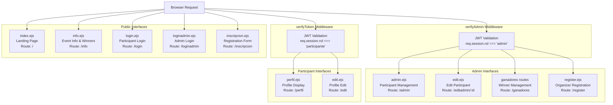
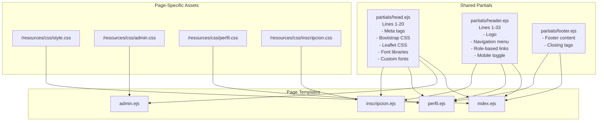
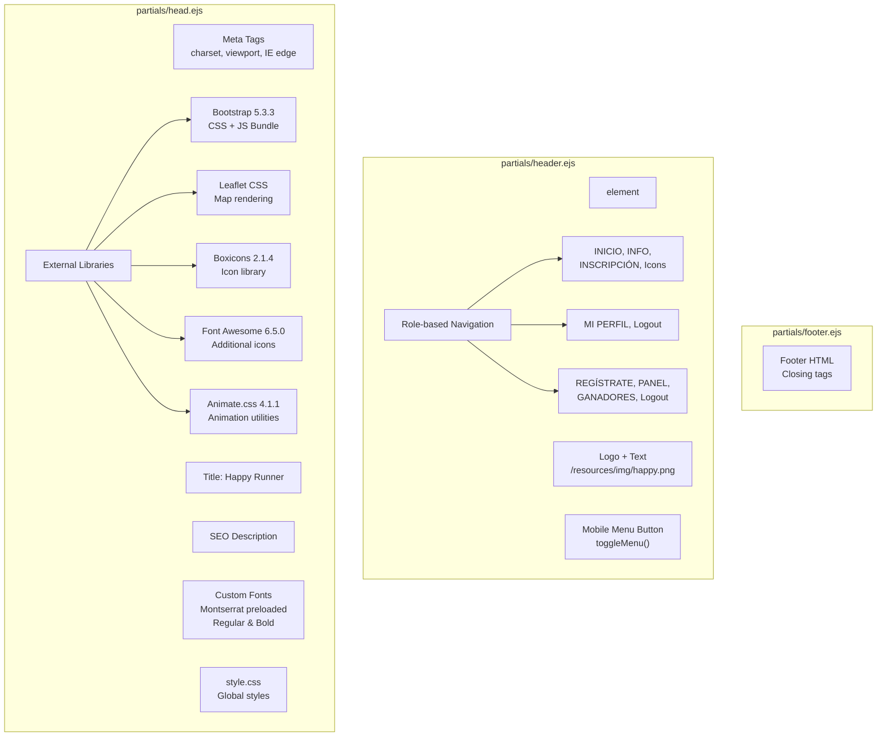

# User Interfaces

> **Relevant source files**
> * [views/admin.ejs](https://github.com/Lourdes12587/Proyecto-Node.js/blob/3a172be7/views/admin.ejs)
> * [views/index.ejs](https://github.com/Lourdes12587/Proyecto-Node.js/blob/3a172be7/views/index.ejs)
> * [views/partials/head.ejs](https://github.com/Lourdes12587/Proyecto-Node.js/blob/3a172be7/views/partials/head.ejs)
> * [views/partials/header.ejs](https://github.com/Lourdes12587/Proyecto-Node.js/blob/3a172be7/views/partials/header.ejs)

## Purpose and Scope

This document provides a comprehensive overview of the user interface layer in the HAPPY RUNNER 42K application, describing the EJS-based view architecture, template composition patterns, and role-based interface presentation. The system implements distinct interface hierarchies for participants, administrators, and public visitors.

For detailed authentication mechanisms that control interface access, see [Authentication & Authorization](/Lourdes12587/Proyecto-Node.js/3-authentication-and-authorization). For styling and CSS architecture, see [Styling System](/Lourdes12587/Proyecto-Node.js/5-styling-system). For subsystem details on specific interface types, see [Participant Interfaces](/Lourdes12587/Proyecto-Node.js/4.1-participant-interfaces), [Admin Interfaces](/Lourdes12587/Proyecto-Node.js/4.2-admin-interfaces), and [Shared Components](/Lourdes12587/Proyecto-Node.js/4.3-shared-components).

---

## UI Architecture Overview

The application uses **EJS (Embedded JavaScript)** templating with a partial-based composition pattern. All views reside in `views/` directory and share common components through `views/partials/`. The system implements role-based conditional rendering where navigation and available pages adapt based on the user's session role (`participante`, `admin`, or unauthenticated).

| Aspect | Implementation |
| --- | --- |
| Template Engine | EJS |
| Layout Pattern | Partial inclusion (head, header, footer) |
| Routing | Express router modules with role-based middleware |
| Access Control | Session-based with `res.locals` injection |
| Static Assets | CSS per-page pattern (`/resources/css/`) |
| External Libraries | Bootstrap 5.3.3, Leaflet, Font Awesome, Boxicons |

**Sources:** [views/partials/head.ejs L1-L20](https://github.com/Lourdes12587/Proyecto-Node.js/blob/3a172be7/views/partials/head.ejs#L1-L20)

 [views/partials/header.ejs L1-L33](https://github.com/Lourdes12587/Proyecto-Node.js/blob/3a172be7/views/partials/header.ejs#L1-L33)

---

## Interface Access Model



This diagram maps HTTP routes to view files and their middleware requirements. Public interfaces have no authentication guard, participant interfaces require `verifyToken` middleware, and admin interfaces require `verifyAdmin` middleware.

**Sources:** [views/partials/header.ejs L18-L30](https://github.com/Lourdes12587/Proyecto-Node.js/blob/3a172be7/views/partials/header.ejs#L18-L30)

---

## View Composition Pattern



Every page template includes `partials/head.ejs` for common `<head>` setup, selectively includes `partials/header.ejs` for navigation (admin views like `admin.ejs` may skip this), and includes `partials/footer.ejs` for page closure. Each template then loads its own dedicated CSS file.

**Sources:** [views/index.ejs L1-L118](https://github.com/Lourdes12587/Proyecto-Node.js/blob/3a172be7/views/index.ejs#L1-L118)

 [views/admin.ejs L1-L65](https://github.com/Lourdes12587/Proyecto-Node.js/blob/3a172be7/views/admin.ejs#L1-L65)

 [views/partials/head.ejs L1-L20](https://github.com/Lourdes12587/Proyecto-Node.js/blob/3a172be7/views/partials/head.ejs#L1-L20)

---

## Role-Based Navigation

The `partials/header.ejs` implements dynamic navigation that adapts based on `res.locals.user` and `res.locals.rol` values injected by Express middleware:

| Session State | Navigation Items Displayed |
| --- | --- |
| No session (`!user`) | INICIO, INFO, INSCRIPCIÓN, User icon (→ /login), Shield icon (→ /loginadmin) |
| `rol === 'participante'` | INICIO, INFO, MI PERFIL, Logout icon |
| `rol === 'admin'` | INICIO, INFO, REGÍSTRATE, PANEL, GANADORES, Logout icon |

The navigation is implemented in [views/partials/header.ejs L18-L30](https://github.com/Lourdes12587/Proyecto-Node.js/blob/3a172be7/views/partials/header.ejs#L18-L30)

 using EJS conditionals:

```
<% if (!user) { %>
  <!-- Public navigation -->
<% } else if (rol === 'participante') { %>
  <!-- Participant navigation -->
<% } else if (rol === 'admin') { %>
  <!-- Admin navigation -->
<% } %>
```

The `res.locals` injection occurs in the Express middleware pipeline before view rendering, making these values globally available to all EJS templates without explicit passing.

**Sources:** [views/partials/header.ejs L18-L30](https://github.com/Lourdes12587/Proyecto-Node.js/blob/3a172be7/views/partials/header.ejs#L18-L30)

---

## Public Interface Characteristics

Public interfaces are accessible without authentication and serve as entry points for user journeys:

| View File | Route | Primary Purpose | Key Features |
| --- | --- | --- | --- |
| `index.ejs` | `/` | Event landing page | Hero banner, event details, photo gallery, Leaflet race map |
| `info.ejs` | `/info` | Event information & winners | Detailed event info, winner display cards, race route map |
| `inscripcion.ejs` | `/inscripcion` | Participant registration | Multi-field form, photo upload, weather widget |
| `login.ejs` | `/login` | Participant authentication | DNI-based login form |
| `loginadmin.ejs` | `/loginadmin` | Admin authentication | Username/password login form |

### Landing Page Structure

The `index.ejs` template [views/index.ejs L1-L119](https://github.com/Lourdes12587/Proyecto-Node.js/blob/3a172be7/views/index.ejs#L1-L119)

 implements a multi-section layout:

1. **Hero Banner** [views/index.ejs L5-L26](https://github.com/Lourdes12587/Proyecto-Node.js/blob/3a172be7/views/index.ejs#L5-L26) : Full-width banner with event title, date, call-to-action buttons
2. **Event Info Section** [views/index.ejs L29-L53](https://github.com/Lourdes12587/Proyecto-Node.js/blob/3a172be7/views/index.ejs#L29-L53) : Grid of event details (date, time, location, hydration)
3. **Categories Section** [views/index.ejs L55-L69](https://github.com/Lourdes12587/Proyecto-Node.js/blob/3a172be7/views/index.ejs#L55-L69) : Masculine/Feminine 42K categories
4. **Gallery Section** [views/index.ejs L71-L81](https://github.com/Lourdes12587/Proyecto-Node.js/blob/3a172be7/views/index.ejs#L71-L81) : Three-image gallery with lazy loading
5. **Race Route Map** [views/index.ejs L83-L116](https://github.com/Lourdes12587/Proyecto-Node.js/blob/3a172be7/views/index.ejs#L83-L116) : Leaflet map with polyline route visualization

The Leaflet map initialization occurs in an inline `<script>` block [views/index.ejs L95-L116](https://github.com/Lourdes12587/Proyecto-Node.js/blob/3a172be7/views/index.ejs#L95-L116)

 creating an interactive map centered on Park Güell coordinates `[41.4145, 2.1527]` with race path markers.

**Sources:** [views/index.ejs L1-L119](https://github.com/Lourdes12587/Proyecto-Node.js/blob/3a172be7/views/index.ejs#L1-L119)

---

## Participant Interface Characteristics

Participant interfaces require `verifyToken` middleware and display personalized data from `req.session.user`:

| View File | Route | Purpose | Data Dependencies |
| --- | --- | --- | --- |
| `perfil.ejs` | `/perfil` | Display participant profile | Session user object |
| `edit.ejs` | `/edit` | Edit participant profile | Participant record from database |

These views render participant-specific data including name, DNI, address details, phone number, and uploaded photo path. The edit flow submits to `updateParticipante.js` controller for data persistence.

**Sources:** Referenced in [views/partials/header.ejs L23](https://github.com/Lourdes12587/Proyecto-Node.js/blob/3a172be7/views/partials/header.ejs#L23-L23)

---

## Admin Interface Characteristics

### Admin Panel Structure

The `admin.ejs` view [views/admin.ejs L1-L79](https://github.com/Lourdes12587/Proyecto-Node.js/blob/3a172be7/views/admin.ejs#L1-L79)

 implements a full-featured participant management interface:

**Key Components:**

1. **Search Bar** [views/admin.ejs L17-L20](https://github.com/Lourdes12587/Proyecto-Node.js/blob/3a172be7/views/admin.ejs#L17-L20) : Client-side filtering input with participant count badge
2. **Data Table** [views/admin.ejs L22-L62](https://github.com/Lourdes12587/Proyecto-Node.js/blob/3a172be7/views/admin.ejs#L22-L62) : Bootstrap table displaying all participant records
3. **Action Buttons** [views/admin.ejs L50-L57](https://github.com/Lourdes12587/Proyecto-Node.js/blob/3a172be7/views/admin.ejs#L50-L57) : Edit (Boxicons `bxs-edit`) and Delete (Boxicons `bxs-trash`) icons per row

**Table Columns:**

| Column | Field | Source |
| --- | --- | --- |
| N° Dorsal | `participante.id` | Auto-incremented participant ID |
| Nombre | `participante.nombre` | First name |
| Apellido | `participante.apellido` | Last name |
| DNI | `participante.dni` | National ID |
| Tel. | `participante.telefono` | Phone number |
| Calle | `participante.calle` | Street name |
| N° | `participante.numero` | Street number |
| Población | `participante.poblacion` | City/town |
| CP° | `participante.codigo_postal` | Postal code |
| Acciones | Links to `/editadmin/:id` and `/delete/:id` | Action buttons |

**Client-Side Search Implementation:**

The search functionality [views/admin.ejs L67-L77](https://github.com/Lourdes12587/Proyecto-Node.js/blob/3a172be7/views/admin.ejs#L67-L77)

 uses vanilla JavaScript to filter table rows based on user input:

```javascript
const searchInput = document.getElementById('searchInput');
const participantesTable = document.getElementById('participantesTable');
searchInput?.addEventListener('input', (e) => {
  const q = e.target.value.toLowerCase().trim();
  Array.from(participantesTable.rows).forEach(row => {
    const txt = row.innerText.toLowerCase();
    row.style.display = txt.includes(q) ? '' : 'none';
  });
});
```

This provides instant filtering across all table columns without server round-trips.

**Sources:** [views/admin.ejs L1-L79](https://github.com/Lourdes12587/Proyecto-Node.js/blob/3a172be7/views/admin.ejs#L1-L79)

---

## Shared Component Architecture



### Head Partial Dependencies

The `partials/head.ejs` [views/partials/head.ejs L1-L20](https://github.com/Lourdes12587/Proyecto-Node.js/blob/3a172be7/views/partials/head.ejs#L1-L20)

 establishes the complete dependency chain for all pages:

| Dependency | CDN/Path | Purpose |
| --- | --- | --- |
| Bootstrap 5.3.3 CSS | `cdn.jsdelivr.net` | UI framework, grid system, utilities |
| Bootstrap 5.3.3 JS | `cdn.jsdelivr.net` | Interactive components |
| Leaflet CSS | `unpkg.com/leaflet` | Map rendering library |
| Boxicons 2.1.4 | `unpkg.com/boxicons` | Icon library (user, shield, trash, edit icons) |
| Font Awesome 6.5.0 | `cdnjs.cloudflare.com` | Additional icon library |
| Animate.css 4.1.1 | `cdnjs.cloudflare.com` | CSS animation utilities |
| Montserrat Font | `/fonts/` (preloaded) | Custom typography |
| `style.css` | `/resources/css/` | Global application styles |

### Header Partial Navigation Logic

The header navigation [views/partials/header.ejs L5-L32](https://github.com/Lourdes12587/Proyecto-Node.js/blob/3a172be7/views/partials/header.ejs#L5-L32)

 implements:

1. **Logo Section** [views/partials/header.ejs L6-L9](https://github.com/Lourdes12587/Proyecto-Node.js/blob/3a172be7/views/partials/header.ejs#L6-L9) : Image + text branding
2. **Mobile Menu Toggle** [views/partials/header.ejs L10-L14](https://github.com/Lourdes12587/Proyecto-Node.js/blob/3a172be7/views/partials/header.ejs#L10-L14) : Hamburger button calling `toggleMenu()` function
3. **Conditional Navigation** [views/partials/header.ejs L15-L31](https://github.com/Lourdes12587/Proyecto-Node.js/blob/3a172be7/views/partials/header.ejs#L15-L31) : Three-way branching based on `user` and `rol` variables

Navigation links use Boxicons for iconography:

* `bx-user-circle`: Participant login
* `bxs-shield`: Admin login
* `bxs-log-out`: Logout action

**Sources:** [views/partials/head.ejs L1-L20](https://github.com/Lourdes12587/Proyecto-Node.js/blob/3a172be7/views/partials/head.ejs#L1-L20)

 [views/partials/header.ejs L1-L33](https://github.com/Lourdes12587/Proyecto-Node.js/blob/3a172be7/views/partials/header.ejs#L1-L33)

---

## View-to-Route Mapping

The following table maps all view files to their corresponding Express routes and required middleware:

| View File | Route Pattern | HTTP Method | Middleware | Route Module |
| --- | --- | --- | --- | --- |
| `index.ejs` | `/` | GET | None | `routes/index.js` |
| `info.ejs` | `/info` | GET | None | `routes/index.js` |
| `inscripcion.ejs` | `/inscripcion` | GET | None | `routes/index.js` |
| `login.ejs` | `/login` | GET | None | `routes/auth.js` |
| `loginadmin.ejs` | `/loginadmin` | GET | None | `routes/auth.js` |
| `perfil.ejs` | `/perfil` | GET | `verifyToken` | `routes/participante.js` |
| `edit.ejs` | `/edit` | GET | `verifyToken` | `routes/participante.js` |
| `admin.ejs` | `/admin` | GET | `verifyAdmin` | `routes/admin.js` |
| `edit.ejs` | `/editadmin/:id` | GET | `verifyAdmin` | `routes/admin.js` |
| `register.ejs` | `/register` | GET | `verifyAdmin` | `routes/auth.js` |

Note that `edit.ejs` is reused for both participant self-editing (`/edit`) and admin-initiated editing (`/editadmin/:id`) with different middleware requirements.

**Sources:** Inferred from route structure and [views/partials/header.ejs L18-L30](https://github.com/Lourdes12587/Proyecto-Node.js/blob/3a172be7/views/partials/header.ejs#L18-L30)

 [views/admin.ejs L51-L54](https://github.com/Lourdes12587/Proyecto-Node.js/blob/3a172be7/views/admin.ejs#L51-L54)

---

## Interactive Features

### Leaflet Map Integration

The landing page and info page implement Leaflet maps for race route visualization. In `index.ejs` [views/index.ejs L93-L116](https://github.com/Lourdes12587/Proyecto-Node.js/blob/3a172be7/views/index.ejs#L93-L116)

:

1. **Map Initialization**: Creates `L.map('map')` centered on Park Güell
2. **Tile Layer**: Uses OpenStreetMap tiles via `L.tileLayer()`
3. **Race Path**: Defines array of coordinates and renders with `L.polyline()`
4. **Markers**: Places markers at start (`racePath[0]`) and finish points
5. **Auto-fit**: Calls `map.fitBounds()` to frame the entire route

The map container requires inline styles: `height: 400px; width: 100%; border: 2px solid #ccc;` [views/index.ejs L87](https://github.com/Lourdes12587/Proyecto-Node.js/blob/3a172be7/views/index.ejs#L87-L87)

### Client-Side Search in Admin Panel

The admin panel implements instant search filtering [views/admin.ejs L67-L77](https://github.com/Lourdes12587/Proyecto-Node.js/blob/3a172be7/views/admin.ejs#L67-L77)

 without pagination or server queries. On each keystroke in `#searchInput`, the script:

1. Retrieves input value and converts to lowercase
2. Iterates through all `<tbody>` rows
3. Checks if row text includes search query
4. Sets `display: none` for non-matching rows

This approach provides responsive filtering for reasonable dataset sizes (hundreds of participants) but may require server-side implementation for larger datasets.

**Sources:** [views/index.ejs L93-L116](https://github.com/Lourdes12587/Proyecto-Node.js/blob/3a172be7/views/index.ejs#L93-L116)

 [views/admin.ejs L67-L77](https://github.com/Lourdes12587/Proyecto-Node.js/blob/3a172be7/views/admin.ejs#L67-L77)

---

## CSS Loading Strategy

Each page follows a consistent CSS loading pattern:

1. **Global Styles**: `style.css` loaded via `partials/head.ejs` [views/partials/head.ejs L9](https://github.com/Lourdes12587/Proyecto-Node.js/blob/3a172be7/views/partials/head.ejs#L9-L9)
2. **Page-Specific Styles**: Loaded directly in the view file after head include

Example from `admin.ejs` [views/admin.ejs L7](https://github.com/Lourdes12587/Proyecto-Node.js/blob/3a172be7/views/admin.ejs#L7-L7)

:

```
<link rel="stylesheet" href="/resources/css/admin.css">
```

This two-tier approach enables:

* **Global consistency** through shared base styles (typography, colors, layout utilities)
* **Page-specific customization** without style conflicts
* **Efficient caching** of common styles across pages

**Available CSS Files:**

* `style.css`: Global base styles
* `admin.css`: Admin panel table and action buttons
* `inscripcion.css`: Registration form styling
* `perfil.css`: Profile display layout
* `edit.css`: Profile edit form
* `info.css`: Info page and winner cards
* `login.css`: Login form styling

**Sources:** [views/partials/head.ejs L9](https://github.com/Lourdes12587/Proyecto-Node.js/blob/3a172be7/views/partials/head.ejs#L9-L9)

 [views/admin.ejs L7](https://github.com/Lourdes12587/Proyecto-Node.js/blob/3a172be7/views/admin.ejs#L7-L7)

---

## Accessibility Considerations

The UI layer implements several accessibility features:

| Feature | Implementation | Location |
| --- | --- | --- |
| Semantic HTML | `<header>`, `<main>`, `<nav>`, `<article>` elements | All view files |
| ARIA Labels | `aria-label`, `aria-hidden` attributes | [views/index.ejs L6-L20](https://github.com/Lourdes12587/Proyecto-Node.js/blob/3a172be7/views/index.ejs#L6-L20) |
| Image Alt Text | Alt attributes on all images | [views/index.ejs L75-L77](https://github.com/Lourdes12587/Proyecto-Node.js/blob/3a172be7/views/index.ejs#L75-L77) |
| Form Labels | Explicit label-input associations | Registration and edit forms |
| Lazy Loading | `loading="lazy"` on gallery images | [views/index.ejs L75-L77](https://github.com/Lourdes12587/Proyecto-Node.js/blob/3a172be7/views/index.ejs#L75-L77) |
| Keyboard Navigation | Focusable elements, logical tab order | Navigation and forms |
| Responsive Meta Tag | `viewport` meta for mobile scaling | [views/partials/head.ejs L6](https://github.com/Lourdes12587/Proyecto-Node.js/blob/3a172be7/views/partials/head.ejs#L6-L6) |

**Sources:** [views/index.ejs L6-L77](https://github.com/Lourdes12587/Proyecto-Node.js/blob/3a172be7/views/index.ejs#L6-L77)

 [views/partials/head.ejs L6](https://github.com/Lourdes12587/Proyecto-Node.js/blob/3a172be7/views/partials/head.ejs#L6-L6)

---

## Summary

The HAPPY RUNNER 42K UI layer implements a role-aware, component-based architecture using EJS templating. The system distinguishes three user contexts—public visitors, authenticated participants, and administrators—through session-based conditional rendering. All pages compose from shared partials (`head`, `header`, `footer`) while maintaining page-specific styling through dedicated CSS files. Interactive features include Leaflet map integration for race visualization and client-side search for admin participant management. The Bootstrap 5.3.3 framework provides responsive layout and utility classes, while Boxicons and Font Awesome supply iconography throughout the interface.