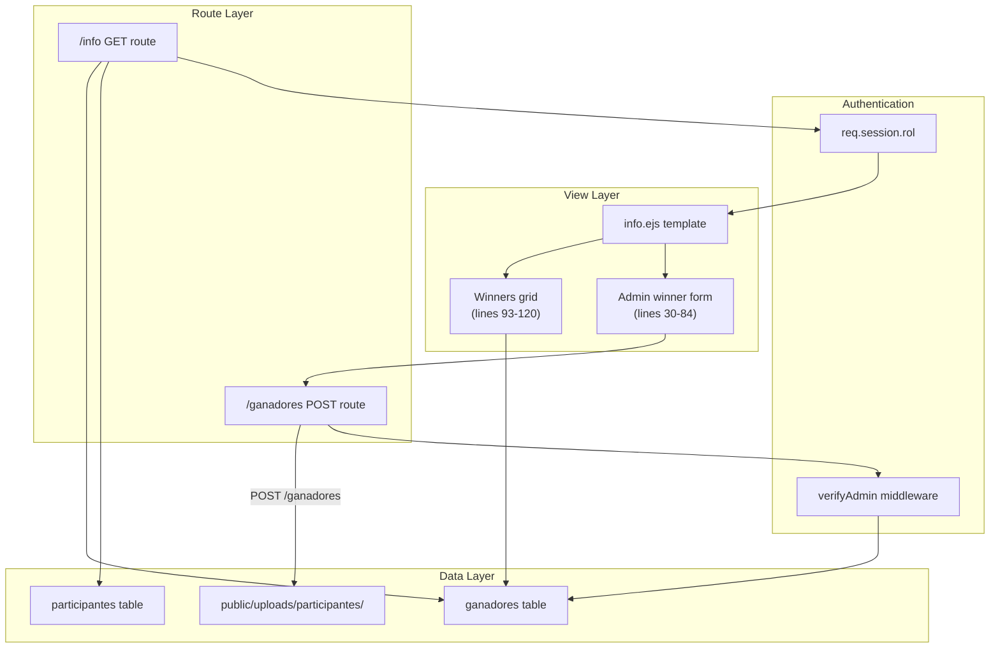
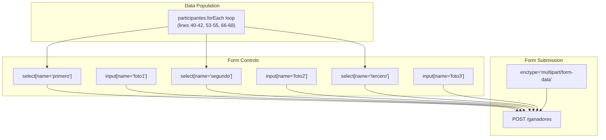
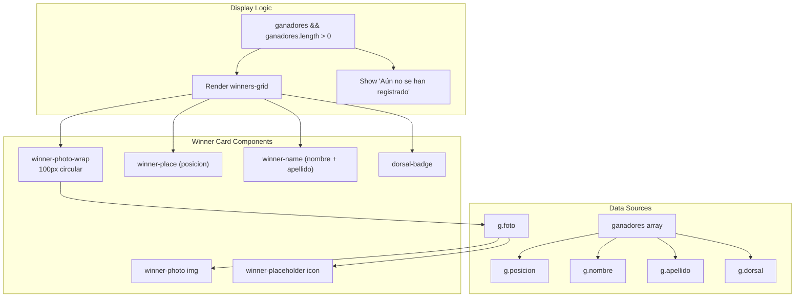
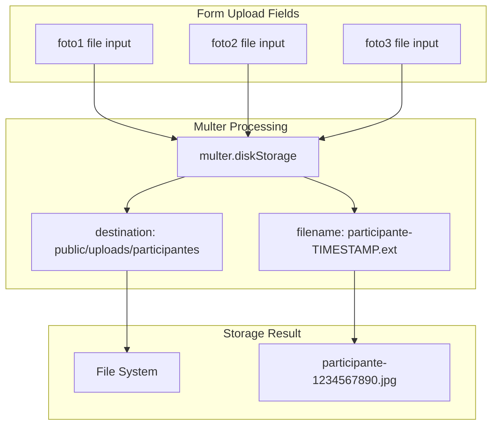
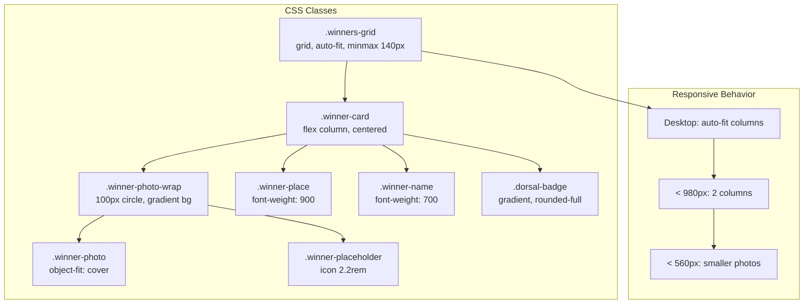
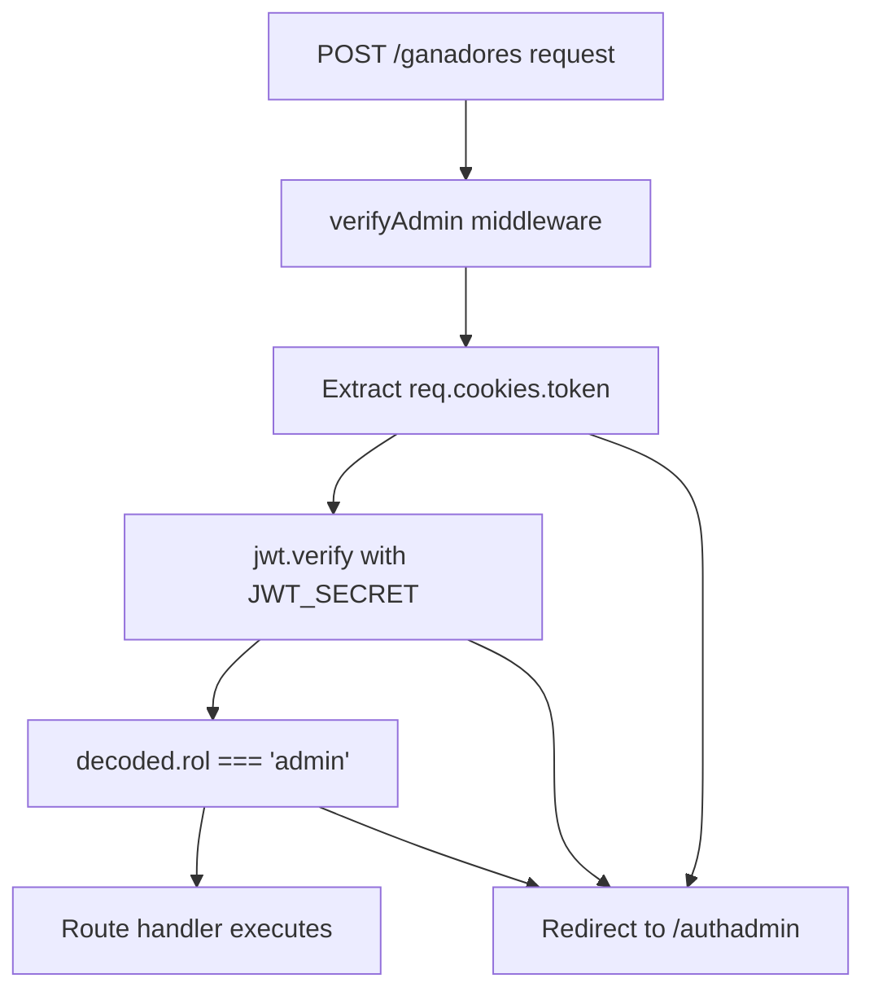

# Winner Management

> **Relevant source files**
> * [middlewares/multer.js](https://github.com/Lourdes12587/Proyecto-Node.js/blob/3a172be7/middlewares/multer.js)
> * [middlewares/verifyAdmin.js](https://github.com/Lourdes12587/Proyecto-Node.js/blob/3a172be7/middlewares/verifyAdmin.js)
> * [middlewares/verifyToken.js](https://github.com/Lourdes12587/Proyecto-Node.js/blob/3a172be7/middlewares/verifyToken.js)
> * [public/css/edit.css](https://github.com/Lourdes12587/Proyecto-Node.js/blob/3a172be7/public/css/edit.css)
> * [public/css/info.css](https://github.com/Lourdes12587/Proyecto-Node.js/blob/3a172be7/public/css/info.css)
> * [views/info.ejs](https://github.com/Lourdes12587/Proyecto-Node.js/blob/3a172be7/views/info.ejs)

## Purpose and Scope

This document describes the winner management system within the HAPPY RUNNER 42K marathon application. The system enables administrators to designate the top three finishers (1st, 2nd, and 3rd place) from registered participants and optionally upload winner-specific photos. Winners are selected through a form interface embedded in the event information page and displayed publicly to all users.

For general event information display, see [Landing Page](/Lourdes12587/Proyecto-Node.js/4.1.1-landing-page). For broader administrative functions including participant management, see [Admin Panel](/Lourdes12587/Proyecto-Node.js/4.2.1-admin-panel). For organizer account creation, see [Organizer Registration](/Lourdes12587/Proyecto-Node.js/4.2.3-organizer-registration).

---

## System Architecture

The winner management system is architecturally unique in that it combines both administrative control and public display within a single page template (`info.ejs`). Access control is enforced through conditional rendering based on the user's role, rather than through separate route handlers.



**Sources:** [views/info.ejs L1-L147](https://github.com/Lourdes12587/Proyecto-Node.js/blob/3a172be7/views/info.ejs#L1-L147)

 [middlewares/verifyAdmin.js L1-L17](https://github.com/Lourdes12587/Proyecto-Node.js/blob/3a172be7/middlewares/verifyAdmin.js#L1-L17)

---

## Administrative Interface

### Winner Selection Form

The winner registration form is conditionally rendered within `info.ejs` when the `isAdmin` flag is set to `true` in the template context [views/info.ejs L30-L84](https://github.com/Lourdes12587/Proyecto-Node.js/blob/3a172be7/views/info.ejs#L30-L84)

 The form provides three identical field groups, one for each podium position.

**Form Structure:**

| Position | Field Name | Field Type | Purpose |
| --- | --- | --- | --- |
| 1st Place | `primero` | `<select>` dropdown | Participant ID selection |
| 1st Place | `foto1` | `<input type="file">` | Optional winner photo |
| 2nd Place | `segundo` | `<select>` dropdown | Participant ID selection |
| 2nd Place | `foto2` | `<input type="file">` | Optional winner photo |
| 3rd Place | `tercero` | `<select>` dropdown | Participant ID selection |
| 3rd Place | `foto3` | `<input type="file">` | Optional winner photo |

Each dropdown is populated dynamically with all registered participants, displaying both the participant ID and full name in the format: `{id} — {nombre} {apellido}` [views/info.ejs L40-L42](https://github.com/Lourdes12587/Proyecto-Node.js/blob/3a172be7/views/info.ejs#L40-L42)



**Sources:** [views/info.ejs L34-L78](https://github.com/Lourdes12587/Proyecto-Node.js/blob/3a172be7/views/info.ejs#L34-L78)

### Form Validation and Submission

The form requires `enctype="multipart/form-data"` to support file uploads [views/info.ejs L34](https://github.com/Lourdes12587/Proyecto-Node.js/blob/3a172be7/views/info.ejs#L34-L34)

 Each participant selection dropdown is marked with the `required` attribute [views/info.ejs L38-L64](https://github.com/Lourdes12587/Proyecto-Node.js/blob/3a172be7/views/info.ejs#L38-L64)

 ensuring that all three positions must be filled before submission. The file inputs are optional, allowing administrators to designate winners without immediately providing photos.

The form submits to the `/ganadores` POST endpoint [views/info.ejs L34](https://github.com/Lourdes12587/Proyecto-Node.js/blob/3a172be7/views/info.ejs#L34-L34)

 which is protected by the `verifyAdmin` middleware as documented in [Role-Based Access Control](/Lourdes12587/Proyecto-Node.js/3.2-role-based-access-control).

### Feedback Messaging

The form displays server-side feedback messages when present. The template checks for `mensaje` and `mensajeTipo` variables [views/info.ejs L79-L81](https://github.com/Lourdes12587/Proyecto-Node.js/blob/3a172be7/views/info.ejs#L79-L81)

 and conditionally applies success styling when `mensajeTipo === 'success'`.

**Sources:** [views/info.ejs L79-L81](https://github.com/Lourdes12587/Proyecto-Node.js/blob/3a172be7/views/info.ejs#L79-L81)

---

## Winner Display System

### Public Winners Grid

The winners section renders below the race map regardless of user authentication status [views/info.ejs L93-L120](https://github.com/Lourdes12587/Proyecto-Node.js/blob/3a172be7/views/info.ejs#L93-L120)

 This ensures that race results are publicly visible to all visitors.



**Sources:** [views/info.ejs L93-L120](https://github.com/Lourdes12587/Proyecto-Node.js/blob/3a172be7/views/info.ejs#L93-L120)

### Winner Card Structure

Each winner is rendered as an `article.winner-card` with the following structure:

1. **Photo Display** [views/info.ejs L100-L108](https://github.com/Lourdes12587/Proyecto-Node.js/blob/3a172be7/views/info.ejs#L100-L108) * If `g.foto` exists: renders `` from `/uploads/participantes/{filename}` * If `g.foto` is null: displays a Boxicons user placeholder icon (`bx bxs-user`)
2. **Winner Information** [views/info.ejs L109-L113](https://github.com/Lourdes12587/Proyecto-Node.js/blob/3a172be7/views/info.ejs#L109-L113) * **Position**: `#{g.posicion}` displayed with class `winner-place` * **Name**: `{g.nombre} {g.apellido}` with class `winner-name` * **Dorsal**: "Dorsal" label followed by `{g.dorsal}` in a `dorsal-badge` span

**Sources:** [views/info.ejs L99-L114](https://github.com/Lourdes12587/Proyecto-Node.js/blob/3a172be7/views/info.ejs#L99-L114)

---

## Data Flow and State Management

### Winner Registration Flow

```mermaid
sequenceDiagram
  participant Admin User
  participant Browser
  participant /info GET
  participant /ganadores POST
  participant multer.upload
  participant Database
  participant File System

  Admin User->>Browser: Navigate to /info
  Browser->>/info GET: GET /info
  /info GET->>Database: SELECT participantes
  /info GET->>Database: SELECT ganadores
  Database-->>/info GET: participant list + winners
  /info GET-->>Browser: Render info.ejs (isAdmin=true)
  Admin User->>Browser: Fill form + upload photos
  Browser->>/ganadores POST: POST /ganadores (multipart)
  /ganadores POST->>multer.upload: Process file uploads
  multer.upload->>File System: Save foto1, foto2, foto3
  File System-->>multer.upload: File paths
  multer.upload->>/ganadores POST: req.files populated
  /ganadores POST->>Database: INSERT/UPDATE ganadores (position=1)
  /ganadores POST->>Database: INSERT/UPDATE ganadores (position=2)
  /ganadores POST->>Database: INSERT/UPDATE ganadores (position=3)
  Database-->>/ganadores POST: Success
  /ganadores POST-->>Browser: Redirect to /info (with mensaje)
  Browser->>/info GET: GET /info
  /info GET-->>Browser: Display success message
```

**Sources:** [views/info.ejs L34](https://github.com/Lourdes12587/Proyecto-Node.js/blob/3a172be7/views/info.ejs#L34-L34)

 [middlewares/multer.js L1-L15](https://github.com/Lourdes12587/Proyecto-Node.js/blob/3a172be7/middlewares/multer.js#L1-L15)

### Data Model Relationships

The `ganadores` table maintains a relationship with the `participantes` table through the `participant_id` foreign key. The table structure stores:

* `position`: Integer (1, 2, or 3) identifying the podium placement
* `participant_id`: Foreign key reference to `participantes.id`
* `foto`: Optional filename for winner-specific photo

When rendering winners, the system performs a JOIN query to retrieve participant details (nombre, apellido, dorsal) alongside winner-specific data [views/info.ejs L98](https://github.com/Lourdes12587/Proyecto-Node.js/blob/3a172be7/views/info.ejs#L98-L98)

**Sources:** Based on template data structure in [views/info.ejs L96-L120](https://github.com/Lourdes12587/Proyecto-Node.js/blob/3a172be7/views/info.ejs#L96-L120)

---

## File Upload Integration

### Multer Configuration

The winner management system leverages the same multer configuration used for participant registration [middlewares/multer.js L1-L15](https://github.com/Lourdes12587/Proyecto-Node.js/blob/3a172be7/middlewares/multer.js#L1-L15)

 File uploads are stored in `public/uploads/participantes/` with auto-generated filenames following the pattern `participante-{timestamp}.{ext}`.

**Key Configuration Points:**

| Setting | Value | Purpose |
| --- | --- | --- |
| Destination | `public/uploads/participantes` | Storage directory [middlewares/multer.js L7](https://github.com/Lourdes12587/Proyecto-Node.js/blob/3a172be7/middlewares/multer.js#L7-L7) |
| Filename Strategy | `participante-{Date.now()}.{ext}` | Unique timestamped naming [middlewares/multer.js L11](https://github.com/Lourdes12587/Proyecto-Node.js/blob/3a172be7/middlewares/multer.js#L11-L11) |
| Storage Type | `multer.diskStorage` | File system storage [middlewares/multer.js L5](https://github.com/Lourdes12587/Proyecto-Node.js/blob/3a172be7/middlewares/multer.js#L5-L5) |



**Sources:** [middlewares/multer.js L4-L13](https://github.com/Lourdes12587/Proyecto-Node.js/blob/3a172be7/middlewares/multer.js#L4-L13)

### Photo Display Logic

When displaying winners, the system checks for the existence of `g.foto` [views/info.ejs L101](https://github.com/Lourdes12587/Proyecto-Node.js/blob/3a172be7/views/info.ejs#L101-L101)

 If present, it constructs the image path as `/uploads/participantes/{g.foto}`. This path resolution works because the `public` directory is served as static files by the Express application.

If no photo exists, the system displays a Boxicons user icon placeholder [views/info.ejs L104-L106](https://github.com/Lourdes12587/Proyecto-Node.js/blob/3a172be7/views/info.ejs#L104-L106)

 maintaining visual consistency in the winners grid even when photos are missing.

**Sources:** [views/info.ejs L100-L108](https://github.com/Lourdes12587/Proyecto-Node.js/blob/3a172be7/views/info.ejs#L100-L108)

---

## Styling and Layout

### CSS Architecture

The winner management interface styling is defined in `public/css/info.css` using the application's design token system [public/css/info.css L1-L10](https://github.com/Lourdes12587/Proyecto-Node.js/blob/3a172be7/public/css/info.css#L1-L10)

**Winner Card Styling:**



**Sources:** [public/css/info.css L106-L149](https://github.com/Lourdes12587/Proyecto-Node.js/blob/3a172be7/public/css/info.css#L106-L149)

 [public/css/info.css L193-L194](https://github.com/Lourdes12587/Proyecto-Node.js/blob/3a172be7/public/css/info.css#L193-L194)

### Design Tokens

The styling utilizes CSS custom properties for consistent theming:

* **Primary Colors**: `--lapis-lazuli` (#2f6690) and `--cerulean` (#3a7ca5)
* **Background**: `--glass` (rgba(255,255,255,0.96))
* **Shadows**: `--muted-shadow` (rgba(22,66,91,0.08))

The winner cards feature hover effects with vertical translation and shadow enhancement [public/css/info.css L121-L124](https://github.com/Lourdes12587/Proyecto-Node.js/blob/3a172be7/public/css/info.css#L121-L124)

 providing interactive feedback.

**Sources:** [public/css/info.css L1-L10](https://github.com/Lourdes12587/Proyecto-Node.js/blob/3a172be7/public/css/info.css#L1-L10)

 [public/css/info.css L111-L124](https://github.com/Lourdes12587/Proyecto-Node.js/blob/3a172be7/public/css/info.css#L111-L124)

---

## Authorization and Access Control

### Admin-Only Form Access

The winner registration form is protected through template-level conditional rendering:

```xml
<% if (typeof isAdmin !== 'undefined' && isAdmin) { %>
  <section class="card admin-panel">
    <!-- Form content -->
  </section>
<% } %>
```

This check occurs in [views/info.ejs L30](https://github.com/Lourdes12587/Proyecto-Node.js/blob/3a172be7/views/info.ejs#L30-L30)

 The `isAdmin` variable must be explicitly set in the route handler's template context, typically derived from `req.session.rol === 'admin'`.

**Sources:** [views/info.ejs L30-L84](https://github.com/Lourdes12587/Proyecto-Node.js/blob/3a172be7/views/info.ejs#L30-L84)

### Backend Route Protection

While the form rendering is conditionally protected, the actual POST endpoint `/ganadores` must also implement server-side protection using the `verifyAdmin` middleware [middlewares/verifyAdmin.js L1-L17](https://github.com/Lourdes12587/Proyecto-Node.js/blob/3a172be7/middlewares/verifyAdmin.js#L1-L17)

 This middleware:

1. Extracts the JWT token from `req.cookies.token` [middlewares/verifyAdmin.js L4](https://github.com/Lourdes12587/Proyecto-Node.js/blob/3a172be7/middlewares/verifyAdmin.js#L4-L4)
2. Verifies the token using `process.env.JWT_SECRET` [middlewares/verifyAdmin.js L8](https://github.com/Lourdes12587/Proyecto-Node.js/blob/3a172be7/middlewares/verifyAdmin.js#L8-L8)
3. Checks that `decoded.rol === "admin"` [middlewares/verifyAdmin.js L9](https://github.com/Lourdes12587/Proyecto-Node.js/blob/3a172be7/middlewares/verifyAdmin.js#L9-L9)
4. Redirects to `/authadmin` if any check fails [middlewares/verifyAdmin.js L5-L13](https://github.com/Lourdes12587/Proyecto-Node.js/blob/3a172be7/middlewares/verifyAdmin.js#L5-L13)



**Sources:** [middlewares/verifyAdmin.js L1-L17](https://github.com/Lourdes12587/Proyecto-Node.js/blob/3a172be7/middlewares/verifyAdmin.js#L1-L17)

---

## Integration Points

### Participant Data Dependency

The winner selection system depends on the participant dataset. The route handler must query the `participantes` table and pass the results to the template as the `participantes` array variable. This data populates the dropdown options in all three winner selection fields [views/info.ejs L40-L68](https://github.com/Lourdes12587/Proyecto-Node.js/blob/3a172be7/views/info.ejs#L40-L68)

### Event Information Page Context

Winner management is embedded within the broader event information page, which also includes:

* Event details section [views/info.ejs L16-L28](https://github.com/Lourdes12587/Proyecto-Node.js/blob/3a172be7/views/info.ejs#L16-L28)
* Participant statistics [views/info.ejs L21-L27](https://github.com/Lourdes12587/Proyecto-Node.js/blob/3a172be7/views/info.ejs#L21-L27)
* Interactive Leaflet race map [views/info.ejs L88-L145](https://github.com/Lourdes12587/Proyecto-Node.js/blob/3a172be7/views/info.ejs#L88-L145)
* Social sharing buttons

This co-location allows administrators to manage winners within the same interface where they view event statistics and participant counts.

**Sources:** [views/info.ejs L1-L147](https://github.com/Lourdes12587/Proyecto-Node.js/blob/3a172be7/views/info.ejs#L1-L147)